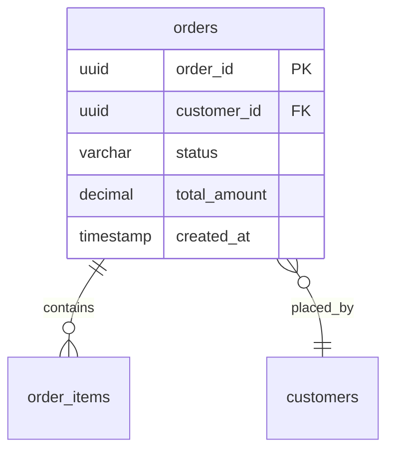

# リバースエンジニアリング：コードから仕様を抽出する

既存のコードベースからSDD準拠のアーティファクトを抽出する手順。

## 概要

リバースエンジニアリングとは、実装（コード）から仕様（ドキュメント）を逆方向に生成すること。
既存プロジェクトでは「コードが唯一の真実」になっていることが多いため、そこから構造化された仕様を抽出する。

---

## 1. コードからGlossary（用語集）を抽出する

### 手順

#### Step 1: ドメイン層のファイルを特定

```bash
# TypeScript/JavaScript
find src -name "*.ts" | xargs grep -l "class\|interface\|type\|enum" | head -50

# Python
find src -name "*.py" | xargs grep -l "class\|@dataclass" | head -50

# Java
find src -name "*.java" | xargs grep -l "class\|interface\|enum" | head -50
```

#### Step 2: クラス名・型名を抽出

```bash
# TypeScriptの例
grep -r "export class\|export interface\|export type\|export enum" src/domain/
```

#### Step 3: AI支援で用語集を生成

以下のプロンプトを使用：

```
コンテキスト:
- 言語: [TypeScript/Python/Java等]
- ドメイン: [業務領域の説明]
- 抽出したクラス/型名:
[クラス名リストを貼り付け]

- サンプルコード:
[主要なドメインクラスのコードを貼り付け]

タスク:
上記のコードから、ドメイン用語集（Glossary）をYAML形式で生成してください。

要件:
1. 各用語に以下を含める:
   - term: 用語名
   - definition: 明確な定義（1-2文）
   - type: Entity | Value Object | Enum | Service | Event
   - attributes: 属性リスト（型を含む）
   - invariants: 不変条件（コードから読み取れるもの）
2. コード内のバリデーションロジックから不変条件を抽出
3. 同じ概念の別名（変数名の揺れ）があれば synonyms に記載

出力形式: YAML
```

#### Step 4: 抽出結果の検証

```markdown
## Glossary抽出チェックリスト

- [ ] 主要なEntity（10個以上）が含まれている
- [ ] 各Entityに2つ以上のinvariantsがある
- [ ] Value Objectが適切に識別されている
- [ ] Enumの値が網羅されている
- [ ] コード内の命名と用語が一致している
- [ ] 定義が曖昧でない（「〜に関するもの」等を避ける）
```

### 抽出例

**入力コード（TypeScript）**:
```typescript
class Order {
  private id: OrderId;
  private items: OrderItem[];
  private status: OrderStatus;
  
  constructor(items: OrderItem[]) {
    if (items.length === 0) {
      throw new Error("Order must have at least one item");
    }
    this.items = items;
    this.status = OrderStatus.PENDING;
  }
}

enum OrderStatus {
  PENDING = "pending",
  CONFIRMED = "confirmed",
  SHIPPED = "shipped",
}
```

**出力Glossary（YAML）**:
```yaml
glossary:
  - term: "Order"
    definition: "顧客による商品購入リクエストを表すエンティティ"
    type: "Entity"
    attributes:
      - "id: OrderId"
      - "items: OrderItem[]"
      - "status: OrderStatus"
    invariants:
      - "注文には少なくとも1つの商品が含まれる (items.length > 0)"
      - "statusは定義された値のいずれか"
    related_terms:
      - "OrderItem"
      - "OrderStatus"

  - term: "OrderStatus"
    definition: "注文のライフサイクル状態を表す列挙型"
    type: "Enum"
    values:
      - "PENDING: 注文作成済み、確認待ち"
      - "CONFIRMED: 支払い完了、発送準備中"
      - "SHIPPED: 発送済み"
```

---

## 2. コードからDomain Modelを抽出する

### 手順

#### Step 1: Aggregateの境界を識別

以下の手がかりを探す：
- トランザクション境界（どのエンティティが一緒に保存されるか）
- カスケード削除の関係
- リポジトリの単位

```bash
# リポジトリを探す
grep -r "Repository\|repository" src/ --include="*.ts"

# トランザクション境界を探す
grep -r "@Transaction\|transaction\|BEGIN\|COMMIT" src/
```

#### Step 2: Entity vs Value Objectの判別

| 特徴 | Entity | Value Object |
|------|--------|--------------|
| ID | あり（一意識別子） | なし |
| 可変性 | 状態が変化する | 不変（immutable） |
| 等価性 | IDで比較 | 全属性で比較 |
| ライフサイクル | 独立して存在 | Entityに所属 |

#### Step 3: AI支援でドメインモデルを構造化

```
コンテキスト:
- リポジトリ一覧:
[リポジトリクラス名を貼り付け]

- 主要エンティティのコード:
[コードを貼り付け]

タスク:
上記のコードからDDD準拠のドメインモデル構造を抽出してください。

要件:
1. Aggregateを識別し、Aggregate Rootを特定
2. 各Aggregateに含まれるEntity/Value Objectを列挙
3. 不変条件をassertInvariants()メソッド形式で表現
4. 状態遷移をDomain Event形式で表現

出力形式: TypeScript（DDD戦術パターン準拠）
```

#### Step 4: イベントフローの抽出

既存コードから状態遷移を探す：

```bash
# 状態変更メソッドを探す
grep -r "status\s*=\|setState\|updateStatus" src/domain/

# イベント発行を探す
grep -r "emit\|publish\|dispatch\|Event" src/
```

---

## 3. 既存APIからOpenAPI仕様を生成する

### 手順

#### Step 1: エンドポイント一覧を抽出

```bash
# Express.js
grep -r "app\.\(get\|post\|put\|delete\|patch\)" src/routes/

# NestJS
grep -r "@Get\|@Post\|@Put\|@Delete\|@Patch" src/

# FastAPI
grep -r "@app\.\(get\|post\|put\|delete\)" src/

# Spring Boot
grep -r "@GetMapping\|@PostMapping\|@PutMapping\|@DeleteMapping" src/
```

#### Step 2: リクエスト/レスポンス型を収集

```bash
# DTOを探す
find src -name "*Dto*" -o -name "*Request*" -o -name "*Response*"

# バリデーションを探す
grep -r "@IsString\|@IsNumber\|@IsNotEmpty\|@Valid" src/
```

#### Step 3: AI支援でOpenAPI生成

```
コンテキスト:
- フレームワーク: [Express/NestJS/FastAPI等]
- エンドポイント一覧:
[抽出したエンドポイントを貼り付け]

- リクエスト/レスポンス型:
[DTOコードを貼り付け]

タスク:
上記の情報からOpenAPI 3.0仕様書を生成してください。

要件:
1. 全エンドポイントをpaths配下に定義
2. リクエストボディのスキーマを定義
3. レスポンススキーマ（成功・エラー）を定義
4. 適切なHTTPステータスコードを設定
5. パラメータ（path, query）を定義

出力形式: YAML (OpenAPI 3.0)
```

#### Step 4: 自動生成ツールの活用

既存ツールでの補助：

```bash
# TypeScript + Express: tsoa
npx tsoa spec

# NestJS: @nestjs/swagger
# （デコレータがあれば自動生成可能）

# FastAPI: 組み込みの /openapi.json
curl http://localhost:8000/openapi.json > openapi.json

# Spring Boot: springdoc-openapi
# /v3/api-docs エンドポイントから取得
```

---

## 4. DBスキーマからData Modelを文書化する

### 手順

#### Step 1: 現在のスキーマを取得

```sql
-- PostgreSQL
\d+ tablename
SELECT * FROM information_schema.columns WHERE table_name = 'orders';

-- MySQL
DESCRIBE orders;
SHOW CREATE TABLE orders;

-- SQLite
.schema orders
```

#### Step 2: 制約情報を取得

```sql
-- PostgreSQL: CHECK制約
SELECT conname, pg_get_constraintdef(oid) 
FROM pg_constraint 
WHERE conrelid = 'orders'::regclass;

-- Foreign Keys
SELECT
    tc.constraint_name,
    tc.table_name,
    kcu.column_name,
    ccu.table_name AS foreign_table_name,
    ccu.column_name AS foreign_column_name
FROM information_schema.table_constraints AS tc
JOIN information_schema.key_column_usage AS kcu
    ON tc.constraint_name = kcu.constraint_name
JOIN information_schema.constraint_column_usage AS ccu
    ON ccu.constraint_name = tc.constraint_name
WHERE constraint_type = 'FOREIGN KEY';
```

#### Step 3: AI支援で論理モデルを生成

```
コンテキスト:
- DBMS: [PostgreSQL/MySQL/SQLite等]
- テーブル定義:
[CREATE TABLE文を貼り付け]

- 制約情報:
[CHECK制約、FK情報を貼り付け]

タスク:
上記のDBスキーマから論理データモデルのドキュメントを生成してください。

要件:
1. 各テーブルの目的を説明
2. カラムの意味を記述
3. 制約をドメイン不変条件と対応付け
4. リレーションシップを図示（Mermaid ER図）
5. インデックス戦略を説明

出力形式: Markdown + Mermaid
```

### 出力例

```markdown
# 論理データモデル

## テーブル: orders

### 概要
顧客の注文情報を格納する。Orderアグリゲートのルートエンティティに対応。

### カラム定義

| カラム | 型 | 制約 | 説明 |
|--------|-----|------|------|
| order_id | UUID | PK | 注文の一意識別子 |
| customer_id | UUID | FK, NOT NULL | 注文した顧客 |
| status | VARCHAR(20) | CHECK | 注文状態（pending/confirmed/shipped） |
| total_amount | DECIMAL(10,2) | CHECK > 0 | 合計金額 |
| created_at | TIMESTAMP | DEFAULT NOW() | 作成日時 |

### 制約とドメイン不変条件の対応

| DB制約 | ドメイン不変条件 |
|--------|------------------|
| CHECK (status IN (...)) | Order.statusは定義された値のみ |
| CHECK (total_amount > 0) | Order.totalAmountは正の値 |
| FK (customer_id) | Orderは必ずCustomerに紐づく |

### ER図


```

---

## 5. テストコードからAcceptance Criteriaを抽出する

### 手順

#### Step 1: テストファイルを特定

```bash
# テストファイル一覧
find . -name "*.test.ts" -o -name "*.spec.ts" -o -name "*_test.py"

# E2E/統合テスト
find . -path "*/e2e/*" -o -path "*/integration/*"
```

#### Step 2: テストケース名を抽出

```bash
# Jest/Mocha
grep -r "describe\|it\|test" tests/ --include="*.ts"

# pytest
grep -r "def test_\|class Test" tests/ --include="*.py"
```

#### Step 3: AI支援でACに変換

```
コンテキスト:
- テストフレームワーク: [Jest/pytest等]
- テストコード:
[テストコードを貼り付け]

タスク:
上記のテストコードから、Given-When-Then形式の受け入れ基準（AC）を抽出してください。

要件:
1. 各テストケースをGiven-When-Then形式に変換
2. テスト名からユーザーストーリーを推測
3. アサーションから期待結果を抽出
4. モックから前提条件を抽出
5. 可能であれば形式的制約も追記

出力形式: Markdown
```

### 変換例

**入力（テストコード）**:
```typescript
describe('Order', () => {
  it('should create order with pending status', () => {
    const items = [new OrderItem(productId, 2, 1000)];
    const order = Order.create(customerId, items);
    
    expect(order.status).toBe(OrderStatus.PENDING);
    expect(order.items).toHaveLength(1);
  });
  
  it('should throw error when creating order without items', () => {
    expect(() => Order.create(customerId, [])).toThrow();
  });
});
```

**出力（AC）**:
```markdown
## US-XXX: 顧客が注文を作成する

### AC-1: 正常な注文作成
```
Given: 認証済みの顧客が存在する
  And: カートに1つ以上の商品がある
When: 顧客が注文を作成する
Then: 注文が「pending」ステータスで作成される
  And: カート内の商品が注文に含まれる
```

### AC-2: 空の注文は作成できない
```
Given: 認証済みの顧客が存在する
  And: カートが空である
When: 顧客が注文を作成しようとする
Then: エラー「注文には商品が必要です」が発生する
  And: 注文は作成されない
```

### 形式的制約
```
∀ order ∈ Order:
  create(items) → (items.length > 0 ∧ status = PENDING)
```
```

---

## 抽出作業のベストプラクティス

### やるべきこと

1. **段階的に進める**: 一度に全部やらず、Glossary → Domain Model → API Specs の順で
2. **AIを補助として使う**: 生成結果は必ず人間がレビュー
3. **コードとの一致を確認**: 抽出した仕様がコードと乖離していないか検証
4. **チームでレビュー**: ドメインエキスパートと一緒に確認

### 避けるべきこと

1. **コードを読まずにAIに丸投げ**: 文脈がないと誤った抽出になる
2. **一度で完璧を目指す**: 反復的に改善する方が効率的
3. **全部を文書化しようとする**: 重要な部分から優先的に
4. **古いコードをそのまま文書化**: 明らかな問題は文書化より修正

---

## 次のステップ

- 抽出した用語の背景を知りたい → [knowledge-extraction.md](knowledge-extraction.md)
- 抽出結果を段階的に導入したい → [migration-roadmap.md](migration-roadmap.md)
- 新規プロジェクト向けの手順 → [../phase-1-foundation.md](../phase-1-foundation.md)
