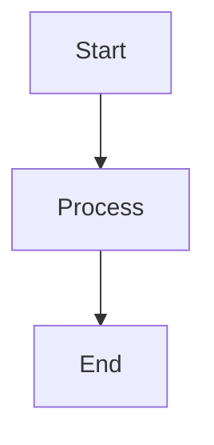

# CLAUDE.md

This file provides guidance to Claude Code (claude.ai/code) when working with code in this repository.

## Development Commands

### Core Development

- `pnpm run dev` - Start development server with hot reload
- `pnpm run build` - Build the application with TypeScript checks
- `pnpm run start` - Run the built application (preview mode)

### Code Quality

- `pnpm run lint` - Run ESLint on the codebase
- `pnpm run format` - Format code with Prettier
- `pnpm run typecheck` - Run TypeScript checks for both node and web configurations
- `pnpm run typecheck:node` - Check main process TypeScript
- `pnpm run typecheck:web` - Check renderer process TypeScript

### Testing

- `pnpm run test:backend` - Run backend process tests with Vitest

### Database Operations

- `pnpm run drizzle-kit` - Run Drizzle Kit CLI operations (generate, migrate, push, studio)
- `pnpm run db:reset` - Reset development database by removing the database file

### Building Distributables

- `pnpm run build:win` - Build Windows executable
- `pnpm run build:mac` - Build macOS executable  
- `pnpm run build:linux` - Build Linux executable
- `pnpm run build:unpack` - Build without packaging

## Architecture

This is an Electron application with AI chat integration using the following modern stack:

- **Electron 37** with **electron-vite** for bundling and development
- **React 19** with TypeScript for the renderer process
- **Tailwind CSS 4** with Vite plugin for styling
- **Shadcn/ui** component library (New York style)
- **Lucide React** for icons
- **SQLite database** with **Drizzle ORM** and **better-sqlite3**
- **AI SDK** with support for Anthropic, OpenAI, and Google providers
- **Assistant UI** for chat interface components

### Project Structure

```
src/
├── main/           # Electron main process entry point
├── backend/        # Backend business logic (separate from main)
│   ├── ai/         # AI provider factory, streaming, session management
│   ├── mcp/        # MCP server lifecycle management
│   ├── db/         # Database schema, migrations, connection
│   ├── settings/   # Application settings management
│   ├── paths/      # Path configuration utilities
│   ├── logger.ts   # Backend logging configuration
│   └── server.ts   # AI streaming server setup
├── preload/        # Secure IPC bridge scripts
├── renderer/       # React frontend application
│   └── src/
│       ├── components/     # React components
│       │   ├── ui/         # Shadcn/ui components
│       │   └── assistant-ui/ # AI chat components
│       ├── lib/            # Utilities and AI streaming logic
│       └── assets/         # Global CSS with Tailwind + Assistant UI styles
├── common/         # Shared TypeScript types and utilities
└── resources/      # Build resources (migrations, icons, etc.)
```

This project uses a custom three-process architecture with a separate backend process for business logic, which differs from Electron's standard two-process model.

### Key Configuration Files

- `electron.vite.config.ts` - Main build configuration with path aliases and Tailwind
- `components.json` - Shadcn/ui configuration (New York style, neutral base color)
- `tsconfig.json` - Composite TypeScript configuration
- `tsconfig.node.json` - Node.js (main/preload/backend) TypeScript config
- `tsconfig.web.json` - Web (renderer) TypeScript config
- `drizzle.config.ts` - Database configuration and migration setup
- `vitest.config.backend.ts` - Testing configuration for backend process
- `electron-builder.yml` - Multi-platform packaging configuration

### Path Aliases

The following aliases are configured in `electron.vite.config.ts`:

- `@renderer` → `src/renderer/src`
- `@common` → `src/common`
- `@main` → `src/main`
- `@backend` → `src/backend`
- `@resources` → `resources`

### Adding Shadcn Components

Use the following command to add new Shadcn components:

```bash
pnpm run shadcn add [component-name]
```

The configuration uses New York style with Lucide icons and neutral base color.

### Database Configuration

- **SQLite database** with environment-based path configuration
- **Development database**: `./tmp/db/app.db`
- **Production database**: Electron's userData directory `/db/app.db`
- **Schema**: Simple settings table for key-value configuration storage
- **Migrations**: Located in `resources/db/migrations/` (included in build)
- **Type-safe**: Full Drizzle ORM integration with TypeScript types
- **Database commands**:
  - `pnpm run drizzle-kit` - Drizzle Kit operations (generate, migrate, push, studio)
  - `pnpm run db:reset` - Reset development database

### AI Integration

- **Multi-provider factory**: Support for OpenAI, Anthropic (Claude), and Google (Gemini)
- **Streaming architecture**: Real-time text streaming with session management
- **MCP Integration**: External tool calling via Model Context Protocol
  - Multi-step tool execution with automatic chaining
  - Multiple MCP server support
  - Real-time tool execution display in chat UI with expandable details
  - Tool call tracking: arguments, results, and execution status
  - See `docs/MCP_INTEGRATION_DESIGN.md` for implementation details
- **Provider configurations**: Model lists, API key management, connection testing
- **Assistant UI components**: Pre-built chat interface with streaming support
- **Configuration**: AI settings stored in database and configurable via UI
- **Session management**: Persistent chat sessions with proper state handling

### Proxy and Certificate Configuration

The application supports enterprise network environments with comprehensive proxy and certificate management:

- **Proxy support**: System detection (Windows registry), custom configuration with authentication, HTTP/HTTPS support
- **Certificate support**: System certificate store integration (Windows), custom CA certificates, validation control
- **Configuration modes**: System (auto-detect), Custom (manual), None (direct connection)
- **Connection testing**: Built-in verification with detailed error categorization
- **Platform support**:
  - ✅ Windows (fully tested)
  - ⚠️ macOS/Linux (planned, currently defaults to 'none' mode)
  - ⚠️ PAC files not currently supported (see workaround in docs)

**Usage**:
1. System proxy/certificate settings auto-detected on first launch
2. Configure via Settings page (System/Custom/None modes)
3. Use "Test Connection" to verify configuration
4. All AI API requests automatically use configured settings

For detailed configuration instructions, see `docs/PROXY_CONFIGURATION.md`.
For technical design details, see `docs/PROXY_AND_CERTIFICATE_DESIGN.md`.

### Logging Configuration

- **Unified logging system** - All three processes (Main, Backend, Renderer) log to a single `app.log` file
- **Architecture**: Main Process acts as a log hub, receiving logs from Backend and Renderer via IPC
- **Log file location**:
  - Development: `./tmp/logs/app.log`
  - Production: userData directory `/logs/app.log`
- **Log format**: `[timestamp] [level] [scope] message`
  - Example: `[2025-11-08 10:23:45.123] [info] [backend:ai] AI request started { provider: 'anthropic' }`
- **Features**:
  - Unified timeline across all processes for easier debugging
  - File rotation (5MB limit)
  - Structured logging with scope management (e.g., `backend:ai`, `renderer`)
  - Process-specific loggers that integrate seamlessly
  - Automatic error catching with optional dialogs in development
- **Usage**:
  - Main process: `import logger from './logger'`
  - Backend process: `import logger from './logger'` - Logs sent to Main via IPC
    - Create sub-scopes: `const aiLogger = logger.child('ai')`
  - Renderer process: `import { logger } from '@/lib/logger'` - Uses electron-log/renderer
- **Benefits**:
  - Single file to monitor during development: `tail -f ./tmp/logs/app.log`
  - Easy to trace cross-process flows (e.g., user action → IPC → backend → AI → response)
  - Filter by process: `grep '[backend]' ./tmp/logs/app.log`

### UI & Styling Architecture

- **Tailwind CSS 4** with CSS variables for theming support
- **Assistant UI styles** integrated via CSS layers for chat components
- **Dark/light theme support** with CSS custom properties
- **Component system**: Shadcn/ui + custom Assistant UI components
- **Accessibility**: Built-in WCAG compliance patterns

## Development Notes

- The application uses a custom three-process architecture (main, backend, renderer) with IPC communication, extending Electron's standard two-process model
- TypeScript is configured with separate configs for Node.js and web environments
- Tailwind CSS 4 is used with CSS variables for theming support
- The build process includes comprehensive TypeScript checking before bundling
- Database migrations are handled through Drizzle Kit CLI and included in build resources
- AI chat functionality is built with streaming support and multiple provider options
- Testing is set up for the backend process using Vitest with Electron runtime
- The backend process is separated from main for better organization and testing
- Assistant UI provides pre-built components for chat interfaces with streaming support

## Key Dependencies

### Core Framework
- `electron` - Desktop application framework
- `electron-vite` - Build tooling and development server
- `react` - UI framework
- `typescript` - Type safety

### UI & Styling
- `tailwindcss` - Utility-first CSS framework
- `@tailwindcss/vite` - Tailwind CSS Vite plugin
- `@radix-ui/*` - Unstyled, accessible UI primitives
- `lucide-react` - Icon library

### Database
- `drizzle-orm` - TypeScript ORM
- `drizzle-kit` - Database toolkit
- `better-sqlite3` - SQLite driver

### AI Integration
- `ai` (v5) - AI SDK for streaming and chat
- `@ai-sdk/mcp` - MCP server integration
- `@ai-sdk/anthropic` - Anthropic provider
- `@ai-sdk/openai` - OpenAI provider
- `@ai-sdk/google` - Google provider
- `@assistant-ui/react` - Chat UI components

### Development Tools
- `vitest` - Testing framework
- `eslint` - Code linting
- `prettier` - Code formatting
- `electron-builder` - Application packaging

## Documentation Guidelines

### Diagrams and Visualizations

When creating or updating documentation that requires diagrams, flowcharts, or visualizations:

- **Primary choice**: Use **Mermaid** syntax within Markdown code blocks
- **Why Mermaid**:
  - Native support in GitHub, GitLab, and VSCode Markdown preview
  - Text-based and version control friendly
  - Supports multiple diagram types (flowcharts, sequence diagrams, state diagrams, etc.)
  - Easy to maintain and update

**Example**:

~~~markdown

~~~

- See `docs/FOR_DEVELOPERS.md` for examples of architecture diagrams and sequence diagrams
- For complex UML diagrams, PlantUML is an acceptable alternative (requires additional tooling)

## Database Inspection

When you need to inspect the SQLite database contents during development or debugging:

### Use sqlite3 Command (Recommended)

**sqlite3** is the standard command-line tool for SQLite databases. It provides a consistent interface across platforms and is the recommended method for both human developers and coding agents.

**Common inspection commands**:

```bash
# View all settings
sqlite3 ./tmp/db/app.db "SELECT * FROM settings"

# View AI configuration (formatted)
sqlite3 ./tmp/db/app.db "SELECT key, json_pretty(value) FROM settings WHERE key='ai'"

# List all setting keys
sqlite3 ./tmp/db/app.db "SELECT key FROM settings"

# View table schema
sqlite3 ./tmp/db/app.db ".schema settings"
```

**If sqlite3 is not available**:
- Inform the user that `sqlite3` command is not found
- Recommend installation for their platform:
  - macOS: `brew install sqlite3`
  - Ubuntu/Debian: `sudo apt-get install sqlite3`
  - Windows: `winget install SQLite.SQLite` (recommended, built-in to Windows 10/11)
  - Windows (alternatives): `choco install sqlite` or `scoop install sqlite`
- As an alternative, suggest using Drizzle Studio: `pnpm run drizzle-kit studio`

**Why sqlite3 is preferred**:
- Standard tool across all SQLite projects
- Same commands work for developers and coding agents
- No project-specific scripts needed
- Widely documented and supported

See `docs/FOR_DEVELOPERS.md` for more detailed examples and usage patterns.

## GitHub CLI (gh) Usage

This repository is forked from `rarexlabs/electron-ai-starter`. When using `gh` commands to manage Issues, PRs, or other GitHub resources:

- **Always specify the repository explicitly**: `--repo mosaan/electron-ai-starter`
- This ensures commands target your forked repository, not the upstream repository

**Examples**:
```bash
# List issues from your fork
gh issue list --repo mosaan/electron-ai-starter

# View specific issue
gh issue view 10 --repo mosaan/electron-ai-starter

# Create new issue
gh issue create --repo mosaan/electron-ai-starter --title "Title" --body "Description"

# Edit issue
gh issue edit 10 --repo mosaan/electron-ai-starter --title "New title"
```

## Commit Guidelines

- Keep commit messages concise and descriptive
- Use `git add .` when committing changes
- Do not include Claude-related messages in commits