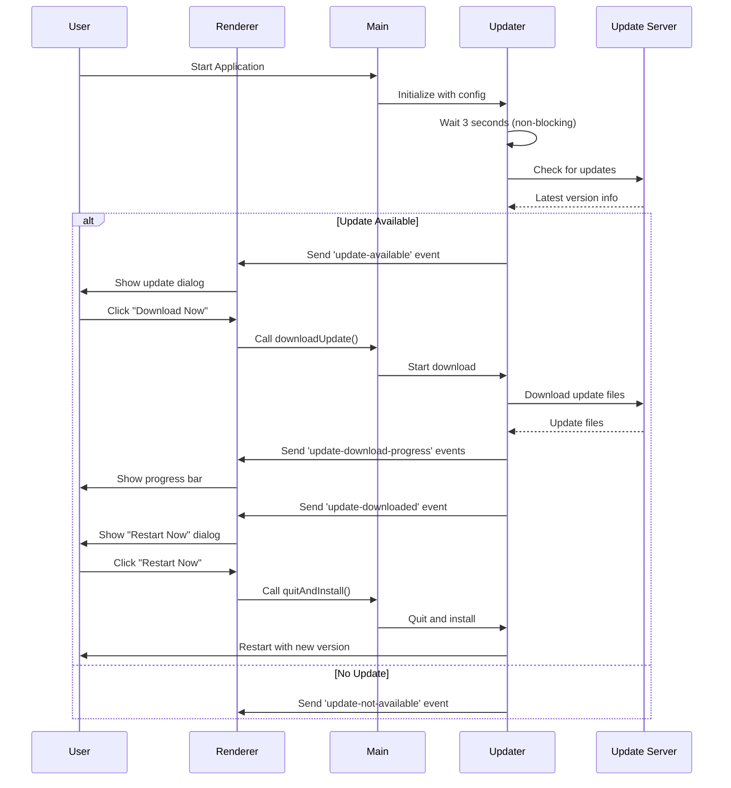

# Electron Auto-Update Implementation

This document describes the implementation of automatic update functionality using static web servers for the Electron application.

## Overview

The auto-update feature allows the application to automatically check for updates on startup, download them, and prompt the user to install. It is designed to work with static web servers (GitHub Pages, S3+CloudFront, Nginx, etc.) using the `electron-updater` package with the `generic` provider.

## Architecture



## Components

### Backend Components

1. **src/main/updater.ts**
   - Core updater logic using `electron-updater`
   - Manages update checking, downloading, and installation
   - Emits events to renderer process

2. **src/main/updater-config.ts**
   - Configuration loader for updater settings
   - Development: Reads from `ELECTRON_UPDATER_CONFIG` environment variable
   - Production: Reads from `updater.json` file next to executable

3. **src/main/handler.ts**
   - IPC handlers for update operations
   - Exposes `checkForUpdates()`, `downloadUpdate()`, `quitAndInstall()`

4. **src/main/server.ts**
   - Integrates updater into main process
   - Initializes updater after main window is created

### Frontend Components

1. **src/renderer/src/components/UpdateNotification.tsx**
   - React component for update notifications
   - Shows dialogs for update available, downloading, downloaded, and errors
   - Handles user interactions (download, install, dismiss)

2. **src/renderer/src/App.tsx**
   - Integrates `UpdateNotification` component
   - Enables update notifications after backend connection

### Configuration

1. **electron-builder.yml**
   - NSIS installer configuration for Windows
   - Per-user installation (allows updater.json placement)

2. **.env.example**
   - Example environment variable configuration for development

## Configuration

### Development Mode

Set the `ELECTRON_UPDATER_CONFIG` environment variable:

```bash
# .env file
ELECTRON_UPDATER_CONFIG='{"enabled":true,"updateServerUrl":"http://localhost:5000","channel":"latest"}'
```

**Format**: JSON string with the following structure:
```typescript
{
  "enabled": boolean,          // Enable/disable auto-update
  "updateServerUrl": string,   // Base URL of update server
  "channel": string            // Update channel (e.g., "latest", "beta")
}
```

### Production Mode

Create a `updater.json` file in the same directory as the executable (next to the `.exe` file):

**Location**:
- Windows: `<installation-directory>/updater.json` (e.g., `C:\Users\<username>\AppData\Local\electron-ai-starter\updater.json`)

**Example updater.json**:
```json
{
  "enabled": true,
  "updateServerUrl": "https://your-domain.com/updates",
  "channel": "latest"
}
```

**Deployment Note**: You need to manually place this file in the installation directory after the application is installed, or include it in your installer script.

## Update Server Setup

The update server must be a static web server that serves the following files:

### Required Files

1. **latest.yml** (or latest-mac.yml, latest-linux.yml)
   - Metadata file containing version information
   - Generated by `electron-builder`

2. **Installer files**
   - Windows: `electron-ai-starter-0.1.0-setup.exe`
   - Full NSIS installer with the new version

### Directory Structure

```
update-server/
├── latest.yml
├── electron-ai-starter-0.1.0-setup.exe
├── electron-ai-starter-0.2.0-setup.exe
└── ...
```

### Example latest.yml

```yaml
version: 0.2.0
releaseDate: '2025-11-11T00:00:00.000Z'
files:
  - url: electron-ai-starter-0.2.0-setup.exe
    sha512: <hash>
    size: 12345678
path: electron-ai-starter-0.2.0-setup.exe
sha512: <hash>
releaseNotes: |
  - Added new features
  - Fixed bugs
```

### Hosting Options

1. **GitHub Pages**
   - Use GitHub Actions to build and publish to gh-pages branch
   - Set `updateServerUrl` to `https://<username>.github.io/<repo>/`

2. **AWS S3 + CloudFront**
   - Upload files to S3 bucket
   - Configure CloudFront distribution
   - Set `updateServerUrl` to CloudFront URL

3. **Nginx/Apache**
   - Configure static file serving
   - Enable HTTPS (required for production)
   - Set `updateServerUrl` to server URL

## Building and Publishing

### 1. Build the application

```bash
pnpm run build:win
```

This creates:
- `dist/electron-ai-starter-0.1.0-setup.exe` - Installer
- `dist/latest.yml` - Update metadata

### 2. Upload to update server

Upload both files to your static web server:

```bash
# Example: Upload to S3
aws s3 cp dist/electron-ai-starter-0.1.0-setup.exe s3://my-bucket/updates/
aws s3 cp dist/latest.yml s3://my-bucket/updates/
```

### 3. Test update flow

1. Install version 0.1.0 from the installer
2. Place `updater.json` in the installation directory
3. Build and upload version 0.2.0
4. Launch the application (0.1.0)
5. Wait 3 seconds for automatic update check
6. Update notification should appear

## User Experience

### Update Available Dialog

When an update is available, the user sees:
- **Title**: "Update Available"
- **Message**: "A new version (X.X.X) is available. Would you like to download it now?"
- **Release Notes**: Shows changelog if available
- **Buttons**:
  - "Later" - Dismiss and check again next startup
  - "Download Now" - Start download

### Download Progress Dialog

During download:
- **Title**: "Downloading Update"
- **Progress Bar**: Shows download percentage
- **Details**: Transferred / Total size and download speed

### Update Downloaded Dialog

When download completes:
- **Title**: "Update Ready"
- **Message**: "Version X.X.X has been downloaded. Restart now to install the update?"
- **Buttons**:
  - "Later" - Continue using current version
  - "Restart Now" - Quit and install update

### Error Dialog

If an error occurs:
- **Title**: "Update Error"
- **Message**: Error details
- **Button**: "Close"

## Security Considerations

1. **HTTPS Required**
   - Production update servers MUST use HTTPS
   - Development can use HTTP (localhost only)

2. **Code Signing** (Currently disabled)
   - Windows installers should be code-signed in production
   - Prevents "Unknown Publisher" warnings
   - See `electron-builder` documentation for code signing setup

3. **Automatic Signature Verification**
   - `electron-updater` automatically verifies file integrity using SHA-512 hashes
   - Prevents man-in-the-middle attacks

## Troubleshooting

### Update check fails

1. **Check logs**: View `./tmp/logs/app.log` (development) or `<userData>/logs/app.log` (production)
2. **Verify updater.json**: Ensure file exists and is valid JSON
3. **Check network**: Ensure update server is accessible
4. **Verify latest.yml**: Ensure file exists on server and is properly formatted

### Update doesn't appear

1. **Check version**: Ensure server version is higher than current version
2. **Wait 3 seconds**: Initial check has a 3-second delay
3. **Check console**: Open DevTools and check for errors
4. **Verify configuration**: Ensure `enabled: true` in configuration

### Download fails

1. **Check network**: Ensure stable internet connection
2. **Check server**: Ensure installer file is accessible
3. **Check logs**: Review error messages in logs
4. **Check disk space**: Ensure sufficient space for download

## API Reference

### Main Process APIs

```typescript
// src/main/updater.ts
class Updater {
  initialize(config: UpdaterConfig, mainWindow: BrowserWindow): void
  checkForUpdates(): Promise<UpdateCheckResult>
  downloadUpdate(): Promise<void>
  quitAndInstall(): void
}
```

### IPC APIs

```typescript
// From renderer process
window.main.checkForUpdates(): Promise<Result<UpdateCheckResult, string>>
window.main.downloadUpdate(): Promise<Result<void, string>>
window.main.quitAndInstall(): Promise<Result<void, string>>
```

### IPC Events

Renderer process receives these events:

```typescript
// Update available
window.electron.ipcRenderer.on('update-available', (event, info: UpdateInfo) => {})

// Update not available
window.electron.ipcRenderer.on('update-not-available', (event, info) => {})

// Download progress
window.electron.ipcRenderer.on('update-download-progress', (event, progress: UpdateProgressInfo) => {})

// Update downloaded
window.electron.ipcRenderer.on('update-downloaded', (event, info: UpdateInfo) => {})

// Update error
window.electron.ipcRenderer.on('update-error', (event, error: UpdateError) => {})
```

## Future Enhancements

1. **Code Signing**: Add Windows code signing support
2. **Manual Check**: Add UI button for manual update check
3. **Update Channels**: Support multiple channels (stable, beta, alpha)
4. **macOS/Linux Support**: Extend to other platforms
5. **Differential Updates**: Implement delta updates for smaller downloads
6. **Background Download**: Download updates in background without user prompt
7. **Update History**: Show update history in settings
8. **Automatic Installation**: Install updates automatically on app quit

## References

- [electron-updater Documentation](https://www.electron.build/auto-update)
- [electron-builder Configuration](https://www.electron.build/configuration/configuration)
- [Publishing Artifacts](https://www.electron.build/configuration/publish)
