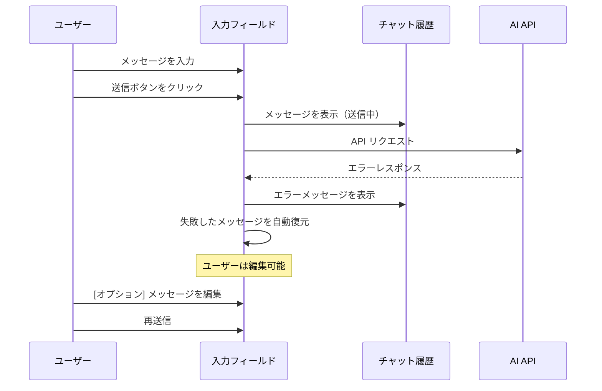
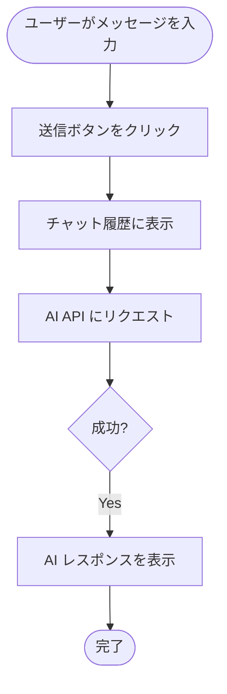
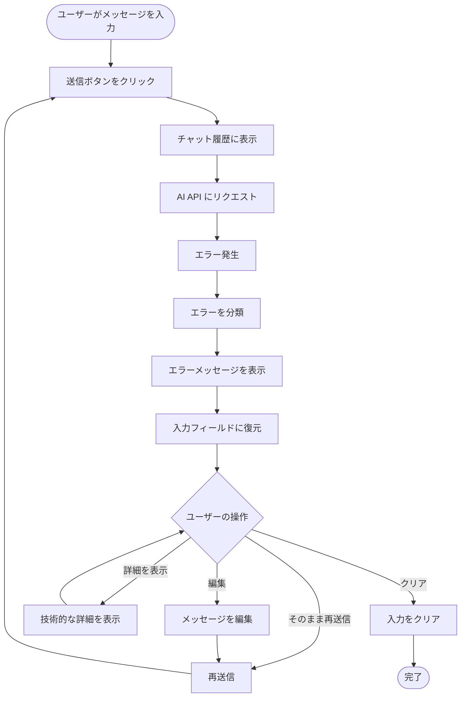
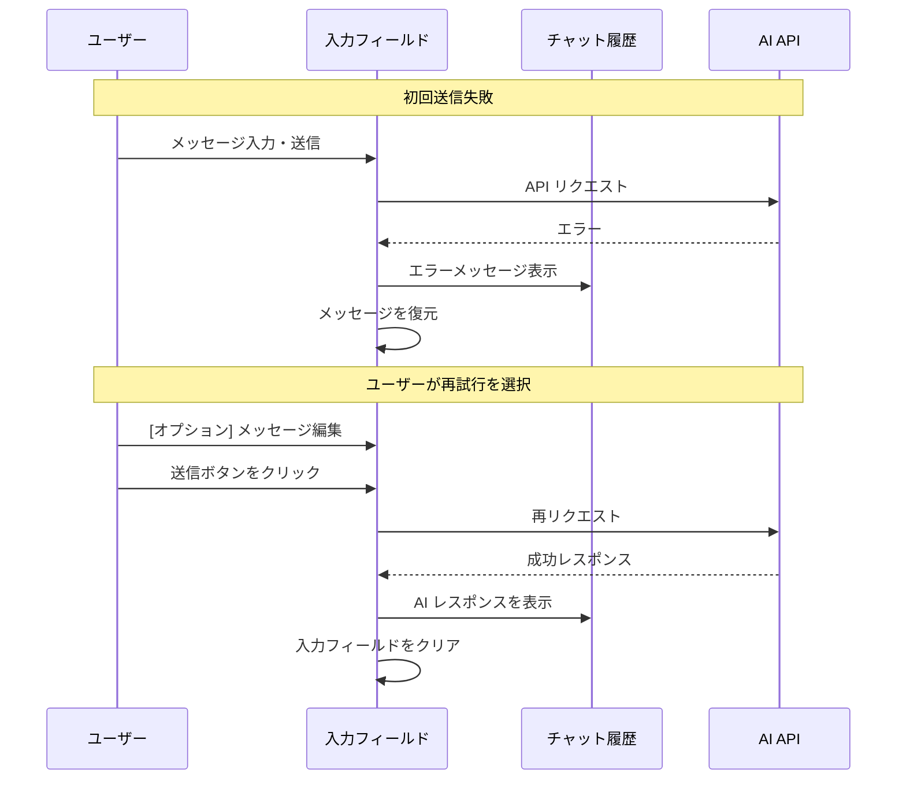

# チャットエラーハンドリングの設計方針

このドキュメントでは、AI チャット機能におけるエラーハンドリングとユーザー体験の設計方針を定義します。

## 目次

- [背景と問題](#背景と問題)
- [設計の目的](#設計の目的)
- [エラーハンドリングの基本方針](#エラーハンドリングの基本方針)
- [UI/UX 設計](#uiux-設計)
- [エラーの種類と対応](#エラーの種類と対応)
- [実装詳細](#実装詳細)
- [ユーザーフロー](#ユーザーフロー)
- [今後の拡張性](#今後の拡張性)

---

## 背景と問題

### 現在の問題

チャットメッセージの送信が失敗した場合、以下の問題が発生しています：

1. **フィードバック不足**: エラーが発生しても、チャット履歴エリアが白紙で表示され、何が起きたのか分からない
2. **メッセージの喪失**: 送信失敗したメッセージがどこにも残らず、ユーザーは再入力を強いられる
3. **リトライの困難**: エラー後に同じメッセージを再送信するには、全て手動で再入力する必要がある
4. **原因の不明瞭**: ネットワークエラー、認証エラー、レート制限など、エラーの種類が分からない

### 影響を受けるユーザーシナリオ

- ネットワーク接続が不安定な環境での利用
- API キーが無効または期限切れの場合
- レート制限に達した場合
- プロキシ設定が正しくない場合
- AI プロバイダー側のサービス障害

---

## 設計の目的

### 主要な目標

1. **エラーの可視化**: ユーザーに何が起きたかを明確に伝える
2. **メッセージの保護**: 送信失敗したメッセージを失わない
3. **リトライの容易性**: ワンクリックで再送信できる
4. **編集の柔軟性**: 失敗したメッセージを編集してから再送信できる
5. **原因の明確化**: エラーの種類に応じた適切なメッセージとアクションを提供

### 設計原則

- **非破壊的**: ユーザーが入力した内容を失わない
- **直感的**: 次に何をすべきか明確
- **文脈に応じた対応**: エラーの種類に応じて適切なガイダンスを提供
- **シンプル**: 複雑な UI を避け、基本的な操作で解決できる

---

## エラーハンドリングの基本方針

### 自動入力復元パターン

エラー発生時、以下の動作を行います：



### 主要な動作

1. **エラーメッセージの表示**: チャット履歴内に、ユーザーメッセージの直後にエラーメッセージを表示
2. **自動復元**: 失敗したメッセージを入力フィールドに自動的に復元
3. **編集と再送信**: ユーザーは復元されたメッセージを編集して再送信できる

---

## UI/UX 設計

### エラーメッセージコンポーネント

チャット履歴内に表示されるエラーメッセージの構造：

```
┌─────────────────────────────────────────────────┐
│ ⚠️ メッセージの送信に失敗しました                │
│                                                 │
│ [詳細を表示]                                     │
└─────────────────────────────────────────────────┘
```

#### デザイン要素

- **アイコン**: ⚠️（警告）を使用
- **背景色**: 薄いオレンジ（`bg-orange-50`）
- **境界線**: オレンジ（`border-orange-200`）
- **メッセージ**: シンプルに「メッセージの送信に失敗しました」のみ
- **アクションボタン**: 「詳細を表示」（技術的なエラー詳細を展開）

### 入力フィールドの状態

- **復元時**: 入力フィールドに失敗したメッセージが自動的に復元される
- **編集可能**: ユーザーは自由にメッセージを編集できる
- **再送信**: 通常の「送信」ボタンで再送信

---

## エラーの種類と対応

### エラーカテゴリー

エラーは以下のカテゴリーに分類されますが、ユーザーに表示されるメッセージは常に「メッセージの送信に失敗しました」で統一します。詳細情報は「詳細を表示」ボタンで展開表示されます。

| エラーの種類 | 原因例 | 詳細に表示される情報 |
|-------------|--------|---------------------|
| **ネットワークエラー** | 接続タイムアウト、DNS解決失敗 | ネットワーク接続エラー、プロキシ設定の確認を促す |
| **認証エラー** | 無効な API キー、期限切れ | HTTP 401/403、API キーの確認を促す |
| **レート制限** | API 呼び出し上限 | HTTP 429、しばらく待つよう促す |
| **プロバイダーエラー** | サービス障害、無効な設定 | HTTP 4xx/5xx、プロバイダーからのエラーメッセージ |
| **不明なエラー** | その他の予期しないエラー | 技術的なエラーメッセージ、タイムスタンプ |

### エラーメッセージの構造

```typescript
interface ChatError {
  // エラーの種類（内部分類用、UI には表示しない）
  type: 'network' | 'auth' | 'rate_limit' | 'provider' | 'unknown'

  // 技術的な詳細（「詳細を表示」で展開表示）
  details: {
    statusCode?: number
    errorCode?: string
    errorMessage?: string
    timestamp: string
  }
}
```

### エラー判定ロジック

```typescript
function categorizeError(error: unknown): ChatError {
  const timestamp = new Date().toISOString()

  // ネットワークエラー
  if (error instanceof TypeError && error.message.includes('fetch')) {
    return {
      type: 'network',
      details: {
        errorMessage: error.message,
        timestamp
      }
    }
  }

  // HTTP ステータスコードベースの判定
  if (error instanceof Response) {
    const statusCode = error.status
    let type: ChatError['type'] = 'provider'

    if (statusCode === 401 || statusCode === 403) {
      type = 'auth'
    } else if (statusCode === 429) {
      type = 'rate_limit'
    }

    return {
      type,
      details: {
        statusCode,
        errorMessage: error.statusText || String(error),
        timestamp
      }
    }
  }

  // デフォルト（不明なエラー）
  return {
    type: 'unknown',
    details: {
      errorMessage: String(error),
      timestamp
    }
  }
}
```

---

## 実装詳細

### コンポーネント構造

```
Thread (assistant-ui)
├── Message (ユーザーメッセージ)
├── ErrorMessage (新規コンポーネント)
│   ├── ErrorIcon
│   ├── ErrorTitle
│   └── ShowDetailsButton (展開可能)
└── Message (AI レスポンス)
```

### 状態管理

```typescript
interface ChatState {
  // 現在の入力値
  inputValue: string

  // メッセージ履歴
  messages: Array<{
    id: string
    role: 'user' | 'assistant' | 'error'
    content?: string
    error?: ChatError
  }>
}
```

### 送信エラー時の処理フロー

```typescript
async function handleSendMessage(message: string) {
  try {
    // メッセージを履歴に追加
    addMessage({ role: 'user', content: message })

    // AI API を呼び出し
    const response = await sendToAI(message)

    // 成功: AI レスポンスを表示
    addMessage({ role: 'assistant', content: response })

  } catch (error) {
    // エラーを分類
    const chatError = categorizeError(error)

    // エラーメッセージを履歴に追加
    addMessage({
      role: 'error',
      error: chatError
    })

    // 失敗したメッセージを入力フィールドに復元
    setInputValue(message)
  }
}
```

### エラーメッセージコンポーネント

```typescript
interface ErrorMessageProps {
  error: ChatError
}

function ErrorMessage({ error }: ErrorMessageProps) {
  const [showDetails, setShowDetails] = useState(false)

  return (
    <Alert variant="destructive" className="my-2">
      <AlertCircle className="h-4 w-4" />
      <AlertTitle>メッセージの送信に失敗しました</AlertTitle>
      <AlertDescription>
        {showDetails && (
          <div className="mt-2 p-2 bg-gray-100 rounded text-xs font-mono">
            <pre>{JSON.stringify(error.details, null, 2)}</pre>
          </div>
        )}

        <div className="mt-3">
          <Button
            variant="outline"
            size="sm"
            onClick={() => setShowDetails(!showDetails)}
          >
            {showDetails ? '詳細を隠す' : '詳細を表示'}
          </Button>
        </div>
      </AlertDescription>
    </Alert>
  )
}
```

### Assistant UI との統合

Assistant UI のカスタムコンポーネント機能を使用して、エラーメッセージを統合します：

```typescript
import { Thread } from '@assistant-ui/react'

function ChatThread() {
  return (
    <Thread
      components={{
        Message: CustomMessage,
        ErrorMessage: ErrorMessage
      }}
    />
  )
}

function CustomMessage({ message }) {
  if (message.role === 'error') {
    return <ErrorMessage error={message.error} />
  }

  return <DefaultMessage message={message} />
}
```

---

## ユーザーフロー

### 正常系フロー



### エラー時のフロー



### リトライのフロー



---

## 今後の拡張性

### フェーズ 1: 基本的なエラーハンドリング（現在）

- ✅ エラーメッセージの表示
- ✅ 自動入力復元
- ✅ 基本的なエラー分類

### フェーズ 2: エラー情報の充実

- ⬜ より詳細なエラーカテゴリー
- ⬜ エラー履歴の保存
- ⬜ エラー統計の表示（設定画面）

### フェーズ 3: リトライの最適化

- ⬜ 指数バックオフによる自動リトライ
- ⬜ リトライカウンターの表示
- ⬜ レート制限を考慮した待機時間の計算

### フェーズ 4: オフライン対応

- ⬜ オフライン検出
- ⬜ メッセージのキューイング
- ⬜ オンライン復帰時の自動送信

### フェーズ 5: 高度な診断機能

- ⬜ ネットワーク診断ツール
- ⬜ 接続テストの統合
- ⬜ トラブルシューティングウィザード

### 検討事項

1. **パフォーマンス**: エラー発生時の UI レスポンスを最適化
2. **アクセシビリティ**: スクリーンリーダー対応、キーボード操作
3. **国際化**: エラーメッセージの多言語対応
4. **テスト**: エラーシナリオの自動テスト
5. **ログ収集**: エラー情報をログに記録し、デバッグを容易にする

---

## 参考資料

- [Electron AI Starter - IPC Communication Deep Dive](./IPC_COMMUNICATION_DEEP_DIVE.md)
- [Electron AI Starter - AI Settings V2 Design](./AI_SETTINGS_V2_DESIGN.md)
- [Assistant UI Documentation](https://github.com/assistant-ui/react)
- [Vercel AI SDK - Error Handling](https://sdk.vercel.ai/docs/guides/error-handling)

---

**最終更新**: 2025-11-12
