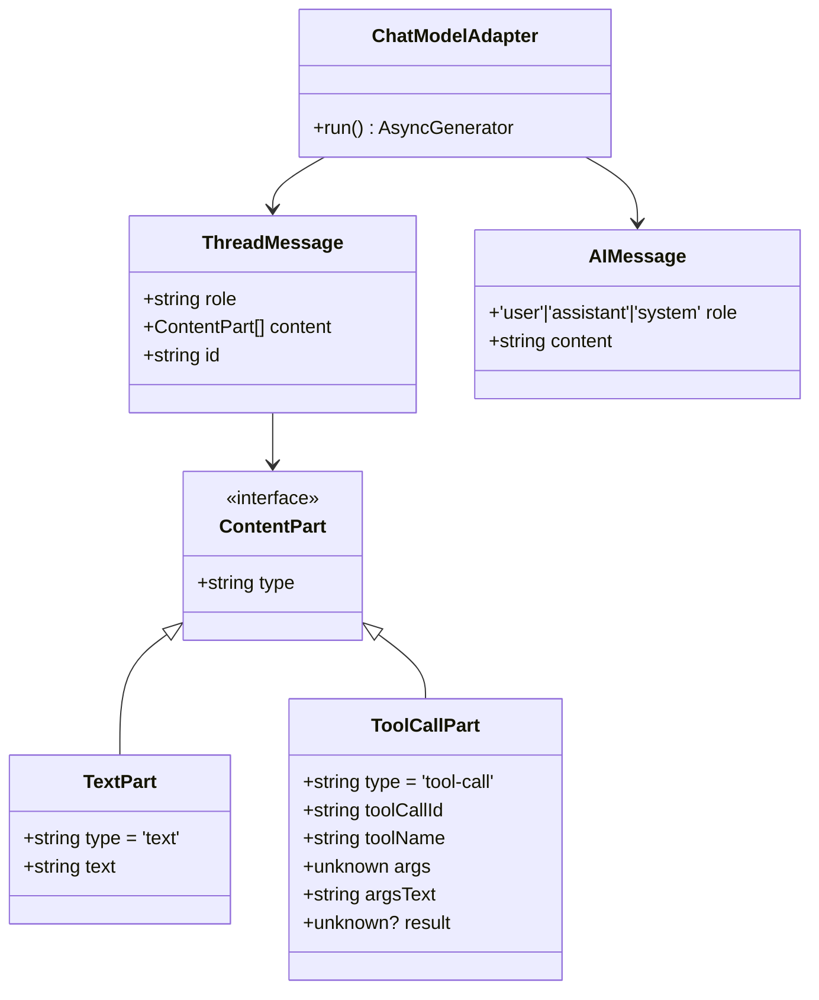

# チャットセッション永続化設計文書

## 概要

このドキュメントは、チャットセッション（会話履歴）の記録・再開機構の設計仕様をまとめたものです。ユーザーがアプリケーションを終了してから再起動した場合でも、以前の会話を復元して継続できる機能を提供します。

**最終更新**: 2025-11-12  
**ステータス**: 要件定義フェーズ

---

## 目次

1. [背景と問題](#背景と問題)
2. [設計の目的](#設計の目的)
3. [用語定義](#用語定義)
4. [要件仕様](#要件仕様)
5. [データモデル](#データモデル)
6. [システムアーキテクチャ](#システムアーキテクチャ)
7. [API 仕様](#api-仕様)
8. [ユーザーフロー](#ユーザーフロー)
9. [スキーマバージョン管理](#スキーマバージョン管理)
10. [エラーハンドリング](#エラーハンドリング)
11. [マイグレーション戦略](#マイグレーション戦略)
12. [実装計画](#実装計画)

---

## 背景と問題

### 現在の状態

現在のアプリケーションでは、チャットセッションがメモリ上にのみ保持されています：

- **制限事項**：
  - アプリを再起動するとチャット履歴が消失
  - 長時間の会話を保存できない
  - 同じトピックの複数の会話を管理できない
  - 会話の履歴を後から参照できない

### ユーザーニーズ

- 中断した会話を後から再開したい
- 複数のセッション（トピックごと）を管理したい
- 過去の会話を検索・参照したい
- セッションをエクスポート・共有したい（将来）

---

## 設計の目的

1. **会話の永続化**: チャット履歴をデータベースに安全に保存
2. **セッション管理**: 複数のチャットセッションを管理・切り替え
3. **再開機能**: 保存されたセッションを復元して会話継続
4. **メタデータ管理**: セッションの作成日時、最終更新日時、タイトル等を管理
5. **スケーラビリティ**: 大量のメッセージとセッションに対応
6. **バックワード互換性**: 既存機能への影響を最小化

---

## 用語定義

| 用語 | 定義 |
|------|------|
| **セッション** | 1 つの会話スレッド。複数のメッセージで構成される |
| **メッセージ** | ユーザーまたは AI の 1 つの発話。テキスト、メタデータを含む |
| **メッセージスレッド** | メッセージの連続。セッションを形成 |
| **セッションメタデータ** | セッションのタイトル、作成日時、最終更新日時、モデル情報など |
| **ツール呼び出し** | MCP ツールの実行記録（呼び出し、結果含む） |
| **永続化** | データベースへの保存・復元処理 |

---

## 要件仕様

### 機能要件（FR）

#### FR1: セッション管理

- **FR1.1**: 新規セッション作成
  - ユーザーが新しいチャットを開始できる
  - 自動的にセッション ID を生成
  - デフォルトタイトルは日時 or ユーザー指定

- **FR1.2**: セッション一覧表示
  - すべてのセッションを一覧で表示
  - タイトル、最終更新日時でソート可能
  - タイトル・メッセージ内容で検索可能

- **FR1.3**: セッション削除
  - 不要なセッションを削除（ハードデリート）
  - 削除前に確認プロンプトを表示
  - DB からセッションとすべてのメッセージが完全に削除される

- **FR1.4**: セッションタイトル編集
  - セッションのタイトルを後から変更可能
  - 空文字は許可しない

- **FR1.5**: セッション切り替え
  - 複数セッション間をシームレスに切り替え可能
  - 前のセッション状態は保存

#### FR2: メッセージ永続化

- **FR2.1**: メッセージ保存
  - ユーザー入力とAI応答の両方を保存
  - タイムスタンプ、ロール（user/assistant/system）を記録

- **FR2.2**: メッセージ表示
  - セッション内のすべてのメッセージを新しい順に表示
  - ページング対応（大規模セッションに対応）

- **FR2.3**: メッセージ削除
  - 特定のメッセージを削除可能
  - または会話の一部を削除可能

- **FR2.4**: メッセージ編集
  - ユーザーメッセージの再編集・再送信機能
  - AI の応答以降を削除して再送信

#### FR3: セッション再開

- **FR3.1**: 自動復元
  - アプリ起動時に最後に使用したセッションを復元
  - ユーザー設定で自動復元を ON/OFF 可能

- **FR3.2**: 手動復元
  - セッション一覧から選択して復元
  - 復元後すぐに会話継続可能

- **FR3.3**: コンテキスト復元
  - セッション作成時の AI モデル設定を復元
  - または起動時のデフォルトモデルを使用

#### FR4: メタデータ管理

- **FR4.1**: セッションメタデータ
  - id（UUID）
  - title（ユーザー設定）
  - createdAt（ISO 8601）
  - updatedAt（ISO 8601）
  - modelConfig（使用 AI モデル情報）
  - messageCount（メッセージ数）

- **FR4.2**: メッセージメタデータ
  - id（UUID）
  - sessionId（所属セッション）
  - role（user/assistant/system）
  - content（メッセージ本文）
  - timestamp（ISO 8601）
  - toolCalls（MCP ツール呼び出し情報）
  - usage（トークン使用量など）

#### FR5: ツール呼び出し履歴

- **FR5.1**: ツール呼び出し記録
  - MCP ツール呼び出しの名前、入力、出力を記録
  - タイムスタンプを記録

- **FR5.2**: ツール呼び出し表示
  - メッセージ内に「ツール使用」インジケータを表示

### 非機能要件（NFR）

#### NFR1: パフォーマンス

- **NFR1.1**: レスポンス時間
  - セッション一覧取得: < 500ms（100 セッション）
  - メッセージ読み込み: < 1000ms（1000 メッセージ）
  - セッション切り替え: < 200ms

- **NFR1.2**: スケーラビリティ
  - 1000 セッション、10K メッセージまでスムーズに対応
  - 必要に応じてページング実装

#### NFR2: データ整合性

- **NFR2.1**: ACID 特性
  - メッセージ保存時はトランザクション保証
  - 部分的な保存を防ぐ

- **NFR2.2**: 同時実行制御
  - 複数プロセスからの同時アクセス対応
  - libsql（SQLite ベース）のロック機構を活用

#### NFR3: ストレージ

- **NFR3.1**: ディスク容量
  - 1 メッセージ平均 1KB （テキストのみ）
  - 10K メッセージ = 約 10MB
  - ユーザーデータディレクトリ配下に保存

- **NFR3.2**: クリーンアップ
  - 古いセッション（90 日以上未使用）の自動削除オプション（手動で OFF 可能）
  - ユーザーが明示的に手動削除可能（ハードデリート）

#### NFR4: セキュリティ

- **NFR4.1**: アクセス制御
  - セッションはローカルユーザーのみアクセス可能
  - API キー等の機密情報は保存しない

- **NFR4.2**: データ保護
  - センシティブデータ（API キー）は保存対象外
  - ローカル暗号化検討（将来）

#### NFR5: 可用性

- **NFR5.1**: バックアップ
  - セッションデータのバックアップ機能（将来）
  - クラウド同期検討（将来）

- **NFR5.2**: 復旧
  - DB 破損時の修復メカニズム
  - フォールバック: メモリ内セッション

---

## データモデル

### アーキテクチャ方針

**マルチレベルの正規化テーブル設計**を採用します。理由：

1. **正規化スキーマ（3NF）**: データ整合性が高く、保守性に優れている
2. **OPENCODE 設計の踏襲**: 既存の成功事例（Session → Message → Part 階層）を SQL テーブルで実装
3. **柔軟なクエリ**: ツール実行統計、エラー分析など SQL で直接実行可能
4. **将来への拡張性**: 要約・圧縮機能を後から追加しやすい
5. **段階的復元**: UI はメッセージ一覧を取得し、必要に応じてパートを遅延ロード可能

### スキーマ設計

```sql
-- 1. セッション（トップレベル）
CREATE TABLE chat_sessions (
  id TEXT PRIMARY KEY,
  title TEXT NOT NULL,
  createdAt TIMESTAMP NOT NULL,
  updatedAt TIMESTAMP NOT NULL,
  
  -- メタデータ
  modelConfigId TEXT,
  modelName TEXT,
  providerName TEXT,
  
  -- スキーマバージョン管理
  dataSchemaVersion INTEGER NOT NULL DEFAULT 1,
  
  -- UI キャッシュ
  messageCount INTEGER NOT NULL DEFAULT 0
);

-- 2. メッセージ（role: user | assistant | system）
CREATE TABLE chat_messages (
  id TEXT PRIMARY KEY,
  sessionId TEXT NOT NULL,
  
  -- メッセージ属性
  role TEXT NOT NULL,              -- 'user' | 'assistant' | 'system'
  createdAt TIMESTAMP NOT NULL,
  completedAt TIMESTAMP,           -- assistant の streaming 完了時刻
  
  -- トークン使用量
  inputTokens INTEGER,
  outputTokens INTEGER,
  
  -- エラー情報
  error TEXT,                      -- JSON: { name, message, details }
  
  -- メッセージ分岐対応
  parentMessageId TEXT,
  
  FOREIGN KEY (sessionId) REFERENCES chat_sessions(id) ON DELETE CASCADE,
  FOREIGN KEY (parentMessageId) REFERENCES chat_messages(id) ON DELETE SET NULL
);

-- 3. メッセージパート（text | tool_call）
CREATE TABLE message_parts (
  id TEXT PRIMARY KEY,
  messageId TEXT NOT NULL,
  sessionId TEXT NOT NULL,
  
  -- パートタイプ
  type TEXT NOT NULL,              -- 'text' | 'tool_call'
  
  -- 時系列
  createdAt TIMESTAMP NOT NULL,
  updatedAt TIMESTAMP NOT NULL,
  
  -- テキストパート用
  content TEXT,
  
  -- ツール呼び出しパート用
  toolCallId TEXT UNIQUE,
  toolName TEXT,
  toolInput TEXT,                  -- JSON
  toolInputText TEXT,              -- 整形済み表示用
  toolStatus TEXT,                 -- 'pending' | 'running' | 'completed' | 'error'
  
  -- その他メタデータ
  metadata TEXT,                   -- JSON
  
  FOREIGN KEY (messageId) REFERENCES chat_messages(id) ON DELETE CASCADE,
  FOREIGN KEY (sessionId) REFERENCES chat_sessions(id) ON DELETE CASCADE
);

-- 4. ツール呼び出し結果
CREATE TABLE tool_call_results (
  id TEXT PRIMARY KEY,
  partId TEXT NOT NULL UNIQUE,
  messageId TEXT NOT NULL,
  sessionId TEXT NOT NULL,
  
  -- ツール識別情報
  toolCallId TEXT NOT NULL UNIQUE,
  toolName TEXT NOT NULL,
  
  -- 実行結果
  output TEXT,                     -- JSON
  status TEXT NOT NULL,            -- 'success' | 'error'
  error TEXT,
  errorCode TEXT,
  
  -- 実行時刻
  startedAt TIMESTAMP,
  completedAt TIMESTAMP,
  
  -- 記録
  createdAt TIMESTAMP NOT NULL,
  updatedAt TIMESTAMP NOT NULL,
  
  FOREIGN KEY (partId) REFERENCES message_parts(id) ON DELETE CASCADE,
  FOREIGN KEY (messageId) REFERENCES chat_messages(id) ON DELETE CASCADE,
  FOREIGN KEY (sessionId) REFERENCES chat_sessions(id) ON DELETE CASCADE
);

-- インデックス戦略
CREATE INDEX idx_chat_messages_sessionId ON chat_messages(sessionId);
CREATE INDEX idx_chat_messages_createdAt ON chat_messages(createdAt DESC);
CREATE INDEX idx_message_parts_messageId ON message_parts(messageId);
CREATE INDEX idx_message_parts_sessionId ON message_parts(sessionId);
CREATE INDEX idx_message_parts_toolCallId ON message_parts(toolCallId);
CREATE INDEX idx_tool_call_results_messageId ON tool_call_results(messageId);
CREATE INDEX idx_tool_call_results_toolName ON tool_call_results(toolName);
```

### TypeScript インターフェース

```typescript
// セッション
interface ChatSessionRow {
  id: string
  title: string
  createdAt: string              // ISO 8601
  updatedAt: string              // ISO 8601
  modelConfigId?: string
  modelName?: string
  providerName?: string
  dataSchemaVersion: number
  messageCount: number
}

// メッセージ
interface ChatMessageRow {
  id: string
  sessionId: string
  role: 'user' | 'assistant' | 'system'
  createdAt: string
  completedAt?: string
  inputTokens?: number
  outputTokens?: number
  error?: string
  parentMessageId?: string
}

// メッセージパート
interface MessagePartRow {
  id: string
  messageId: string
  sessionId: string
  type: 'text' | 'tool_call'
  createdAt: string
  updatedAt: string
  
  // text タイプ
  content?: string
  
  // tool_call タイプ
  toolCallId?: string
  toolName?: string
  toolInput?: string              // JSON
  toolInputText?: string
  toolStatus?: 'pending' | 'running' | 'completed' | 'error'
  metadata?: string
}

// ツール呼び出し結果
interface ToolCallResultRow {
  id: string
  partId: string
  messageId: string
  sessionId: string
  toolCallId: string
  toolName: string
  output?: string                 // JSON
  status: 'success' | 'error'
  error?: string
  errorCode?: string
  startedAt?: string
  completedAt?: string
  createdAt: string
  updatedAt: string
}

// ドメイン型（UI/API 向け）
interface TextPart {
  type: 'text'
  id: string
  content: string
  createdAt: string
}

interface ToolCallPart {
  type: 'tool_call'
  id: string
  toolCallId: string
  toolName: string
  input: unknown
  inputText: string
  status: 'pending' | 'running' | 'completed' | 'error'
  result?: {
    output?: unknown
    error?: string
    errorCode?: string
  }
  startedAt?: string
  completedAt?: string
}

// 複合メッセージ（UI に返すデータ）
interface ChatMessageWithParts extends ChatMessageRow {
  parts: (TextPart | ToolCallPart)[]
}

// セッション + メッセージ（セッション復元時）
interface ChatSessionWithMessages extends ChatSessionRow {
  messages: ChatMessageWithParts[]
}

// API リクエスト型
interface CreateSessionRequest {
  title?: string
  modelConfigId?: string
}

interface AddMessageRequest {
  sessionId: string
  role: 'user' | 'assistant' | 'system'
  content: string
  inputTokens?: number
  outputTokens?: number
}

interface AddToolCallPartRequest {
  messageId: string
  sessionId: string
  toolCallId: string
  toolName: string
  input: unknown
}

interface UpdateToolCallResultRequest {
  toolCallId: string
  output?: unknown
  status: 'success' | 'error'
  error?: string
  errorCode?: string
  completedAt?: string
}

interface DeleteMessagesAfterRequest {
  sessionId: string
  messageId: string
}
```

### 現状の Renderer（UI）上のメッセージ構造

現在のレンダラーでは `@assistant-ui/react` ライブラリを使用しており、メッセージは以下の構造で扱われています。

**ThreadMessage (assistant-ui のメッセージ型)**:

```typescript
interface ThreadMessage {
  role: 'user' | 'assistant' | 'system'
  content: ContentPart[]           // テキストとツール呼び出しの混合
  id: string
}

// コンテンツ部品（複合型）
type ContentPart = TextPart | ToolCallPart

interface TextPart {
  type: 'text'
  text: string
}

interface ToolCallPart {
  type: 'tool-call'
  toolCallId: string
  toolName: string
  args: unknown                     // ツール入力パラメータ
  argsText: string                  // JSON 文字列化
  result?: unknown                  // ツール出力（実行結果）
}
```

**Mermaid クラス図**:



**データフロー**:

1. **Backend → Renderer**: `AIMessage[]` として渡される（role + plain text content）
2. **Renderer 内流通**: `ThreadMessage[]` に変換（ContentPart[] を含む）
3. **表示**: TextPart は Markdown として、ToolCallPart は折りたたみ可能なカードとして表示

### 今後の設計方針の検討

現状の UI 上では「テキストとツール呼び出しが 1 つのメッセージ内に複合」という構造ですが、永続化時には以下のいずれかの設計を選択できます：

#### オプション A：Key-Value JSON 内で複合型を保持（現在の設計）

**メリット**:
- 最小限の変更で既存UI対応
- JSON スキーマの柔軟性が高い
- UI の ContentPart 構造そのままに保存

**デメリット**:
- ツール呼び出しの細粒度検索が困難
- ツール実行結果の統計集計に手作業が必要
- メッセージの正規化が不完全

#### オプション B：メッセージとツール呼び出しを正規化（マルチレベルテーブル設計）

本オプションは OPENCODE（コーディングエージェント）の設計を参考に、**マルチレベルの正規化テーブル構造**を採用します。
セッション → メッセージ → パート（テキスト/ツール呼び出し）という階層構造を明示的に表現します。

**設計の理念**:

OPENCODE は Storage を JSON ファイルで実装していますが、本プロジェクトでは同じ論理構造を SQL テーブルで実装します：
- **Session（セッション）**: メタデータ（title、createdAt、updatedAt、modelConfig など）
- **Message（メッセージ）**: role（user/assistant/system）、タイムスタンプ、トークン使用量
- **MessagePart（メッセージ内の部分）**: type（text/tool_call）、それぞれの内容
- **ToolCallResult（ツール呼び出し結果）**: tool 結果の詳細、error、output

**テーブル構造（詳細版）**:

```sql
-- 1. チャットセッション（トップレベル）
CREATE TABLE chat_sessions (
  id TEXT PRIMARY KEY,
  title TEXT NOT NULL,
  createdAt TIMESTAMP NOT NULL,
  updatedAt TIMESTAMP NOT NULL,
  
  -- メタデータ
  modelConfigId TEXT,           -- 使用した AI モデル設定 ID
  modelName TEXT,               -- モデル名（スナップショット）
  providerName TEXT,            -- プロバイダ名（スナップショット）
  
  -- スキーマバージョン
  dataSchemaVersion INTEGER NOT NULL DEFAULT 1,
  
  -- メッセージ数キャッシュ（UI 高速化用）
  messageCount INTEGER NOT NULL DEFAULT 0
);

-- 2. メッセージ（セッション内の個別メッセージ）
CREATE TABLE chat_messages (
  id TEXT PRIMARY KEY,
  sessionId TEXT NOT NULL,
  
  -- メッセージ種別
  role TEXT NOT NULL,            -- 'user' | 'assistant' | 'system'
  
  -- タイムスタンプ
  createdAt TIMESTAMP NOT NULL,
  completedAt TIMESTAMP,         -- assistant メッセージが完成した時刻（streaming 完了時刻）
  
  -- トークン使用量（AI メッセージ向け）
  inputTokens INTEGER,
  outputTokens INTEGER,
  
  -- エラー情報（AI メッセージが失敗した場合）
  error TEXT,                    -- JSON: { name, message, details }
  
  -- 親メッセージ ID（会話の分岐に対応）
  parentMessageId TEXT,
  
  FOREIGN KEY (sessionId) REFERENCES chat_sessions(id) ON DELETE CASCADE,
  FOREIGN KEY (parentMessageId) REFERENCES chat_messages(id) ON DELETE SET NULL
);

-- 3. メッセージ部分（テキスト、ツール呼び出しなど）
CREATE TABLE message_parts (
  id TEXT PRIMARY KEY,
  messageId TEXT NOT NULL,
  sessionId TEXT NOT NULL,
  
  -- 部分タイプ
  type TEXT NOT NULL,            -- 'text' | 'tool_call'
  
  -- 共通フィールド
  createdAt TIMESTAMP NOT NULL,
  updatedAt TIMESTAMP NOT NULL,
  
  -- テキスト部分用
  content TEXT,                  -- type='text' のときのテキスト内容
  
  -- ツール呼び出し部分用
  toolCallId TEXT,               -- ツール呼び出し ID（一意）
  toolName TEXT,                 -- ツール名
  toolInput TEXT,                -- JSON: ツール入力パラメータ
  toolInputText TEXT,            -- JSON 整形版（表示用）
  toolStatus TEXT,               -- 'pending' | 'running' | 'completed' | 'error'
  
  -- メタデータ
  metadata TEXT,                 -- JSON: その他メタデータ
  
  FOREIGN KEY (messageId) REFERENCES chat_messages(id) ON DELETE CASCADE,
  FOREIGN KEY (sessionId) REFERENCES chat_sessions(id) ON DELETE CASCADE
);

-- 4. ツール呼び出し結果（tool_call パートの結果を別テーブルで管理）
CREATE TABLE tool_call_results (
  id TEXT PRIMARY KEY,
  partId TEXT NOT NULL UNIQUE,   -- message_parts の id を参照
  messageId TEXT NOT NULL,
  sessionId TEXT NOT NULL,
  
  -- ツール呼び出し情報
  toolCallId TEXT NOT NULL UNIQUE,
  toolName TEXT NOT NULL,
  
  -- 結果
  output TEXT,                   -- JSON: ツール出力
  status TEXT NOT NULL,          -- 'success' | 'error'
  error TEXT,                    -- エラーメッセージ
  errorCode TEXT,                -- エラーコード
  
  -- タイムスタンプ
  startedAt TIMESTAMP,           -- ツール実行開始時刻
  completedAt TIMESTAMP,         -- ツール実行完了時刻
  
  createdAt TIMESTAMP NOT NULL,
  updatedAt TIMESTAMP NOT NULL,
  
  FOREIGN KEY (partId) REFERENCES message_parts(id) ON DELETE CASCADE,
  FOREIGN KEY (messageId) REFERENCES chat_messages(id) ON DELETE CASCADE,
  FOREIGN KEY (sessionId) REFERENCES chat_sessions(id) ON DELETE CASCADE
);

-- インデックス
CREATE INDEX idx_chat_messages_sessionId ON chat_messages(sessionId);
CREATE INDEX idx_chat_messages_createdAt ON chat_messages(createdAt DESC);
CREATE INDEX idx_message_parts_messageId ON message_parts(messageId);
CREATE INDEX idx_message_parts_sessionId ON message_parts(sessionId);
CREATE INDEX idx_message_parts_toolCallId ON message_parts(toolCallId);
CREATE INDEX idx_tool_call_results_messageId ON tool_call_results(messageId);
CREATE INDEX idx_tool_call_results_toolName ON tool_call_results(toolName);
```

**TypeScript インターフェース（正規化後）**:

```typescript
// セッション
interface ChatSessionRow {
  id: string
  title: string
  createdAt: string
  updatedAt: string
  modelConfigId?: string
  modelName?: string
  providerName?: string
  dataSchemaVersion: number
  messageCount: number
}

// メッセージ
interface ChatMessageRow {
  id: string
  sessionId: string
  role: 'user' | 'assistant' | 'system'
  createdAt: string
  completedAt?: string          // assistant の場合、streaming 完了時刻
  inputTokens?: number
  outputTokens?: number
  error?: string
  parentMessageId?: string
}

// メッセージ部分
interface MessagePartRow {
  id: string
  messageId: string
  sessionId: string
  type: 'text' | 'tool_call'
  createdAt: string
  updatedAt: string
  
  // テキスト部分
  content?: string
  
  // ツール呼び出し部分
  toolCallId?: string
  toolName?: string
  toolInput?: string
  toolInputText?: string
  toolStatus?: 'pending' | 'running' | 'completed' | 'error'
  metadata?: string
}

// ツール呼び出し結果
interface ToolCallResultRow {
  id: string
  partId: string
  messageId: string
  sessionId: string
  toolCallId: string
  toolName: string
  output?: string
  status: 'success' | 'error'
  error?: string
  errorCode?: string
  startedAt?: string
  completedAt?: string
  createdAt: string
  updatedAt: string
}

// 組み立てられたメッセージ（UI 向け）
interface ChatMessageWithParts extends ChatMessageRow {
  parts: (TextPartRow | ToolCallPartRow)[]
}

interface TextPartRow {
  type: 'text'
  id: string
  content: string
  createdAt: string
}

interface ToolCallPartRow {
  type: 'tool_call'
  id: string
  toolCallId: string
  toolName: string
  input: unknown
  inputText: string
  status: 'pending' | 'running' | 'completed' | 'error'
  result?: {
    output?: unknown
    error?: string
    errorCode?: string
  }
  startedAt?: string
  completedAt?: string
}
```

**データ読み込みフロー（セッション復元時）**:

```typescript
async function getChatSessionWithMessages(sessionId: string): Promise<ChatSessionWithMessages | null> {
  // 1. セッション取得
  const sessionRow = await db.select().from(chatSessions).where(eq(chatSessions.id, sessionId))
  if (!sessionRow) return null

  // 2. メッセージ一覧取得（作成順）
  const messageRows = await db.select()
    .from(chatMessages)
    .where(eq(chatMessages.sessionId, sessionId))
    .orderBy(asc(chatMessages.createdAt))

  // 3. 各メッセージにパートを割り当て
  const messagesWithParts = await Promise.all(
    messageRows.map(async (msg) => {
      // パート取得
      const partRows = await db.select()
        .from(messageParts)
        .where(eq(messageParts.messageId, msg.id))
        .orderBy(asc(messageParts.createdAt))

      // ツール呼び出し結果を取得
      const parts = await Promise.all(
        partRows.map(async (part) => {
          if (part.type === 'text') {
            return { type: 'text', id: part.id, content: part.content, createdAt: part.createdAt }
          } else if (part.type === 'tool_call') {
            const result = await db.select()
              .from(toolCallResults)
              .where(eq(toolCallResults.partId, part.id))
              .limit(1)
            return {
              type: 'tool_call',
              id: part.id,
              toolCallId: part.toolCallId,
              toolName: part.toolName,
              input: JSON.parse(part.toolInput),
              inputText: part.toolInputText,
              status: part.toolStatus,
              result: result[0] ? {
                output: result[0].output ? JSON.parse(result[0].output) : undefined,
                error: result[0].error,
                errorCode: result[0].errorCode,
              } : undefined,
              startedAt: result[0]?.startedAt,
              completedAt: result[0]?.completedAt,
            }
          }
        })
      )

      return { ...msg, parts }
    })
  )

  return {
    ...sessionRow,
    messages: messagesWithParts
  }
}
```

**メリット**:
- ✅ **正規化スキーマ**: 3NF に従い、データ整合性が高い
- ✅ **効率的なクエリ**: 特定ツール実行の統計、エラーメッセージの集計など SQL で直接実行可能
- ✅ **段階的な拡張**: 将来「要約メッセージ」や「コンパクション」を追加しやすい
- ✅ **OPENCODE との親和性**: 同じレベルの階層構造を採用
- ✅ **部分更新**: ツール結果の追記やメッセージ完了フラグの更新が効率的

**デメリット**:
- ❌ **複雑性**: 4 テーブル、JOIN が複数必要
- ❌ **読み込み処理**: セッション全体復元に複数クエリ必要（ただし、インデックスで最適化可能）
- ❌ **マイグレーション管理**: バージョンアップ時に複数テーブルを管理
- ❌ **初期実装コスト**: Key-Value より実装量が増加

### 推奨方針

**オプション B（正規化テーブル設計）を採用** する理由：

1. **長期保守性**: 3NF に従う正規化スキーマは保守・拡張しやすい
2. **OPENCODE との整合性**: 既存の成功事例を踏襲
3. **将来への投資**: 要約・圧縮機能を後から追加する際、正規化済み設計だと容易
4. **統計・分析**: ツール実行結果の集計が SQL で直接実行可能
5. **段階的復元**: UI は「メッセージ一覧」を取得し、必要に応じて「パート」を遅延ロード可能

ただし、実装段階では以下を考慮：
- インデックス戦略で読み込み性能を確保
- キャッシュ層（messageCount など）で UI 反応性維持
- バッチ操作（トランザクション）で整合性保証

---

## システムアーキテクチャ

### 層構造

```
┌─────────────────────────────────────────────────────┐
│              Renderer (React)                       │
│  - ChatInterface Component                          │
│  - SessionList Component                            │
│  - SessionManager Context                           │
└─────────────────────┬───────────────────────────────┘
                      │ IPC/RPC
┌─────────────────────▼───────────────────────────────┐
│              Handler (Backend)                      │
│  - addChatMessage()                                 │
│  - getChatSession()                                 │
│  - listChatSessions()                               │
│  - deleteChatSession()                              │
└─────────────────────┬───────────────────────────────┘
                      │
┌─────────────────────▼───────────────────────────────┐
│        ChatSessionStore (Business Logic)            │
│  - Session CRUD（JSON 読み書き）                    │
│  - Message 操作（JSON 配列の操作）                  │
│  - タイムスタンプ・メタデータ管理                    │
└─────────────────────┬───────────────────────────────┘
                      │
┌─────────────────────▼───────────────────────────────┐
│         Database Layer (libsql + Drizzle)           │
│  - chat_sessions table (Key-Value ストア)           │
│  - JSON 読み書き・シリアライズ                      │
└─────────────────────┬───────────────────────────────┘
                      │
           ┌──────────▼──────────┐
           │   SQLite DB File    │
           │  (app.db)           │
           └─────────────────────┘
```

### コンポーネント責務

#### Renderer Layer

- セッション一覧 UI 表示
- 現在のセッション切り替え
- メッセージ入力・表示
- SessionManager Context で状態管理
- ローカルストレージ: lastSessionId

#### Backend Handler

- IPC API エントリーポイント
- リクエスト検証
- ChatSessionStore に委譲

#### ChatSessionStore

- Session CRUD 操作（JSON 全体の読み書き）
- Message 配列操作（追加・削除・編集）
- データベーストランザクション管理
- JSON のシリアライズ・パース

#### Database Layer

- Drizzle ORM スキーマ定義
- テーブル操作
- インデックス管理（createdAt, updatedAt, title）

### データフロー：メッセージ追加

```typescript
// Renderer
await backend.addChatMessage({
  sessionId: 'session-123',
  role: 'user',
  content: 'Hello'
})

// Handler
async addChatMessage(request: AddMessageRequest) {
  return await chatSessionStore.addMessage(request)
}

// ChatSessionStore
async addMessage(request: AddMessageRequest) {
  // 1. 現在のセッション読み込み
  const session = await db.select()
    .from(chatSessions)
    .where(eq(chatSessions.id, request.sessionId))

  // 2. スキーマバージョンに応じた自動アップグレード
  let data = JSON.parse(session.data) as SessionData
  if (session.dataSchemaVersion < CURRENT_DATA_SCHEMA_VERSION) {
    data = await migrateSessionData(data, session.dataSchemaVersion, CURRENT_DATA_SCHEMA_VERSION)
  }

  // 3. メッセージ追加
  const newMessage: ChatMessage = {
    id: generateUUID(),
    role: request.role,
    content: request.content,
    timestamp: new Date().toISOString(),
    ...
  }
  data.messages.push(newMessage)

  // 4. DB 更新（トランザクション）
  await db.update(chatSessions)
    .set({
      data: JSON.stringify(data),
      dataSchemaVersion: CURRENT_DATA_SCHEMA_VERSION,  // ← バージョンを更新
      messageCount: data.messages.length,
      updatedAt: new Date()
    })
    .where(eq(chatSessions.id, request.sessionId))

  return newMessage
}
```

---

## 画面構成案

以下は Assistant UI の例（会話一覧 + 会話ビュー）を参考にした画面構成案です。
目的は「セッション一覧から選んで復元・継続する」操作を直感的に行える UI を提供することです。


### レイアウト（デスクトップ）

デスクトップアプリ専用の想定です。レイアウトはシンプルに二分割を基本とします。

1. 左カラム: セッション一覧（SessionList）
  - 新規セッションボタン
  - セッション項目（タイトル・最終更新・プレビュー）
  - ソフト削除済の表示切替

2. 中央カラム: 会話エリア（ChatPanel）
  - セッションヘッダ（タイトル、モデル情報、最終更新、アクション）
  - メッセージストリーム（MessageList）
    - 仮想化（大量レンダリング対策）
    - ストリーミングチャンクのリアルタイム表示（typing / partial）
    - ツール呼び出しカード（ToolCallCard）を埋め込み表示
  - 入力エリア（InputBar）
    - プロンプト履歴／ショートカット
    - モデル選択トグル（ModelSelector）
    - 送信 / 中止 ボタン（Streaming 中は中止）

### コンポーネント一覧と責務


- SessionList
  - Props: { sessions: ChatSession[], selectedId?: string }
  - Events: onSelect(sessionId), onCreate(), onDelete(sessionId), onRename(sessionId, title)
  - 責務: セッション取得（listChatSessions）, 新規作成トリガ

- ChatPanel
  - Props: { session: ChatSession }
  - Events: onAddMessage(req: AddMessageRequest), onEditMessage(...), onDeleteAfter(...)
  - 責務: メッセージ表示、ストリーミング UI の受け渡し、入力エリアとの接続

- MessageList
  - Props: { messages: ChatMessage[] }
  - 責務: 仮想スクロール、各種バブル（user/assistant/system）、ツール呼び出しレンダリング

- MessageBubble
  - Props: { message: ChatMessage }
  - 責務: role に応じた UI、ツール呼び出しインライン表示、編集/リトライ操作

- ToolCallCard
  - Props: { toolCall: ToolCallRecord }
  - 責務: ツール入力/出力の表示、再実行や詳細表示

- InputBar
  - Props: { defaultModel?: AIModelSelection }
  - Events: onSend(content, options), onAbort()
  - 責務: 送信、パラメータ指定、クイックプロンプト

- ModelSelector
  - Props: { value?: AIModelSelection }
  - Events: onChange(selection)
  - 責務: Provider/Model の切り替え UI（v2 の設定と連携）

### UI と既存 Backend API のマッピング

- 初期表示: Handler.getLastSessionId() → getChatSession() または createChatSession()
- セッション一覧: Handler.listChatSessions()
- セッション作成: Handler.createChatSession()
- メッセージ送信ワークフロー（簡素化）:
  1. ユーザーがメッセージを送信 → Renderer はまず Handler.addChatMessage() でユーザーメッセージを保存（即時保存）し、UI に表示する。
  2. その後 Renderer は Handler.streamAIText(...) を呼び出して AI ストリーミングを開始する。
  3. ストリーミング中はチャンクを UI に逐次表示する（未保存の一時表示）。
  4. ストリーミングが完了（aiChatEnd イベント受信）したタイミングで、完全な assistant メッセージを Handler.addChatMessage() で保存する。
  
- メッセージ編集/再送: editChatMessage(), deleteMessagesAfter() → 再送は streamAIText を呼び出し
- ツール呼び出し表示/結果: stream.ts で publishEvent('aiToolCall'/'aiToolResult') を受けて UI 側で ToolCallCard を更新

### ストリーミング UX の考慮点

- AI の応答は逐次チャンクで到着するため、MessageList は「編集中/確定前」状態を扱う必要がある（表示は逐次更新するが、永続化は完了時のみ行う）
- 中止（Abort）操作は InputBar の中止ボタンで発火 → Handler.abortAIText(sessionId)
- 永続化タイミング: assistant メッセージは "ストリーミング完了（aiChatEnd）" のタイミングでのみ DB に保存する。これにより保存タイミングを簡素化する。

### 編集・リトライワークフロー

- ユーザーは自分のメッセージを編集してから deleteMessagesAfter(messageId) を呼び出し、再度送信（streamAIText）できる
- assistant の応答を途中から再生成したい場合は、該当メッセージ以降を削除し再送

### パフォーマンス / 大量データ対策

- MessageList は仮想化（react-virtual、virtuoso など）を利用してレンダリング負荷を抑える
- messageCount をキャッシュして一覧のサムネイル表示を高速化
- 備考: Key-Value ストアでセッション全体を JSON として保存する方式では「最新 N 件のみを DB から取り出す」操作は困難であるため、当面はセッション全体をロードする設計とし、極端に長いセッションは別途アーカイブ等で対処する（現時点でページングは実装しない）

### アクセシビリティ & キーボード操作

- 主要操作にキーボードショートカットを提供（新規: Ctrl/Cmd+N、送信: Ctrl/Cmd+Enter）
- メッセージ入力は ARIA attributes を付与、スクリーンリーダー向けに role/labels を整備

### 実装フェーズ（UI 側）

1. SessionList + ChatPanel（基本レイアウト）
2. InputBar と送信フロー（addChatMessage によるユーザーメッセージ保存 + streamAIText による応答取得。assistant は完了時に保存）
3. ストリーミング表示（aiChatChunk のハンドリング）
4. ToolCallCard 表示（aiToolCall / aiToolResult）
5. パフォーマンス最適化（仮想化）

---

## API 仕様

### Backend API (IPC/RPC)

#### セッション操作

```typescript
// セッション作成
createChatSession(request: CreateSessionRequest): Promise<Result<ChatSession>>

// セッション一覧取得
listChatSessions(options?: { 
  limit?: number, 
  offset?: number,
  sortBy?: 'updatedAt' | 'createdAt' | 'title'
}): Promise<Result<ChatSession[]>>

// セッション取得（メッセージデータ含む・自動アップグレード）
getChatSession(sessionId: string): Promise<Result<ChatSession | null>>

// セッション更新（タイトル、メタデータ）
updateChatSession(sessionId: string, request: UpdateSessionRequest): Promise<Result<void>>

// セッション削除（ハードデリート）
deleteChatSession(sessionId: string): Promise<Result<void>>

// セッション検索（タイトル・タグ・メモで）
searchChatSessions(query: string): Promise<Result<ChatSession[]>>

// セッションデータマイグレーション（バッチ処理用）
migrateSessionData(sessionId: string): Promise<Result<void>>

// 全セッションをマイグレーション（管理機能）
migrateAllSessions(): Promise<Result<{ migratedCount: number, failedCount: number }>>
```

#### メッセージ操作

```typescript
// メッセージ追加（セッションの JSON data に追加＆updatedAt 更新）
addChatMessage(request: AddMessageRequest): Promise<Result<ChatMessage>>

// メッセージ削除（指定メッセージ以降を削除）
deleteMessagesAfter(sessionId: string, messageId: string): Promise<Result<void>>

// メッセージ編集（特定メッセージのコンテンツを更新）
editChatMessage(sessionId: string, messageId: string, newContent: string): Promise<Result<void>>
```

#### セッション復元

```typescript
// 最後に使用したセッション ID を取得
getLastSessionId(): Promise<Result<string | null>>

// 最後に使用したセッション ID を保存
setLastSessionId(sessionId: string): Promise<Result<void>>
```

### 実装上の注意点

- **メッセージ追加時**: sessionId の data（JSON）にメッセージを追加し、messageCount、dataSchemaVersion、updatedAt をインクリメント
- **メッセージ削除時**: 指定メッセージ以降を削除して data を更新、messageCount と updatedAt を更新
- **セッション読み込み時**: 自動的に dataSchemaVersion をチェックしてアップグレード
- **セッション保存時**: ChatSession を JSON にシリアライズして保存、dataSchemaVersion を CURRENT_DATA_SCHEMA_VERSION に設定
- **トランザクション**: メッセージ追加・削除時は単一の UPDATE トランザクションで保証

---

## ユーザーフロー

### フロー1: 新規会話開始

```
ユーザー起動
  ↓
アプリ初期化
  ├─ 最後のセッション ID を取得
  ├─ 存在すれば復元、なければ新規作成
  ↓
新規セッション作成 (createChatSession)
  ├─ ID: UUID
  ├─ Title: "Chat-{timestamp}"
  ├─ CreatedAt: now
  ↓
ChatInterface に表示
```

### フロー2: メッセージ送信・保存

```
ユーザー: メッセージ入力 → 送信
  ↓
Renderer: addChatMessage (role: 'user')
  ├─ sessionId, content
  ↓
Backend: addChatMessage handler
  ├─ セッションの JSON data を読込
  ├─ messages 配列にメッセージ追加
  ├─ messageCount と updatedAt を更新
  ├─ 全体を JSON で DB 保存
  ↓
AI 処理（ストリーミング）
  ├─ 応答テキストを取得
  ├─ ツール呼び出し実行
  ↓
Renderer: addChatMessage (role: 'assistant')
  ├─ 完全な応答テキスト
  ├─ usage（トークン）
  ├─ toolCalls（ツール呼び出し情報）
  ├─ JSON data に追加
  ↓
DB 保存（単一の UPDATE）
```

### フロー3: セッション切り替え

```
ユーザー: SessionList からセッションクリック
  ↓
Renderer: setLastSessionId(sessionId)
  ├─ Backend に通知
  ↓
Renderer: getChatMessages(sessionId)
  ├─ すべてのメッセージ取得
  ↓
ChatInterface: メッセージ表示
```

### フロー4: アプリ再起動後に会話再開

```
ユーザー: アプリ起動
  ↓
Backend: 初期化
  ├─ getLastSessionId() で最後のセッション取得
  ↓
Renderer: 最後のセッションを復元
  ├─ getChatSession(lastSessionId)
  ├─ getChatMessages(lastSessionId)
  ↓
前回の会話が表示される
  ↓
ユーザー: 新しいメッセージ入力 → 会話継続
```

---

## スキーマバージョン管理

### 目的

JSON スキーマが将来変更される場合に、古い形式と新しい形式を共存させながら、シームレスにマイグレーションを行う仕組みです。

### バージョン管理戦略

各セッションに `dataSchemaVersion` を記録し、読み込み時に自動的にアップグレードします。

```
┌─────────────────────────────────────────────────────┐
│ データバージョンの進化                                 │
├─────────────────────────────────────────────────────┤
│ v1 (現在)                                            │
│ ├─ messages: ChatMessage[]                          │
│ ├─ metadata: SessionMetadata                        │
│                                                     │
│ v2 (将来の例)                                        │
│ ├─ messages: ChatMessage[] (拡張フィールド追加)      │
│ ├─ metadata: SessionMetadata                        │
│ ├─ archived: ArchivedMessage[]  (新フィールド)      │
│                                                     │
│ v3 (さらに将来の例)                                   │
│ ├─ ...その他変更                                     │
└─────────────────────────────────────────────────────┘
```

### バージョン定義

```typescript
// スキーマバージョン定数
const CURRENT_DATA_SCHEMA_VERSION = 1

// バージョン互換性
type DataSchemaVersion = 1 | 2 | 3  // 現在と将来のバージョン

// バージョンごとのスキーマ定義
interface SessionDataV1 {
  messages: ChatMessage[]
  metadata: SessionMetadata
}

interface SessionDataV2 extends SessionDataV1 {
  // 新フィールド
  archived?: ArchivedMessage[]
}

type SessionData = SessionDataV1 | SessionDataV2  // Union 型で対応
```

### マイグレーション関数

```typescript
// マイグレーション関数レジストリ
type DataMigrator = (data: unknown) => unknown

const migratorRegistry: Record<DataSchemaVersion, DataMigrator | undefined> = {
  1: migrateV1ToV2,  // v1 → v2 のマイグレーション関数
  2: migrateV2ToV3,  // v2 → v3 のマイグレーション関数
}

// v1 → v2 マイグレーション例
function migrateV1ToV2(data: SessionDataV1): SessionDataV2 {
  return {
    ...data,
    archived: []  // 新フィールドにデフォルト値
  }
}

// 汎用マイグレーション関数
async function migrateSessionData(
  data: unknown,
  fromVersion: DataSchemaVersion,
  toVersion: DataSchemaVersion
): Promise<SessionData> {
  let current = data

  // fromVersion から toVersion へ順番にマイグレーション
  for (let v = fromVersion; v < toVersion; v++) {
    const migrator = migratorRegistry[v]
    if (!migrator) {
      throw new Error(`No migrator found for version ${v}`)
    }
    current = migrator(current)
  }

  return current as SessionData
}
```

### 読み込み時の自動アップグレード

```typescript
// getChatSession でセッション読み込み時
async getChatSession(sessionId: string): Promise<ChatSession | null> {
  const row = await db.select()
    .from(chatSessions)
    .where(eq(chatSessions.id, sessionId))

  if (!row) return null

  let data = JSON.parse(row.data)

  // 自動アップグレード（遅延マイグレーション）
  if (row.dataSchemaVersion < CURRENT_DATA_SCHEMA_VERSION) {
    logger.info(`Migrating session ${sessionId} from v${row.dataSchemaVersion} to v${CURRENT_DATA_SCHEMA_VERSION}`)
    data = await migrateSessionData(data, row.dataSchemaVersion, CURRENT_DATA_SCHEMA_VERSION)

    // アップグレード後を DB に反映
    await db.update(chatSessions)
      .set({
        data: JSON.stringify(data),
        dataSchemaVersion: CURRENT_DATA_SCHEMA_VERSION,
        updatedAt: new Date()
      })
      .where(eq(chatSessions.id, sessionId))
  }

  return {
    ...row,
    data
  }
}
```

### バッチマイグレーション

```typescript
// 全セッションをマイグレーション（管理機能・将来の利用）
async migrateAllSessions(): Promise<{ migratedCount: number, failedCount: number }> {
  const sessions = await db.select()
    .from(chatSessions)
    .where(lt(chatSessions.dataSchemaVersion, CURRENT_DATA_SCHEMA_VERSION))

  let migratedCount = 0
  let failedCount = 0

  for (const session of sessions) {
    try {
      await this.getChatSession(session.id)  // 自動アップグレード処理を呼び出し
      migratedCount++
    } catch (error) {
      logger.error(`Failed to migrate session ${session.id}:`, error)
      failedCount++
    }
  }

  return { migratedCount, failedCount }
}
```

### メリット

1. **段階的対応**: 読み込み時に自動マイグレーション、段階的に進行
2. **新旧共存**: 旧バージョンと新バージョンが共存可能
3. **保守性**: マイグレーション関数を一箇所に集中
4. **ロールバック対応**: 必要に応じて逆マイグレーション関数も追加可能
5. **監査**: どのセッションが何バージョンかを追跡可能

---

## エラーハンドリング

### エラーシナリオと対応

| シナリオ | エラー | 対応 |
|---------|--------|------|
| DB 接続失敗 | DatabaseError | メモリ内セッション fallback |
| セッション不在 | SessionNotFound | エラー表示 + 新規セッション作成オプション |
| メッセージ保存失敗 | SaveError | ユーザー通知 + リトライボタン |
| 大量メッセージ読み込み | Timeout | ページング実装 + 警告表示 |
| 不正なセッション ID | ValidationError | エラー返却 |
| マイグレーション失敗 | MigrationError | ログ記録 + fallback 処理 |

### エラー復旧戦略

1. **自動復旧**: 一時的なエラーは自動リトライ（最大 3 回）
2. **ユーザー操作**: ユーザーが明示的にリトライ
3. **フォールバック**: DB 不可時はメモリ内セッション
4. **グレースフルデグラデーション**: セッション機能なしで動作

---

## マイグレーション戦略

### 段階的な実装

**フェーズ 1: スキーマ定義（1-2 week）**
- Drizzle schema 定義
- マイグレーション生成
- テーブル作成

**フェーズ 2: Backend API 実装（2-3 week）**
- ChatSessionManager 実装
- CRUD 操作実装
- ユニットテスト

**フェーズ 3: Handler 統合（1 week）**
- Handler に API メソッド追加
- IPC/RPC インテグレーション
- エラーハンドリング

**フェーズ 4: Renderer UI 実装（2-3 week）**
- SessionList コンポーネント
- SessionManager Context
- ChatInterface 修正

**フェーズ 5: 統合テスト・チューニング（1-2 week）**
- E2E テスト
- パフォーマンステスト
- UX 調整

### バックワード互換性

- 既存コードはメモリ内セッション使用可能（オプション）
- DB 移行は段階的（オンボーディング）
- フラグで機能 ON/OFF 切り替え可能

---

## 実装計画

### 実装の優先順位

1. **必須（MVP）**
   - Drizzle スキーマ定義（4 テーブル構造）
   - DB マイグレーション
   - ChatSessionStore 実装（CRUD + 複雑クエリ）
   - Handler IPC API 統合

2. **高優先度**
   - Renderer UI コンポーネント（SessionList、ChatPanel、MessageList）
   - SessionManager Context 状態管理
   - ストリーミング → パート保存フロー
   - セッション復元・切り替え

3. **中優先度**
   - エラーハンドリング・再試行
   - ツール呼び出し統計 API
   - セッション検索・フィルター
   - パフォーマンス最適化（インデックス、キャッシュ）

4. **低優先度（将来）**
   - セッションエクスポート
   - 自動要約・圧縮機能
   - クラウド同期
   - バージョン管理画面

### 実装チェックリスト

**フェーズ 1: DB スキーマ・Store 実装**

- [ ] Drizzle スキーマ定義
  - [ ] chat_sessions テーブル
  - [ ] chat_messages テーブル
  - [ ] message_parts テーブル
  - [ ] tool_call_results テーブル
  - [ ] インデックス定義
- [ ] DB マイグレーション (Drizzle Migrate)
- [ ] ChatSessionStore クラス実装
  - [ ] `createSession(title, modelConfigId)`
  - [ ] `getSession(sessionId)` - メッセージ・パート一括ロード
  - [ ] `listSessions()` - 一覧取得
  - [ ] `updateSession(sessionId, updates)`
  - [ ] `deleteSession(sessionId)` - ハードデリート
  - [ ] `addMessage(sessionId, role, content)` - ユーザーメッセージ
  - [ ] `completeAssistantMessage(messageId)` - streaming 完了フラグ
  - [ ] `addMessagePart(messageId, type, content)` - パート追加
  - [ ] `addToolCallPart(messageId, toolCallId, toolName, input)`
  - [ ] `updateToolCallResult(toolCallId, output, status, error)`
  - [ ] `deleteMessagesAfter(sessionId, messageId)` - 以降削除

**フェーズ 2: Handler IPC 統合**

- [ ] Backend API メソッド追加
  - [ ] `createChatSession(title, modelConfigId)`
  - [ ] `listChatSessions()`
  - [ ] `getChatSession(sessionId)`
  - [ ] `updateChatSession(sessionId, title)`
  - [ ] `deleteChatSession(sessionId)`
  - [ ] `addChatMessage(sessionId, role, content, tokens)`
  - [ ] `completeAssistantMessage(messageId)`
  - [ ] `addToolCallPart(messageId, toolCallId, toolName, input)`
  - [ ] `updateToolCallResult(toolCallId, output, status, error)`
  - [ ] `getLastSessionId()` / `setLastSessionId(sessionId)`
  - [ ] `deleteMessagesAfter(sessionId, messageId)`
- [ ] ストリーミング・ツール結果フロー統合
  - [ ] streaming 完了時に assistant message を persist
  - [ ] ツール呼び出し → パート追加
  - [ ] ツール結果 → result テーブル更新
- [ ] エラーハンドリング・トランザクション

**フェーズ 3: ユニットテスト**

- [ ] ChatSessionStore テスト
  - [ ] CRUD 操作（create, get, list, update, delete）
  - [ ] メッセージ追加・完了
  - [ ] ツール呼び出しパート追加・結果更新
  - [ ] トランザクション整合性
- [ ] Handler API テスト
- [ ] ストリーミング → persist フロー テスト

**フェーズ 4: Renderer UI**

- [ ] SessionList コンポーネント
  - [ ] セッション一覧表示
  - [ ] 新規セッション作成ボタン
  - [ ] セッション選択・切り替え
  - [ ] セッション削除
- [ ] ChatPanel コンポーネント
  - [ ] ヘッダー（セッション名、モデル情報）
  - [ ] MessageList（仮想化）
  - [ ] InputBar（テキスト入力、送信、中止）
- [ ] MessageBubble コンポーネント
  - [ ] ユーザーメッセージ表示
  - [ ] Assistant メッセージ表示（streaming 中）
  - [ ] パート分割表示（TextPart、ToolCallPart）
- [ ] ToolCallCard コンポーネント
  - [ ] ツール入力・出力表示
  - [ ] 実行状態表示（pending/running/completed/error）
- [ ] SessionManager Context
  - [ ] 現在セッション管理
  - [ ] セッション一覧管理
  - [ ] メッセージ一覧管理
- [ ] ストリーミング UI
  - [ ] リアルタイムチャンク表示
  - [ ] ツール呼び出しカード動的更新
  - [ ] 中止ボタン機能

**フェーズ 5: 統合テスト・最適化**

- [ ] E2E テスト（セッション作成 → メッセージ送信 → 結果保存）
- [ ] パフォーマンステスト（1000+ メッセージ）
- [ ] UI レスポンシブテスト
- [ ] キャッシュ戦略検証

### 開発タイムライン（概算）

| フェーズ | 内容 | 期間 |
|---------|------|------|
| Phase 1 | DB スキーマ + ChatSessionStore 実装 | 1 週間 |
| Phase 2 | Handler IPC 統合 + ストリーミングフロー | 1 週間 |
| Phase 3 | ユニットテスト + 修正 | 3-4 日 |
| Phase 4 | Renderer UI 実装 | 1.5 週間 |
| Phase 5 | 統合テスト・最適化 | 1 週間 |

**合計**: 約 5-5.5 週間

---

## まとめ

このドキュメントでは、チャットセッション永続化機構の設計を提案しました。

**採用した方式：マルチレベル正規化テーブル設計（OPENCODE 準拠）**

### メリット

1. **正規化スキーマ（3NF）**: データ整合性が高い
2. **SQL 効率性**: ツール統計、エラー分析が直接可能
3. **OPENCODE 準拠**: 既存の成功事例を踏襲
4. **将来拡張性**: 要約・圧縮機能を後から追加容易
5. **段階的復元**: UI は遅延ロード対応可能

### テーブル構造

```
chat_sessions (セッションメタデータ)
  ↓ (1..*)
chat_messages (role: user/assistant/system)
  ↓ (1..*)
message_parts (type: text/tool_call)
  ↓ (0..1 for tool_call)
tool_call_results (ツール実行結果)
```

### 実装のポイント

- **トランザクション**: メッセージ追加時は単一トランザクション
- **ストリーミング完了時のみ永続化**: assistant メッセージは `completedAt` で判定
- **ツール呼び出し**:  パート追加 → 結果更新の 2 段階
- **インデックス戦略**: 会話復元のキー（sessionId, messageId, createdAt）に集中
- **UI キャッシュ**: `messageCount` で一覧表示高速化
- **エラーハンドリング**: ツール実行失敗時も部分的に保存可能
- **スキーマバージョン管理**: 将来の拡張に備え `dataSchemaVersion` で追跡

### 推奨される次のステップ

1. **実装開始準備**
   - Drizzle スキーマ定義ファイル作成
   - ChatSessionStore 基盤クラス実装
   - DB マイグレーション生成（drizzle-kit generate）
   - テストコードのテンプレート作成

2. **並行作業**
   - Handler IPC API メソッド追加
   - ストリーミングフロー統合（streaming 完了時に message 保存）
   - Renderer UI コンポーネント基盤

3. **検証・最適化**
   - ユニットテスト実行
   - E2E テスト（セッション作成 → 保存 → 復元）
   - パフォーマンス測定（1000+ メッセージ）
   - 本番環境シミュレーション

4. **将来への備え**
   - スキーマバージョン v2 の計画立案
   - 要約・圧縮機能の検討
   - アーカイブ・削除ポリシーの設計

---

**最終確認**

- ✅ OPENCODE の設計パターンを踏襲
- ✅ マルチレベル正規化テーブル（4 テーブル構造）
- ✅ 効率的なクエリ可能（SQL 直接実行）
- ✅ 長期保守性確保（3NF スキーマ）
- ✅ ストリーミング完了時のみ永続化
- ✅ ツール呼び出し結果の正確な追跡
- ✅ スキーマバージョン管理で将来対応


