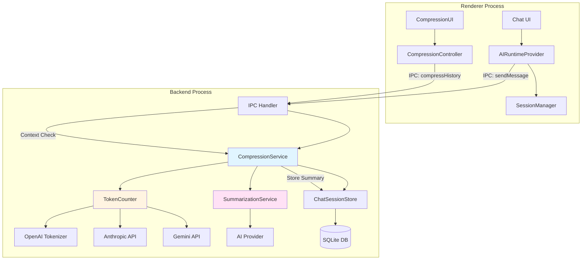
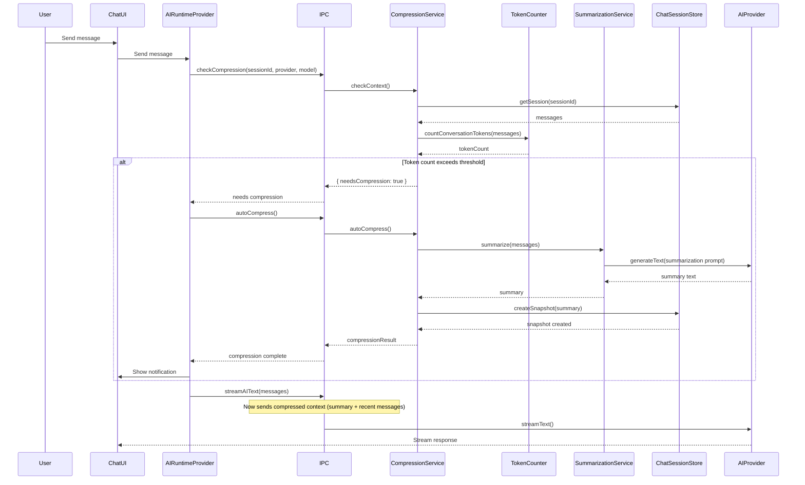
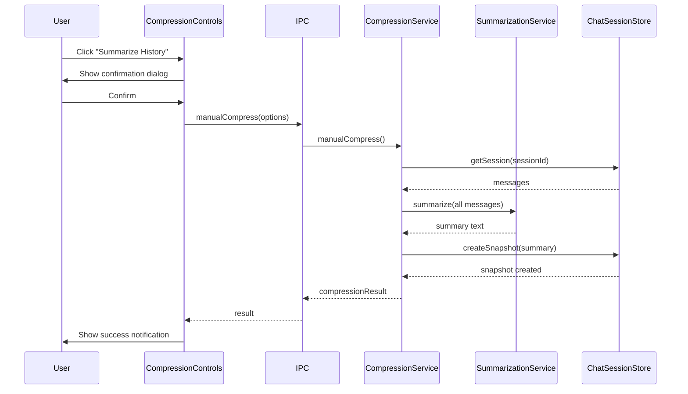

# Conversation History Compression - Implementation Design

## Overview

This document describes the technical architecture and implementation approach for the conversation history compression feature. It provides detailed design specifications for developers to implement the requirements defined in `CONVERSATION_HISTORY_COMPRESSION_REQUIREMENTS.md`.

## Architecture Overview

### System Components



### Three-Process Architecture

Following the application's existing pattern:

1. **Renderer Process**
   - UI components for compression controls and visualization
   - Token usage indicators
   - Summary display components
   - Manual compression triggers

2. **Backend Process**
   - Core compression logic (`CompressionService`)
   - Token counting (`TokenCounter`)
   - Summarization orchestration (`SummarizationService`)
   - Database operations via `ChatSessionStore`

3. **Main Process**
   - IPC routing between renderer and backend
   - Minimal logic (follows existing pattern)

## Component Design

### 1. TokenCounter Service

**Location:** `src/backend/compression/TokenCounter.ts`

**Responsibilities:**
- Count tokens using hybrid approach: recorded tokens (priority) + tiktoken fallback
- Provide fast, local token counting without API calls
- Handle message parts (text, tool calls, attachments)

**Design Decision:** See `CONVERSATION_HISTORY_COMPRESSION_TOKEN_COUNTING_STRATEGY.md` for detailed rationale.

**Interface:**
```typescript
interface TokenCountResult {
  totalTokens: number;
  inputTokens: number;
  outputTokens: number;
  estimatedResponseTokens: number;
}

class TokenCounter {
  private encoding: Tiktoken; // o200k_base encoding

  constructor();

  /**
   * Count tokens for a single message (hybrid approach)
   * - Uses recorded tokens if available (inputTokens + outputTokens)
   * - Falls back to tiktoken o200k_base calculation
   */
  countMessageTokens(message: ChatMessage): number;

  /**
   * Count tokens for an array of messages
   */
  countConversationTokens(messages: ChatMessage[]): TokenCountResult;

  /**
   * Count tokens for raw text (fallback method)
   */
  countText(text: string): number;

  /**
   * Clean up resources
   */
  dispose(): void;
}
```

**Implementation Details:**

#### Hybrid Token Counting (Single Implementation)

```typescript
import { get_encoding, type Tiktoken } from 'tiktoken';

class TokenCounter {
  private encoding: Tiktoken;

  constructor() {
    // Use o200k_base as universal fallback tokenizer
    this.encoding = get_encoding('o200k_base');
  }

  /**
   * Count tokens for a single message (hybrid approach)
   */
  countMessageTokens(message: ChatMessage): number {
    // Priority: Use recorded tokens if available
    if (message.inputTokens != null || message.outputTokens != null) {
      return (message.inputTokens ?? 0) + (message.outputTokens ?? 0);
    }

    // Fallback: Calculate using tiktoken
    return this.calculateTokens(message);
  }

  /**
   * Calculate tokens using tiktoken o200k_base
   */
  private calculateTokens(message: ChatMessage): number {
    let tokenCount = 0;

    // Message structure overhead (role + formatting)
    tokenCount += 4;

    // Count all message parts
    for (const part of message.parts) {
      if (part.kind === 'text' && part.contentText) {
        tokenCount += this.encoding.encode(part.contentText).length;
      }

      // Tool invocations: serialize JSON and count
      if (part.kind === 'tool_invocation' && part.contentJson) {
        const jsonString = JSON.stringify(JSON.parse(part.contentJson));
        tokenCount += this.encoding.encode(jsonString).length;
      }

      // Tool results: serialize JSON and count
      if (part.kind === 'tool_result' && part.contentJson) {
        const jsonString = JSON.stringify(JSON.parse(part.contentJson));
        tokenCount += this.encoding.encode(jsonString).length;
      }

      // Attachments: count metadata only (not content)
      if (part.kind === 'attachment') {
        const metadata = `${part.contentText || ''} ${part.mimeType || ''}`;
        tokenCount += this.encoding.encode(metadata).length;
      }
    }

    return tokenCount;
  }

  /**
   * Count tokens for raw text
   */
  countText(text: string): number {
    return this.encoding.encode(text).length;
  }

  /**
   * Count tokens for an array of messages
   */
  countConversationTokens(messages: ChatMessage[]): TokenCountResult {
    let totalTokens = 0;
    let inputTokens = 0;
    let outputTokens = 0;

    for (const message of messages) {
      const messageTokens = this.countMessageTokens(message);
      totalTokens += messageTokens;

      // Categorize by role
      if (message.role === 'user') {
        inputTokens += messageTokens;
      } else if (message.role === 'assistant') {
        outputTokens += messageTokens;
      }
    }

    return {
      totalTokens,
      inputTokens,
      outputTokens,
      estimatedResponseTokens: 0, // Will be set based on model config
    };
  }

  dispose() {
    this.encoding.free();
  }
}
```

**Key Points:**
1. **Single tokenizer**: tiktoken o200k_base for all providers
2. **Hybrid logic**: Recorded tokens (100% accurate) → tiktoken fallback (±10-15% for non-OpenAI)
3. **No API calls**: All counting is local and fast
4. **Handles all message types**: text, tool calls, tool results, attachments

### 2. Model Configuration Registry

**Location:** `src/backend/compression/ModelConfig.ts`

**Purpose:** Centralized configuration for all supported models

**Interface:**
```typescript
interface ModelContextConfig {
  provider: string;
  model: string;
  contextWindow: number;        // Total context in tokens
  maxOutputTokens: number;      // Maximum response tokens
  defaultCompressionThreshold: number; // Percentage (0-1)
  recommendedRetentionTokens: number;  // Tokens to preserve for recent messages
}

// Note: tokenizerType removed - all models use tiktoken o200k_base for fallback counting
// Note: This configuration includes both currently available models and future models.
//       When implementing, ensure corresponding models are also added to src/backend/ai/factory.ts

class ModelConfigRegistry {
  private static configs: Map<string, ModelContextConfig> = new Map([
    // OpenAI models
    ['openai:gpt-5', {
      provider: 'openai',
      model: 'gpt-5',
      contextWindow: 400000,
      maxOutputTokens: 128000,
      defaultCompressionThreshold: 0.95,
      recommendedRetentionTokens: 2000,
    }],
    ['openai:gpt-4o', {
      provider: 'openai',
      model: 'gpt-4o',
      contextWindow: 128000,
      maxOutputTokens: 16384,
      defaultCompressionThreshold: 0.95,
      recommendedRetentionTokens: 1000,
    }],
    ['openai:gpt-4o-mini', {
      provider: 'openai',
      model: 'gpt-4o-mini',
      contextWindow: 128000,
      maxOutputTokens: 16384,
      defaultCompressionThreshold: 0.95,
      recommendedRetentionTokens: 1000,
    }],
    ['openai:gpt-4-turbo', {
      provider: 'openai',
      model: 'gpt-4-turbo',
      contextWindow: 128000,
      maxOutputTokens: 4096,
      defaultCompressionThreshold: 0.95,
      recommendedRetentionTokens: 1000,
    }],

    // Anthropic models (4.5 generation)
    ['anthropic:claude-sonnet-4-5-20250929', {
      provider: 'anthropic',
      model: 'claude-sonnet-4-5-20250929',
      contextWindow: 200000, // 1M with beta header, but default to 200K
      maxOutputTokens: 64000,
      defaultCompressionThreshold: 0.95,
      recommendedRetentionTokens: 1500,
    }],
    ['anthropic:claude-opus-4-1', {
      provider: 'anthropic',
      model: 'claude-opus-4-1',
      contextWindow: 200000,
      maxOutputTokens: 4096,
      defaultCompressionThreshold: 0.95,
      recommendedRetentionTokens: 1500,
    }],
    ['anthropic:claude-haiku-4-5', {
      provider: 'anthropic',
      model: 'claude-haiku-4-5',
      contextWindow: 200000,
      maxOutputTokens: 64000,
      defaultCompressionThreshold: 0.95,
      recommendedRetentionTokens: 1500,
    }],

    // Legacy Anthropic models (3.x generation)
    ['anthropic:claude-3-5-sonnet-20241022', {
      provider: 'anthropic',
      model: 'claude-3-5-sonnet-20241022',
      contextWindow: 200000,
      maxOutputTokens: 8192,
      defaultCompressionThreshold: 0.95,
      recommendedRetentionTokens: 1500,
    }],
    ['anthropic:claude-3-opus-20240229', {
      provider: 'anthropic',
      model: 'claude-3-opus-20240229',
      contextWindow: 200000,
      maxOutputTokens: 4096,
      defaultCompressionThreshold: 0.95,
      recommendedRetentionTokens: 1500,
    }],
    ['anthropic:claude-3-haiku-20240307', {
      provider: 'anthropic',
      model: 'claude-3-haiku-20240307',
      contextWindow: 200000,
      maxOutputTokens: 4096,
      defaultCompressionThreshold: 0.95,
      recommendedRetentionTokens: 1500,
    }],

    // Google models
    ['google:gemini-2.5-pro', {
      provider: 'google',
      model: 'gemini-2.5-pro',
      contextWindow: 1048576,
      maxOutputTokens: 65535,
      defaultCompressionThreshold: 0.98, // Higher threshold due to massive context
      recommendedRetentionTokens: 2000,
    }],
    ['google:gemini-2.5-flash', {
      provider: 'google',
      model: 'gemini-2.5-flash',
      contextWindow: 1048576,
      maxOutputTokens: 65535,
      defaultCompressionThreshold: 0.98,
      recommendedRetentionTokens: 2000,
    }],
  ]);

  static getConfig(provider: string, model: string): ModelContextConfig | undefined {
    const key = `${provider}:${model}`;
    return this.configs.get(key);
  }

  static getAllConfigs(): ModelContextConfig[] {
    return Array.from(this.configs.values());
  }
}
```

### 3. CompressionService

**Location:** `src/backend/compression/CompressionService.ts`

**Responsibilities:**
- Orchestrate compression workflow
- Determine when compression is needed
- Manage compression state
- Coordinate between TokenCounter, SummarizationService, and ChatSessionStore

**Interface:**
```typescript
interface CompressionOptions {
  sessionId: string;
  provider: string;
  model: string;
  apiKey?: string;
  retentionTokenCount?: number; // Override default retention token budget
  force?: boolean; // For manual compression
}

interface CompressionResult {
  compressed: boolean;
  summaryId?: string;
  originalTokenCount: number;
  newTokenCount: number;
  messagesCompressed: number;
  messageCutoffId?: string;
  summary?: string;
}

interface ContextCheckResult {
  needsCompression: boolean;
  currentTokenCount: number;
  contextLimit: number;
  thresholdTokenCount: number;
  utilizationPercentage: number;
  retentionTokenBudget: number;
  retainedMessageCount: number;
  compressibleMessageCount: number;
}

class CompressionService {
  constructor(
    private tokenCounter: TokenCounter,
    private summarizationService: SummarizationService,
    private sessionStore: ChatSessionStore
  );

  /**
   * Check if conversation needs compression before sending to AI
   * Returns context status and recommendation
   */
  async checkContext(
    sessionId: string,
    provider: string,
    model: string,
    additionalInput?: string
  ): Promise<ContextCheckResult>;

  /**
   * Perform automatic compression (called before AI request if needed)
   */
  async autoCompress(options: CompressionOptions): Promise<CompressionResult>;

  /**
   * Perform manual compression (user-initiated)
   */
  async manualCompress(options: CompressionOptions): Promise<CompressionResult>;

  /**
   * Get compression configuration for session
   */
  async getCompressionConfig(sessionId: string): Promise<CompressionConfig>;

  /**
   * Construct context for AI request (summary + recent messages)
   */
  async buildContextForAI(sessionId: string): Promise<AIMessage[]>;
}
```

**Key Methods Implementation:**

```typescript
async checkContext(
  sessionId: string,
  provider: string,
  model: string,
  additionalInput?: string
): Promise<ContextCheckResult> {
  // 1. Get model configuration
  const modelConfig = ModelConfigRegistry.getConfig(provider, model);
  if (!modelConfig) {
    throw new Error(`Model configuration not found: ${provider}:${model}`);
  }

  // 2. Fetch all messages from session
  const session = await this.sessionStore.getSession(sessionId);
  const messages = session.messages;

  // 3. Get latest summary if exists
  const latestSummary = await this.sessionStore.getLatestSnapshot(sessionId, 'summary');

  // 4. Build current context (summary + all messages after cutoff)
  let contextMessages: AIMessage[] = [];
  if (latestSummary) {
    const summaryContent = JSON.parse(latestSummary.contentJson);
    contextMessages.push({
      role: 'system',
      content: `[Previous conversation summary]\n${summaryContent.summaryText}`,
    });

    // Only include messages after cutoff
    const cutoffIndex = messages.findIndex(m => m.id === latestSummary.messageCutoffId);
    contextMessages.push(...messages.slice(cutoffIndex + 1));
  } else {
    contextMessages = [...messages];
  }

  // 5. Add additional input if provided
  if (additionalInput) {
    contextMessages.push({ role: 'user', content: additionalInput });
  }

  // 6. Count tokens
  const tokenCount = await this.tokenCounter.countConversationTokens(contextMessages);

  // 7. Calculate available space
  const reservedForResponse = modelConfig.maxOutputTokens;
  const safetyMargin = Math.floor(modelConfig.contextWindow * 0.05);
  const availableForContext = modelConfig.contextWindow - reservedForResponse - safetyMargin;

  // 8. Determine if compression needed
  const threshold = modelConfig.defaultCompressionThreshold;
  const thresholdTokenCount = Math.floor(availableForContext * threshold);
  const needsCompression = tokenCount.totalTokens > thresholdTokenCount;

  // 9. Calculate retention boundary based on token budget
  const retentionTokenBudget = modelConfig.recommendedRetentionTokens;

  // Count tokens from most recent messages backwards until budget is exhausted
  let retainedTokens = 0;
  let retainedMessageCount = 0;
  for (let i = contextMessages.length - 1; i >= 0; i--) {
    const messageTokens = await this.tokenCounter.countMessageTokens(contextMessages[i]);
    if (retainedTokens + messageTokens <= retentionTokenBudget) {
      retainedTokens += messageTokens;
      retainedMessageCount++;
    } else {
      break;
    }
  }

  const compressibleMessageCount = Math.max(0, contextMessages.length - retainedMessageCount);

  return {
    needsCompression,
    currentTokenCount: tokenCount.totalTokens,
    contextLimit: availableForContext,
    thresholdTokenCount,
    utilizationPercentage: tokenCount.totalTokens / availableForContext,
    retentionTokenBudget,
    retainedMessageCount,
    compressibleMessageCount,
  };
}

async autoCompress(options: CompressionOptions): Promise<CompressionResult> {
  const { sessionId, provider, model, retentionTokenCount } = options;

  // 1. Get model config
  const modelConfig = ModelConfigRegistry.getConfig(provider, model);
  if (!modelConfig) {
    throw new Error(`Model configuration not found: ${provider}:${model}`);
  }

  // 2. Fetch session messages
  const session = await this.sessionStore.getSession(sessionId);
  const messages = session.messages;

  // 3. Determine retention boundary based on token budget
  const retentionTokenBudget = retentionTokenCount ?? modelConfig.recommendedRetentionTokens;

  // Count tokens from most recent messages backwards until budget is exhausted
  let retainedTokens = 0;
  let retainedMessageCount = 0;
  for (let i = messages.length - 1; i >= 0; i--) {
    const messageTokens = await this.tokenCounter.countMessageTokens(messages[i]);
    if (retainedTokens + messageTokens <= retentionTokenBudget) {
      retainedTokens += messageTokens;
      retainedMessageCount++;
    } else {
      break;
    }
  }

  // Not enough tokens to compress (all messages fit within retention budget)
  if (retainedMessageCount >= messages.length) {
    return {
      compressed: false,
      originalTokenCount: 0,
      newTokenCount: 0,
      messagesCompressed: 0,
    };
  }

  // 4. Split messages: to-compress vs. to-retain
  const splitIndex = messages.length - retainedMessageCount;
  const messagesToCompress = messages.slice(0, splitIndex);
  const messagesToRetain = messages.slice(splitIndex);

  // 5. Check if there's already a summary covering these messages
  const latestSummary = await this.sessionStore.getLatestSnapshot(sessionId, 'summary');
  let summaryInput = messagesToCompress;

  if (latestSummary) {
    const cutoffIndex = messages.findIndex(m => m.id === latestSummary.messageCutoffId);
    if (cutoffIndex >= 0 && cutoffIndex < splitIndex) {
      // Include previous summary and new messages
      const summaryContent = JSON.parse(latestSummary.contentJson);
      const newMessages = messages.slice(cutoffIndex + 1, splitIndex);
      summaryInput = [
        { role: 'system', content: summaryContent.summaryText },
        ...newMessages,
      ];
    }
  }

  // 6. Count tokens before compression
  const originalTokens = await this.tokenCounter.countConversationTokens(messagesToCompress);

  // 7. Generate summary
  const summaryText = await this.summarizationService.summarize({
    messages: summaryInput,
    provider,
    model,
    sessionId,
  });

  // 8. Count summary tokens
  const summaryTokens = await this.tokenCounter.countMessageTokens({
    role: 'system',
    content: summaryText,
  });

  // 9. Store summary in database
  const messageCutoffId = messagesToCompress[messagesToCompress.length - 1].id;
  const summarySnapshot = await this.sessionStore.createSnapshot({
    sessionId,
    kind: 'summary',
    contentJson: JSON.stringify({
      summaryText,
      messageRange: {
        firstMessageId: messagesToCompress[0].id,
        lastMessageId: messageCutoffId,
      },
      compressionTimestamp: new Date().toISOString(),
      compressionType: 'auto',
      originalTokenCount: originalTokens.totalTokens,
      summaryTokenCount: summaryTokens,
      messagesIncluded: messagesToCompress.length,
    }),
    messageCutoffId,
    tokenCount: summaryTokens,
  });

  // 10. Return result
  return {
    compressed: true,
    summaryId: summarySnapshot.id,
    originalTokenCount: originalTokens.totalTokens,
    newTokenCount: summaryTokens + (await this.tokenCounter.countConversationTokens(messagesToRetain)).totalTokens,
    messagesCompressed: messagesToCompress.length,
    messageCutoffId,
    summary: summaryText,
  };
}
```

### 4. SummarizationService

**Location:** `src/backend/compression/SummarizationService.ts`

**Responsibilities:**
- Generate summaries using AI models
- Manage summarization prompts
- Handle summarization errors and retries

**Interface:**
```typescript
interface SummarizationOptions {
  messages: AIMessage[];
  provider: string;
  model: string;
  sessionId: string;
  promptTemplate?: string; // Custom prompt (optional)
}

class SummarizationService {
  constructor(private aiFactory: AIProviderFactory);

  /**
   * Generate a summary of conversation messages
   */
  async summarize(options: SummarizationOptions): Promise<string>;

  /**
   * Get default summarization prompt
   */
  private getSummarizationPrompt(messages: AIMessage[]): string;

  /**
   * Select model for summarization (may differ from conversation model)
   */
  private selectSummarizationModel(provider: string): string;
}
```

**Implementation:**
```typescript
async summarize(options: SummarizationOptions): Promise<string> {
  const { messages, provider, sessionId, promptTemplate } = options;

  // 1. Select summarization model (use cheaper/faster model)
  const summaryModel = this.selectSummarizationModel(provider);

  // 2. Build summarization prompt
  const conversationText = messages.map(m => {
    return `${m.role.toUpperCase()}: ${m.content}`;
  }).join('\n\n');

  const prompt = promptTemplate ?? this.getSummarizationPrompt(conversationText);

  // 3. Call AI to generate summary
  try {
    const model = this.aiFactory.createModel(provider, summaryModel);
    const result = await generateText({
      model,
      prompt,
      temperature: 0.3, // Lower temperature for consistent summaries
    });

    return result.text;
  } catch (error) {
    logger.error('Summarization failed', { sessionId, provider, error });
    throw new Error('Failed to generate conversation summary');
  }
}

private getSummarizationPrompt(conversationText: string): string {
  return `You are a conversation summarization assistant. Your task is to create a concise yet comprehensive summary of the conversation history provided below.

**Guidelines:**
1. Preserve all key facts, decisions, and important context
2. Maintain chronological order of significant events
3. Keep technical details, code examples, and specific implementation decisions
4. Include information about tool invocations and their results (e.g., file operations, API calls, database queries)
5. Use concise language to maximize information density
6. Focus on actionable information and outcomes
7. Omit pleasantries, greetings, and off-topic discussions

**Conversation History:**
${conversationText}

**Summary:**
Please provide a summary in the following format:

## Context
[Brief overview of the main topic and purpose of the conversation]

## Key Points
- [Important fact/decision 1]
- [Important fact/decision 2]
...

## Technical Details
[Code snippets, commands, configurations, or technical specifications discussed]

## Tool Invocations
[Significant tool calls made (file operations, searches, API calls) and their outcomes]

## Decisions and Outcomes
[Agreements reached, decisions made, next steps identified]

## Unresolved Questions
[Any open questions or pending items]`;
}

private selectSummarizationModel(provider: string): string {
  // Use cheaper models for summarization
  const summaryModels: Record<string, string> = {
    'openai': 'gpt-4o-mini',
    'anthropic': 'claude-haiku-4-5',
    'google': 'gemini-2.5-flash',
    'azure': 'gpt-4o-mini',
  };
  return summaryModels[provider] || 'gpt-4o-mini';
}
```

### 5. Database Extensions

**Location:** Updates to `src/backend/session/ChatSessionStore.ts`

**New Methods:**
```typescript
class ChatSessionStore {
  // ... existing methods ...

  /**
   * Create a session snapshot (summary, title, memory)
   */
  async createSnapshot(params: {
    sessionId: string;
    kind: 'title' | 'summary' | 'memory';
    contentJson: string;
    messageCutoffId: string;
    tokenCount: number;
  }): Promise<SessionSnapshot> {
    const now = Date.now();
    const snapshot = {
      id: randomUUID(),
      sessionId: params.sessionId,
      kind: params.kind,
      contentJson: params.contentJson,
      messageCutoffId: params.messageCutoffId,
      tokenCount: params.tokenCount,
      createdAt: now,
      updatedAt: now,
    };

    await db.insert(sessionSnapshots).values(snapshot);
    return snapshot;
  }

  /**
   * Get latest snapshot of a specific kind
   */
  async getLatestSnapshot(
    sessionId: string,
    kind: 'title' | 'summary' | 'memory'
  ): Promise<SessionSnapshot | null> {
    const result = await db
      .select()
      .from(sessionSnapshots)
      .where(
        and(
          eq(sessionSnapshots.sessionId, sessionId),
          eq(sessionSnapshots.kind, kind)
        )
      )
      .orderBy(desc(sessionSnapshots.createdAt))
      .limit(1);

    return result[0] ?? null;
  }

  /**
   * Get all snapshots for a session
   */
  async getSnapshots(sessionId: string): Promise<SessionSnapshot[]> {
    return db
      .select()
      .from(sessionSnapshots)
      .where(eq(sessionSnapshots.sessionId, sessionId))
      .orderBy(desc(sessionSnapshots.createdAt));
  }

  /**
   * Update token counts for a message
   */
  async updateMessageTokens(
    messageId: string,
    inputTokens: number,
    outputTokens: number
  ): Promise<void> {
    await db
      .update(chatMessages)
      .set({ inputTokens, outputTokens })
      .where(eq(chatMessages.id, messageId));
  }

  /**
   * Build context for AI request (includes summary if exists)
   */
  async buildAIContext(sessionId: string): Promise<AIMessage[]> {
    const latestSummary = await this.getLatestSnapshot(sessionId, 'summary');
    const session = await this.getSession(sessionId);

    const context: AIMessage[] = [];

    if (latestSummary) {
      const summaryContent = JSON.parse(latestSummary.contentJson);
      context.push({
        role: 'system',
        content: `[Previous conversation summary]\n${summaryContent.summaryText}`,
      });

      // Only include messages after cutoff
      const cutoffIndex = session.messages.findIndex(
        m => m.id === latestSummary.messageCutoffId
      );
      if (cutoffIndex >= 0) {
        context.push(...session.messages.slice(cutoffIndex + 1));
      }
    } else {
      context.push(...session.messages);
    }

    return context;
  }
}
```

### 6. IPC Interface

**Location:** `src/backend/handler.ts`, `src/preload/index.ts`

**New IPC Methods:**
```typescript
// Backend handler
export const compressionHandlers = {
  // Check if compression is needed
  checkCompression: async (sessionId: string, provider: string, model: string) => {
    const compressionService = getCompressionService();
    return await compressionService.checkContext(sessionId, provider, model);
  },

  // Manually trigger compression
  manualCompress: async (options: CompressionOptions) => {
    const compressionService = getCompressionService();
    return await compressionService.manualCompress(options);
  },

  // Get compression configuration
  getCompressionConfig: async (sessionId: string) => {
    const compressionService = getCompressionService();
    return await compressionService.getCompressionConfig(sessionId);
  },

  // Get session summaries
  getSessionSummaries: async (sessionId: string) => {
    const sessionStore = getChatSessionStore();
    return await sessionStore.getSnapshots(sessionId);
  },
};

// Preload API
export interface CompressionAPI {
  checkCompression(sessionId: string, provider: string, model: string): Promise<ContextCheckResult>;
  manualCompress(options: CompressionOptions): Promise<CompressionResult>;
  getCompressionConfig(sessionId: string): Promise<CompressionConfig>;
  getSessionSummaries(sessionId: string): Promise<SessionSnapshot[]>;
}

// In preload/index.ts
const compressionAPI: CompressionAPI = {
  checkCompression: (sessionId, provider, model) =>
    ipcRenderer.invoke('compression:check', sessionId, provider, model),
  manualCompress: (options) =>
    ipcRenderer.invoke('compression:manual', options),
  getCompressionConfig: (sessionId) =>
    ipcRenderer.invoke('compression:config', sessionId),
  getSessionSummaries: (sessionId) =>
    ipcRenderer.invoke('compression:summaries', sessionId),
};
```

### 7. UI Components

#### 7.1 Token Usage Indicator

**Location:** `src/renderer/src/components/TokenUsageIndicator.tsx`

```typescript
interface TokenUsageIndicatorProps {
  sessionId: string;
  provider: string;
  model: string;
}

export function TokenUsageIndicator({ sessionId, provider, model }: TokenUsageIndicatorProps) {
  const [contextStatus, setContextStatus] = useState<ContextCheckResult | null>(null);

  useEffect(() => {
    const checkContext = async () => {
      const status = await window.backend.checkCompression(sessionId, provider, model);
      setContextStatus(status);
    };

    checkContext();
    const interval = setInterval(checkContext, 5000); // Update every 5s

    return () => clearInterval(interval);
  }, [sessionId, provider, model]);

  if (!contextStatus) return null;

  const percentage = Math.round(contextStatus.utilizationPercentage * 100);
  const color = percentage > 95 ? 'red' : percentage > 80 ? 'orange' : 'green';

  return (
    <div className="flex items-center gap-2 text-sm">
      <div className="flex-1 h-2 bg-gray-200 rounded-full overflow-hidden">
        <div
          className={`h-full transition-all duration-300 bg-${color}-500`}
          style={{ width: `${percentage}%` }}
        />
      </div>
      <span className="text-gray-600 min-w-[4rem]">
        {contextStatus.currentTokenCount.toLocaleString()} / {contextStatus.contextLimit.toLocaleString()} tokens
      </span>
      {contextStatus.needsCompression && (
        <span className="text-orange-600 font-medium">Compression recommended</span>
      )}
    </div>
  );
}
```

#### 7.2 Manual Compression Button

**Location:** `src/renderer/src/components/CompressionControls.tsx`

```typescript
interface CompressionControlsProps {
  sessionId: string;
  provider: string;
  model: string;
  onCompressionComplete?: (result: CompressionResult) => void;
}

export function CompressionControls({
  sessionId,
  provider,
  model,
  onCompressionComplete,
}: CompressionControlsProps) {
  const [isCompressing, setIsCompressing] = useState(false);
  const [showConfirm, setShowConfirm] = useState(false);

  const handleCompress = async () => {
    setIsCompressing(true);
    try {
      const result = await window.backend.manualCompress({
        sessionId,
        provider,
        model,
        force: true,
      });

      if (result.compressed) {
        toast.success(
          `Compressed ${result.messagesCompressed} messages.
           Reduced from ${result.originalTokenCount} to ${result.newTokenCount} tokens.`
        );
        onCompressionComplete?.(result);
      }
    } catch (error) {
      toast.error('Failed to compress conversation history');
      logger.error('Manual compression failed', { error });
    } finally {
      setIsCompressing(false);
      setShowConfirm(false);
    }
  };

  return (
    <>
      <Button
        variant="outline"
        size="sm"
        onClick={() => setShowConfirm(true)}
        disabled={isCompressing}
      >
        {isCompressing ? 'Compressing...' : 'Summarize History'}
      </Button>

      {showConfirm && (
        <ConfirmDialog
          title="Summarize Conversation History"
          description="This will create a summary of older messages to reduce context size. Original messages will still be accessible."
          onConfirm={handleCompress}
          onCancel={() => setShowConfirm(false)}
        />
      )}
    </>
  );
}
```

#### 7.3 Summary Display Component

**Location:** `src/renderer/src/components/SummaryDisplay.tsx`

```typescript
interface SummaryDisplayProps {
  sessionId: string;
}

export function SummaryDisplay({ sessionId }: SummaryDisplayProps) {
  const [summaries, setSummaries] = useState<SessionSnapshot[]>([]);
  const [expanded, setExpanded] = useState<Set<string>>(new Set());

  useEffect(() => {
    const loadSummaries = async () => {
      const snapshots = await window.backend.getSessionSummaries(sessionId);
      const summarySnapshots = snapshots.filter(s => s.kind === 'summary');
      setSummaries(summarySnapshots);
    };

    loadSummaries();
  }, [sessionId]);

  if (summaries.length === 0) return null;

  return (
    <div className="space-y-2 mb-4">
      {summaries.map(summary => {
        const content = JSON.parse(summary.contentJson);
        const isExpanded = expanded.has(summary.id);

        return (
          <div key={summary.id} className="bg-blue-50 border border-blue-200 rounded-lg p-3">
            <div className="flex items-start justify-between gap-2">
              <div className="flex-1">
                <div className="flex items-center gap-2 mb-1">
                  <span className="text-xs font-medium text-blue-700">
                    Conversation Summary
                  </span>
                  <span className="text-xs text-gray-500">
                    {content.messagesIncluded} messages • {content.summaryTokenCount} tokens
                  </span>
                </div>
                <div className={`text-sm text-gray-700 ${!isExpanded && 'line-clamp-2'}`}>
                  {content.summaryText}
                </div>
              </div>
              <Button
                variant="ghost"
                size="sm"
                onClick={() => {
                  setExpanded(prev => {
                    const next = new Set(prev);
                    if (next.has(summary.id)) {
                      next.delete(summary.id);
                    } else {
                      next.add(summary.id);
                    }
                    return next;
                  });
                }}
              >
                {isExpanded ? 'Show less' : 'Show more'}
              </Button>
            </div>
            {isExpanded && (
              <div className="mt-2 text-xs text-gray-500">
                Compressed on {new Date(content.compressionTimestamp).toLocaleString()}
              </div>
            )}
          </div>
        );
      })}
    </div>
  );
}
```

## Data Flow

### Automatic Compression Flow



### Manual Compression Flow



## Testing Strategy

### Unit Tests

#### TokenCounter Tests
```typescript
describe('TokenCounter', () => {
  describe('OpenAI', () => {
    it('should count tokens for GPT-4o correctly', async () => {
      const counter = new TokenCounter({ provider: 'openai', model: 'gpt-4o' });
      const tokens = await counter.countMessageTokens({
        role: 'user',
        content: 'Hello, world!',
      });
      expect(tokens).toBeGreaterThan(0);
    });

    it('should count tool calls', async () => {
      // Test tool call token counting
    });
  });

  describe('Anthropic', () => {
    it('should use API for token counting', async () => {
      // Mock Anthropic API
      // Test token counting
    });

    it('should fall back to estimation on API failure', async () => {
      // Test fallback behavior
    });
  });
});
```

#### CompressionService Tests
```typescript
describe('CompressionService', () => {
  it('should detect when compression is needed', async () => {
    const service = new CompressionService(/* deps */);
    const result = await service.checkContext(sessionId, 'openai', 'gpt-4');
    expect(result.needsCompression).toBe(true);
  });

  it('should compress old messages and retain recent ones', async () => {
    const result = await service.autoCompress({
      sessionId,
      provider: 'openai',
      model: 'gpt-4o',
    });
    expect(result.compressed).toBe(true);
    expect(result.messagesCompressed).toBeGreaterThan(0);
  });

  it('should not compress if below threshold', async () => {
    // Test no-op case
  });
});
```

### Integration Tests

```typescript
describe('Compression Integration', () => {
  it('should compress conversation and use summary in next request', async () => {
    // 1. Create session with many messages
    // 2. Trigger compression
    // 3. Send new message
    // 4. Verify AI request uses summary + recent messages
  });

  it('should handle multiple compression cycles', async () => {
    // Test cascading summaries
  });
});
```

### Manual Testing Checklist

- [ ] Auto-compression triggers at 95% threshold
- [ ] Manual compression works with confirmation dialog
- [ ] Token usage indicator updates in real-time
- [ ] Summaries display correctly in chat UI
- [ ] Compressed context reduces token count significantly
- [ ] AI responses maintain coherence after compression
- [ ] Error handling works (API failures, network errors)
- [ ] Settings persist across app restarts
- [ ] Multi-provider support (OpenAI, Anthropic, Google)

## Performance Considerations

### Token Counting Performance

**Challenge:** Token counting for every message on every request could be slow.

**Optimizations:**
1. **Cache token counts**: Store in database (`inputTokens`, `outputTokens` fields)
2. **Incremental counting**: Only count new messages since last check
3. **Approximate counting**: Use estimation for initial checks, precise counting only when near threshold
4. **Async operations**: Perform token counting in background, don't block UI

### Database Query Optimization

**Challenge:** Fetching messages and summaries efficiently.

**Optimizations:**
1. **Indexes**:
   ```sql
   CREATE INDEX idx_session_messages ON chatMessages(sessionId, createdAt);
   CREATE INDEX idx_session_snapshots ON sessionSnapshots(sessionId, kind, createdAt);
   ```
2. **Limit queries**: Only fetch messages after summary cutoff
3. **Pagination**: Don't load all messages at once in UI

### Summarization Latency

**Challenge:** Summarization can take 5-10 seconds for large conversations.

**Optimizations:**
1. **Use faster models**: GPT-4o-mini, Claude Haiku, Gemini Flash
2. **Show progress**: Display "Summarizing..." indicator to user
3. **Background processing**: Allow user to continue using app while summarizing
4. **Caching**: Don't re-summarize the same content

## Security and Privacy

### API Key Handling

- Never log API keys
- Use existing key storage mechanisms from settings
- Encrypt keys at rest

### Summary Content

- Summaries contain conversation content (potentially sensitive)
- Store in database with same security as messages
- No external transmission except to AI provider during summarization

### User Control

- Users can disable auto-compression
- Users can view/delete summaries
- Original messages always retained (never deleted)

## Dependencies

### New NPM Packages

```json
{
  "dependencies": {
    "tiktoken": "^1.0.0"
  }
}
```

**Note:** Anthropic and Google SDKs already included in project.

### Version Compatibility

- `ai` SDK: v5 (already in use)
- `tiktoken`: Latest stable (1.0+)
- Node.js: 18+ (for Anthropic/Google async APIs)

## Migration and Rollout

### Phase 1: Backend Implementation (Week 1-2)
1. Implement `TokenCounter` for OpenAI
2. Implement `ModelConfigRegistry`
3. Implement `SummarizationService`
4. Implement `CompressionService`
5. Add database methods to `ChatSessionStore`
6. Unit tests for all services

### Phase 2: IPC and Integration (Week 2-3)
1. Add IPC handlers
2. Integrate with existing `streamAIText` flow
3. Add automatic compression logic
4. Integration tests

### Phase 3: UI Implementation (Week 3-4)
1. Implement `TokenUsageIndicator`
2. Implement `CompressionControls`
3. Implement `SummaryDisplay`
4. Add settings UI for configuration
5. Manual testing

### Phase 4: Multi-Provider Support (Week 4-5)
1. Implement Anthropic token counting
2. Implement Gemini token counting
3. Test with all providers
4. Performance tuning

### Phase 5: Polish and Documentation (Week 5-6)
1. Error handling improvements
2. User documentation
3. Performance optimization
4. Beta testing

## Implementation Decisions

### ✅ RESOLVED: Multi-Level Compression Strategy
**Decision:** Multi-level compression is REQUIRED. When a second compression is needed, the system SHALL include the previous summary plus subsequent messages as input for the new summary. This creates a cascading summary chain without depth limits.

**Implementation:** See `autoCompress` method lines 584-593 for logic that checks for existing summaries and includes them in re-summarization.

### ✅ RESOLVED: Token Counting Strategy
**Decision:** Hybrid approach - recorded tokens (priority) + tiktoken o200k_base (fallback)

**Details:**
- **Recorded tokens**: Use `inputTokens` and `outputTokens` from AI response `usage` field (100% accurate)
- **Fallback**: tiktoken o200k_base for local calculation when no record exists (±10-15% for non-OpenAI)
- **Tool invocations**: Serialize JSON input/output, then count with tiktoken
- **Attachments**: Count metadata only (filename, MIME type, size) - not content

**Rationale:** See `CONVERSATION_HISTORY_COMPRESSION_TOKEN_COUNTING_STRATEGY.md` for detailed analysis of alternatives and decision rationale.

### ✅ RESOLVED: Message Retention Strategy
**Decision:** Retention is based on TOKEN COUNT, not message count. The system retains the maximum number of recent messages that fit within a configurable token budget (default: 1000 tokens).

**Example:** If retention budget is 1000 tokens, and the most recent 3 messages total 900 tokens while 4 messages total 1100 tokens, retain 3 messages.

**Implementation:** See `checkContext` (lines 510-537) and `autoCompress` (lines 553-582) for token-based retention logic.

### ✅ RESOLVED: Message Pinning
**Decision:** Message pinning is NOT in scope for the current implementation. This feature will not be developed at this time.

## Open Implementation Questions

### 1. Should we cache tokenizer instances?
**Context:** Creating tiktoken encodings has overhead.
**Proposal:** Singleton pattern for tokenizers per model.
**Status:** To be decided during implementation.

### 2. How to handle token counting failures gracefully?
**Options:**
- A) Fail request (strict)
- B) Estimate tokens (lenient)
- C) User choice in settings

**Recommendation:** B with warning notification.
**Status:** To be decided during implementation.

### 3. Should summaries be editable by users?
**Consideration:** Users may want to correct or enhance summaries.
**Complexity:** Medium (requires summary editing UI).
**Decision:** Phase 2 feature (not MVP).

### 4. Should we support exporting full conversation history?
**Use case:** Users want to keep full records before compression.
**Decision:** Good future feature, not required for MVP.

---

**Document Version:** 2.0
**Last Updated:** 2025-11-16
**Status:** Token Counting Strategy Finalized - Ready for Implementation

**Major Changes in v2.0:**
- Simplified token counting to hybrid approach (recorded + tiktoken o200k_base fallback)
- Removed provider-specific tokenizer implementations (Anthropic API, Gemini API)
- Removed `tokenizerType` from ModelConfigRegistry (no longer needed)
- Added `CONVERSATION_HISTORY_COMPRESSION_TOKEN_COUNTING_STRATEGY.md` for decision rationale
