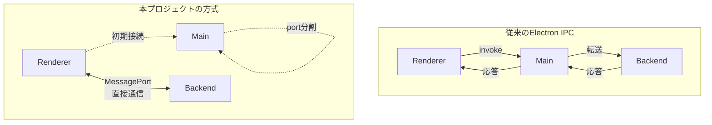
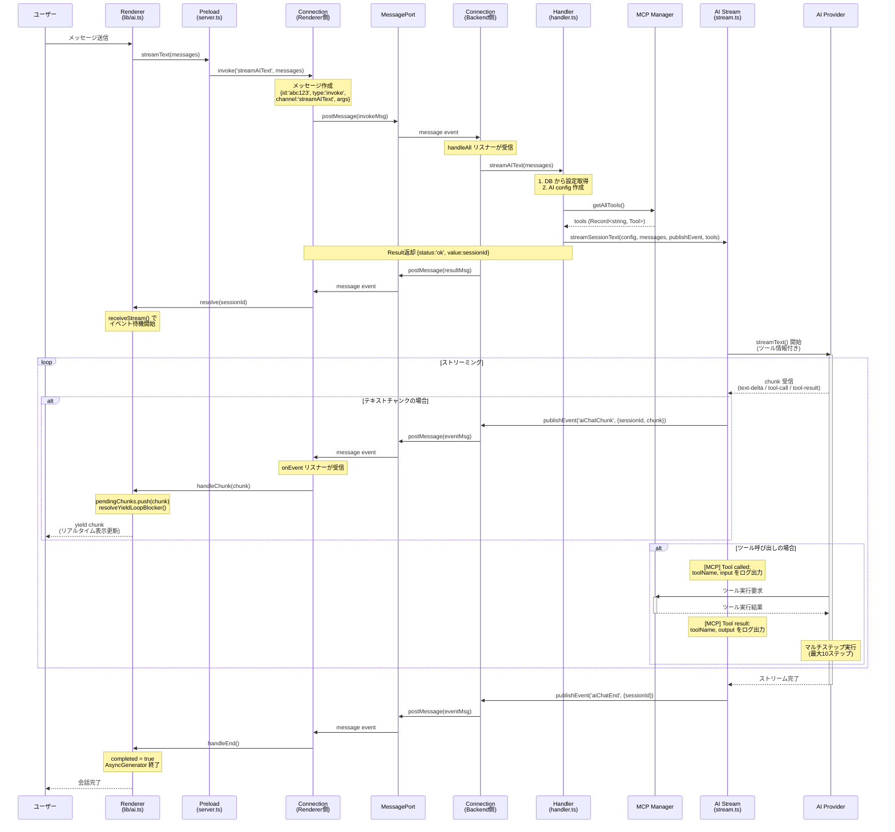

# IPC通信の詳細解説: streamAIText を例に

このドキュメントでは、本プロジェクトで採用している MessagePort ベースの IPC 通信アーキテクチャを、実際の `streamAIText` API を例に詳しく解説します。

## 目次

- [通信アーキテクチャの概要](#通信アーキテクチャの概要)
- [streamAIText の完全な処理フロー](#streamaitext-の完全な処理フロー)
- [Connection クラスの詳細](#connection-クラスの詳細)
- [二段階の通信パターン](#二段階の通信パターン)
- [AsyncGenerator によるストリーミング](#asyncgenerator-によるストリーミング)
- [エラーハンドリングと中止処理](#エラーハンドリングと中止処理)
- [デバッグ方法](#デバッグ方法)

## 通信アーキテクチャの概要

### 従来の Electron IPC との違い

本プロジェクトでは、従来の `ipcMain.handle()`/`ipcRenderer.invoke()` を使わず、**MessagePort** による直接通信を採用しています。



**利点**:
- Main Process を経由しないため、オーバーヘッドが少ない
- 大量のストリーミングデータに適している
- 独立したバックエンドプロセスとの疎結合な設計

### コアとなる Connection クラス

全ての通信は `src/common/connection.ts` の **Connection クラス** を通じて行われます。

**ファイル**: `src/common/connection.ts`

```typescript
export class Connection {
  constructor(private port: MessagePort | MessagePortMain | Electron.ParentPort)

  // リクエスト-レスポンスパターン
  async invoke(channel: string, ...args: unknown[]): Promise<Result<any, any>>
  handle(channel: string, callback: (...args) => Promise<Result<unknown, unknown>>): void

  // イベント通知パターン
  publishEvent(channels: string[] | string, event?: AppEvent): void
  onEvent(channel: string, callback: (arg) => void): void
  offEvent(channel: string): void
}
```

## streamAIText の完全な処理フロー

### ステップ1: レンダラ側での呼び出し

**ファイル**: `src/renderer/src/lib/ai.ts:5-18`

ユーザーがチャットにメッセージを入力すると、以下の関数が呼ばれます:

```typescript
export async function streamText(
  messages: AIMessage[],
  abortSignal: AbortSignal
): Promise<AsyncGenerator<string, void, unknown>> {
  // バックエンドにストリーミング開始をリクエスト
  const result = await window.backend.streamAIText(messages)

  if (isOk(result)) {
    const sessionId = result.value  // セッションIDを受け取る
    return receiveStream(sessionId, abortSignal)
  } else {
    throw new Error(`Failed to start AI chat stream: ${result.error}`)
  }
}
```

**ポイント**:
- `window.backend.streamAIText()` は Preload スクリプトで公開された API
- 返り値は `AsyncGenerator` - 呼び出し側は `for await (const chunk of stream)` で使用可能

### ステップ2: Preload スクリプト経由で Connection にアクセス

**ファイル**: `src/preload/server.ts:23, 35-37`

```typescript
export class Server {
  private _backendConnection: Connection | null = null

  public readonly backendAPI: RendererBackendAPI & BackendListenerAPI = {
    streamAIText: (...args) => this._invoke('streamAIText', ...args),
    // ... 他のAPI
  }

  private _invoke(channel: string, ...args) {
    return this._backendConnection!.invoke(channel, ...args)
  }
}
```

**ポイント**:
- `this._backendConnection` は `Connection` クラスのインスタンス
- 全ての API 呼び出しは `Connection.invoke()` に集約される

### ステップ3: Connection.invoke() による MessagePort 通信

**ファイル**: `src/common/connection.ts:40-70`

```typescript
async invoke(channel: string, ...args: unknown[]): Promise<Result<any, any>> {
  const TIMEOUT_DURATION = 1800000 // 30分

  return new Promise((resolve) => {
    // 1. ユニークIDを持つメッセージを作成
    const msg = this._invokeMessage(channel, args)
    // msg = { id: 'abc123', type: 'invoke', channel: 'streamAIText', args: [messages] }

    // 2. レスポンスを待つリスナーを設定
    const resultListener = (event: MessageEvent): void => {
      const data = event.data
      // 同じチャンネル、同じIDのレスポンスだけ受け取る
      if (data.channel !== channel) return
      if (data.id !== msg.id) return
      if (data.type !== 'result') return

      clearTimeout(timeoutId)
      this._removeListener(resultListener)
      resolve(data.payload)  // 結果を返す
    }

    // 3. タイムアウト設定
    const timeoutId = setTimeout(() => {
      this._removeListener(resultListener)
      resolve({ status: 'error', error: new TimeoutError(...) })
    }, TIMEOUT_DURATION)

    // 4. リスナーを登録してメッセージを送信
    this._addListener(resultListener)
    this._postMessage(msg)  // MessagePort.postMessage() で送信
  })
}
```

**送信されるメッセージの構造**:

```typescript
{
  id: 'abc123',           // ランダムなユニークID
  type: 'invoke',         // メッセージタイプ
  channel: 'streamAIText', // API名
  args: [                 // 引数の配列
    [{ role: 'user', content: 'Hello' }]
  ]
}
```

**ポイント**:
- メッセージごとにユニークIDを生成
- レスポンスは同じIDを持つメッセージを待機
- 30分のタイムアウトを設定

### ステップ4: バックエンド側でのメッセージ受信とハンドラ呼び出し

**ファイル**: `src/backend/server.ts` (Connection.handle の登録)

バックエンドプロセス起動時に、全ての API ハンドラが登録されます:

```typescript
export class BackendServer {
  private _rendererConnection: Connection | null = null

  listen(): void {
    process.parentPort.on('message', (event) => {
      if (event.data.type === 'connect') {
        const port = event.ports[0]
        this._rendererConnection = new Connection(port)

        // ハンドラを設定
        this.setupHandlers()
      }
    })
  }

  private setupHandlers(): void {
    const connection = this._rendererConnection!
    const handler = new Handler({ rendererConnetion: connection })

    // 全てのチャンネルを1つのハンドラで処理
    connection.handleAll(async (channel, args) => {
      return await handler[channel](...args)
    })
  }
}
```

**Connection.handleAll() の内部動作** (`src/common/connection.ts:95-108`):

```typescript
handleAll(
  callback: (channel: string, args: unknown[]) => Promise<Result<unknown, unknown>>
): void {
  const listener = async (event: MessageEvent): Promise<void> {
    if (event.data?.type !== 'invoke') return

    const invoke = event.data as InvokeMessage
    // channel = 'streamAIText', args = [[messages]]

    const result = await callback(invoke.channel, invoke.args)

    // レスポンスメッセージを作成して送信
    const msg = this._resultMessage(invoke, result)
    // msg = { id: 'abc123', type: 'result', channel: 'streamAIText', payload: result }

    this._postMessage(msg)
  }

  this._addListener(listener)
}
```

### ステップ5: Handler.streamAIText() の実行

**ファイル**: `src/backend/handler.ts:61-96`

```typescript
export class Handler {
  private _rendererConnection: Connection
  private _mcpManager: MCPManager

  async streamAIText(messages: AIMessage[]): Promise<Result<string>> {
    // 1. データベースからAI設定を取得
    const aiSettings = await getSetting<AISettings>('ai')

    if (!aiSettings) throw new Error('No AI setting has been created')

    // 2. プロバイダーとAPIキーを決定
    const selectedProvider = aiSettings.default_provider!  // 'anthropic', 'openai', etc.
    const apiKeyField = `${selectedProvider}_api_key` as keyof AISettings
    const apiKey = aiSettings[apiKeyField] as string

    if (!apiKey) {
      throw new Error(`API key not found for provider: ${selectedProvider}`)
    }

    // 3. モデルを決定
    const modelField = `${selectedProvider}_model` as keyof AISettings
    const model = (aiSettings[modelField] as string) || FACTORY[selectedProvider].default

    // 4. AI設定オブジェクトを作成
    const config: AIConfig = {
      provider: selectedProvider,
      model,
      apiKey
    }

    // 5. MCPツールを取得
    const mcpTools = await this._mcpManager.getAllTools()
    const toolCount = Object.keys(mcpTools).length
    logger.info(`Streaming AI text with ${toolCount} MCP tool(s) available`)

    // 6. ストリーミング開始（コールバックでイベントを送信、ツールも渡す）
    const sessionId = await streamText(
      config,
      messages,
      (channel: string, event: AppEvent) => {
        // レンダラにイベントを直接送信
        this._rendererConnection.publishEvent(channel, event)
      },
      toolCount > 0 ? mcpTools : undefined  // MCPツールを渡す
    )

    // 7. セッションIDを返す（invoke のレスポンス）
    return ok(sessionId)
  }
}
```

**ポイント**:
- この関数はストリーミング開始のみを担当
- 実際のAI応答は非同期でイベント経由で送られる
- 返り値は `sessionId` のみ（すぐに返る）

### ステップ6: AI SDK によるストリーミング処理

**ファイル**: `src/backend/ai/stream.ts:12-81`

```typescript
export async function streamSessionText(
  config: AIConfig,
  messages: AIMessage[],
  session: StreamSession,
  publishEvent: (channel: string, event: AppEvent) => void,
  cb: () => void,
  tools?: Record<string, any>  // MCPツールを受け取る
): Promise<void> {
  try {
    // 1. AIプロバイダーのモデルを作成
    const model = createModel(config.provider, config.apiKey, config.model)

    // MCPツールの可用性をログ出力
    const toolCount = tools ? Object.keys(tools).length : 0
    if (toolCount > 0) {
      logger.info(`[MCP] ${toolCount} tool(s) available for session ${session.id}`)
      Object.entries(tools!).forEach(([name, tool]) => {
        logger.info(`[MCP] Tool: ${name} - ${tool.description || 'No description'}`)
      })
    }

    logger.info(`AI response streaming started with ${config.provider}`)

    // 2. AI SDKでストリーミング開始（ツールとマルチステップ実行を有効化）
    const result = streamText({
      model,
      messages,
      temperature: 0.7,
      abortSignal: session.abortSignal,
      stopWhen: stepCountIs(10),  // マルチステップツール呼び出し（最大10ステップ）
      ...(tools && toolCount > 0 ? { tools } : {})  // MCPツールを渡す
    })

    // 3. fullStream でチャンクとツールイベントを順次処理
    for await (const chunk of result.fullStream) {
      // 中止されていないかチェック
      if (session.abortSignal.aborted) {
        publishEvent('aiChatAborted', {
          type: EventType.Message,
          payload: { sessionId: session.id }
        })
        return
      }

      // チャンクタイプ別に処理
      switch (chunk.type) {
        case 'text-delta':
          // テキストチャンクをレンダラに送信
          publishEvent('aiChatChunk', {
            type: EventType.Message,
            payload: { sessionId: session.id, chunk: chunk.text }
          })
          break

        case 'tool-call':
          // ツール呼び出しをログ出力
          logger.info(`[MCP] Tool called: ${chunk.toolName}`, {
            toolCallId: chunk.toolCallId,
            input: chunk.input
          })
          break

        case 'tool-result':
          // ツール結果をログ出力
          logger.info(`[MCP] Tool result received: ${chunk.toolName}`, {
            toolCallId: chunk.toolCallId,
            output: typeof chunk.output === 'string'
              ? chunk.output.substring(0, 200)  // 長い出力は切り詰め
              : chunk.output
          })
          break

        case 'finish':
          // 完了をログ出力
          logger.info(`[AI] Stream finished`, {
            finishReason: chunk.finishReason,
            usage: chunk.totalUsage
          })
          break

        case 'error':
          logger.error(`[AI] Stream error:`, chunk.error)
          break
      }
    }

    // 4. ストリーム終了を通知
    if (!session.abortSignal.aborted) {
      publishEvent('aiChatEnd', {
        type: EventType.Message,
        payload: { sessionId: session.id }
      })
      logger.info('✅ AI response streaming completed successfully')
    }
  } catch (error) {
    // エラー処理
    const errorMessage = error instanceof Error ? error.message : 'Unknown error'
    publishEvent('aiChatError', {
      type: EventType.Message,
      payload: { sessionId: session.id, error: errorMessage }
    })
  } finally {
    cb()  // クリーンアップ
  }
}
```

**ポイント**:
- `tools` パラメータでMCPツールを受け取る（`Record<string, Tool>` 形式）
- `stopWhen: stepCountIs(10)` でマルチステップツール呼び出しを有効化
- `fullStream` を使用してツールイベント（`tool-call`, `tool-result`）も取得
- `for await` でチャンクを1つずつ受信
- チャンクタイプ別に処理（`text-delta`, `tool-call`, `tool-result`, `finish`, `error`）
- 各チャンクをイベントとしてレンダラに送信
- ツール呼び出しと結果を詳細にログ出力
- 完了/エラー/中止のイベントも送信

### ステップ7: Connection.publishEvent() によるイベント送信

**ファイル**: `src/common/connection.ts:115-125`

```typescript
publishEvent(channels: string[] | string, event?: AppEvent): void {
  if (!this._isStarted) return

  const channelArray = Array.isArray(channels) ? channels : [channels]
  for (const channel of channelArray) {
    // イベントメッセージを作成
    const msg = this._eventMessage(channel, event)
    // msg = { type: 'event', channel: 'aiChatChunk', payload: {...} }

    this._postMessage(msg)  // MessagePort経由で送信
  }
}
```

**送信されるイベントメッセージの構造**:

```typescript
{
  type: 'event',
  channel: 'aiChatChunk',
  payload: {
    type: EventType.Message,
    payload: {
      sessionId: 'xyz789',
      chunk: 'こんにちは'
    }
  }
}
```

**ポイント**:
- イベントには ID がない（一方向通信）
- 複数のチャンネルに同時送信可能

### ステップ8: レンダラ側でのイベント受信と AsyncGenerator

**ファイル**: `src/renderer/src/lib/ai.ts:20-131`

```typescript
async function* receiveStream(
  sessionId: string,
  abortSignal: AbortSignal
): AsyncGenerator<string, void, unknown> {
  let completed = false
  let error: string | null = null
  let pendingChunks: string[] = []  // チャンクのバッファ
  let resolveYieldLoopBlocker: (() => void) | null = null

  // イベント待機用のPromise
  const waitForEvent = (): Promise<void> =>
    new Promise<void>((resolve) => {
      resolveYieldLoopBlocker = resolve
      if (completed || error || abortSignal.aborted) {
        resolve()  // 既に終了していたら即座に解決
      }
    })

  // チャンク受信ハンドラ
  const handleChunk = (appEvent: AppEvent): void => {
    const payload = appEvent.payload as { sessionId: string; chunk: string }
    if (payload.sessionId !== sessionId) return  // 別のセッションは無視

    if (payload.chunk) {
      pendingChunks.push(payload.chunk)  // バッファに追加
    }

    // 待機中だったら解除
    if (resolveYieldLoopBlocker) {
      resolveYieldLoopBlocker()
      resolveYieldLoopBlocker = null
    }
  }

  // 終了ハンドラ
  const handleEnd = (appEvent: AppEvent): void => {
    const payload = appEvent.payload as { sessionId: string }
    if (payload.sessionId !== sessionId) return

    completed = true
    if (resolveYieldLoopBlocker) {
      resolveYieldLoopBlocker()
    }
  }

  // エラーハンドラ
  const handleError = (appEvent: AppEvent): void => {
    const payload = appEvent.payload as { sessionId: string; error: string }
    if (payload.sessionId !== sessionId) return

    error = payload.error || 'Unknown error'
    logger.error('AI stream error for session:', sessionId, error)
    if (resolveYieldLoopBlocker) {
      resolveYieldLoopBlocker()
    }
  }

  try {
    // イベントリスナーを登録
    window.backend.onEvent('aiChatChunk', handleChunk)
    window.backend.onEvent('aiChatEnd', handleEnd)
    window.backend.onEvent('aiChatError', handleError)
    window.backend.onEvent('aiChatAborted', handleAborted)

    // ストリーミングループ
    while (!completed && !error && !abortSignal.aborted) {
      // バッファにチャンクがあれば順次返す
      if (pendingChunks.length > 0) {
        yield* pendingChunks  // 配列の全要素をyield
        pendingChunks = []
      }

      // 次のイベントを待つ
      if (!completed && !error && !abortSignal.aborted) {
        await waitForEvent()
      }
    }

    // 最後のチャンクを返す
    if (pendingChunks.length > 0) {
      yield* pendingChunks
    }

    // エラーがあれば例外をスロー
    if (error) {
      throw new Error(error)
    }
  } finally {
    // クリーンアップ: 全てのイベントリスナーを削除
    window.backend.offEvent('aiChatChunk')
    window.backend.offEvent('aiChatEnd')
    window.backend.offEvent('aiChatError')
    window.backend.offEvent('aiChatAborted')
  }
}
```

**ポイント**:
- `AsyncGenerator` を使用して呼び出し側に順次チャンクを返す
- `pendingChunks` バッファで受信したチャンクを一時保管
- `waitForEvent()` で非同期に次のイベントを待機
- `yield* pendingChunks` で配列の全要素を順次 yield

### 完全なシーケンス図



## Connection クラスの詳細

### invoke/handle パターン（リクエスト-レスポンス）

**用途**: 何らかの結果を即座に受け取る必要がある処理

**例**:
- `getSetting(key)` → 設定値を返す
- `streamAIText(messages)` → セッションIDを返す
- `testAIProviderConnection(config)` → 接続テスト結果を返す

**特徴**:
- メッセージごとにユニークIDを付与
- レスポンスは同じIDのメッセージでマッチング
- Promise ベースで `async/await` 可能
- 30分のタイムアウト

**内部のメッセージフロー**:

```
Renderer                             Backend
   |                                    |
   | invoke('getSetting', {key:'ai'})  |
   |                                    |
   | --> InvokeMessage                 |
   |     {id:'123', type:'invoke',     |
   |      channel:'getSetting',        |
   |      args:[{key:'ai'}]}           |-----> handle() リスナーが受信
   |                                    |       ↓
   |                                    |    getSetting('ai') 実行
   |                                    |       ↓
   |     ResultMessage              <--|    return ok(value)
   |     {id:'123', type:'result',     |
   |      channel:'getSetting',        |
   |      payload:{status:'ok',        |
   |               value:{...}}}       |
   | <--                                |
   |                                    |
   resolve(payload)                    |
```

### publishEvent/onEvent パターン（イベント通知）

**用途**: 一方向の通知、リアルタイムデータの送信

**例**:
- `aiChatChunk` → AIのレスポンスチャンク
- `aiChatEnd` → ストリーミング完了通知
- `aiChatError` → エラー通知

**特徴**:
- メッセージにIDがない（一方向通信）
- レスポンスを期待しない
- 複数のリスナーが同時に受信可能
- 最後のイベントが記録され、後からリスナー登録しても再生される

**内部のメッセージフロー**:

```
Backend                              Renderer
   |                                    |
   | publishEvent('aiChatChunk',       |
   |   {sessionId:'xyz', chunk:'Hi'})  |
   |                                    |
   | --> EventMessage                  |
   |     {type:'event',                |
   |      channel:'aiChatChunk',       |
   |      payload:{...}}               |-----> onEvent リスナーが受信
   |                                    |       ↓
   |                                    |    handleChunk(event.payload)
   |                                    |       ↓
   |                                    |    pendingChunks.push(chunk)
   |                                    |
```

**イベントの再生機能**:

`Connection` クラスは最後に受信したイベントを保存し、新しいリスナーが登録されたときに自動的に再生します:

```typescript
// src/common/connection.ts:132-150
onEvent(channel: string, callback: (arg) => void): void {
  const listener = (event: MessageEvent): void => {
    const data = event.data
    if (data.type !== 'event') return
    if (data.channel !== channel) return

    const eventMessage = data as EventMessage
    callback(eventMessage.payload)
  }

  // 最後のイベントがあれば即座に呼び出す
  const lastEvent = this._channelLastReceivedEvent[channel]
  if (lastEvent) {
    callback(lastEvent.payload)
  }

  this._addListener(listener)
  this._eventListeners[channel] ||= []
  this._eventListeners[channel].push(listener)
}
```

これにより、ストリーミング開始前に既にチャンクが届いていても見逃すことがありません。

## 二段階の通信パターン

`streamAIText` は2つの通信パターンを組み合わせています:

### 第1段階: invoke/handle でストリーミング開始

```typescript
// Renderer側
const result = await window.backend.streamAIText(messages)
const sessionId = result.value  // すぐに返る
```

**目的**:
- ストリーミングセッションを開始
- セッションIDを取得
- エラーがあれば即座に検知

**返り値**: `Result<string, Error>` (sessionId または エラー)

### 第2段階: publishEvent/onEvent でデータ受信

```typescript
// イベントリスナーを登録
window.backend.onEvent('aiChatChunk', (event) => {
  const { sessionId, chunk } = event.payload
  // チャンクを処理
})

// 完了通知を待つ
window.backend.onEvent('aiChatEnd', (event) => {
  const { sessionId } = event.payload
  // ストリーム終了処理
})
```

**目的**:
- リアルタイムでチャンクを受信
- 完了/エラー/中止を検知

**イベントの種類**:
- `aiChatChunk`: テキストチャンク
- `aiChatEnd`: 正常完了
- `aiChatError`: エラー発生
- `aiChatAborted`: ユーザーによる中止

## AsyncGenerator によるストリーミング

### AsyncGenerator とは

`AsyncGenerator` は非同期で値を順次返すイテレータです。`for await...of` で使用できます:

```typescript
// 使用側のコード
async function example() {
  const stream = streamText(messages, abortSignal)

  for await (const chunk of stream) {
    console.log('受信:', chunk)
    // リアルタイムでチャンクを処理
  }

  console.log('完了')
}
```

### receiveStream() の内部動作

**ファイル**: `src/renderer/src/lib/ai.ts:20-131`

AsyncGenerator の実装は、以下の3つの要素で構成されています:

#### 1. バッファリング

```typescript
let pendingChunks: string[] = []

const handleChunk = (appEvent: AppEvent): void => {
  const payload = appEvent.payload as { sessionId: string; chunk: string }
  if (payload.sessionId !== sessionId) return

  pendingChunks.push(payload.chunk)  // バッファに追加
  unblockYieldLoop()  // 待機を解除
}
```

イベントとして届いたチャンクを配列にバッファリングします。

#### 2. 非同期待機

```typescript
let resolveYieldLoopBlocker: (() => void) | null = null

const waitForEvent = (): Promise<void> =>
  new Promise<void>((resolve) => {
    resolveYieldLoopBlocker = resolve
    if (completed || error || abortSignal.aborted) {
      resolve()
    }
  })

const unblockYieldLoop = (): void => {
  if (!resolveYieldLoopBlocker) return
  resolveYieldLoopBlocker()
  resolveYieldLoopBlocker = null
}
```

新しいイベントが来るまで待機するための Promise を作成します。

#### 3. ループと yield

```typescript
while (!completed && !error && !abortSignal.aborted) {
  // バッファにチャンクがあれば返す
  if (pendingChunks.length > 0) {
    yield* pendingChunks  // 配列の全要素を yield
    pendingChunks = []
  }

  // 次のイベントを待つ
  if (!completed && !error && !abortSignal.aborted) {
    await waitForEvent()
  }
}
```

**動作フロー**:

```
1. バッファにチャンクがあるか確認
   ├─ ある → yield* で全て返す
   └─ ない → waitForEvent() で待機

2. イベント到着
   ├─ handleChunk() がバッファに追加
   └─ unblockYieldLoop() で待機解除

3. ループ再開 → 1に戻る

4. completed/error/aborted でループ終了
```

### yield と yield* の違い

```typescript
// yield - 単一の値を返す
yield 'Hello'

// yield* - イテラブルの全要素を順次返す
yield* ['Hello', ' ', 'World']
// 上記は以下と同等:
yield 'Hello'
yield ' '
yield 'World'
```

本プロジェクトでは `yield* pendingChunks` を使用して、バッファにある全チャンクを一度に返しています。

## エラーハンドリングと中止処理

### エラーハンドリング

全ての API は `Result<T, E>` 型を返します:

```typescript
type Result<T, E = Error> =
  | { status: 'ok'; value: T }
  | { status: 'error'; error: E }
```

**利点**:
- 例外を投げずに明示的にエラーを返す
- 型安全なエラー処理
- プロセス間通信でも安全

**使用例**:

```typescript
const result = await window.backend.getSetting('ai')

if (isOk(result)) {
  console.log('設定:', result.value)
} else {
  console.error('エラー:', result.error)
}
```

### ストリーミングの中止

ユーザーがストリーミングを中止する場合:

**Renderer側**:

```typescript
const abortController = new AbortController()
const stream = streamText(messages, abortController.signal)

// 中止ボタンがクリックされたら
abortController.abort()
```

**Backend側**:

```typescript
// AbortSignal を AI SDK に渡す
const result = streamText({
  model,
  messages,
  abortSignal: session.abortSignal  // ここで中止シグナルを渡す
})

for await (const chunk of result.textStream) {
  // 中止をチェック
  if (session.abortSignal.aborted) {
    publishEvent('aiChatAborted', { sessionId: session.id })
    return
  }

  publishEvent('aiChatChunk', { sessionId: session.id, chunk })
}
```

**イベントフロー**:

```
1. Renderer: abortController.abort() 呼び出し
2. Renderer: window.backend.abortAIText(sessionId) 送信
3. Backend: session.abortController.abort() 実行
4. Backend: AI SDK がリクエストをキャンセル
5. Backend: publishEvent('aiChatAborted') 送信
6. Renderer: handleAborted() でループ終了
```

## デバッグ方法

### 通信のデバッグ

#### メッセージの送受信を確認

**Connection クラスにログを追加**:

```typescript
// src/common/connection.ts
private _postMessage(msg: InvokeMessage | ResultMessage | EventMessage): void {
  console.log('[Connection] 送信:', msg.type, msg.channel || '', msg)
  this.port.postMessage(msg)
}

private _addListener(listener: (event: MessageEvent) => void): void {
  const wrappedListener = (event: MessageEvent) => {
    console.log('[Connection] 受信:', event.data.type, event.data.channel || '', event.data)
    listener(event)
  }
  // ...
}
```

#### ログの出力例

```
[Connection] 送信: invoke streamAIText {id: 'abc123', type: 'invoke', channel: 'streamAIText', args: [...]}
[Connection] 受信: result streamAIText {id: 'abc123', type: 'result', channel: 'streamAIText', payload: {status: 'ok', value: 'xyz789'}}
[Connection] 受信: event aiChatChunk {type: 'event', channel: 'aiChatChunk', payload: {...}}
[Connection] 受信: event aiChatChunk {type: 'event', channel: 'aiChatChunk', payload: {...}}
[Connection] 受信: event aiChatEnd {type: 'event', channel: 'aiChatEnd', payload: {...}}
```

### 統合ログでの確認

本プロジェクトは統合ログシステムを採用しているため、1つのファイルで全プロセスを追跡できます:

```bash
# リアルタイムでログを確認
tail -f ./tmp/logs/app.log

# Backend のログのみフィルタ
grep '\[backend\]' ./tmp/logs/app.log

# AI 関連のログのみ
grep '\[backend:ai\]' ./tmp/logs/app.log
```

**ログの例**:

```
[2025-11-09 10:15:30.123] [info] [renderer] User sent message
[2025-11-09 10:15:30.125] [info] [backend] streamAIText called
[2025-11-09 10:15:30.150] [info] [backend:ai] AI response streaming started with anthropic
[2025-11-09 10:15:31.200] [debug] [backend:ai] Chunk received
[2025-11-09 10:15:31.201] [debug] [renderer] Chunk yielded to UI
[2025-11-09 10:15:35.500] [info] [backend:ai] AI response streaming completed successfully
[2025-11-09 10:15:35.501] [info] [renderer] Stream finished
```

### セッション管理のデバッグ

複数のストリームが同時に動作する場合、セッションIDで区別します:

```typescript
// Backend側
const sessionId = createId()
logger.info(`[Session ${sessionId}] Streaming started`)

// Renderer側
const handleChunk = (appEvent: AppEvent): void => {
  const { sessionId, chunk } = appEvent.payload
  console.log(`[Session ${sessionId}] Received chunk:`, chunk)
}
```

### タイムアウトのデバッグ

`invoke()` は30分のタイムアウトがありますが、デバッグ時には短くすることも可能:

```typescript
// src/common/connection.ts:41
const TIMEOUT_DURATION = 5000 // 5秒に変更（デバッグ用）
```

タイムアウトが発生すると、以下のエラーが返されます:

```typescript
{
  status: 'error',
  error: TimeoutError { limitMs: 5000 }
}
```

## まとめ

### 通信の流れ（簡易版）

```
1. Renderer: window.backend.streamAIText(messages)
   ↓
2. Connection.invoke('streamAIText', messages) via MessagePort
   ↓
3. Backend: Handler.streamAIText() 実行
   ↓
4. Backend: sessionId を即座に返す
   ↓
5. Backend: AI SDK でストリーミング開始
   ↓
6. Backend: Connection.publishEvent('aiChatChunk', chunk) 繰り返し
   ↓
7. Renderer: AsyncGenerator が yield chunk 繰り返し
   ↓
8. Backend: Connection.publishEvent('aiChatEnd')
   ↓
9. Renderer: AsyncGenerator 終了
```

### 主要な設計パターン

1. **MessagePort による直接通信** - Main Process を経由しない効率的な通信
2. **invoke/handle パターン** - RPC 風のリクエスト-レスポンス
3. **publishEvent/onEvent パターン** - リアルタイムイベント通知
4. **Result 型** - 例外を使わない明示的なエラーハンドリング
5. **AsyncGenerator** - ストリーミングデータの型安全な処理
6. **セッション管理** - 複数ストリームの同時実行

### 関連ファイル一覧

| ファイル | 役割 |
|---------|------|
| `src/common/connection.ts` | Connection クラス（通信の中核） |
| `src/common/types.ts` | 型定義（Message, Result, AIConfig など） |
| `src/preload/server.ts` | Renderer 側 API の公開 |
| `src/preload/index.d.ts` | window.backend の型定義 |
| `src/backend/server.ts` | Backend 側の接続とハンドラ登録 |
| `src/backend/handler.ts` | 全ての API ハンドラの実装 |
| `src/backend/ai/stream.ts` | AI ストリーミングのコア処理 |
| `src/renderer/src/lib/ai.ts` | Renderer 側のストリーミング受信 |

---

**更新日**: 2025-11-09
