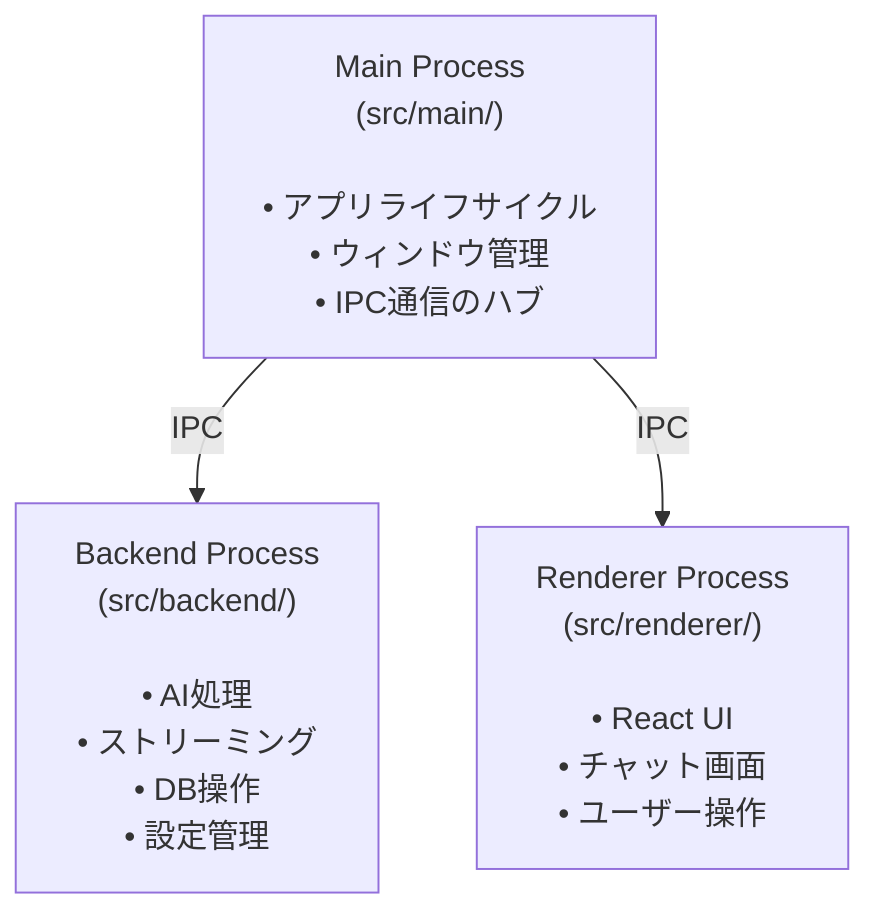
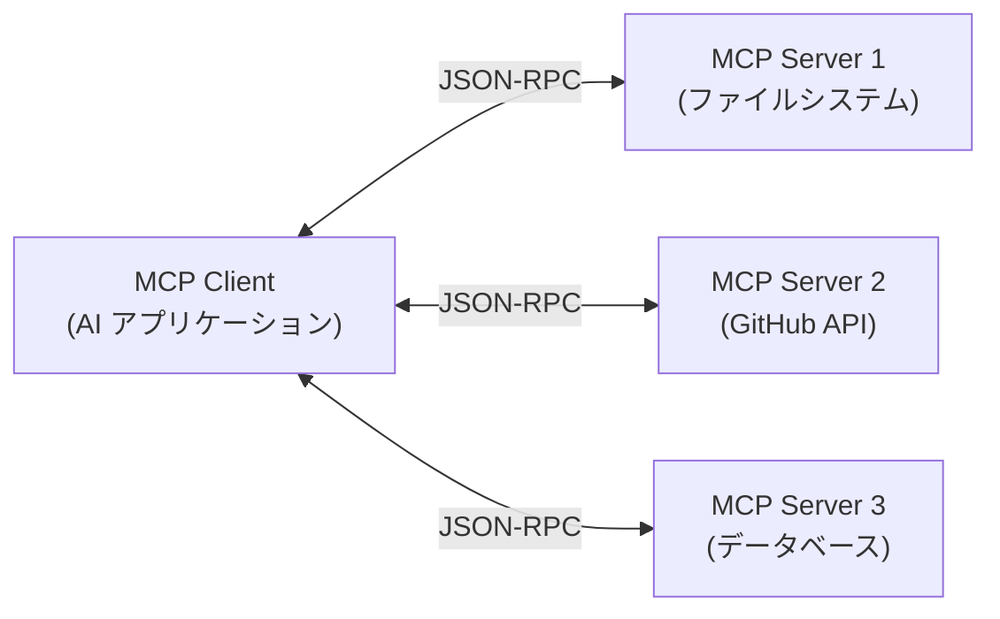

# MCP サーバー統合の設計方針

このドキュメントでは、Electron AI Starter Template に Model Context Protocol (MCP) サーバー接続機能を追加するための設計方針を定義します。

## 目次

- [現状分析](#現状分析)
- [MCP とは](#mcp-とは)
- [統合の目的とスコープ](#統合の目的とスコープ)
- [アーキテクチャ設計](#アーキテクチャ設計)
- [実装計画](#実装計画)
- [データモデル](#データモデル)
- [API 設計](#api-設計)
- [UI/UX 設計](#uiux-設計)
- [セキュリティ考慮事項](#セキュリティ考慮事項)
- [実装フェーズ](#実装フェーズ)
- [今後の拡張性](#今後の拡張性)

---

## 現状分析

### プロジェクトの現在のアーキテクチャ

本プロジェクトは、標準的な Electron の2プロセスモデルを拡張した **3プロセス構成** を採用しています。



### 現在の AI プロバイダー統合

現在、以下の AI プロバイダーに対応しています：

- **Anthropic** (Claude)
- **OpenAI** (GPT)
- **Google** (Gemini)

**統合方法**:
- `src/backend/ai/factory.ts` でプロバイダー管理
- **Vercel AI SDK (`ai` パッケージ v4.3.17)** を使用
- 各プロバイダーの API を直接呼び出し
- `streamText()` によるストリーミング対応

**重要**: AI SDK v4.2+ は **MCP を公式サポート**しており、`experimental_createMCPClient` API が利用可能です。

### IPC 通信の特徴

本プロジェクトでは、**MessagePort ベースの直接通信** を採用しており、`src/common/connection.ts` の `Connection` クラスが全ての通信を管理しています。

**通信パターン**:
1. **invoke/handle**: リクエスト-レスポンス（同期的）
2. **publishEvent/onEvent**: イベント通知（非同期的）

---

## MCP とは

### Model Context Protocol の概要

**MCP (Model Context Protocol)** は、Anthropic が2024年11月に発表した、AI アシスタントと外部データソースを接続するためのオープンスタンダードです。

**特徴**:
- クライアント・サーバーアーキテクチャ
- JSON-RPC ベースの通信
- 3つのプリミティブ: Resources、Tools、Prompts
- 複数の言語に対応した公式 SDK (TypeScript、Python など)

### MCP のアーキテクチャ



### MCP のプリミティブ

| プリミティブ | 説明 | 例 |
|------------|------|-----|
| **Resources** | 読み取り専用のデータエンドポイント | ファイル内容、データベースレコード |
| **Tools** | LLM が実行可能なアクション | ファイル作成、API 呼び出し |
| **Prompts** | 再利用可能なプロンプトテンプレート | プロジェクト分析プロンプト |

### トランスポート

MCP は複数のトランスポート方式をサポートしています：

- **stdio**: 標準入出力を使ったローカルプロセス通信
- **HTTP/SSE**: リモートサーバーとの通信（Streamable HTTP）

### Vercel AI SDK の MCP サポート

**重要な発見**: 本プロジェクトが既に使用している **Vercel AI SDK (v4.2+) は MCP を公式サポート**しています。

**サポート機能**:
- ✅ **Tools**: 完全サポート（自動変換）
- ✅ **Resources**: 完全サポート（`listResources()`, `readResource()`, `includeResources` オプション）
- ✅ **Prompts**: 完全サポート（`listPrompts()`）
- ✅ **stdio transport**: ローカルサーバー用
- ✅ **HTTP/SSE transport**: リモートサーバー用（本番推奨）

**主要 API**:
```typescript
import { experimental_createMCPClient } from 'ai'

const mcpClient = experimental_createMCPClient({
  transport: {
    type: 'stdio',
    command: 'node',
    args: ['path/to/server.js']
  }
})

// Tools を取得して streamText() に渡せる
const tools = await mcpClient.getTools()

// Resources も includeResources: true でツール化可能
const resourceTools = await mcpClient.getTools({ includeResources: true })
```

**メリット**:
- `@modelcontextprotocol/sdk` を直接使用する必要がない
- AI SDK との統合がシームレス
- 型安全性が保証される
- Vercel が継続的にメンテナンス

---

## 統合の目的とスコープ

### 目的

1. **拡張性の向上**: AI に外部コンテキストを提供する標準的な方法を確立
2. **再利用性**: 既存の MCP サーバーエコシステムを活用
3. **統一的な管理**: 複数の MCP サーバーを一元管理

### スコープ

**含まれるもの**:
- ✅ MCP サーバーへの接続管理
- ✅ stdio トランスポートのサポート（ローカルサーバー）
- ✅ Resources、Tools、Prompts の取得と表示
- ✅ MCP ツールの実行
- ✅ 設定 UI での MCP サーバー管理
- ✅ 既存 AI 統合との連携

**含まれないもの (将来の拡張)**:
- ⏳ HTTP/SSE トランスポート（リモートサーバー）※ AI SDK はサポート済み
- ❌ MCP サーバーの自動検出
- ❌ カスタム MCP サーバーの開発サポート

---

## アーキテクチャ設計

### 全体アーキテクチャ

```mermaid
graph TB
    subgraph "Renderer Process"
        UI[Settings UI<br/>MCP サーバー管理]
        Chat[Chat UI<br/>AI 会話]
    end

    subgraph "Backend Process"
        MCPManager[MCP Manager<br/>接続管理]
        AISDK[AI SDK<br/>experimental_createMCPClient]
        AIHandler[AI Handler<br/>streamText統合]
        DB[(Database<br/>設定保存)]
    end

    subgraph "External MCP Servers"
        Server1[MCP Server 1<br/>filesystem]
        Server2[MCP Server 2<br/>github]
        Server3[MCP Server N<br/>custom]
    end

    UI -->|IPC| MCPManager
    Chat -->|IPC| AIHandler
    MCPManager --> DB
    MCPManager --> AISDK
    AISDK -->|stdio| Server1
    AISDK -->|stdio| Server2
    AISDK -->|stdio| Server3
    AIHandler -->|getTools()| MCPManager
    AIHandler -->|tools渡し| AISDK
```

### プロセス配置の方針

**MCP Client の配置場所**: Backend Process

**理由**:
1. **子プロセス管理**: MCP サーバーは Node.js の子プロセスとして起動されるため、Backend Process で管理するのが自然
2. **既存パターンとの一貫性**: AI 統合も Backend Process にあり、統一的な設計
3. **セキュリティ**: Renderer Process からの直接アクセスを避ける
4. **リソース管理**: 長時間実行されるプロセスの管理が容易

### IPC 通信設計

既存の `Connection` クラスを活用し、MCP 関連の新しいチャンネルを追加します。

**新規追加するチャンネル**:

| チャンネル名 | 方向 | 説明 |
|------------|------|------|
| `listMCPServers` | Renderer → Backend | 登録済み MCP サーバー一覧取得 |
| `addMCPServer` | Renderer → Backend | MCP サーバーを追加 |
| `removeMCPServer` | Renderer → Backend | MCP サーバーを削除 |
| `connectMCPServer` | Renderer → Backend | MCP サーバーに接続 |
| `disconnectMCPServer` | Renderer → Backend | MCP サーバーから切断 |
| `getMCPResources` | Renderer → Backend | Resources 一覧取得 |
| `getMCPTools` | Renderer → Backend | Tools 一覧取得 |
| `getMCPPrompts` | Renderer → Backend | Prompts 一覧取得 |
| `callMCPTool` | Renderer → Backend | Tool を実行 |
| `mcpServerStatusChanged` | Backend → Renderer | サーバー接続状態の変化 (event) |

---

## 実装計画

### ディレクトリ構造

```
src/
├── backend/
│   ├── mcp/
│   │   ├── index.ts              # MCP マネージャー公開 API
│   │   ├── manager.ts            # MCP マネージャー本体（AI SDK使用）
│   │   ├── server-config.ts     # サーバー設定管理
│   │   └── types.ts             # MCP 関連の型定義（AI SDK型の再エクスポート）
│   ├── handler.ts               # ← MCP メソッドを追加
│   └── ...
├── common/
│   └── types.ts                 # ← MCP 関連の共通型を追加
├── renderer/src/
│   ├── components/
│   │   └── settings/
│   │       └── mcp-settings.tsx # MCP 設定画面
│   └── lib/
│       └── mcp.ts               # MCP クライアント API
└── ...
```

**注**: `client-wrapper.ts` は不要です。AI SDK の `experimental_createMCPClient` を直接使用します。

### 主要コンポーネント

#### 1. MCP Manager (`src/backend/mcp/manager.ts`)

**責務**:
- MCP サーバーへの接続・切断管理（AI SDK の `experimental_createMCPClient` 使用）
- 複数サーバーの並行管理
- サーバー設定の読み込み・保存
- クライアントインスタンスのライフサイクル管理

**実装例**:
```typescript
import { experimental_createMCPClient } from 'ai'

class MCPManager {
  private clients: Map<string, ReturnType<typeof experimental_createMCPClient>> = new Map()

  async connect(serverId: string, config: MCPServerConfig): Promise<Result<void>> {
    const client = experimental_createMCPClient({
      transport: {
        type: 'stdio',
        command: config.command,
        args: config.args,
        env: config.env
      }
    })

    this.clients.set(serverId, client)
    return ok(undefined)
  }

  async disconnect(serverId: string): Promise<Result<void>> {
    const client = this.clients.get(serverId)
    if (client) {
      // クライアントのクリーンアップ
      this.clients.delete(serverId)
    }
    return ok(undefined)
  }

  async listResources(serverId: string): Promise<Result<MCPResource[]>> {
    const client = this.clients.get(serverId)
    if (!client) return error('Server not connected')

    const resources = await client.listResources()
    return ok(resources)
  }

  async getTools(serverId: string, includeResources = false): Promise<Result<MCPTool[]>> {
    const client = this.clients.get(serverId)
    if (!client) return error('Server not connected')

    const tools = await client.getTools({ includeResources })
    return ok(tools)
  }

  async listPrompts(serverId: string): Promise<Result<MCPPrompt[]>> {
    const client = this.clients.get(serverId)
    if (!client) return error('Server not connected')

    const prompts = await client.listPrompts()
    return ok(prompts)
  }

  // AI統合用: 全サーバーのツールを取得
  async getAllTools(includeResources = false): Promise<MCPTool[]> {
    const allTools: MCPTool[] = []
    for (const [_serverId, client] of this.clients) {
      const tools = await client.getTools({ includeResources })
      allTools.push(...tools)
    }
    return allTools
  }
}
```

**重要なポイント**:
- `@modelcontextprotocol/sdk` は使用しない
- AI SDK の型定義をそのまま利用（型変換不要）
- `getTools({ includeResources: true })` で Resources もツールとして扱える
- `streamText()` に直接渡せる形式でツールを取得

#### 2. Handler 拡張 (`src/backend/handler.ts`)

既存の `Handler` クラスに MCP メソッドを追加します。

```typescript
export class Handler {
  private _mcpManager: MCPManager

  // 既存メソッド...

  // MCP メソッド
  async listMCPServers(): Promise<Result<MCPServerConfig[]>>
  async addMCPServer(config: MCPServerConfig): Promise<Result<void>>
  async removeMCPServer(serverId: string): Promise<Result<void>>
  async connectMCPServer(serverId: string): Promise<Result<void>>
  async disconnectMCPServer(serverId: string): Promise<Result<void>>
  async getMCPResources(serverId: string): Promise<Result<MCPResource[]>>
  async getMCPTools(serverId: string): Promise<Result<MCPTool[]>>
  async getMCPPrompts(serverId: string): Promise<Result<MCPPrompt[]>>
  async callMCPTool(serverId: string, toolName: string, args: unknown): Promise<Result<unknown>>
}
```

---

## データモデル

### データベーススキーマ拡張

**新規テーブル**: `mcp_servers`

```typescript
// src/backend/db/schema.ts
export const mcpServers = sqliteTable('mcp_servers', {
  id: text('id').notNull().primaryKey(),
  name: text('name').notNull(),
  description: text('description'),
  command: text('command').notNull(),
  args: text('args', { mode: 'json' }).notNull(),  // string[]
  env: text('env', { mode: 'json' }),              // Record<string, string> | null
  autoConnect: integer('auto_connect', { mode: 'boolean' }).notNull().default(false),
  enabled: integer('enabled', { mode: 'boolean' }).notNull().default(true),
  createdAt: integer('created_at', { mode: 'timestamp' }).notNull(),
  updatedAt: integer('updated_at', { mode: 'timestamp' }).notNull()
})
```

**フィールド説明**:

| フィールド | 型 | 説明 |
|-----------|-----|------|
| `id` | string | ユニーク ID (UUID) |
| `name` | string | サーバー名 (例: "Filesystem Server") |
| `description` | string? | 説明文 |
| `command` | string | 実行コマンド (例: "node") |
| `args` | string[] | コマンド引数 (例: ["path/to/server.js"]) |
| `env` | object? | 環境変数 (例: {"API_KEY": "..."}) |
| `autoConnect` | boolean | アプリ起動時に自動接続するか |
| `enabled` | boolean | サーバーが有効か |
| `createdAt` | Date | 作成日時 |
| `updatedAt` | Date | 更新日時 |

### TypeScript 型定義

```typescript
// src/common/types.ts

export interface MCPServerConfig {
  id: string
  name: string
  description?: string
  command: string
  args: string[]
  env?: Record<string, string>
  autoConnect: boolean
  enabled: boolean
  createdAt: Date
  updatedAt: Date
}

export interface MCPServerStatus {
  serverId: string
  connected: boolean
  error?: string
}

export interface MCPResource {
  uri: string
  name: string
  description?: string
  mimeType?: string
}

export interface MCPTool {
  name: string
  description?: string
  inputSchema: object  // JSON Schema
}

export interface MCPPrompt {
  name: string
  description?: string
  arguments?: Array<{
    name: string
    description?: string
    required?: boolean
  }>
}
```

---

## API 設計

### Backend API (Handler メソッド)

#### サーバー管理

**`listMCPServers()`**
```typescript
// リクエスト: なし
// レスポンス: Result<MCPServerConfig[]>
await window.backend.listMCPServers()
```

**`addMCPServer(config)`**
```typescript
// リクエスト: MCPServerConfig (id を除く)
// レスポンス: Result<string>  // 作成された ID
await window.backend.addMCPServer({
  name: "Filesystem Server",
  command: "node",
  args: ["/path/to/server.js"],
  autoConnect: true,
  enabled: true
})
```

**`removeMCPServer(serverId)`**
```typescript
// リクエスト: serverId
// レスポンス: Result<void>
await window.backend.removeMCPServer("server-123")
```

**`connectMCPServer(serverId)`**
```typescript
// リクエスト: serverId
// レスポンス: Result<void>
await window.backend.connectMCPServer("server-123")
```

**`disconnectMCPServer(serverId)`**
```typescript
// リクエスト: serverId
// レスポンス: Result<void>
await window.backend.disconnectMCPServer("server-123")
```

#### リソース・ツール・プロンプト取得

**`getMCPResources(serverId)`**
```typescript
// リクエスト: serverId
// レスポンス: Result<MCPResource[]>
const result = await window.backend.getMCPResources("server-123")
```

**`getMCPTools(serverId)`**
```typescript
// リクエスト: serverId
// レスポンス: Result<MCPTool[]>
const result = await window.backend.getMCPTools("server-123")
```

**`getMCPPrompts(serverId)`**
```typescript
// リクエスト: serverId
// レスポンス: Result<MCPPrompt[]>
const result = await window.backend.getMCPPrompts("server-123")
```

#### ツール実行

**`callMCPTool(serverId, toolName, args)`**
```typescript
// リクエスト: serverId, toolName, args
// レスポンス: Result<unknown>
const result = await window.backend.callMCPTool(
  "server-123",
  "read_file",
  { path: "/path/to/file.txt" }
)
```

### イベント通知

**`mcpServerStatusChanged`**

サーバーの接続状態が変化したときに通知されます。

```typescript
window.backend.onEvent('mcpServerStatusChanged', (event: AppEvent) => {
  const status = event.payload as MCPServerStatus
  console.log(`Server ${status.serverId} is now ${status.connected ? 'connected' : 'disconnected'}`)
})
```

---

## UI/UX 設計

### 設定画面の拡張

**新規追加**: Settings 画面に "MCP Servers" タブを追加

```
Settings
├── AI Providers (既存)
├── MCP Servers (新規) ← ここを追加
└── Database (既存)
```

### MCP Servers タブの構成

```
┌─────────────────────────────────────────────────────┐
│ MCP Servers                                         │
├─────────────────────────────────────────────────────┤
│                                                     │
│  [+ Add Server]                                     │
│                                                     │
│  ┌───────────────────────────────────────────────┐ │
│  │ Filesystem Server                    [•]  [×] │ │
│  │ Access local files and directories            │ │
│  │ Command: node /path/to/fs-server.js           │ │
│  │ Status: Connected ✓                           │ │
│  │ [Disconnect] [Edit] [Delete]                  │ │
│  └───────────────────────────────────────────────┘ │
│                                                     │
│  ┌───────────────────────────────────────────────┐ │
│  │ GitHub Server                        [•]  [×] │ │
│  │ Interact with GitHub repositories             │ │
│  │ Command: npx -y @github/mcp-server            │ │
│  │ Status: Disconnected                          │ │
│  │ [Connect] [Edit] [Delete]                     │ │
│  └───────────────────────────────────────────────┘ │
│                                                     │
└─────────────────────────────────────────────────────┘
```

**要素**:
- サーバー名、説明
- 接続ステータス (Connected / Disconnected / Error)
- 自動接続トグル
- 有効/無効トグル
- アクション: Connect / Disconnect / Edit / Delete

### Add/Edit Server ダイアログ

```
┌─────────────────────────────────────────────────────┐
│ Add MCP Server                            [×]       │
├─────────────────────────────────────────────────────┤
│                                                     │
│ Server Name *                                       │
│ ┌───────────────────────────────────────────────┐  │
│ │ Filesystem Server                             │  │
│ └───────────────────────────────────────────────┘  │
│                                                     │
│ Description                                         │
│ ┌───────────────────────────────────────────────┐  │
│ │ Access local files and directories            │  │
│ └───────────────────────────────────────────────┘  │
│                                                     │
│ Command *                                           │
│ ┌───────────────────────────────────────────────┐  │
│ │ node                                          │  │
│ └───────────────────────────────────────────────┘  │
│                                                     │
│ Arguments (one per line) *                          │
│ ┌───────────────────────────────────────────────┐  │
│ │ /path/to/server.js                            │  │
│ │ --config                                       │  │
│ │ /path/to/config.json                          │  │
│ └───────────────────────────────────────────────┘  │
│                                                     │
│ Environment Variables (optional)                    │
│ ┌─────────────────────┬─────────────────────────┐  │
│ │ Key                 │ Value                   │  │
│ ├─────────────────────┼─────────────────────────┤  │
│ │ API_KEY             │ sk-...                  │  │
│ │ LOG_LEVEL           │ debug                   │  │
│ └─────────────────────┴─────────────────────────┘  │
│ [+ Add Variable]                                    │
│                                                     │
│ ☑ Auto-connect on startup                          │
│ ☑ Enabled                                           │
│                                                     │
│              [Cancel]  [Save]                       │
└─────────────────────────────────────────────────────┘
```

### MCP Resources/Tools ブラウザ (将来の拡張)

接続されたサーバーのリソースやツールを一覧・実行できるビューを提供します。

```
┌─────────────────────────────────────────────────────┐
│ MCP Resources & Tools                               │
├─────────────────────────────────────────────────────┤
│ Server: [Filesystem Server ▼]                       │
├─────────────────────────────────────────────────────┤
│                                                     │
│ Resources (12)                                      │
│ ┌───────────────────────────────────────────────┐  │
│ │ 📄 /home/user/documents/readme.md             │  │
│ │ 📄 /home/user/documents/notes.txt             │  │
│ │ 📁 /home/user/projects/                       │  │
│ └───────────────────────────────────────────────┘  │
│                                                     │
│ Tools (5)                                           │
│ ┌───────────────────────────────────────────────┐  │
│ │ 🔧 read_file                                  │  │
│ │    Read the contents of a file                │  │
│ │    [Execute]                                   │  │
│ │                                                │  │
│ │ 🔧 write_file                                 │  │
│ │    Write content to a file                    │  │
│ │    [Execute]                                   │  │
│ └───────────────────────────────────────────────┘  │
│                                                     │
└─────────────────────────────────────────────────────┘
```

---

## セキュリティ考慮事項

### 1. コマンド実行のリスク

MCP サーバーは任意のコマンドを実行するため、セキュリティリスクがあります。

**対策**:
- ✅ ユーザーが明示的に追加したサーバーのみ実行
- ✅ サーバー設定は暗号化せず、ユーザーの責任で管理
- ✅ UI で実行コマンドを明示的に表示
- ⚠️ サンドボックス化は今回のスコープ外（将来の拡張）

### 2. 環境変数の管理

API キーなどの機密情報が環境変数に含まれる可能性があります。

**対策**:
- ✅ 環境変数はデータベースに平文で保存（既存の AI 設定と同様）
- ✅ userData ディレクトリのパーミッションで保護
- ⚠️ OS キーチェーン統合は将来の拡張

### 3. MCP サーバーとの通信

**対策**:
- ✅ stdio トランスポートを使用（ローカルプロセス間通信）
- ✅ JSON-RPC メッセージの検証
- ✅ タイムアウト設定

---

## 実装フェーズ

### フェーズ 1: 基礎実装 (MVP)

**目標**: 単一の MCP サーバーに接続し、リソース一覧を取得できる

**タスク**:
1. ~~`@modelcontextprotocol/sdk` のインストール~~ → **不要**（AI SDK v4.3.17 に含まれる）
2. データベーススキーマの追加とマイグレーション
3. `MCPManager` の基本実装（`experimental_createMCPClient` 使用）
   - `connect()`, `disconnect()`, `listResources()`
4. Handler への MCP メソッド追加
5. `src/common/types.ts` への型定義追加
6. Renderer 側 API の実装（`window.backend.*` 経由）
7. Settings UI の基本実装（サーバー追加・一覧表示・接続）

**成功基準**:
- ✅ MCP サーバーを設定画面から追加できる
- ✅ サーバーに接続できる（AI SDK の `experimental_createMCPClient` 経由）
- ✅ リソース一覧を取得・表示できる

**実装の簡素化**:
- `MCPClientWrapper` の実装は不要
- 型変換ロジックも不要（AI SDK の型をそのまま使用）
- 低レベルの MCP プロトコル処理は AI SDK が担当

### フェーズ 2: 機能拡張

**目標**: Tools と Prompts のサポート、複数サーバー管理

**タスク**:
1. `listTools()` と `listPrompts()` の実装
2. `callTool()` の実装
3. 複数サーバーの並行管理
4. 自動接続機能
5. エラーハンドリングの強化
6. Settings UI の拡張（ツール実行、プロンプト表示）

**成功基準**:
- ✅ 複数の MCP サーバーを同時に接続できる
- ✅ ツールを実行できる
- ✅ プロンプトを取得・表示できる

### フェーズ 3: AI 統合

**目標**: AI チャットから MCP リソースやツールを利用できる

**タスク**:
1. `MCPManager.getAllTools()` の実装（全サーバーのツールを集約）
2. `streamAIText()` に MCP ツールを渡す実装
   ```typescript
   // src/backend/handler.ts
   async streamAIText(messages: AIMessage[]): Promise<Result<string>> {
     // 既存のAI設定取得...

     // MCP ツールを取得
     const mcpTools = await this._mcpManager.getAllTools({ includeResources: true })

     // streamText() に渡す
     const sessionId = await streamText(
       config,
       messages,
       mcpTools,  // ← MCP ツールを追加
       (channel, event) => this._rendererConnection.publishEvent(channel, event)
     )

     return ok(sessionId)
   }
   ```
3. チャット UI でのツール実行結果の表示（Assistant UI が対応）
4. プロンプトテンプレートの活用

**成功基準**:
- ✅ AI がファイル内容を読み取れる（MCP Resources をツール化して利用）
- ✅ AI がツールを実行できる（MCP Tools を `streamText()` に渡すだけ）
- ✅ ユーザーがツール実行を確認・承認できる

**AI SDK による簡素化**:
- MCP Tools は AI SDK のツール形式に自動変換される
- `streamText()` の `tools` パラメータに直接渡せる
- ツール実行のハンドリングも AI SDK が担当

### フェーズ 4: 高度な機能 (将来の拡張)

- **HTTP/SSE トランスポートのサポート**（AI SDK は既にサポート済み）
- MCP サーバーの自動検出
- カスタムサーバー開発サポート
- パフォーマンス最適化
- リソースキャッシング

---

## 今後の拡張性

### 1. HTTP/SSE トランスポートのサポート

リモート MCP サーバーへの接続を可能にします。

**変更点**:
- `MCPServerConfig` に `transport: 'stdio' | 'http'` フィールドを追加
- HTTP トランスポート設定の UI 追加
- 認証機能の追加（API キーなど）

**実装例**:
```typescript
// AI SDK は既に HTTP トランスポートをサポート
const client = experimental_createMCPClient({
  transport: {
    type: 'http',  // または 'sse'
    url: 'https://api.example.com/mcp',
    headers: {
      'Authorization': `Bearer ${apiKey}`
    }
  }
})
```

**メリット**:
- Vercel など本番環境へのデプロイが可能
- クラウドホストされた MCP サーバーへのアクセス
- AI SDK が既にサポート済みなので実装が容易

### 2. MCP サーバーマーケットプレイス

公式・コミュニティが提供する MCP サーバーを簡単にインストールできる機能。

**実装案**:
- GitHub からサーバーリストを取得
- ワンクリックインストール
- 自動アップデート

### 3. カスタム MCP サーバー開発支援

プロジェクト内でカスタム MCP サーバーを開発できる環境を提供。

**実装案**:
- テンプレートジェネレーター
- デバッグツール
- ホットリロード対応

### 4. AI ツール実行の承認フロー

セキュリティ向上のため、AI がツールを実行する前にユーザーの承認を求める。

**UI**:
```
┌─────────────────────────────────────────────────────┐
│ Tool Execution Request                              │
├─────────────────────────────────────────────────────┤
│ The AI wants to execute the following tool:         │
│                                                     │
│ Server: Filesystem Server                           │
│ Tool: write_file                                    │
│                                                     │
│ Arguments:                                          │
│ {                                                   │
│   "path": "/home/user/notes.txt",                  │
│   "content": "Meeting notes..."                    │
│ }                                                   │
│                                                     │
│              [Deny]  [Approve]                      │
└─────────────────────────────────────────────────────┘
```

---

## 参考資料

### MCP 公式リソース
- [Model Context Protocol - 公式サイト](https://modelcontextprotocol.io)
- [MCP TypeScript SDK - GitHub](https://github.com/modelcontextprotocol/typescript-sdk)
- [MCP Servers - GitHub](https://github.com/modelcontextprotocol/servers)
- [Anthropic MCP ドキュメント](https://docs.anthropic.com/en/docs/agents-and-tools/mcp)

### Vercel AI SDK（本プロジェクトで使用）
- [AI SDK - MCP Tools ドキュメント](https://ai-sdk.dev/docs/ai-sdk-core/mcp-tools)
- [AI SDK - experimental_createMCPClient API リファレンス](https://ai-sdk.dev/docs/reference/ai-sdk-core/create-mcp-client)
- [AI SDK - Node.js MCP クックブック](https://ai-sdk.dev/cookbook/node/mcp-tools)
- [AI SDK 4.2 リリースノート](https://vercel.com/blog/ai-sdk-4-2)

### 本プロジェクト
- [開発者向けドキュメント](./FOR_DEVELOPERS.md)
- [IPC 通信の詳細解説](./IPC_COMMUNICATION_DEEP_DIVE.md)
- [AI プロバイダー拡張ガイド](./EXTENDING_AI_PROVIDERS.md)

---

**更新日**: 2025-11-09
**バージョン**: 2.0
**ステータス**: Draft (設計中)
**変更履歴**:
- v2.0: AI SDK の MCP サポートを反映した設計に変更（`experimental_createMCPClient` 使用）
- v1.0: 初版（`@modelcontextprotocol/sdk` 直接使用）
