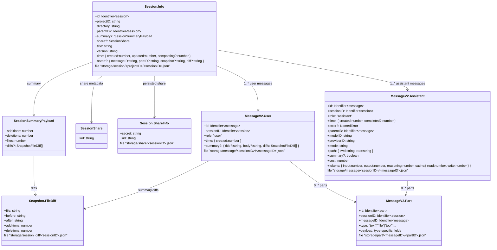

# Opencodeにおけるチャットセッション永続化・要約機能の実装調査

本資料は、[Opencode](https://github.com/sst/opencode)プロジェクトにおけるチャットセッションの永続化方式と、コンテキスト上限接近時の履歴圧縮（要約）機能についての実装調査レポートである。(参考: [公式サイト](https://opencode.ai/))

## 1. チャットセッションの永続化方式

### 1.1 保存先とファイルレイアウト
- ベースディレクトリは `Global.Path.data`（Linux なら `~/.local/share/opencode` など）で、起動時に必要な各ディレクトリが作成される（`packages/opencode/src/global/index.ts:6-31`）。
- `Storage` は上記 `data` 配下に `storage` ディレクトリを確保し、キー配列をパスに変換して `<dir>/<key...>.json` 形式で読み書きする（`packages/opencode/src/storage/storage.ts:143-195`）。排他は `Lock.read`/`Lock.write` で制御される（同 :169-195）。
- 主なキーとファイル構造例
  - セッション情報: `["session", <projectID>, <sessionID>]` → `.../storage/session/<projectID>/<sessionID>.json`
  - メッセージ本体: `["message", <sessionID>, <messageID>]` → `.../storage/message/<sessionID>/<messageID>.json`
  - メッセージ部品: `["part", <messageID>, <partID>]` → `.../storage/part/<messageID>/<partID>.json`
  - 差分要約: `["session_diff", <sessionID>]` → `.../storage/session_diff/<sessionID>.json`
  - 共有情報: `["share", <sessionID>]` → `.../storage/share/<sessionID>.json`

#### 1.1.1 ストレージ構造に対応する概念図


#### 1.1.2 JSONエンティティと Zod スキーマ
- `Session.Info` — `packages/opencode/src/session/index.ts:37-75`。セッション JSON で保持する ID・プロジェクト・ディレクトリ・親子関係・`summary`・`share`・`time` などを定義。
- `Session.ShareInfo` — `packages/opencode/src/session/index.ts:77-85`。共有 URL とシークレットだけを持つシンプルなオブジェクトで `["share", sessionID]` キーに保存。
- `MessageV2` 系 — `packages/opencode/src/session/message-v2.ts:34-345`。`TextPart`/`FilePart`/`ToolPart` などの各 `Part` 型、`ToolState`（pending/running/completed/error）、`User`・`Assistant`。最終的に `MessageV2.Info = z.discriminatedUnion("role", [User, Assistant])` でメッセージ JSON の整合を保証。
- `Snapshot.FileDiff` — `packages/opencode/src/snapshot/index.ts:131-142`。`session_diff/<sessionID>.json` に格納する差分レコード（`file`, `before`, `after`, `additions`, `deletions`）。

#### 1.1.3 Zod スキーマ原文
- `packages/opencode/src/session/index.ts`
```ts
export const Info = z
  .object({
    id: Identifier.schema("session"),
    projectID: z.string(),
    directory: z.string(),
    parentID: Identifier.schema("session").optional(),
    summary: z
      .object({
        additions: z.number(),
        deletions: z.number(),
        files: z.number(),
        diffs: Snapshot.FileDiff.array().optional(),
      })
      .optional(),
    share: z
      .object({
        url: z.string(),
      })
      .optional(),
    title: z.string(),
    version: z.string(),
    time: z.object({
      created: z.number(),
      updated: z.number(),
      compacting: z.number().optional(),
    }),
    revert: z
      .object({
        messageID: z.string(),
        partID: z.string().optional(),
        snapshot: z.string().optional(),
        diff: z.string().optional(),
      })
      .optional(),
  })
  .meta({
    ref: "Session",
  })

export const ShareInfo = z
  .object({
    secret: z.string(),
    url: z.string(),
  })
  .meta({
    ref: "SessionShare",
  })
```

- `packages/opencode/src/session/message-v2.ts`（主要パート）
```ts
const PartBase = z.object({
  id: z.string(),
  sessionID: z.string(),
  messageID: z.string(),
})

export const TextPart = PartBase.extend({
  type: z.literal("text"),
  text: z.string(),
  synthetic: z.boolean().optional(),
  time: z
    .object({
      start: z.number(),
      end: z.number().optional(),
    })
    .optional(),
  metadata: z.record(z.string(), z.any()).optional(),
}).meta({ ref: "TextPart" })

export const FilePart = PartBase.extend({
  type: z.literal("file"),
  mime: z.string(),
  filename: z.string().optional(),
  url: z.string(),
  source: FilePartSource.optional(),
}).meta({ ref: "FilePart" })

export const ToolPart = PartBase.extend({
  type: z.literal("tool"),
  callID: z.string(),
  tool: z.string(),
  state: ToolState,
  metadata: z.record(z.string(), z.any()).optional(),
}).meta({ ref: "ToolPart" })

export const Part = z
  .discriminatedUnion("type", [
    TextPart,
    ReasoningPart,
    FilePart,
    ToolPart,
    StepStartPart,
    StepFinishPart,
    SnapshotPart,
    PatchPart,
    AgentPart,
    RetryPart,
  ])
  .meta({
    ref: "Part",
  })

const Base = z.object({
  id: z.string(),
  sessionID: z.string(),
})

export const User = Base.extend({
  role: z.literal("user"),
  time: z.object({
    created: z.number(),
  }),
  summary: z
    .object({
      title: z.string().optional(),
      body: z.string().optional(),
      diffs: Snapshot.FileDiff.array(),
    })
    .optional(),
}).meta({ ref: "UserMessage" })

export const Assistant = Base.extend({
  role: z.literal("assistant"),
  time: z.object({
    created: z.number(),
    completed: z.number().optional(),
  }),
  error: z
    .discriminatedUnion("name", [
      AuthError.Schema,
      NamedError.Unknown.Schema,
      OutputLengthError.Schema,
      AbortedError.Schema,
      APIError.Schema,
    ])
    .optional(),
  parentID: z.string(),
  modelID: z.string(),
  providerID: z.string(),
  mode: z.string(),
  path: z.object({
    cwd: z.string(),
    root: z.string(),
  }),
  summary: z.boolean().optional(),
  cost: z.number(),
  tokens: z.object({
    input: z.number(),
    output: z.number(),
    reasoning: z.number(),
    cache: z.object({
      read: z.number(),
      write: z.number(),
    }),
  }),
}).meta({ ref: "AssistantMessage" })

export const Info = z.discriminatedUnion("role", [User, Assistant]).meta({
  ref: "Message",
})
```

- `packages/opencode/src/snapshot/index.ts`
```ts
export const FileDiff = z
  .object({
    file: z.string(),
    before: z.string(),
    after: z.string(),
    additions: z.number(),
    deletions: z.number(),
  })
  .meta({
    ref: "FileDiff",
  })
```

### 1.2 セッション／メッセージスキーマ
- セッションは `Session.Info` スキーマで `id`, `projectID`, `directory`, `parentID`, `summary`, `share`, `title`, `version`, `time`, `revert` などを保持する（`packages/opencode/src/session/index.ts:37-75`）。`summary` にはファイル変更数・追加/削除行数が格納される。
- メッセージとそのパーツは `MessageV2` に型定義があり、テキスト／ファイル／スナップショット／パッチ／ツール実行ステータスなどを Zod でバリデートする（`packages/opencode/src/session/message-v2.ts:34-183`）。これにより JSON の構造が明確化され、読み込み時もスキーマ検証が利く。
- セッションに紐づく差分は `SessionSummary` が計算し、`session.summary` と `session_diff/<sessionID>.json` に書き戻される（`packages/opencode/src/session/summary.ts:20-59`）。個別メッセージに対するタイトル・本文サマリーや差分も `Session.updateMessage` を通じて永続化される（同 :61-139）。

### 1.3 書き込み・更新フロー
- セッション作成時は `Session.createNext` が `Storage.write(["session", projectID, sessionID], info)` を呼び出し JSON を生成、Bus で `session.created`/`session.updated` を配信する（`packages/opencode/src/session/index.ts:175-208`）。
- 共有リンクやメタデータは `Session.update` で `Storage.update` を介し最後に `time.updated` を更新する（同 :254-264）。差分一覧は `Session.diff` で `session_diff` ファイルから読み取る（同 :266-269）。
- メッセージ／パーツは `Session.updateMessage` と `Session.updatePart` がそれぞれ `Storage.write` を実行し、Bus 経由で UI と同期される（`packages/opencode/src/session/index.ts:328-372`）。
- ストリーミング読み出しは `MessageV2.stream` が `Storage.list(["message", sessionID])` で JSON を列挙し、各メッセージを `MessageV2.get` で結合して返す（`packages/opencode/src/session/message-v2.ts:639-669`）。過去にコンパクト済みの地点までで打ち切る仕組みが `MessageV2.filterCompacted` にあり、最新サマリー以降のみを扱う（同 :672-679）。

## 2. コンテキスト上限接近時の履歴圧縮

### 2.1 上限検知とトリガー
- プロンプト生成時、`SessionPrompt.getMessages` が `MessageV2.filterCompacted` 結果の最後のアシスタント発話を確認し、`SessionCompaction.isOverflow` へ渡す（`packages/opencode/src/session/prompt.ts:482-530`）。
- `SessionCompaction.isOverflow` はモデルの `limit.context` から安全マージンとして最大出力トークン（`min(model.limit.output, SessionPrompt.OUTPUT_TOKEN_MAX)`）を引き、最後のアシスタント発話で消費した `input + cache.read + output` が可用コンテキストを超えたかを判定する（`packages/opencode/src/session/compaction.ts:33-41`）。フラグ `OPENCODE_DISABLE_AUTOCOMPACT` が有効な場合は無効化される。

### 2.2 要約シーケンス
1. **要約メッセージ挿入**  
   - 溢れが検知されると `SessionPrompt.getMessages` は `SessionCompaction.run` を呼び出す（`packages/opencode/src/session/prompt.ts:497-503`）。`SessionCompaction.run` はセッションをロックし `time.compacting` を設定後、`MessageV2.filterCompacted` でサマリー以降の履歴を抽出する（`packages/opencode/src/session/compaction.ts:90-105`）。
2. **モデル呼び出しとストリーム処理**  
   - 新しいアシスタントメッセージ (`summary: true`) と空のテキストパートを作り（同 :111-146）、`streamText` に対してシステムプロンプト＋会話履歴＋「会話の要約を返せ」というユーザー入力で推論を開始する（同 :147-179）。部分的なデルタは `Session.updatePart` で随時追記され、使用トークンは `Session.getUsage` を通してメッセージに保存される（同 :181-215）。
   - エラー時は `retry` パートを残し最大 `chatMaxRetries`（デフォルト 10）までリトライ、失敗すれば `session.error` を発火する（同 :181-270）。
3. **完了処理と再開メッセージ**  
   - 要約メッセージが完成し `msg.summary = true` になった段階で `session.compacted` イベントが飛ぶ（同 :271-309）。直後に `SessionPrompt.getMessages` は人工ユーザーメッセージを生成し、「上のサマリーを使って再開せよ」と指示するテキストを追加、次のプロンプトでは `[summaryMsg, resumeMsg]` だけをモデルに渡す（`packages/opencode/src/session/prompt.ts:503-528`）。
4. **履歴の剪定**  
   - `SessionPrompt.prompt` から返るたびに `SessionCompaction.prune` が呼ばれ、最新 2 ターン以降で 40k トークンを超えている古いツール出力を `part.state.time.compacted` フラグ付きで空にし、次回の送信内容から削除する（`packages/opencode/src/session/prompt.ts:473-478` と `packages/opencode/src/session/compaction.ts:47-88`）。

### 2.3 既存サマリーの扱い
- `MessageV2.filterCompacted` は逆順ストリームを最新から追い、`info.summary === true` のアシスタントメッセージを見つけたらそれより前を切り捨てる（`packages/opencode/src/session/message-v2.ts:672-679`）。すなわち、以降のプロンプトは常に「直近の要約」＋「要約以後の履歴」のみを含む。
- 追加で `SessionSummary.summarize` が差分一覧と短い説明文を作成しているが、これは UI や共有用メタデータでありコンテキスト圧縮には直接使われていない（`packages/opencode/src/session/summary.ts:20-139`）。ただし同じ `Storage` 基盤を利用してセッション JSON に格納されるため、永続化方式としては整合している。

---

以上より、セッションデータは XDG データディレクトリ配下の JSON ファイル群として永続化され、コンテキスト上限へ近づくと `SessionCompaction` により自動サマリー＋再開指示が挿入され、過去履歴は要約およびツール出力剪定で段階的に圧縮されることが確認できた。
