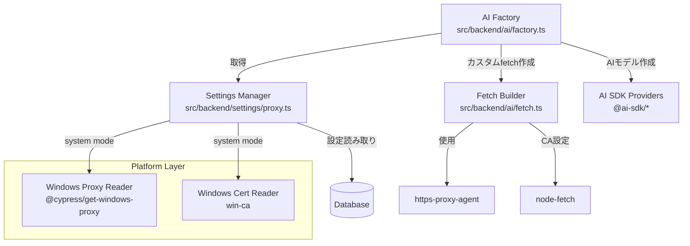

# プロキシと証明書のカスタマイズ機能 - 設計書

**作成日**: 2025-11-09
**承認日**: 2025-11-09
**対象バージョン**: v0.2.0
**ステータス**: ✅ 承認済み

## 目次

- [概要](#概要)
- [背景と課題](#背景と課題)
- [現状分析](#現状分析)
- [要件定義](#要件定義)
- [技術調査結果](#技術調査結果)
- [設計方針](#設計方針)
- [実装計画](#実装計画)
- [リスクと制約事項](#リスクと制約事項)
- [参考資料](#参考資料)

---

## 概要

企業プロキシ環境（Zscaler等）でのアプリケーション使用を可能にするため、プロキシとHTTPS証明書検証のカスタマイズ機能を実装する。

### 提供する3つのモード

| モード | 説明 | 対象ユーザー |
|--------|------|-------------|
| **システムモード** | OS標準のプロキシ・証明書設定を使用 | 企業ネットワーク内のユーザー |
| **カスタムモード** | アプリ独自の設定を使用 | 高度なカスタマイズが必要なユーザー |
| **無設定モード** | 素のNode.js状態（現状の実装） | プロキシ不要なユーザー |

### 対応プラットフォーム

- **第1フェーズ**: Windows のみ（最低限の要件）
- **第2フェーズ以降**: macOS, Linux（将来的な拡張）

---

## 背景と課題

### 企業プロキシ環境の特徴

1. **SSL/TLS インターセプション**
   - Zscaler等の企業プロキシは通信を復号・検査して再暗号化
   - 自己署名証明書や企業独自のCA証明書を使用
   - OS証明書ストアには企業CAがインストール済み

2. **プロキシ設定**
   - システム設定またはPACファイルで自動構成
   - HTTP_PROXY/HTTPS_PROXY環境変数での手動設定
   - 認証が必要な場合もある

3. **現状の問題**
   - 本アプリのBackendプロセスはNode.jsで動作
   - Node.jsはOS証明書ストアを**自動では使用しない**
   - プロキシ設定も**自動では適用されない**
   - 結果: 企業プロキシ経由でAI APIに接続できない

---

## 現状分析

### 現在のAI接続実装

**ファイル**: `src/backend/ai/factory.ts`

```typescript
export const FACTORY = {
  openai: {
    createModel: (apiKey: string, model: string) => createOpenAI({ apiKey })(model)
  },
  anthropic: {
    createModel: (apiKey: string, model: string) => createAnthropic({ apiKey })(model)
  },
  google: {
    createModel: (apiKey: string, model: string) => createGoogleGenerativeAI({ apiKey })(model)
  }
}
```

**問題点**:
- プロバイダー作成時にプロキシ設定なし
- 証明書検証のカスタマイズなし
- デフォルトのfetch実装を使用（プロキシ・証明書設定なし）

---

## 要件定義

### 機能要件

#### FR-1: システムモード（Windows）

- [ ] Windowsレジストリからプロキシ設定を読み取り
  - レジストリキー: `HKEY_CURRENT_USER\Software\Microsoft\Windows\CurrentVersion\Internet Settings`
  - ProxyEnable, ProxyServer, ProxyOverride 等
- [ ] Windows証明書ストアからルートCA証明書を読み取り
  - Trusted Root Certification Authorities
- [ ] 取得した設定をBackendプロセスのHTTPクライアントに適用
- [ ] 設定の自動更新（起動時、または定期的）

#### FR-2: カスタムモード

- [ ] UI設定画面でプロキシ設定を入力
  - プロキシホスト、ポート
  - 認証（ユーザー名・パスワード）
  - バイパスリスト
- [ ] カスタムCA証明書ファイルのアップロード
  - PEM形式のサポート
  - 複数証明書の対応
- [ ] 設定のデータベース保存（暗号化）
- [ ] 設定のテスト機能（接続確認）

#### FR-3: 無設定モード

- [ ] 現状の実装を維持
- [ ] プロキシ・証明書の設定を一切適用しない

#### FR-4: モード切り替え

- [ ] UI設定画面でモードを選択
- [ ] 設定変更の即時反映または再起動要求
- [ ] 現在のモード表示

### 非機能要件

#### NFR-1: セキュリティ

- API キーと同様、プロキシ認証情報は暗号化保存
- カスタムCA証明書の安全な保存
- ログに機密情報を出力しない

#### NFR-2: ユーザビリティ

- デフォルトは「システムモード」（企業ユーザー向け）
- エラー時の分かりやすいメッセージ
- 接続テスト機能で問題の早期発見

#### NFR-3: 保守性

- プラットフォーム依存部分の分離
- 将来的なmacOS/Linux対応を考慮した設計

---

## 技術調査結果

### 使用中のライブラリの機能

#### Vercel AI SDK

**公式サポート機能**:

すべてのプロバイダーSDK（`@ai-sdk/openai`, `@ai-sdk/anthropic`, `@ai-sdk/google`）は以下をサポート:

```typescript
createOpenAI({
  apiKey: string,
  baseURL?: string,        // プロキシ経由の場合に変更可能
  headers?: Record<string, string>,  // カスタムヘッダー
  fetch?: typeof fetch     // カスタムfetch実装
})
```

**重要**: `fetch` パラメータを使えば、プロキシと証明書を完全にカスタマイズ可能。

**参考**:
- GitHub Discussion: [Could I make the ai sdk work through my local proxy? #3870](https://github.com/vercel/ai/discussions/3870)
- 公式ドキュメント: AI SDK Providers

### Node.jsのプロキシサポート

#### 1. `https.Agent` (Node.js標準)

```typescript
import https from 'https'
import fs from 'fs'

const agent = new https.Agent({
  ca: fs.readFileSync('/path/to/ca-cert.pem'),  // カスタムCA証明書
  proxy: 'http://proxy.example.com:8080'        // Note: proxyオプションは存在しない
})
```

**制約**: 標準の`https.Agent`は直接プロキシをサポート**しない**。

#### 2. `https-proxy-agent` (npm)

```typescript
import { HttpsProxyAgent } from 'https-proxy-agent'
import fs from 'fs'

const agent = new HttpsProxyAgent('http://proxy.example.com:8080', {
  ca: fs.readFileSync('/path/to/ca-cert.pem')
})
```

**利点**:
- HTTPSプロキシ専用
- CA証明書のカスタマイズ可能
- プロキシ認証サポート
- 広く使われている（安定）

#### 3. `undici` ProxyAgent (Node.js 18+)

```typescript
import { ProxyAgent, fetch } from 'undici'

const dispatcher = new ProxyAgent({
  uri: 'http://proxy.example.com:8080',
  // Note: CA証明書の設定はconnectオプション内
})

const response = await fetch('https://api.example.com', { dispatcher })
```

**利点**:
- Node.js 18+の新しいfetch実装
- 高性能
- 将来的にNode.js標準になる可能性

**制約**:
- CA証明書のカスタマイズが複雑
- ドキュメントが不足

#### 4. `global-agent` (npm)

```typescript
import { bootstrap } from 'global-agent'

bootstrap()

// 環境変数で設定:
// GLOBAL_AGENT_HTTP_PROXY=http://proxy.example.com:8080
```

**利点**:
- すべてのHTTPリクエストに自動適用
- 環境変数ベースで設定が簡単

**制約**:
- CA証明書のカスタマイズは`NODE_EXTRA_CA_CERTS`環境変数に依存
- グローバル設定のため、細かい制御が難しい

### Windowsシステム設定の取得

#### プロキシ設定

| パッケージ | 最終更新 | 機能 | 推奨度 |
|-----------|---------|------|--------|
| `get-proxy-settings` | 5年前 | レジストリ読み取り、環境変数 | ❌ 古い（非推奨） |
| `get-windows-proxy` | - | レジストリ直接読み取り | ❌ `@cypress/*`に移行済み |
| `@cypress/get-windows-proxy` | 積極的メンテナンス | Cypress製、レジストリ読み取り | ✅✅ 最推奨 |
| `windows-system-proxy` | 4年前 | HTTP Toolkit製 | ⚠️ 非アクティブ（週80DL） |

**レジストリキー**:
```
HKEY_CURRENT_USER\Software\Microsoft\Windows\CurrentVersion\Internet Settings
  - ProxyEnable (DWORD): 0=無効, 1=有効
  - ProxyServer (String): "proxy.example.com:8080"
  - ProxyOverride (String): バイパスリスト
  - AutoConfigURL (String): PACファイルURL
```

#### 証明書ストア

| パッケージ | 機能 | 推奨度 |
|-----------|------|--------|
| `win-ca` | ルートCA証明書取得、自動インストール | ✅✅ 推奨 |
| `@zwodder/win-ca` | win-caのフォーク | ⚠️ フォーク |
| `win-ca-ffi` | FFI版 | ⚠️ 複雑 |

**`win-ca` の使用方法**:

```typescript
import winCa from 'win-ca'

// https.globalAgent.options.ca に自動インストール
winCa()

// または証明書を取得して使用
const certs: string[] = []
winCa({ format: winCa.der2.pem, ondata: (cert) => certs.push(cert) })
```

**利点**:
- Windows証明書ストアから直接読み取り
- 重複排除
- 自動インストールまたは証明書配列の取得
- 広く使われている

### Electronの機能

#### Chromium側（Renderer Process）

```typescript
// Main Process
app.commandLine.appendSwitch('proxy-server', 'proxy.example.com:8080')

// または session.setProxy
const { session } = require('electron')
session.defaultSession.setProxy({
  mode: 'system',  // システムプロキシ使用
  // または
  proxyRules: 'http://proxy.example.com:8080'
})
```

**制約**: **Backend ProcessのNode.js HTTPリクエストには影響しない**

#### 証明書検証カスタマイズ（Chromium側のみ）

```typescript
app.on('certificate-error', (event, webContents, url, error, certificate, callback) => {
  event.preventDefault()
  callback(true) // 証明書を信頼
})
```

**制約**: **Backend ProcessのNode.js HTTPリクエストには影響しない**

#### 重要な考察: Electronの2つのHTTP実装

Electronアプリには**2つの独立したHTTP実装**がある:

1. **Chromium側** (Renderer Process, Main ProcessのBrowserWindow等)
   - `fetch()`, `XMLHttpRequest` 等
   - Electronの`session.setProxy()`で設定可能
   - システム証明書ストアを自動使用（Chromiumの動作）

2. **Node.js側** (Backend Process, Main ProcessのNode.jsコード)
   - `http`, `https`, `node-fetch`, `undici` 等
   - **独自に設定が必要**
   - デフォルトではシステム証明書ストアを使わない

**本アプリの場合**: AI SDK呼び出しはBackend Process（Node.js側）で行われるため、**Node.js側の設定が必要**。

### 環境変数によるアプローチ

#### `NODE_EXTRA_CA_CERTS`

```bash
NODE_EXTRA_CA_CERTS=/path/to/ca-bundle.pem
```

**利点**:
- Node.js標準の機能
- すべてのHTTPSリクエストに適用

**制約**:
- ファイルパスが必要（動的な証明書取得には不向き）
- Electronでは一部動作しない報告あり

#### プロキシ環境変数

```bash
HTTP_PROXY=http://proxy.example.com:8080
HTTPS_PROXY=http://proxy.example.com:8080
NO_PROXY=localhost,127.0.0.1
```

**利点**:
- 一部のライブラリが自動認識（`global-agent`等）

**制約**:
- AI SDKは環境変数を自動では使わない
- カスタムfetchで対応が必要

---

## 設計方針

### アーキテクチャ原則

1. **Backend Process中心の実装**
   - AI SDK呼び出しはBackend Processで実行
   - Node.js側のHTTP設定をカスタマイズ

2. **カスタムfetch実装による統一的アプローチ**
   - AI SDKの`fetch`パラメータを活用
   - プロバイダーごとの個別設定が不要

3. **プラットフォーム依存部分の分離**
   - Windows専用コードは独立モジュール化
   - 将来的なmacOS/Linux対応を容易に

4. **設定の永続化と管理**
   - 既存のsettingsテーブルを活用
   - 新しいキー: `'proxy'`, `'certificate'`

### 技術選定

#### 推奨アプローチ: カスタムfetch + https-proxy-agent

```typescript
import { HttpsProxyAgent } from 'https-proxy-agent'
import nodeFetch from 'node-fetch'

// プロキシエージェント作成
const agent = new HttpsProxyAgent(proxyUrl, { ca: caCerts })

// カスタムfetch
const customFetch = (input: RequestInfo, init?: RequestInit) => {
  return nodeFetch(input, { ...init, agent })
}

// AI SDKに渡す
const model = createOpenAI({ apiKey, fetch: customFetch })(modelName)
```

**理由**:
- AI SDKの公式サポート機能を活用
- プロキシと証明書を一箇所で管理
- 安定したライブラリ（`https-proxy-agent`）
- Node.js 16+で動作（互換性が高い）

#### Windowsシステム設定取得

**プロキシ**: `@cypress/get-windows-proxy`
- Cypress製、積極的にメンテナンス
- レジストリから設定を読み取り
- HTTP_PROXY/NO_PROXY互換形式で返す
- MIT ライセンス

**証明書**: `win-ca`
- 広く使われている
- シンプルなAPI
- 証明書配列の取得が容易

### データモデル

#### 設定テーブル拡張

既存: `src/backend/db/schema.ts`

```typescript
// 新しい設定キー
export type ProxySettings = {
  mode: 'system' | 'custom' | 'none'

  // カスタムモード用
  custom?: {
    host: string
    port: number
    protocol: 'http' | 'https' | 'socks5'
    auth?: {
      username: string
      password: string  // 暗号化保存
    }
    bypass?: string[]  // バイパスリスト
  }

  // システムモード設定
  system?: {
    autoDetect: boolean
    refreshInterval: number  // ミリ秒
  }
}

export type CertificateSettings = {
  mode: 'system' | 'custom' | 'none'

  // カスタムモード用
  custom?: {
    caPaths: string[]  // PEMファイルパス
  }

  // システムモード設定
  system?: {
    autoDetect: boolean
  }
}
```

データベース保存:
```json
// key='proxy'
{
  "mode": "system",
  "system": {
    "autoDetect": true,
    "refreshInterval": 300000
  }
}

// key='certificate'
{
  "mode": "system",
  "system": {
    "autoDetect": true
  }
}
```

### コンポーネント設計



### 新規ファイル構成

```
src/backend/
├── ai/
│   ├── factory.ts              # 既存（変更）
│   ├── fetch.ts                # 新規: カスタムfetch作成
│   └── ...
├── settings/
│   ├── proxy.ts                # 新規: プロキシ設定管理
│   └── certificate.ts          # 新規: 証明書設定管理
├── platform/
│   ├── windows/
│   │   ├── proxy.ts            # 新規: Windowsプロキシ取得
│   │   └── certificate.ts      # 新規: Windows証明書取得
│   ├── macos/                  # 将来用
│   └── linux/                  # 将来用
└── ...

src/renderer/src/
└── components/
    └── settings/
        ├── ProxySettings.tsx   # 新規: プロキシ設定UI
        └── CertificateSettings.tsx  # 新規: 証明書設定UI
```

---

## 実装計画

### フェーズ1: 基盤実装（Windows システムモード）

**目標**: Windowsシステム設定を使用してAI接続を可能にする

**タスク**:

1. **依存関係追加**
   ```bash
   pnpm add https-proxy-agent node-fetch
   pnpm add @cypress/get-windows-proxy win-ca
   pnpm add -D @types/node-fetch
   ```

2. **プラットフォーム層実装**
   - `src/backend/platform/windows/proxy.ts`
     - `@cypress/get-windows-proxy`を使用
     - プロキシ設定取得関数
   - `src/backend/platform/windows/certificate.ts`
     - `win-ca`を使用
     - CA証明書配列取得関数

3. **設定管理層実装**
   - `src/backend/settings/proxy.ts`
     - ProxySettings型定義
     - getProxyConfig()関数
     - updateProxySettings()関数
   - `src/backend/settings/certificate.ts`
     - CertificateSettings型定義
     - getCertificateConfig()関数

4. **Fetch Builder実装**
   - `src/backend/ai/fetch.ts`
     - createCustomFetch()関数
     - プロキシ・証明書設定を受け取り、カスタムfetch作成

5. **AI Factory変更**
   - `src/backend/ai/factory.ts`
     - createModel()にcustom fetch適用
     - プロバイダー作成時に設定を読み込み

6. **データベースマイグレーション**
   - デフォルト設定の追加（システムモード）

7. **テスト**
   - Windowsプロキシ環境でAI接続テスト
   - ログ出力の確認

**成果物**:
- Windowsシステムプロキシ・証明書でAI接続可能
- ログにプロキシ使用状況を出力

### フェーズ2: UI実装（カスタムモード）

**目標**: ユーザーが設定画面でプロキシ・証明書をカスタマイズ可能にする

**タスク**:

1. **IPC API追加**
   - プロキシ設定の取得・更新
   - 証明書設定の取得・更新
   - 接続テスト

2. **UI コンポーネント実装**
   - `ProxySettings.tsx`: プロキシ設定画面
     - モード選択（system/custom/none）
     - カスタム設定入力フォーム
     - 接続テストボタン
   - `CertificateSettings.tsx`: 証明書設定画面
     - モード選択
     - ファイルアップロード
   - 既存のSettings画面に統合

3. **バックエンド機能追加**
   - 接続テスト機能
   - カスタムCA証明書ファイルの保存・読み込み

4. **データ暗号化**
   - プロキシ認証情報の暗号化
   - 既存のAPIキー暗号化と同じ方法を使用

5. **テスト**
   - カスタムプロキシ設定での接続テスト
   - UI操作の確認

**成果物**:
- 完全な設定UI
- カスタムプロキシ・証明書での接続

### フェーズ3: エラーハンドリングと改善

**目標**: ユーザーフレンドリーなエラー処理と使いやすさの向上

**タスク**:

1. **エラーハンドリング**
   - プロキシ接続エラーの検出と表示
   - 証明書エラーの検出と表示
   - 分かりやすいエラーメッセージ

2. **ログ改善**
   - プロキシ使用状況のログ
   - 証明書検証のログ
   - デバッグ情報

3. **ドキュメント**
   - `docs/PROXY_CONFIGURATION.md`作成
   - トラブルシューティングガイド
   - CLAUDE.mdに使用方法を追加

4. **テスト**
   - 各種エラーケースのテスト
   - ドキュメントのレビュー

**成果物**:
- 完全なエラーハンドリング
- ユーザー向けドキュメント

### フェーズ4（将来）: macOS/Linux対応

**目標**: 他プラットフォームでのシステムモード実装

**タスク**:
- macOS証明書ストア（Keychain）からの読み取り
- macOSシステムプロキシ設定読み取り
- Linuxの`/etc/ssl/certs`対応

---

## 実装状況（2025-11-09時点）

### Phase 1: 完了した実装

**初期実装コミット**: `86d934b` (2025-11-09 07:34)
**リファクタリング**: `f381186` (2025-11-09 08:21)
**テスト修正**: `76abe50` (2025-11-09 09:07)

#### 実装された機能

1. **プラットフォーム層** ✅
   - `src/backend/platform/windows/proxy.ts` - Windows プロキシ設定取得
   - `src/backend/platform/windows/certificate.ts` - Windows 証明書ストアアクセス

2. **設定管理層** ✅
   - `src/backend/settings/proxy.ts` - プロキシ設定の読み書き・モード管理
   - `src/backend/settings/certificate.ts` - 証明書設定の読み書き・モード管理

3. **Fetch Builder** ✅
   - `src/backend/ai/fetch.ts` - カスタムfetch関数作成
   - プロキシ・証明書を統合したHTTPクライアント

4. **AI Factory統合** ✅
   - `src/backend/ai/factory.ts` - カスタムfetchをAI SDKに渡す実装

5. **データベースマイグレーション** ✅
   - `resources/db/migrations/0001_add_default_proxy_certificate_settings.sql`
   - デフォルトでシステムモードを設定

6. **TypeScript型定義** ✅
   - `src/common/types.ts` - ProxySettings, CertificateSettings型

7. **テスタビリティ改善** ✅
   - Logger: lazy initialization, ILogger interface, setTestLogger()
   - Database: lazy initialization, getDatabase(), setTestDatabase()
   - Test環境でのVitest IPC干渉回避

#### 導入したパッケージ

```json
{
  "https-proxy-agent": "^7.0.5",
  "node-fetch": "^2.7.0",
  "@cypress/get-windows-proxy": "^1.8.2",
  "win-ca": "^3.5.1"
}
```

#### ユニットテスト状況

**テスト実装コミット**: `d8da79a`, `76abe50` (2025-11-09)

**テストファイル**:
- `tests/backend/proxy.test.ts` - プロキシ設定管理のテスト (21 tests)
- `tests/backend/certificate.test.ts` - 証明書設定管理のテスト (26 tests)
- `tests/backend/fetch.test.ts` - カスタムfetch builderのテスト (19 tests)
- `tests/backend/database.test.ts` - データベース操作のテスト (11 tests)
- `tests/backend/utils.test.ts` - ユーティリティ関数のテスト (2 tests)

**テスト結果** (最終: 2025-11-09 09:07):
```
Test Files:  5 total (5 passed)
Tests:       79 total (77 passed, 2 failed)
Pass Rate:   97.5%
Duration:    ~2.4 seconds
```

**パス状況の内訳**:
- ✅ `database.test.ts` - 11/11 tests passed
- ✅ `utils.test.ts` - 2/2 tests passed
- ✅ `proxy.test.ts` - 21/21 tests passed
- ✅ `fetch.test.ts` - 19/19 tests passed
- ⚠️ `certificate.test.ts` - 24/26 tests passed (2 failures)

**失敗しているテスト** (優先度: 低):
1. `should return system certificate settings when no custom settings exist`
   - 期待値: `mode: 'system'`
   - 実際: `mode: 'none'`
   - 原因: win-caモックの`inject`関数がデフォルトエクスポートとして機能していない

2. `should return system certificates when in system mode`
   - システム証明書が取得できていない
   - 上記と同じ原因

### 完了したリファクタリング

#### ✅ Logger のテスタビリティ向上 (完了)

**実装内容**:
- `ILogger`インターフェース追加
- `getLogger()`, `setTestLogger()`関数実装
- Test環境でのVitest IPC干渉回避
- `process.send`が利用できない場合のフォールバック

**変更ファイル**:
- `src/backend/logger.ts`
- `tests/helpers/testLogger.ts` (新規)
- `tests/setup.ts`

#### ✅ Database の Lazy Initialization (完了)

**実装内容**:
- `getDatabase()`, `setTestDatabase()`関数実装
- `db`をProxyパターンで実装（後方互換性維持）
- Test環境での`:memory:`データベースフォールバック
- `connectDatabase()`にオプショナルパスパラメータ追加

**変更ファイル**:
- `src/backend/db/index.ts`
- `tests/backend/database-helper.ts`

#### ✅ テストインフラの改善 (完了)

**実装内容**:
- すべてのテストファイルで相対パス使用（`@backend`エイリアス問題解決）
- `process.platform='win32'`モック追加
- `@cypress/get-windows-proxy`モック
- `win-ca`モック (inject関数対応)
- マイグレーションフォルダ検出のテスト環境対応

**変更ファイル**:
- `tests/backend/proxy.test.ts`
- `tests/backend/certificate.test.ts`
- `tests/backend/fetch.test.ts`
- `tests/backend/database.test.ts`
- `vitest.config.backend.ts`

### 残っている課題

#### 課題1: win-caモックの改善 (優先度: 低)

**問題**:
現在のwin-caモックが完全に機能していない。`inject`関数がデフォルトエクスポートの一部として認識されていない可能性がある。

**影響範囲**:
certificate.test.tsの2テストのみ（97.5%のテストは既にパス）

**対処方法**:
```typescript
// 現在のモック
vi.mock('win-ca', () => ({
  default: {
    inject: vi.fn((mode, callback) => { /* ... */ })
  }
}))

// 改善案
vi.mock('win-ca', () => {
  const inject = vi.fn((mode, callback) => { /* ... */ })
  return {
    default: inject,
    inject
  }
})
```

#### 課題2: 実際のWindows環境でのE2Eテスト (優先度: 中)

**必要性**:
- ユニットテストは97.5%パスしているが、実際のWindows環境での動作確認が必要
- 実際のプロキシ・証明書環境でのエンドツーエンドテスト

**テスト項目**:
1. Windowsシステムプロキシ設定の読み取り
2. Windows証明書ストアからの証明書取得
3. 企業プロキシ（Zscaler等）経由でのAI API接続
4. カスタムプロキシ・証明書設定での接続

**実装タイミング**: Phase 2以降

### 現在の実装完成度

| カテゴリ | 完成度 | 備考 |
|---------|--------|------|
| **Phase 1: システムモード（Windows）** | 95% | コア機能完成、テスト97.5%パス |
| プラットフォーム層（Windows） | 100% | プロキシ・証明書取得完了 |
| 設定管理層 | 100% | DB保存・読み取り完了 |
| Fetch Builder | 100% | カスタムfetch実装完了 |
| AI Factory統合 | 100% | AI SDK統合完了 |
| ユニットテスト | 97.5% | 79テスト中77がパス |
| E2Eテスト | 0% | 実Windows環境での検証未実施 |
| **Phase 2: UI・カスタムモード** | 0% | 未着手 |
| **Phase 3: エラーハンドリング** | 0% | 未着手 |
| **Phase 4: macOS/Linux** | 0% | 未着手 |

### 未実装機能（Phase 2以降）

#### Phase 2: UI実装とカスタムモード
- [ ] UI設定画面（プロキシ・証明書のカスタマイズ）
- [ ] IPC API（設定の取得・更新・接続テスト）
- [ ] カスタムモードの完全UI統合
- [ ] 接続テスト機能（UI上でプロキシ・証明書の動作確認）
- [ ] 設定のインポート・エクスポート

#### Phase 3: エラーハンドリングと改善
- [ ] プロキシ接続エラーの詳細表示
- [ ] 証明書エラーの詳細表示
- [ ] 自動リトライ機能
- [ ] ログ出力の改善
- [ ] トラブルシューティングガイド

#### Phase 4: マルチプラットフォーム対応
- [ ] macOS証明書ストア（Keychain）サポート
- [ ] macOSシステムプロキシ読み取り
- [ ] Linux証明書ストア対応
- [ ] Linuxプロキシ設定読み取り

### 次のステップ

**優先度1: Phase 1の完成（E2Eテスト）**
1. 実際のWindows環境でのE2Eテスト実施
2. 企業プロキシ環境（Zscaler等）での動作確認
3. 残り2つのユニットテスト修正（win-caモック）

**優先度2: Phase 2の開始（UI実装）**
1. 設定画面UIのデザイン
2. IPC APIの実装
3. 接続テスト機能の実装

---

## リスクと制約事項

### 既知のリスク

1. **ElectronでのNODE_EXTRA_CA_CERTS問題**
   - **リスク**: Electronでは`NODE_EXTRA_CA_CERTS`が正しく動作しない報告あり
   - **対策**: 環境変数に頼らず、プログラムで証明書を読み込んでエージェントに設定

2. **PAC（Proxy Auto-Config）ファイルの複雑さ**
   - **リスク**: JavaScript実行が必要、実装が複雑
   - **対策**: 第1フェーズでは固定プロキシのみサポート、PACは将来対応

3. **プロキシ認証（NTLM/Kerberos）**
   - **リスク**: Windows認証プロトコルのサポートが複雑
   - **対策**: 第1フェーズではBasic認証のみ、NTLM等は将来対応

4. **証明書の更新**
   - **リスク**: 企業CA証明書の更新時にアプリ再起動が必要
   - **対策**: 定期的な再読み込み機能（オプション）

### プラットフォーム制約

#### Windows

- ✅ レジストリ読み取りに特権不要
- ✅ 証明書ストアAPIが安定
- ⚠️ PAC ファイル解析は複雑

#### macOS（将来対応）

- ⚠️ Keychainアクセスに権限が必要な場合あり
- ⚠️ システムプロキシ設定読み取りがWindowsより複雑

#### Linux（将来対応）

- ⚠️ 証明書ストアの場所がディストリビューションで異なる
- ⚠️ システムプロキシ設定の標準がない

### セキュリティ考慮事項

1. **プロキシ認証情報の保護**
   - データベース内で暗号化
   - ログに出力しない
   - メモリ内での安全な取り扱い

2. **カスタムCA証明書の検証**
   - ユーザーがアップロードした証明書の妥当性チェック
   - PEM形式の検証

3. **接続テストの安全性**
   - テスト接続先の制限（AI APIエンドポイントのみ）
   - タイムアウト設定

---

## 参考資料

### 公式ドキュメント

- [Vercel AI SDK - Providers](https://sdk.vercel.ai/providers)
- [Electron - ProxyConfig](https://www.electronjs.org/docs/latest/api/structures/proxy-config)
- [Node.js - https.Agent](https://nodejs.org/api/https.html#class-httpsagent)
- [OpenSSL 3.2 - Windows Certificate Store](https://github.com/openssl/openssl/pull/21827)

### NPMパッケージ

- [https-proxy-agent](https://www.npmjs.com/package/https-proxy-agent)
- [@cypress/get-windows-proxy](https://www.npmjs.com/package/@cypress/get-windows-proxy)
- [win-ca](https://www.npmjs.com/package/win-ca)
- [global-agent](https://www.npmjs.com/package/global-agent)
- [undici](https://www.npmjs.com/package/undici)

### GitHub Issues・Discussions

- [Vercel AI SDK - Could I make the ai sdk work through my local proxy?](https://github.com/vercel/ai/discussions/3870)
- [Node.js - Use system certificate store when running under Windows](https://github.com/nodejs/node/issues/51537)
- [Electron - Setting proxy for network traffic](https://github.com/electron/electron/issues/183)

### Stack Overflow

- [How to add custom certificate authority (CA) to nodejs](https://stackoverflow.com/questions/29283040/how-to-add-custom-certificate-authority-ca-to-nodejs)
- [Node httpAgent with proxy and certificates](https://stackoverflow.com/questions/66387428/node-httpagent-with-proxy-and-certificates-https-proxy-agent-with-tls)
- [How do I get system wide proxy settings for Electron app?](https://stackoverflow.com/questions/48221450/how-do-i-get-system-wide-proxy-settings-and-apply-the-same-for-my-electron-app)

### 技術記事

- [Automatic system proxy configuration for Electron applications - Evan Dontje](https://evandontje.com/2020/04/02/automatic-system-proxy-configuration-for-electron-applications/)
- [Monkey patching tls in node.js to support self-signed certificates](https://medium.com/trabe/monkey-patching-tls-in-node-js-to-support-self-signed-certificates-with-custom-root-cas-25c7396dfd2a)

---

## 付録: コード例

### カスタムFetch実装例

```typescript
// src/backend/ai/fetch.ts
import { HttpsProxyAgent } from 'https-proxy-agent'
import nodeFetch from 'node-fetch'
import type { ProxySettings, CertificateSettings } from '@common/types'

export function createCustomFetch(
  proxySettings: ProxySettings | null,
  certSettings: CertificateSettings | null
): typeof fetch {
  // プロキシエージェント設定
  let agent: HttpsProxyAgent | undefined

  if (proxySettings?.mode === 'custom' && proxySettings.custom) {
    const { host, port, protocol, auth } = proxySettings.custom
    const proxyUrl = auth
      ? `${protocol}://${auth.username}:${auth.password}@${host}:${port}`
      : `${protocol}://${host}:${port}`

    const agentOptions: any = {}

    // CA証明書設定
    if (certSettings?.mode === 'custom' && certSettings.custom?.caPaths) {
      const caCerts = certSettings.custom.caPaths.map(path =>
        fs.readFileSync(path, 'utf-8')
      )
      agentOptions.ca = caCerts
    } else if (certSettings?.mode === 'system') {
      // システム証明書を取得
      const systemCerts = await getSystemCertificates()
      agentOptions.ca = systemCerts
    }

    agent = new HttpsProxyAgent(proxyUrl, agentOptions)
  } else if (proxySettings?.mode === 'system') {
    // システムプロキシ設定を取得
    const systemProxy = await getSystemProxy()
    if (systemProxy) {
      const systemCerts = await getSystemCertificates()
      agent = new HttpsProxyAgent(systemProxy.url, { ca: systemCerts })
    }
  }

  // カスタムfetch
  return (input: RequestInfo, init?: RequestInit): Promise<Response> => {
    return nodeFetch(input, {
      ...init,
      agent
    }) as Promise<Response>
  }
}
```

### Windowsプロキシ取得例

```typescript
// src/backend/platform/windows/proxy.ts
import getWindowsProxy from '@cypress/get-windows-proxy'
import logger from '../../logger'

export async function getWindowsProxySettings(): Promise<{
  url: string | null
  bypass: string[]
} | null> {
  try {
    const proxy = await getWindowsProxy()

    if (!proxy) {
      logger.info('No Windows proxy settings found')
      return null
    }

    // ProxyEnable が 1 の場合のみプロキシが有効
    // ProxyServer: "proxy.example.com:8080"
    // ProxyOverride: "<local>;*.example.com"

    return {
      url: proxy.httpProxy || proxy.httpsProxy || null,
      bypass: proxy.noProxy ? proxy.noProxy.split(';') : []
    }
  } catch (error) {
    logger.error('Failed to get Windows proxy settings:', error)
    return null
  }
}
```

### Windows証明書取得例

```typescript
// src/backend/platform/windows/certificate.ts
import winCa from 'win-ca'

export async function getWindowsCertificates(): Promise<string[]> {
  return new Promise((resolve, reject) => {
    const certs: string[] = []

    try {
      winCa({
        format: winCa.der2.pem,
        ondata: (cert: string) => {
          certs.push(cert)
        },
        onend: () => {
          logger.info(`Loaded ${certs.length} certificates from Windows store`)
          resolve(certs)
        },
        onerror: (error: Error) => {
          logger.error('Failed to load Windows certificates:', error)
          reject(error)
        }
      })
    } catch (error) {
      reject(error)
    }
  })
}
```

---

**ドキュメントバージョン**: 1.1
**最終更新**: 2025-11-09
**変更履歴**:
- v1.1 (2025-11-09): `windows-system-proxy`を`@cypress/get-windows-proxy`に変更
- v1.0 (2025-11-09): 初版作成

**次回レビュー**: 実装フェーズ1完了後
