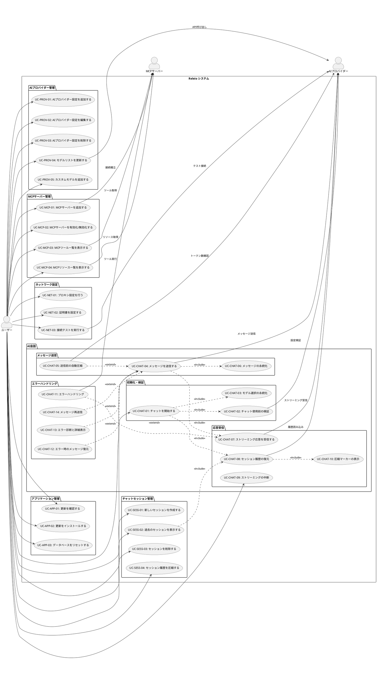

# Releio - 要件定義概要

## ドキュメント情報

- **作成日**: 2025-11-18
- **バージョン**: 1.0
- **ステータス**: 初版
- **プロジェクト**: Releio - AI統合デスクトップアプリケーション

## 1. プロジェクト概要

Releioは、複数のAIプロバイダーと統合し、Model Context Protocol (MCP)を通じて外部ツールにアクセス可能なElectronベースのデスクトップアプリケーションです。ユーザーは複数のAIモデルを切り替えながら会話を行い、ファイルシステムやAPIなどの外部リソースにアクセスできます。

### 1.1 主要機能

- **マルチAIプロバイダー対応**: OpenAI、Anthropic、Google、Azure OpenAIに対応
- **MCP統合**: 外部ツール（ファイルシステム、GitHub、データベース等）への接続
- **チャットセッション管理**: 会話の保存、再開、履歴管理
- **ネットワーク設定**: プロキシ・証明書のサポート（企業環境対応）
- **自動更新**: アプリケーションの自動更新機能
- **データベース管理**: SQLiteベースのローカルデータ管理

### 1.2 アーキテクチャ

本アプリケーションは、Electronの標準的な2プロセスモデルを拡張した**3プロセス構成**を採用しています：

- **Main Process**: アプリライフサイクル、ウィンドウ管理
- **Backend Process**: AI処理、MCP管理、データベース操作（Utility Process）
- **Renderer Process**: React UIによるユーザーインターフェース

## 2. ユースケース図

以下のPlantUMLダイアグラムは、Releioの全体的なユースケース（合計33個）を示しています。

**ユースケースの分類:**
- **主ユースケース（22個）**: ユーザーが直接実行する操作（User --> の関係）
- **内部処理（6個）**: 主ユースケースに含まれるシステム自動処理（<<include>> 関係）
- **条件付き拡張（5個）**: 特定条件下で発生する追加機能（<<extend>> 関係）

## 3. ユースケース一覧

| ID | ユースケース名 | 主要アクター | 説明 |
|----|-------------|------------|------|
| UC-PROV-01 | AIプロバイダー設定を追加する | ユーザー | 新しいAIプロバイダー（OpenAI、Anthropic等）の接続設定を追加する |
| UC-PROV-02 | AIプロバイダー設定を編集する | ユーザー | 既存のプロバイダー設定（APIキー、エンドポイント等）を変更する |
| UC-PROV-03 | AIプロバイダー設定を削除する | ユーザー | 不要になったプロバイダー設定を削除する |
| UC-PROV-04 | モデルリストを更新する | ユーザー | プロバイダーAPIから最新のモデル一覧を取得する |
| UC-PROV-05 | カスタムモデルを追加する | ユーザー | API経由で取得できないカスタムモデルを手動で追加する |
| UC-CHAT-01 | チャットを開始する | ユーザー | プロバイダーとモデルを選択してチャットセッションを開始する |
| UC-CHAT-02 | チャット使用前の検証 | <<include>> | （UC-CHAT-01に含まれる）プロバイダー設定とモデルの存在を確認し、チャット使用可能性を検証する |
| UC-CHAT-03 | モデル選択の永続化 | <<include>> | （UC-CHAT-01に含まれる）選択したモデルをlocalStorageに保存し、次回起動時に復元する |
| UC-CHAT-04 | メッセージを送信する | ユーザー | AIに対してメッセージを送信する |
| UC-CHAT-05 | 送信前の自動圧縮 | <<extend>> | （UC-CHAT-04の拡張）トークン制限時に会話履歴を自動圧縮する |
| UC-CHAT-06 | メッセージの永続化 | <<include>> | （UC-CHAT-04に含まれる）ユーザーメッセージとAI応答をデータベースに保存する |
| UC-CHAT-07 | ストリーミング応答を受信する | <<include>> | （UC-CHAT-04に含まれる）AIからのストリーミング形式の応答をリアルタイムで受信する |
| UC-CHAT-08 | セッション履歴の復元 | <<include>> | （UC-CHAT-01, UC-SESS-02に含まれる）過去のチャットセッションのメッセージ履歴を読み込み、画面に表示する |
| UC-CHAT-09 | ストリーミングの中断 | ユーザー | AI応答のストリーミング中に生成を中断する |
| UC-CHAT-10 | 圧縮マーカーの表示 | <<include>> | （UC-CHAT-08に含まれる）会話履歴が圧縮された箇所にマーカーを表示し、要約内容を確認できるようにする |
| UC-CHAT-11 | ツール呼び出しを確認する | <<extend>> | （UC-CHAT-07の拡張）AIがMCPツールを実行する際の詳細情報を表示する |
| UC-CHAT-12 | エラー時のメッセージ復元 | <<extend>> | （UC-CHAT-04の拡張）メッセージ送信が失敗した場合、失敗したメッセージを入力フィールドに自動復元する |
| UC-CHAT-13 | エラー診断と詳細表示 | <<extend>> | （UC-CHAT-04の拡張）エラーの種類を分類し、詳細情報と推奨対処法を表示する |
| UC-CHAT-14 | メッセージ再送信 | <<extend>> | （UC-CHAT-04の拡張）失敗したメッセージを編集または修正して再送信する |
| UC-SESS-01 | 新しいセッションを作成する | ユーザー | 新しいチャット会話セッションを開始する |
| UC-SESS-02 | 過去のセッションを表示する | ユーザー | 保存された過去のチャットセッションを一覧表示・選択する |
| UC-SESS-03 | セッションを削除する | ユーザー | 不要なチャットセッションを削除する |
| UC-SESS-04 | セッション履歴を圧縮する | ユーザー | 長い会話履歴をトークン制限内に収めるため圧縮する |
| UC-MCP-01 | MCPサーバーを追加する | ユーザー | 新しいMCPサーバー（ファイルシステム、GitHub等）を追加する |
| UC-MCP-02 | MCPサーバーを有効化/無効化する | ユーザー | MCPサーバーの起動状態を切り替える |
| UC-MCP-03 | MCPツール一覧を表示する | ユーザー | 接続されたMCPサーバーが提供するツール一覧を表示する |
| UC-MCP-04 | MCPリソース一覧を表示する | ユーザー | 接続されたMCPサーバーが提供するリソース一覧を表示する |
| UC-NET-01 | プロキシ設定を行う | ユーザー | 企業ネットワーク環境でのプロキシサーバー設定を行う |
| UC-NET-02 | 証明書を設定する | ユーザー | カスタムCA証明書や証明書検証設定を行う |
| UC-NET-03 | 接続テストを実行する | ユーザー | 設定したネットワーク構成でAIプロバイダーへの接続をテストする |
| UC-APP-01 | 更新を確認する | ユーザー | アプリケーションの新しいバージョンが利用可能か確認する |
| UC-APP-02 | 更新をインストールする | ユーザー | 新しいバージョンをダウンロード・インストールする |
| UC-APP-03 | データベースをリセットする | ユーザー | 開発環境でデータベースを初期状態にリセットする |

## 4. システム境界とアクター

### 4.1 主要アクター

| アクター | 説明 |
|---------|------|
| ユーザー | アプリケーションを使用してAIと対話する人（主ユースケースの実行者） |
| AIプロバイダー | OpenAI、Anthropic、Google、Azure等の外部AIサービス（API経由で連携） |
| MCPサーバー | Model Context Protocolで外部ツール・リソースを提供するサーバー（プロセス間通信で連携） |

### 4.2 システム境界

- **内部**: Releioアプリケーション（Main/Backend/Rendererプロセス）
- **外部**: AIプロバイダーAPI、MCPサーバー、OSのプロキシ・証明書設定

### 4.3 ユースケース間の関係

本ユースケース図では、以下のUML標準関係を使用してユースケースを構造化しています:

**<<include>> 関係（必須の内部処理）:**
- 主ユースケースの実行時に**必ず含まれる**システム内部処理
- 例: UC-CHAT-04（メッセージ送信）には、UC-CHAT-06（永続化）とUC-CHAT-07（ストリーミング受信）が常に含まれる

**<<extend>> 関係（条件付き拡張）:**
- 特定の条件下でのみ発生する追加機能
- 例: UC-CHAT-05（自動圧縮）は、トークン制限に達した場合のみUC-CHAT-04を拡張する

この構造化により、**ユーザーが直接操作するユースケース**と**システム内部の自動処理**が明確に区別されています。

## 5. 非機能要件の概要

### 5.1 パフォーマンス要件

- The システム shall ストリーミング応答を100ms以内にユーザーに表示を開始する
- The システム shall 複数のMCPサーバーを同時に管理し、個別サーバーの障害が全体に影響しない

### 5.2 セキュリティ要件

- The システム shall APIキーと環境変数を暗号化せずuserDataディレクトリに保存する（OSのファイルパーミッションで保護）
- The システム shall MCPサーバーはユーザーが明示的に追加したもののみ実行する

### 5.3 互換性要件

- The システム shall Windows、macOS、Linuxの各プラットフォームで動作する
- The システム shall V1設定からV2設定へ自動マイグレーションを行う

### 5.4 ユーザビリティ要件

- The システム shall 設定変更を即座にUIに反映する
- The システム shall エラー発生時に詳細なメッセージをログファイルに記録する

## 6. 詳細要件ドキュメントへの参照

個々のユースケースの詳細な要件記述（EARSフォーマット）は、以下のドキュメントを参照してください：

- [UC-PROV-01 〜 UC-PROV-05: AIプロバイダー管理要件](./REQUIREMENTS_AI_PROVIDER.md)
- [UC-CHAT-01 〜 UC-CHAT-14: AI会話要件](./REQUIREMENTS_AI_CHAT.md)
- [UC-SESS-01 〜 UC-SESS-04: チャットセッション管理要件](./REQUIREMENTS_SESSION.md)
- [UC-MCP-01 〜 UC-MCP-04: MCPサーバー管理要件](./REQUIREMENTS_MCP.md)
- [UC-NET-01 〜 UC-NET-03: ネットワーク設定要件](./REQUIREMENTS_NETWORK.md)
- [UC-APP-01 〜 UC-APP-03: アプリケーション管理要件](./REQUIREMENTS_APP_MGMT.md)

## 7. 設計文書への参照

実装設計の詳細は、`docs/`配下の以下の文書を参照してください：

- [MCP統合設計](./MCP_INTEGRATION_DESIGN.md)
- [AI設定V2設計](./AI_SETTINGS_V2_DESIGN.md)
- [チャットセッション永続化](./CHAT_SESSION_PERSISTENCE.md)
- [プロキシ・証明書設計](./PROXY_AND_CERTIFICATE_DESIGN.md)
- [自動更新](./AUTO_UPDATE.md)
- [会話履歴圧縮設計](./CONVERSATION_HISTORY_COMPRESSION_DESIGN.md)

## 8. 用語集

| 用語 | 説明 |
|------|------|
| MCP | Model Context Protocol - AIと外部データソースを接続するオープンスタンダード |
| EARS | Easy Approach to Requirements Syntax - 要件記述のための構造化フォーマット |
| Provider Config | 特定のAIプロバイダーへの接続設定（APIキー、エンドポイント等） |
| Model Selection | チャット時に選択する「プロバイダー設定 + モデルID」の組み合わせ |
| Streaming | AIの応答を完全に生成する前に、生成中のテキストをリアルタイムで受信する方式 |
| Tool Call | AIがMCPツールを実行すること（ファイル読み取り、API呼び出し等） |
| Session | 一連のチャットメッセージと応答のまとまり |
| Utility Process | Electronのバックエンド処理専用プロセス（Main Processのブロッキングを回避） |

---

**次のステップ**: 各機能領域の詳細要件ドキュメントを参照し、EARSフォーマットで記述された具体的な受け入れ基準を確認してください。
