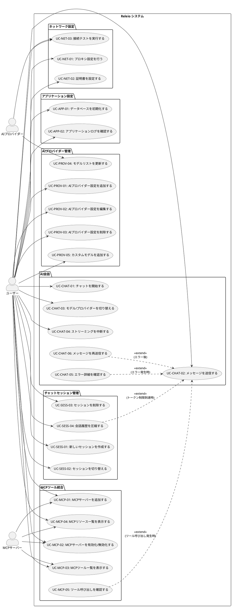

# Releio - 要件定義概要

## ドキュメント情報

- **作成日**: 2025-11-18
- **バージョン**: 2.0
- **ステータス**: ユーザーゴール単位での再設計版
- **プロジェクト**: Releio - AI統合デスクトップアプリケーション

## 1. プロジェクト概要

Releioは、複数のAIプロバイダーと統合し、Model Context Protocol (MCP)を通じて外部ツールにアクセス可能なElectronベースのデスクトップアプリケーションです。ユーザーは複数のAIモデルを切り替えながら会話を行い、ファイルシステムやAPIなどの外部リソースにアクセスできます。

### 1.1 主要機能

- **マルチAIプロバイダー対応**: OpenAI、Anthropic、Google、Azure OpenAIに対応
- **MCP統合**: 外部ツール（ファイルシステム、GitHub、データベース等）への接続
- **チャットセッション管理**: 会話の保存、再開、履歴管理
- **ネットワーク設定**: プロキシ・証明書のサポート（企業環境対応）
- **自動更新**: アプリケーションの自動更新機能
- **データベース管理**: SQLiteベースのローカルデータ管理

### 1.2 アーキテクチャ

本アプリケーションは、Electronの標準的な2プロセスモデルを拡張した**3プロセス構成**を採用しています：

- **Main Process**: アプリライフサイクル、ウィンドウ管理
- **Backend Process**: AI処理、MCP管理、データベース操作（Utility Process）
- **Renderer Process**: React UIによるユーザーインターフェース

## 2. ユースケース図

以下のPlantUMLダイアグラムは、Releioの全体的なユースケース（合計25個）を示しています。

**ユースケースの分類:**
- **主ユースケース（21個）**: ユーザーが直接実行する操作（ユーザー ⇒ ユースケースの関連）
- **条件付き拡張（4個）**: 特定条件下で発生する追加機能（<<extend>> 関係）

**設計方針:**
本図は、ユーザーの業務目的とゴールに焦点を当て、内部処理の詳細は個別ユースケースの要件記述に委ねています。これにより、ユーザーが「何をしたいか」が明確になり、システムの差別化機能（MCPツール統合、モデル切り替え等）が可視化されています。

## 3. ユースケース一覧

### 3.1 主ユースケース（21個）

ユーザーが直接実行する操作です。

| ID | ユースケース名 | 主要アクター | 説明 |
|----|-------------|------------|------|
| **AIプロバイダー管理** | | | |
| UC-PROV-01 | AIプロバイダー設定を追加する | ユーザー | 新しいAIプロバイダー（OpenAI、Anthropic等）の接続設定を追加する |
| UC-PROV-02 | AIプロバイダー設定を編集する | ユーザー | 既存のプロバイダー設定（APIキー、エンドポイント等）を変更する |
| UC-PROV-03 | AIプロバイダー設定を削除する | ユーザー | 不要になったプロバイダー設定を削除する |
| UC-PROV-04 | モデルリストを更新する | AIプロバイダー | プロバイダーAPIから最新のモデル一覧を取得する（自動実行） |
| UC-PROV-05 | カスタムモデルを追加する | ユーザー | API経由で取得できないカスタムモデルを手動で追加する |
| **AI会話** | | | |
| UC-CHAT-01 | チャットを開始する | ユーザー | プロバイダーとモデルを選択してチャットセッションを開始する |
| UC-CHAT-02 | メッセージを送信する | ユーザー | AIに対してメッセージを送信し、ストリーミング応答を受信する |
| UC-CHAT-03 | モデル/プロバイダーを切り替える | ユーザー | 会話中に使用するAIモデルやプロバイダーを変更する |
| UC-CHAT-04 | ストリーミングを中断する | ユーザー | AI応答のストリーミング中に生成を中断する |
| **チャットセッション管理** | | | |
| UC-SESS-01 | 新しいセッションを作成する | ユーザー | 新しいチャット会話セッションを開始する |
| UC-SESS-02 | セッションを切り替える | ユーザー | 保存された過去のチャットセッションを選択して表示する |
| UC-SESS-03 | セッションを削除する | ユーザー | 不要なチャットセッションを削除する |
| UC-SESS-04 | 会話履歴を圧縮する | ユーザー | 長い会話履歴をトークン制限内に収めるため圧縮する（手動/自動） |
| **MCPツール統合** | | | |
| UC-MCP-01 | MCPサーバーを追加する | ユーザー | 新しいMCPサーバー（ファイルシステム、GitHub等）を追加する |
| UC-MCP-02 | MCPサーバーを有効化/無効化する | ユーザー | MCPサーバーの起動状態を切り替える |
| UC-MCP-03 | MCPツール一覧を表示する | ユーザー | 接続されたMCPサーバーが提供するツール一覧を表示する |
| UC-MCP-04 | MCPリソース一覧を表示する | ユーザー | 接続されたMCPサーバーが提供するリソース一覧を表示する |
| **ネットワーク設定** | | | |
| UC-NET-01 | プロキシ設定を行う | ユーザー | 企業ネットワーク環境でのプロキシサーバー設定を行う |
| UC-NET-02 | 証明書を設定する | ユーザー | カスタムCA証明書や証明書検証設定を行う |
| UC-NET-03 | 接続テストを実行する | AIプロバイダー | 設定したネットワーク構成でAIプロバイダーへの接続をテストする |
| **アプリケーション設定** | | | |
| UC-APP-01 | データベースを初期化する | ユーザー | 開発環境でデータベースを初期状態にリセットする |
| UC-APP-02 | アプリケーションログを確認する | ユーザー | システムログファイルを表示・確認する |

### 3.2 条件付き拡張（4個）

特定条件下でのみ発生する追加機能です。

| ID | ユースケース名 | 拡張元 | 発生条件 | 説明 |
|----|-------------|--------|---------|------|
| UC-SESS-04 | 会話履歴を圧縮する | UC-CHAT-02 | トークン制限到達時 | メッセージ送信時にトークン数が閾値を超えた場合、自動的に会話履歴を圧縮する |
| UC-MCP-05 | ツール呼び出しを確認する | UC-CHAT-02 | ツール呼び出し発生時 | AI応答にMCPツール実行が含まれる場合、詳細情報を展開表示する |
| UC-CHAT-05 | エラー詳細を確認する | UC-CHAT-02 | エラー発生時 | メッセージ送信が失敗した場合、エラーの種類を分類し、詳細情報と推奨対処法を表示する |
| UC-CHAT-06 | メッセージを再送信する | UC-CHAT-02 | エラー後 | 失敗したメッセージを編集または修正して再送信する |

## 4. システム境界とアクター

### 4.1 主要アクター

| アクター | 説明 |
|---------|------|
| ユーザー | アプリケーションを使用してAIと対話する人（主ユースケースの実行者） |
| AIプロバイダー | OpenAI、Anthropic、Google、Azure等の外部AIサービス（API経由で連携） |
| MCPサーバー | Model Context Protocolで外部ツール・リソースを提供するサーバー（プロセス間通信で連携） |

### 4.2 システム境界

- **内部**: Releioアプリケーション（Main/Backend/Rendererプロセス）
- **外部**: AIプロバイダーAPI、MCPサーバー、OSのプロキシ・証明書設定

### 4.3 ユースケース間の関係

本ユースケース図では、UML標準の **<<extend>> 関係**を使用して条件付き拡張を表現しています。

**<<extend>> 関係（条件付き拡張）:**
- 特定の条件下でのみ発生する追加機能を表します
- 拡張ユースケースが基本ユースケースに対して「拡張する」関係です
- 例:
  - **UC-SESS-04（会話履歴を圧縮する）** extends **UC-CHAT-02（メッセージを送信する）**
    - 発生条件: トークン数が閾値を超過し、かつ自動圧縮設定が有効な場合
  - **UC-MCP-05（ツール呼び出しを確認する）** extends **UC-CHAT-02（メッセージを送信する）**
    - 発生条件: AI応答にMCPツール実行が含まれる場合
  - **UC-CHAT-05（エラー詳細を確認する）** extends **UC-CHAT-02（メッセージを送信する）**
    - 発生条件: メッセージ送信時にエラーが発生した場合
  - **UC-CHAT-06（メッセージを再送信する）** extends **UC-CHAT-02（メッセージを送信する）**
    - 発生条件: エラー発生後にユーザーが再送信を選択した場合

**内部処理の扱い:**
システム内部の必須処理（検証、永続化、ストリーミング受信等）はユースケース図から除外し、個別ユースケースの要件記述（基本フロー、事前条件、事後条件）に統合しています。これにより、ユースケース図はユーザーのゴールに焦点を当て、図の複雑さを軽減しています。

## 5. 非機能要件の概要

### 5.1 パフォーマンス要件

- The システム shall ストリーミング応答を100ms以内にユーザーに表示を開始する
- The システム shall 複数のMCPサーバーを同時に管理し、個別サーバーの障害が全体に影響しない

### 5.2 セキュリティ要件

- The システム shall APIキーと環境変数を暗号化せずuserDataディレクトリに保存する（OSのファイルパーミッションで保護）
- The システム shall MCPサーバーはユーザーが明示的に追加したもののみ実行する

### 5.3 互換性要件

- The システム shall Windows、macOS、Linuxの各プラットフォームで動作する
- The システム shall V1設定からV2設定へ自動マイグレーションを行う

### 5.4 ユーザビリティ要件

- The システム shall 設定変更を即座にUIに反映する
- The システム shall エラー発生時に詳細なメッセージをログファイルに記録する

## 6. 詳細要件ドキュメントへの参照

個々のユースケースの詳細な要件記述（EARSフォーマット）は、以下のドキュメントを参照してください：

- [UC-PROV-01 〜 UC-PROV-05: AIプロバイダー管理要件](./REQUIREMENTS_AI_PROVIDER.md)
- [UC-CHAT-01 〜 UC-CHAT-06: AI会話要件](./REQUIREMENTS_AI_CHAT.md)
- [UC-SESS-01 〜 UC-SESS-04: チャットセッション管理要件](./REQUIREMENTS_SESSION.md)
- [UC-MCP-01 〜 UC-MCP-05: MCPサーバー管理要件](./REQUIREMENTS_MCP.md)
- [UC-NET-01 〜 UC-NET-03: ネットワーク設定要件](./REQUIREMENTS_NETWORK.md)
- [UC-APP-01 〜 UC-APP-02: アプリケーション設定要件](./REQUIREMENTS_APP_MGMT.md)

## 7. 設計文書への参照

実装設計の詳細は、`docs/`配下の以下の文書を参照してください：

- [MCP統合設計](./MCP_INTEGRATION_DESIGN.md)
- [AI設定V2設計](./AI_SETTINGS_V2_DESIGN.md)
- [チャットセッション永続化](./CHAT_SESSION_PERSISTENCE.md)
- [プロキシ・証明書設計](./PROXY_AND_CERTIFICATE_DESIGN.md)
- [自動更新](./AUTO_UPDATE.md)
- [会話履歴圧縮設計](./CONVERSATION_HISTORY_COMPRESSION_DESIGN.md)

## 8. 用語集

| 用語 | 説明 |
|------|------|
| MCP | Model Context Protocol - AIと外部データソースを接続するオープンスタンダード |
| EARS | Easy Approach to Requirements Syntax - 要件記述のための構造化フォーマット |
| Provider Config | 特定のAIプロバイダーへの接続設定（APIキー、エンドポイント等） |
| Model Selection | チャット時に選択する「プロバイダー設定 + モデルID」の組み合わせ |
| Streaming | AIの応答を完全に生成する前に、生成中のテキストをリアルタイムで受信する方式 |
| Tool Call | AIがMCPツールを実行すること（ファイル読み取り、API呼び出し等） |
| Session | 一連のチャットメッセージと応答のまとまり |
| Utility Process | Electronのバックエンド処理専用プロセス（Main Processのブロッキングを回避） |

---

**次のステップ**: 各機能領域の詳細要件ドキュメントを参照し、EARSフォーマットで記述された具体的な受け入れ基準を確認してください。
