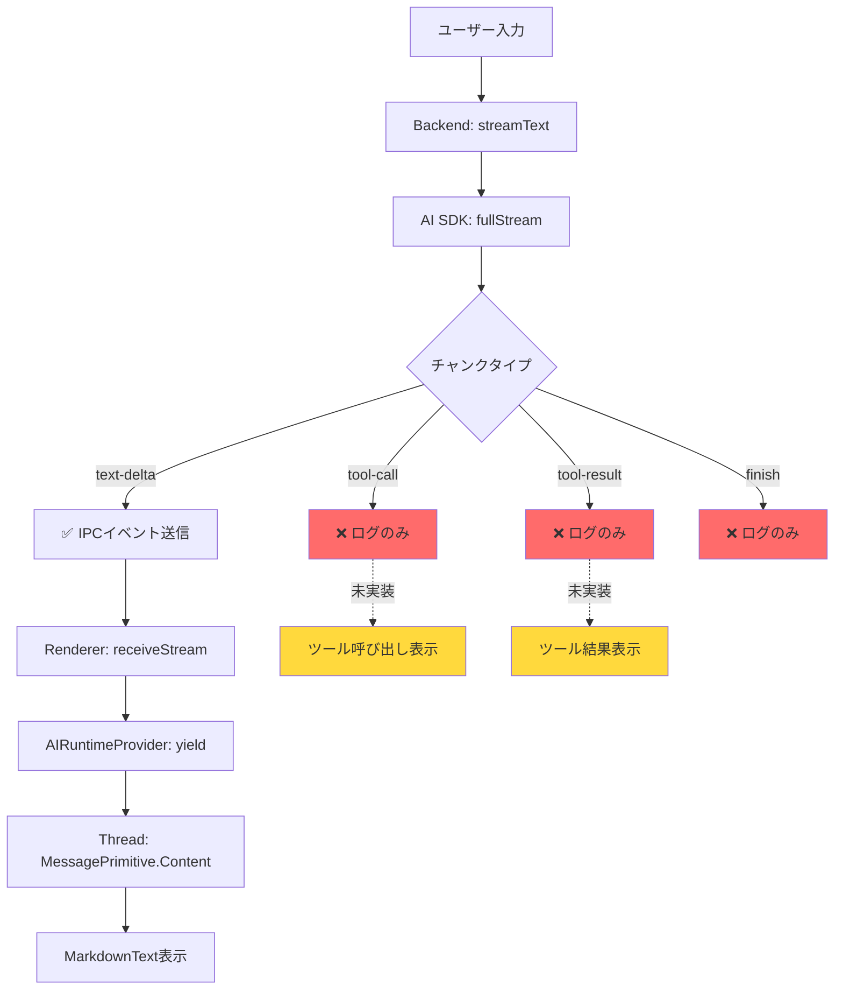
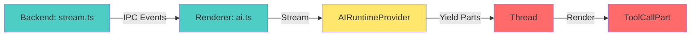
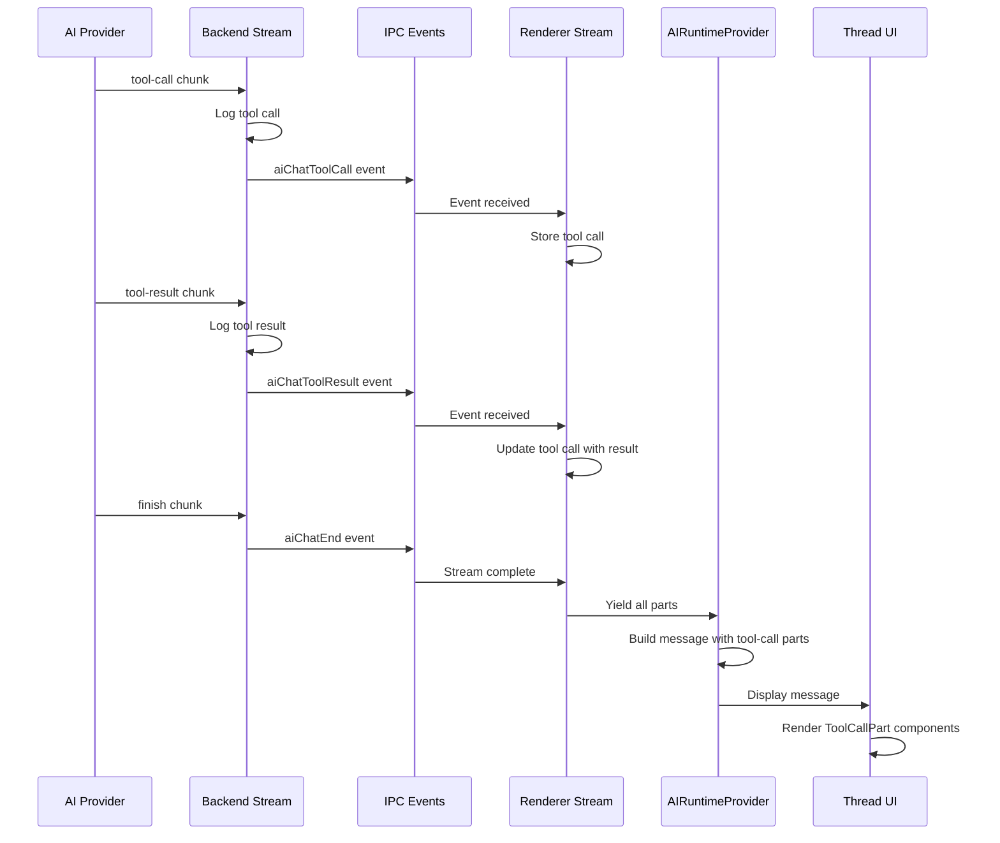

# ツール実行履歴の表示実装ガイド

**日付:** 2025年11月11日
**ステータス:** 実装計画策定完了
**関連Issue:** [#8 - ツール実行履歴をメッセージ履歴としても表示する](https://github.com/mosaan/electron-ai-starter/issues/8)

## エグゼクティブサマリー

本ドキュメントは、MCP（Model Context Protocol）ツールの実行履歴をUI上に表示するための実装ガイドです。現在、バックエンドでツール実行は正常に機能していますが、ユーザーには「見えない」状態です。本ドキュメントでは、assistant-uiの機能を活用してツール呼び出しと結果をメッセージ履歴として表示する実装方針を示します。

**現状:** ❌ ツール実行は機能しているがUI表示なし
**目標:** ✅ ツール呼び出しと結果をチャットUIに表示

---

## 目次

- [1. 現状分析](#1-現状分析)
- [2. assistant-uiのツール表示機能](#2-assistant-uiのツール表示機能)
- [3. 実装アーキテクチャ](#3-実装アーキテクチャ)
- [4. 実装手順](#4-実装手順)
- [5. コード例](#5-コード例)
- [6. テスト方法](#6-テスト方法)
- [7. 参考資料](#7-参考資料)

---

## 1. 現状分析

### 1.1 現在の実装状況

**✅ 動作している部分:**

1. **MCPサーバー管理** ([src/backend/mcp/manager.ts](../src/backend/mcp/manager.ts))
   - MCPサーバーのライフサイクル管理
   - `getAllTools()` でツール一覧を取得
   - AI SDK形式の `Record<string, Tool>` を返却

2. **ツール実行** ([src/backend/ai/stream.ts](../src/backend/ai/stream.ts))
   - `streamText()` にMCPツールを渡して実行
   - `fullStream` でツール呼び出しとツール結果のチャンクを処理
   - ログ出力は完備（`tmp/logs/app.log` に記録）

3. **ログ記録**
   ```typescript
   // 76-90行目: ツール呼び出しとツール結果のログ
   case 'tool-call':
     logger.info(`[MCP] Tool called: ${chunk.toolName}`, {
       toolCallId: chunk.toolCallId,
       input: chunk.input
     })
     break

   case 'tool-result':
     logger.info(`[MCP] Tool result received: ${chunk.toolName}`, {
       toolCallId: chunk.toolCallId,
       output: chunk.output
     })
     break
   ```

**❌ 欠けている部分:**

1. **IPCイベントの送信** ([src/backend/ai/stream.ts](../src/backend/ai/stream.ts):68-104)
   - 現在は `text-delta` のみレンダラーに送信
   - `tool-call` と `tool-result` はログのみで送信されない

2. **レンダラーでのイベント処理** ([src/renderer/src/lib/ai.ts](../src/renderer/src/lib/ai.ts):48-78)
   - `aiChatChunk` イベントのみ処理
   - ツール関連のイベントハンドラーが存在しない

3. **メッセージパートの生成** ([src/renderer/src/components/AIRuntimeProvider.tsx](../src/renderer/src/components/AIRuntimeProvider.tsx):22-26)
   - テキストのみを `yield`
   - `tool-call` 型のメッセージパートを含めていない

4. **UIコンポーネント** ([src/renderer/src/components/assistant-ui/thread.tsx](../src/renderer/src/components/assistant-ui/thread.tsx):208)
   - `MessagePrimitive.Content` に `Text` のみ指定
   - `ToolCall` コンポーネントが未定義

### 1.2 メッセージフロー図



---

## 2. assistant-uiのツール表示機能

### 2.1 ツールメッセージパート型定義

assistant-ui (v0.10.25) は `ToolCallMessagePart` 型を完全にサポートしています。

**型定義:** `node_modules/@assistant-ui/react/dist/types/MessagePartTypes.d.ts`

```typescript
type ToolCallMessagePart<TArgs = ReadonlyJSONObject, TResult = unknown> = {
  readonly type: "tool-call";
  readonly toolCallId: string;
  readonly toolName: string;
  readonly args: TArgs;
  readonly result?: TResult | undefined;
  readonly isError?: boolean | undefined;
  readonly argsText: string;
  readonly artifact?: unknown;
  readonly parentId?: string;
};
```

### 2.2 MessagePrimitive.Contentのcomponentsプロパティ

`MessagePrimitive.Content` は `components` プロパティを受け取り、メッセージパートタイプごとにカスタムレンダラーを指定できます。

**現在の実装:**
```typescript
<MessagePrimitive.Content components={{ Text: MarkdownText }} />
```

**必要な拡張:**
```typescript
<MessagePrimitive.Content
  components={{
    Text: MarkdownText,
    ToolCall: ToolCallPart  // ← 追加
  }}
/>
```

### 2.3 assistant-uiのツール表示機能

assistant-uiは以下のツール関連機能を提供：

1. **自動ツール呼び出し表示**
   - `tool-call` 型のメッセージパートを自動的に検出
   - カスタムコンポーネントでレンダリング

2. **ツール実行状態の追跡**
   - 実行中、完了、エラー状態を管理
   - `result` プロパティで結果を表示

3. **Human-in-the-loopサポート**
   - ツール実行前にユーザー承認を求めることが可能
   - 本実装では後回し（Phase 2以降）

### 2.4 推奨UIパターン

assistant-uiのベストプラクティスに基づく推奨UIデザイン：

```
┌─────────────────────────────────────────┐
│ 🔧 ツール呼び出し: read_file           │
│ ───────────────────────────────────────│
│ 引数:                                   │
│ {                                       │
│   "path": "/workspace/src/main.ts"     │
│ }                                       │
│                                         │
│ 結果:                                   │
│ ✅ 成功 (245 lines)                     │
│ [折りたたみ可能な詳細表示]             │
└─────────────────────────────────────────┘
```

---

## 3. 実装アーキテクチャ

### 3.1 コンポーネント間の依存関係



**変更が必要なファイル:**

1. **Backend**
   - [src/backend/ai/stream.ts](../src/backend/ai/stream.ts) - IPCイベント追加

2. **Common**
   - [src/common/types.ts](../src/common/types.ts) - イベント型定義追加

3. **Renderer**
   - [src/renderer/src/lib/ai.ts](../src/renderer/src/lib/ai.ts) - イベントハンドラー追加
   - [src/renderer/src/components/AIRuntimeProvider.tsx](../src/renderer/src/components/AIRuntimeProvider.tsx) - ツールパート生成
   - [src/renderer/src/components/assistant-ui/thread.tsx](../src/renderer/src/components/assistant-ui/thread.tsx) - ToolCallPartコンポーネント追加
   - [src/renderer/src/components/assistant-ui/tool-call-part.tsx](../src/renderer/src/components/assistant-ui/tool-call-part.tsx) - 新規作成

### 3.2 データフロー



---

## 4. 実装手順

### Phase 1: バックエンドイベント送信

**目標:** ツール呼び出しと結果をIPCイベントとして送信

**ファイル:** [src/backend/ai/stream.ts](../src/backend/ai/stream.ts)

**変更箇所:** 68-104行目（`fullStream` の `for await` ループ）

**タスク:**
1. `tool-call` ケースに `publishEvent` 追加
2. `tool-result` ケースに `publishEvent` 追加
3. 新しいイベント型を定義: `aiChatToolCall`, `aiChatToolResult`

**推定作業量:** 20行のコード追加

---

### Phase 2: 共通型定義

**目標:** ツールイベントの型を定義

**ファイル:** [src/common/types.ts](../src/common/types.ts)

**タスク:**
1. `ToolCallEventPayload` 型を追加
2. `ToolResultEventPayload` 型を追加
3. `AppEvent` のペイロード型に追加

**推定作業量:** 15行のコード追加

---

### Phase 3: レンダラーイベント処理

**目標:** ツールイベントを受信して保存

**ファイル:** [src/renderer/src/lib/ai.ts](../src/renderer/src/lib/ai.ts)

**タスク:**
1. `ToolCallInfo` 型を定義
2. `toolCalls` Map を追加してツール情報を保存
3. `handleToolCall` 関数を実装
4. `handleToolResult` 関数を実装
5. イベントリスナーを登録

**推定作業量:** 40行のコード追加

---

### Phase 4: メッセージパート生成

**目標:** ツール呼び出しをメッセージパートとして含める

**ファイル:** [src/renderer/src/components/AIRuntimeProvider.tsx](../src/renderer/src/components/AIRuntimeProvider.tsx)

**タスク:**
1. `receiveStream` からツール情報を取得
2. ストリーミング終了時に `tool-call` パートを生成
3. `yield` に `tool-call` パートを含める

**推定作業量:** 30行のコード追加

---

### Phase 5: UIコンポーネント作成

**目標:** ツール呼び出しを視覚的に表示

**ファイル:**
- [src/renderer/src/components/assistant-ui/tool-call-part.tsx](../src/renderer/src/components/assistant-ui/tool-call-part.tsx)（新規）
- [src/renderer/src/components/assistant-ui/thread.tsx](../src/renderer/src/components/assistant-ui/thread.tsx)

**タスク:**
1. `ToolCallPart` コンポーネントを作成
2. ツール名、引数、結果を表示
3. 折りたたみ可能なUI実装
4. エラー状態の表示
5. `thread.tsx` で `ToolCall` コンポーネントを登録

**推定作業量:** 80行のコード追加

---

### 実装優先度

| Phase | 優先度 | 工数 | 依存関係 |
|-------|-------|------|----------|
| Phase 1 | 🔴 最高 | 20行 | なし |
| Phase 2 | 🔴 最高 | 15行 | なし |
| Phase 3 | 🟡 高 | 40行 | Phase 1, 2 |
| Phase 4 | 🟡 高 | 30行 | Phase 3 |
| Phase 5 | 🟢 中 | 80行 | Phase 4 |

**合計推定工数:** 約185行のコード追加

---

## 5. コード例

### 5.1 Backend: IPCイベント送信

**ファイル:** `src/backend/ai/stream.ts`

```typescript
// 76-90行目を以下のように変更

case 'tool-call':
  logger.info(`[MCP] Tool called: ${chunk.toolName}`, {
    toolCallId: chunk.toolCallId,
    input: chunk.input
  })

  // 🆕 IPCイベントを送信
  publishEvent('aiChatToolCall', {
    type: EventType.Message,
    payload: {
      sessionId: session.id,
      toolCallId: chunk.toolCallId,
      toolName: chunk.toolName,
      args: chunk.input,
      argsText: JSON.stringify(chunk.input, null, 2)
    }
  })
  break

case 'tool-result':
  logger.info(`[MCP] Tool result received: ${chunk.toolName}`, {
    toolCallId: chunk.toolCallId,
    output: chunk.output
  })

  // 🆕 IPCイベントを送信
  publishEvent('aiChatToolResult', {
    type: EventType.Message,
    payload: {
      sessionId: session.id,
      toolCallId: chunk.toolCallId,
      toolName: chunk.toolName,
      result: chunk.output,
      isError: chunk.isError || false
    }
  })
  break
```

---

### 5.2 Common: 型定義

**ファイル:** `src/common/types.ts`

```typescript
// ツール呼び出しイベントのペイロード
export interface ToolCallEventPayload {
  sessionId: string
  toolCallId: string
  toolName: string
  args: unknown
  argsText: string
}

// ツール結果イベントのペイロード
export interface ToolResultEventPayload {
  sessionId: string
  toolCallId: string
  toolName: string
  result: unknown
  isError: boolean
}

// AppEventのペイロード型を拡張
export type AppEventPayload =
  | { ... } // 既存の型
  | ToolCallEventPayload
  | ToolResultEventPayload
```

---

### 5.3 Renderer: イベント処理

**ファイル:** `src/renderer/src/lib/ai.ts`

```typescript
// ツール呼び出し情報の型
interface ToolCallInfo {
  toolCallId: string
  toolName: string
  args: unknown
  argsText: string
  result?: unknown
  isError?: boolean
}

// セッションごとのツール呼び出しを保存
const sessionToolCalls = new Map<string, Map<string, ToolCallInfo>>()

// ツール呼び出しイベントハンドラー
const handleToolCall = (appEvent: AppEvent): void => {
  const payload = appEvent.payload as ToolCallEventPayload
  const { sessionId, toolCallId, toolName, args, argsText } = payload

  // セッション用のMapを取得または作成
  if (!sessionToolCalls.has(sessionId)) {
    sessionToolCalls.set(sessionId, new Map())
  }

  const toolCalls = sessionToolCalls.get(sessionId)!
  toolCalls.set(toolCallId, {
    toolCallId,
    toolName,
    args,
    argsText
  })

  logger.info(`[Renderer] Tool call stored: ${toolName}`, { toolCallId })
}

// ツール結果イベントハンドラー
const handleToolResult = (appEvent: AppEvent): void => {
  const payload = appEvent.payload as ToolResultEventPayload
  const { sessionId, toolCallId, result, isError } = payload

  const toolCalls = sessionToolCalls.get(sessionId)
  if (!toolCalls) return

  const toolCall = toolCalls.get(toolCallId)
  if (!toolCall) return

  // 結果を追加
  toolCall.result = result
  toolCall.isError = isError

  logger.info(`[Renderer] Tool result stored: ${toolCall.toolName}`, {
    toolCallId,
    isError
  })
}

// イベントリスナー登録
window.backend.onEvent('aiChatToolCall', handleToolCall)
window.backend.onEvent('aiChatToolResult', handleToolResult)

// 🆕 receiveStream を拡張してツール情報を返す
export const receiveStream = async function* (
  sessionId: string
): AsyncGenerator<string, { toolCalls: ToolCallInfo[] }, unknown> {
  // ... 既存のストリーミング処理 ...

  // ストリーミング終了時にツール情報を返す
  const toolCalls = sessionToolCalls.get(sessionId)
  const toolCallsArray = toolCalls ? Array.from(toolCalls.values()) : []

  // クリーンアップ
  sessionToolCalls.delete(sessionId)

  return { toolCalls: toolCallsArray }
}
```

---

### 5.4 AIRuntimeProvider: メッセージパート生成

**ファイル:** `src/renderer/src/components/AIRuntimeProvider.tsx`

```typescript
// 22-30行目を以下のように変更

const contentChunks: string[] = []
const toolCallParts: ToolCallMessagePart[] = []

for await (const chunk of stream) {
  if (abortSignal?.aborted) return
  contentChunks.push(chunk)

  // テキストコンテンツを yield
  yield {
    content: [
      { type: 'text', text: contentChunks.join('') }
    ]
  }
}

// ストリーミング終了後、ツール呼び出し情報を取得
const result = await stream.return?.({ toolCalls: [] })
const { toolCalls = [] } = result?.value || {}

// ツール呼び出しパートを生成
const toolParts: ToolCallMessagePart[] = toolCalls.map(tc => ({
  type: 'tool-call' as const,
  toolCallId: tc.toolCallId,
  toolName: tc.toolName,
  args: tc.args,
  argsText: tc.argsText,
  result: tc.result,
  isError: tc.isError
}))

// 最終的なメッセージを yield（テキスト + ツール呼び出し）
if (toolParts.length > 0) {
  yield {
    content: [
      { type: 'text', text: contentChunks.join('') },
      ...toolParts
    ]
  }
}
```

---

### 5.5 Thread: ToolCallコンポーネント登録

**ファイル:** `src/renderer/src/components/assistant-ui/thread.tsx`

```typescript
import { ToolCallPart } from './tool-call-part'

const AssistantMessage: FC = () => {
  return (
    <MessagePrimitive.Root className="grid grid-cols-[auto_auto_1fr] grid-rows-[auto_1fr] relative w-full max-w-[var(--thread-max-width)] py-4">
      <div className="text-foreground max-w-[calc(var(--thread-max-width)*0.8)] break-words leading-7 col-span-2 col-start-2 row-start-1 my-1.5">
        <MessagePrimitive.Content
          components={{
            Text: MarkdownText,
            ToolCall: ToolCallPart  // 🆕 追加
          }}
        />
        <MessageError />
      </div>

      <AssistantActionBar />

      <BranchPicker className="col-start-2 row-start-2 -ml-2 mr-2" />
    </MessagePrimitive.Root>
  );
};
```

---

### 5.6 ToolCallPart: UIコンポーネント

**ファイル:** `src/renderer/src/components/assistant-ui/tool-call-part.tsx`（新規作成）

```typescript
import type { FC } from 'react'
import { useState } from 'react'
import { cn } from '@renderer/lib/utils'
import { ChevronDownIcon, ChevronRightIcon, WrenchIcon, CheckCircleIcon, XCircleIcon } from 'lucide-react'

interface ToolCallPartProps {
  part: {
    type: 'tool-call'
    toolCallId: string
    toolName: string
    args: unknown
    argsText: string
    result?: unknown
    isError?: boolean
  }
}

export const ToolCallPart: FC<ToolCallPartProps> = ({ part }) => {
  const [isExpanded, setIsExpanded] = useState(false)

  const hasResult = part.result !== undefined
  const isSuccess = hasResult && !part.isError
  const isError = hasResult && part.isError

  return (
    <div className={cn(
      "my-2 rounded-lg border p-3",
      isError ? "border-destructive bg-destructive/10" : "border-border bg-muted/50"
    )}>
      {/* ヘッダー */}
      <div
        className="flex items-center gap-2 cursor-pointer"
        onClick={() => setIsExpanded(!isExpanded)}
      >
        <WrenchIcon className="h-4 w-4 text-muted-foreground" />
        <span className="font-medium text-sm">
          ツール呼び出し: {part.toolName}
        </span>

        {/* ステータスインジケーター */}
        {isSuccess && (
          <CheckCircleIcon className="h-4 w-4 text-green-600 ml-auto" />
        )}
        {isError && (
          <XCircleIcon className="h-4 w-4 text-destructive ml-auto" />
        )}
        {!hasResult && (
          <span className="text-xs text-muted-foreground ml-auto">実行中...</span>
        )}

        {/* 展開アイコン */}
        {isExpanded ? (
          <ChevronDownIcon className="h-4 w-4 text-muted-foreground" />
        ) : (
          <ChevronRightIcon className="h-4 w-4 text-muted-foreground" />
        )}
      </div>

      {/* 詳細（展開時） */}
      {isExpanded && (
        <div className="mt-3 space-y-2">
          {/* 引数 */}
          <div>
            <div className="text-xs font-semibold text-muted-foreground mb-1">
              引数:
            </div>
            <pre className="text-xs bg-background rounded p-2 overflow-x-auto">
              {part.argsText}
            </pre>
          </div>

          {/* 結果 */}
          {hasResult && (
            <div>
              <div className="text-xs font-semibold text-muted-foreground mb-1">
                {isError ? 'エラー:' : '結果:'}
              </div>
              <pre className={cn(
                "text-xs rounded p-2 overflow-x-auto",
                isError ? "bg-destructive/20" : "bg-background"
              )}>
                {typeof part.result === 'string'
                  ? part.result
                  : JSON.stringify(part.result, null, 2)}
              </pre>
            </div>
          )}
        </div>
      )}
    </div>
  )
}
```

---

## 6. テスト方法

### 6.1 開発環境での確認

**ステップ1: ログ監視**
```bash
# 別ターミナルでログを監視
tail -f ./tmp/logs/app.log | grep -E "\[MCP\]|\[TOOLS\]"
```

**ステップ2: アプリケーション起動**
```bash
pnpm run dev
```

**ステップ3: MCPサーバー有効化**
1. Settings画面でMCPサーバーを追加
2. `@modelcontextprotocol/server-filesystem` を推奨（ファイル操作ツール）
3. サーバーを有効化

**ステップ4: ツール実行テスト**
```
ユーザー: "現在のディレクトリにあるファイル一覧を表示してください"

期待される動作:
1. AIがlist_directoryツールを呼び出し
2. チャットUIにツール呼び出しカードが表示される
3. ツール名、引数、結果が表示される
```

### 6.2 確認ポイント

**✅ バックエンド:**
- [ ] `app.log` に `[MCP] Tool called` が記録される
- [ ] `app.log` に `[MCP] Tool result received` が記録される
- [ ] エラーが発生していない

**✅ レンダラー:**
- [ ] ブラウザコンソールに `[Renderer] Tool call stored` が表示される
- [ ] ブラウザコンソールに `[Renderer] Tool result stored` が表示される
- [ ] エラーが発生していない

**✅ UI:**
- [ ] チャットメッセージ内にツール呼び出しカードが表示される
- [ ] ツール名が正しく表示される
- [ ] 引数がJSON形式で表示される
- [ ] 結果が表示される
- [ ] 展開/折りたたみが動作する
- [ ] エラー時に赤色で表示される

### 6.3 テストシナリオ

**シナリオ1: ファイル読み取り**
```
プロンプト: "package.jsonファイルの内容を読んで、依存関係を教えてください"

期待:
- read_file ツールが呼び出される
- ファイルパス引数が表示される
- ファイル内容が結果として表示される
```

**シナリオ2: 複数ツール呼び出し**
```
プロンプト: "srcディレクトリのファイル一覧を取得して、main.tsファイルを読んでください"

期待:
- list_directory と read_file が順次呼び出される
- 各ツール呼び出しが個別のカードで表示される
- 時系列順に並ぶ
```

**シナリオ3: エラー処理**
```
プロンプト: "存在しないファイル missing.txt を読んでください"

期待:
- read_file ツールが呼び出される
- エラー結果が赤色で表示される
- エラーメッセージが読める
```

---

## 7. 参考資料

### 7.1 関連ドキュメント

- [MCP統合設計](./MCP_INTEGRATION_DESIGN.md) - MCPサーバー統合の全体設計
- [UIコンポーネント比較](./UI_COMPONENTS_COMPARISON.md) - assistant-uiの選定理由
- [FOR_DEVELOPERS.md](./FOR_DEVELOPERS.md) - 開発者向けガイド

### 7.2 外部リソース

**assistant-ui:**
- 公式ドキュメント: https://www.assistant-ui.com
- GitHub: https://github.com/assistant-ui/assistant-ui
- ツール呼び出し例: https://www.assistant-ui.com/docs/tools

**Vercel AI SDK:**
- ツール呼び出しガイド: https://sdk.vercel.ai/docs/ai-sdk-core/tools-and-tool-calling
- fullStream API: https://sdk.vercel.ai/docs/reference/ai-sdk-core/stream-text#full-stream

**MCP (Model Context Protocol):**
- 公式仕様: https://modelcontextprotocol.io
- AI SDK MCP統合: https://sdk.vercel.ai/docs/ai-sdk-core/model-context-protocol

### 7.3 プロジェクト内コード参照

**主要ファイル:**
- Backend streaming: [src/backend/ai/stream.ts](../src/backend/ai/stream.ts)
- MCP manager: [src/backend/mcp/manager.ts](../src/backend/mcp/manager.ts)
- Renderer streaming: [src/renderer/src/lib/ai.ts](../src/renderer/src/lib/ai.ts)
- AI runtime: [src/renderer/src/components/AIRuntimeProvider.tsx](../src/renderer/src/components/AIRuntimeProvider.tsx)
- Thread UI: [src/renderer/src/components/assistant-ui/thread.tsx](../src/renderer/src/components/assistant-ui/thread.tsx)

---

## まとめ

### 現状

- ✅ MCPツール実行は動作している
- ✅ バックエンドでログ記録されている
- ❌ UI上でツール呼び出しが見えない

### 実装後

- ✅ ツール呼び出しがチャットUIに表示される
- ✅ ツール名、引数、結果が視覚化される
- ✅ 折りたたみ可能な詳細表示
- ✅ エラー状態の視覚的フィードバック

### 工数見積もり

- **合計:** 約185行のコード追加
- **所要時間:** 4-6時間（テスト含む）
- **難易度:** 中（assistant-uiの理解が必要）

### 次のステップ

1. ✅ 実装計画の承認
2. ⏭️ Phase 1-2の実装（バックエンド + 型定義）
3. ⏭️ Phase 3-4の実装（レンダラー + メッセージパート）
4. ⏭️ Phase 5の実装（UIコンポーネント）
5. ⏭️ テストと調整
6. ⏭️ ドキュメント更新

---

**最終更新:** 2025年11月11日
**ステータス:** 実装準備完了 ✅
