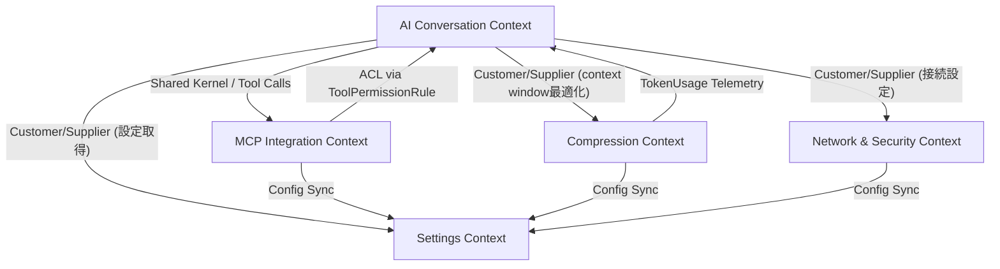

# コンテキストマップ

Releio は 3 プロセス構成（Main / Backend / Renderer）を土台に、以下の境界づけられたコンテキスト（Bounded Context）で機能を分割する。

## 各コンテキスト概要

### AI Conversation Context

- **責務**: チャットセッション管理、メッセージ履歴、AI ストリーミング、ツール呼び出し結果保存。
- **主要モジュール**: `src/backend/session/ChatSessionStore.ts`, `src/backend/ai/*.ts`, `src/backend/handler.ts`, `src/common/chat-types.ts`。
- **所有データ**: `chat_sessions`, `chat_messages`, `message_parts`, `tool_invocations`, `session_snapshots`（Snapshot作成は Compression Context だが永続化は共有スキーマ）。
- **公開 API**: Renderer 向け `RendererBackendAPI` (streamAIText, listSessions など）。

### MCP Integration Context

- **責務**: MCP サーバー設定、プロセスライフサイクル管理、Tool/Prompt/Resource 取得、HITL 判定。
- **主要モジュール**: `src/backend/mcp/manager.ts`, `src/backend/mastra/MastraToolService.ts`, `docs/MCP_INTEGRATION_DESIGN.md`。
- **所有データ**: `mcp_servers`, `tool_permission_rules`。
- **連携**:
  - Shared Kernel: ツール呼び出し情報を AI Conversation と共有（MessagePort イベント経由）。
  - ACL: ToolPermissionRule を通じて AC コンテキストのツール実行を制御。

### Compression Context

- **責務**: トークン計測、圧縮閾値判定、SessionSnapshot 作成、圧縮プレビュー。
- **主要モジュール**: `src/backend/compression/CompressionService.ts`, `docs/CONVERSATION_HISTORY_COMPRESSION_*.md`。
- **所有データ**: `model_configs`（モデル固有閾値）、`session_snapshots`（圧縮結果）。
- **連携**: Customer/Supplier で AI Conversation に圧縮結果を提供。Settings Context から閾値/保持トークンを取得。

### Network & Security Context

- **責務**: プロキシ設定、カスタム証明書、接続テスト、HitL監査ログのネットワーク側考慮。
- **主要モジュール**: `src/backend/settings/proxy.ts`, `src/backend/settings/certificate.ts`, `src/backend/settings/connectionTest.ts`, `docs/PROXY_AND_CERTIFICATE_DESIGN.md`。
- **所有データ**: `settings` テーブル内の `proxy`, `certificate`, `connectionTest` キー。
- **連携**: AC / MCP / Compression からの外部リクエストを中継するため Customer/Supplier 関係。

### Settings Context

- **責務**: アプリ全体の設定管理（AI Provider Config, Compression Settings, Network Settings）。
- **主要モジュール**: `src/backend/settings/*.ts`, `src/renderer/src/components/settings/*`。
- **所有データ**: `settings` テーブルの汎用 key-value。
- **連携**: すべてのコンテキストに設定値を提供。ACL・Contract: `RendererBackendAPI` の get/setSetting。

## コンテキスト間の契約

| 関係              | 送信元 → 送信先                      | 契約/境界                                                                                |
| ----------------- | ------------------------------------ | ---------------------------------------------------------------------------------------- |
| Shared Kernel     | AI Conversation ↔ MCP               | ツール呼び出しペイロード（`ToolCallPayload`, `ToolResultPayload`）。                     |
| Customer/Supplier | AI Conversation → Compression        | `CompressionService.checkContext`, `CompressionService.autoCompress` を通じた API 契約。 |
| Customer/Supplier | AI Conversation → Network & Security | `createFetchWithProxyAndCertificates`, ConnectionTest API。                              |
| Customer/Supplier | AI Conversation → Settings           | `RendererBackendAPI.getSetting/setSetting`。                                             |
| ACL               | MCP → AI Conversation                | ToolPermissionRule により危険なツールをブロック。                                        |
| Shared Kernel     | Settings ↔ その他                   | 共通の `settings` スキーマを共有しながらアクセス API で隔離。                            |

## 境界ガイドライン

- **データ所有**: 永続データは Drizzle スキーマ単位で所有する。外部コンテキストは直接テーブルを編集せず API 経由でアクセス。
- **変更通知**: 圧縮完了やツール呼び出しなどのドメインイベントは `Connection.publishEvent` で Renderer に通知し、必要に応じ他コンテキストも購読。
- **マイグレーション責任**: テーブル所有コンテキストが Drizzle migration を作成し、`docs/sdd/data-model/migrations.md` で管理方針を共有。
