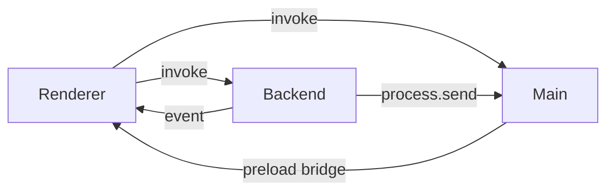

# 統合パターン

Releio のアーキテクチャは Main / Backend / Renderer の 3 プロセス構成と 5 つの境界づけられたコンテキスト（AI Conversation / MCP Integration / Compression / Network & Security / Settings）で構成される。本書は各コンテキスト間の統合スタイルを一覧化し、同期 RPC・非同期イベント・ACL・データ所有ルールを整理する。

## 1. プロセス間通信スタイル

| 呼び出し元 → 呼び出し先 | パターン                        | 実装                                                                   | 目的                                                   |
| ----------------------- | ------------------------------- | ---------------------------------------------------------------------- | ------------------------------------------------------ |
| Renderer → Backend      | 同期 RPC                        | `Connection.invoke()` 経由 `RendererBackendAPI`                        | セッション CRUD、AI ストリーム開始、設定操作、MCP 操作 |
| Backend → Renderer      | 非同期イベント                  | `Connection.publishEvent()` (例: `aiChatChunk`, `toolApprovalRequest`) | ストリーミングチャンク、HITL 要求、更新通知            |
| Renderer ↔ Main        | 同期 RPC / イベント             | `RendererMainAPI`, `BackendMainAPI` (ログ、Updater、OS API)            | OS 統合・暗号化ユーティリティ・ログ集約                |
| Backend → Main          | プロセス間 IPC (`process.send`) | `backend/logger.ts`                                                    | 統合ログ、例外通知                                     |

### Connection ルール

- `invoke/channel` は API 名を一意にする。結果は `Result<T, Error>`。
- タイムアウト: 30 分（長時間の AI ストリーミング / MCP 連鎖を想定）。
- イベント送信はチャンネルベースで購読 (`BackendListenerAPI.onEvent`).

## 2. コンテキスト間統合スタイル

### 2.1 AI Conversation ↔ MCP Integration

- **Shared Kernel**: `ToolCallPayload`, `ToolResultPayload`, `ToolInvocation` エンティティを共有。
- **同期**: AI ストリーム中に `MastraToolService` が MCP Server RPC を実行。
- **ACL**: `ToolPermissionRule` を優先度順に評価。`autoApprove=false` の場合は Renderer へ HITL イベント送信。
- **データ所有**: `tool_invocations` テーブルは AI Conversation が所有し、MCP 側は API 経由で書き込む。

### 2.2 AI Conversation ↔ Compression

- **Customer/Supplier**: Conversation が `CompressionService.checkContext()` を呼び、結果を Snapshot として受け取る。
- **イベント**: 圧縮完了後 `compressionSummaryCreated` イベントで Renderer に要約を通知。
- **データ所有**: `session_snapshots` のビジネスロジックは Compression、保存は共通 DB スキーマ。
- **設定同期**: `CompressionSettings` は Settings Context から取得し、モデル固有値は `model_configs`。

### 2.3 AI Conversation ↔ Network & Security

- **Customer/Supplier**: AI 呼び出し/Tool 呼び出しの fetch を `createFetchWithProxyAndCertificates` でラップ。
- **同期検証**: ユーザーが設定画面から `testProxyConnection` を実行 → 実リクエストで接続可否を返す。
- **フォールバック**: モード `system/custom/none` をサポート。設定は Settings Context に保存。

### 2.4 AI Conversation ↔ Settings

- **同期 RPC**: `RendererBackendAPI.getSetting/setSetting/clearSetting` で key-value を読み書き (Drizzle `settings` テーブル)。
- **キャッシュ**: Backend 起動時に必要設定をオンデマンドでロード。Renderer は `react-query` キャッシュに反映。
- **トレーサビリティ**: `requirements/traceability.md` で設定キーとユースケースをマッピング予定。

### 2.5 MCP ↔ Settings

- **同期**: MCP Server 定義 (`mcp_servers` テーブル) は Settings Context 所有。
- **イベント**: MCP 起動結果やステータスは `mcpServerStatus` イベントで Renderer 表示。

### 2.6 Compression ↔ Settings

- **同期**: 圧縮閾値は `CompressionSettings` (ユーザー設定) + `ModelConfig` (デフォルト) をマージ。
- **ヒント**: `model_configs.recommendedRetentionTokens` を UI で提示。

### 2.7 Network & Security ↔ Settings

- **同期**: プロキシ・証明書設定を `settings` に JSON で保存。
- **検証**: 設定変更後に `connectionTest` API で結果を記録し、ログへ出力。

## 3. 非同期イベント一覧

| イベントチャンネル          | 送信者   | 受信者   | 説明                           |
| --------------------------- | -------- | -------- | ------------------------------ |
| `aiChatChunk`               | Backend  | Renderer | AI ストリームの delta テキスト |
| `aiChatEnd`                 | Backend  | Renderer | ストリーム完了通知             |
| `aiChatError`               | Backend  | Renderer | ストリーム中断/失敗            |
| `toolApprovalRequest`       | Backend  | Renderer | HITL 承認ダイアログ表示        |
| `toolApprovalResolved`      | Renderer | Backend  | ユーザー承認/拒否結果          |
| `compressionSummaryCreated` | Backend  | Renderer | 要約スナップショット生成       |
| `update-available` 等       | Main     | Renderer | 自動更新 UI 通知               |
| `log:backend`               | Backend  | Main     | 統一ログ転送                   |

## 4. 依存関係・ACL ルール

1. **ツール実行 ACL**
   - ルールは Server > ToolName > ToolPattern > 全ツール の順で適用。
   - `autoApprove=false` かつ一致するルールが無い場合はデフォルト拒否。
   - 監査目的で `tool_invocations` に結果を保存。

2. **設定アクセス**
   - Renderer は直接 DB にアクセスせず、Backend API 経由のみ。
   - Backend が設定を更新すると Renderer へイベント通知し、UI 状態を同期。

3. **データ所有ガイドライン**
   - テーブル所有コンテキストのみマイグレーションを作成。外部からは Repository/Service API を呼ぶ。
   - `message_parts`, `tool_invocations` 等は AI Conversation コンテキストが ACL を持つ。

## 5. デプロイ / 配布パターン

- **Main + Backend**: Electron パッケージ内に同梱。Backend は `utilityProcess` として起動。
- **Renderer**: Vite でバンドルされ `dist/renderer` に配置。
- **MCP サーバー**: ユーザー定義のスクリプト（Node/Python 等）を外部プロセスとして起動。
- **設定 & DB**: `userData` ディレクトリに SQLite (`app.db`) と `settings` JSON が保存される。

## 6. 将来の統合検討事項

- **tRPC 拡張**: 現状 `ping` のみ。将来的に Backend API を tRPC で formalize。
- **イベント再生**: Renderer 再接続時に直近イベントを再送 (`replayLast` オプション) → 現状は限定サポート。
- **Pub/Sub 拡張**: MCP サーバーの状態変化を複数 Renderer にブロードキャストするマルチクライアント構成（将来要件）。
