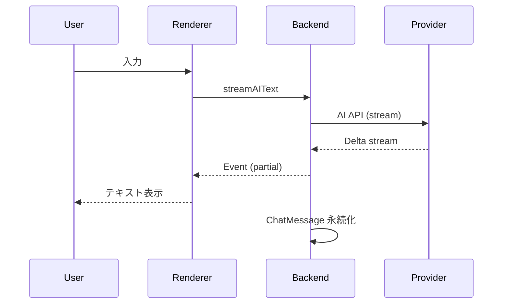

# 全体アーキテクチャ概要

Releio は Electron ベースの AI チャットアプリであり、Main / Backend / Renderer の 3 プロセス構成を採用する。Main はウィンドウ管理と IPC ハブ、Backend は AI・DB・MCP を担当する Utility Process、Renderer は React UI である。

```mermaid
graph LR
  subgraph Main Process
    MP[Main]
  end
  subgraph Backend (Utility)
    BE[Backend]
  end
  subgraph Renderer
    RE[Renderer]
  end

  MP -- MessagePort / Connection --> BE
  MP -- preload bridge --> RE
  RE -- MessagePort / Connection --> BE
```

## プロセス別責務

| プロセス | 主責務                                                            | 主なモジュール                                                                                                         |
| -------- | ----------------------------------------------------------------- | ---------------------------------------------------------------------------------------------------------------------- |
| Main     | BrowserWindow ライフサイクル、IPC ルーティング、Updater、統合ログ | `src/main/main.ts`, `src/main/handler.ts`, `src/main/updater.ts`, `src/main/logger.ts`                                 |
| Backend  | AI ストリーミング、DB 永続化、MCP 管理、設定管理、圧縮、HITL 判定 | `src/backend/index.ts`, `src/backend/handler.ts`, `src/backend/db/*`, `src/backend/mcp/*`, `src/backend/compression/*` |
| Renderer | React UI、tRPC クライアント、状態管理、Assistant UI、設定画面     | `src/renderer/src` 以下                                                                                                |

## Connection (MessagePort) 層

- `@common/connection.ts` で `invoke / result / event` の 3 種 IPC メッセージを定義。
- `RendererBackendAPI`, `BackendMainAPI`, `RendererMainAPI` の型安全な RPC インターフェースを提供。
- `Result<T,E>` 型で成功/失敗を明示。タイムアウトは `TimeoutError`。

## データフロー

1. Renderer から `streamAIText` (RendererBackendAPI) を呼び出し → Backend で AI Factory がプロバイダーごとのクライアントを生成 (`src/backend/ai/factory.ts`).
2. Backend は `ChatSessionStore` で `chat_sessions`, `chat_messages` を操作しながら Streaming Token を Renderer へイベント送信。
3. MCP ツールが必要な場合は `MastraToolService` が `tool_invocations` を生成し、HITL ルール(`tool_permission_rules`)を評価。必要なら Renderer に承認ダイアログイベント。
4. トークンが閾値を超過すると `CompressionService` が `session_snapshots` を生成、サマリーをチャットに挿入。
5. プロキシ/証明書などのネットワーク設定は `settings` テーブルに保存され、AI API 呼び出し時に `createFetchWithProxyAndCertificates` が適用する。

## 主要コンポーネント一覧

- **AIFactory (`src/backend/ai/factory.ts`)**: プロバイダー定義 (OpenAI/Anthropic/Google/Azure)、AI SDK v5 でのストリーミング構築。
- **ChatSessionStore (`src/backend/session/ChatSessionStore.ts`)**: セッション・メッセージCRUD、履歴読み込み、セッション検索。
- **CompressionService (`src/backend/compression/CompressionService.ts`)**: トークン計測、Auto Compress、Snapshot 保存。
- **MCP Manager (`src/backend/mcp/manager.ts`)**: MCP サーバー登録、プロセス起動、リソース・ツール取得。
- **ToolPermissionRule Engine (`src/backend/mcp/manager.ts` 内)**: 優先度順評価、自動承認/拒否。
- **Proxy / Certificate Settings (`src/backend/settings/*.ts`)**: Enterprise ネットワーク向け。
- **Updater (`src/main/updater.ts`)**: electron-updater 連携。Renderer へ Update イベント配信。
- **Logging (`src/main/logger.ts`, `src/backend/logger.ts`, `src/renderer/src/lib/logger.ts`)**: 統一ログファイル `app.log`。

## 典型フロー

### AI 応答ストリーミング



### MCP ツール + HITL

1. AI 出力中に `tool_invocation` 指示 → Backend が MCP Server に RPC。
2. `ToolPermissionRule` が承認フローを判断。承認が必要な場合、Renderer に ToolApprovalRequest イベント。
3. ユーザーが承認後、Backend が MCP フローを継続し `tool_result` を MessagePart として保存。

## 技術スタック

- Electron 37 + electron-vite
- React 19 + Tailwind CSS 4 + shadcn/ui
- Drizzle ORM + SQLite (`resources/db/migrations`)
- Vercel AI SDK v5 (`ai` パッケージ) + @ai-sdk/mcp
- Vitest backend テスト

## 可観測性

- 三プロセス統合ログ (`app.log`)。Backend からは `process.send({type:'log'})` で Main 経由。
- CRAsh/エラーハンドリング: electron-log の `errorHandler` で捕捉。
- MCP/HITL イベント、Updater イベントは Renderer Event Bus で UI 表示。
