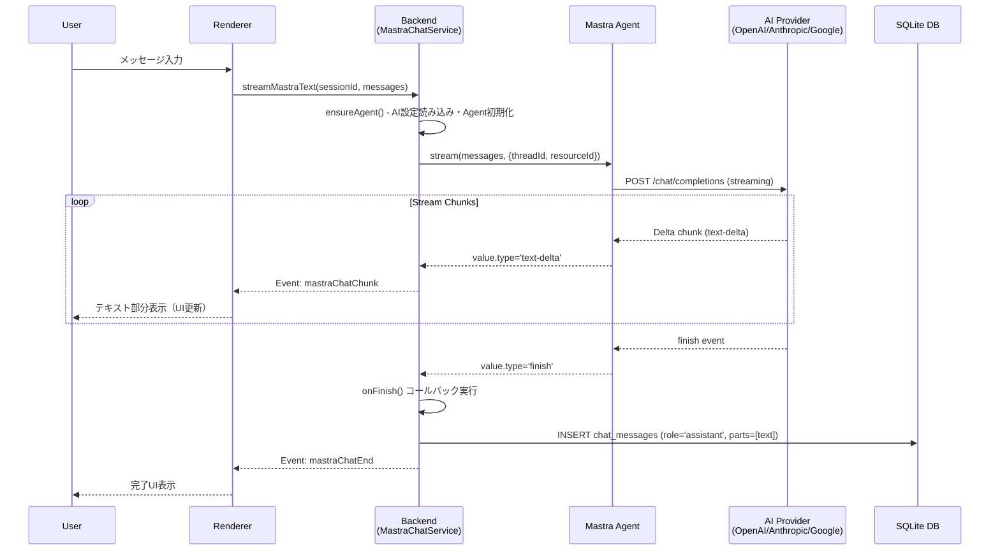
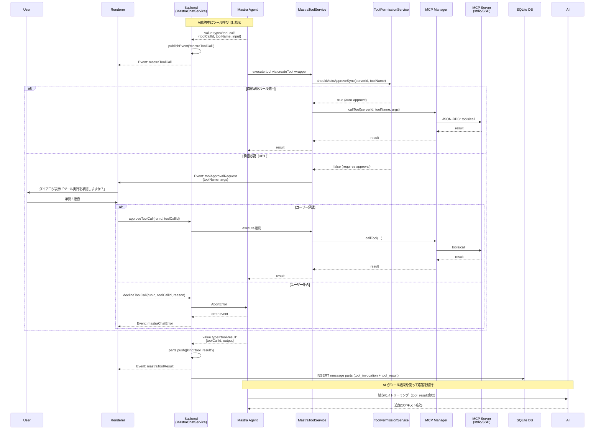
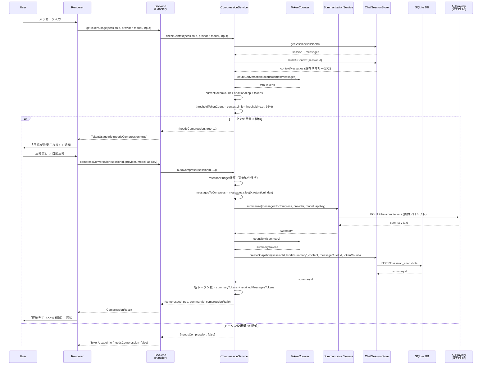
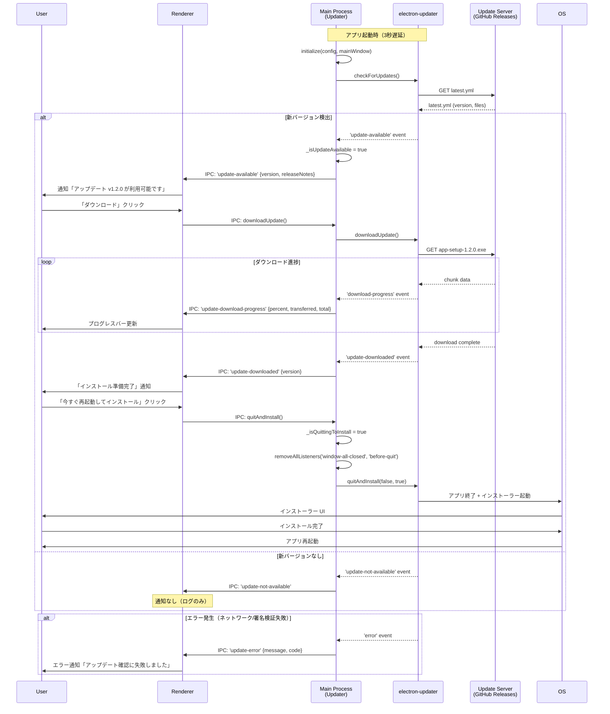
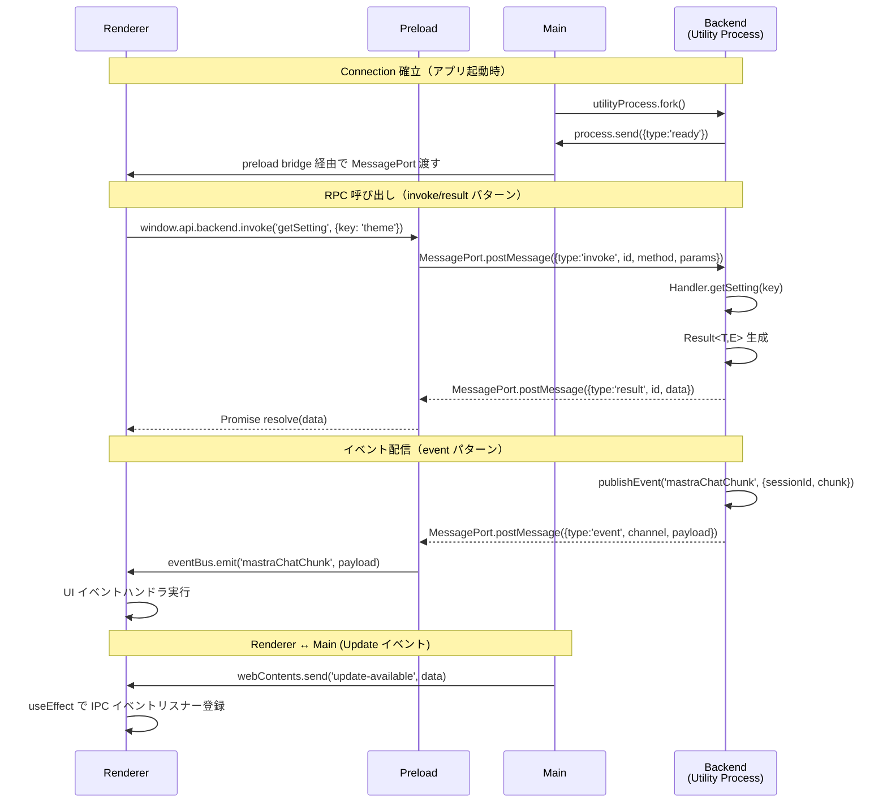

# シーケンス図

本ドキュメントでは、Releio の主要なユースケースフローを Mermaid シーケンス図で示す。

- **参照元**: `src/backend/mastra/`, `src/backend/compression/`, `src/main/updater.ts`, `src/backend/handler.ts`
- **関連**: `architecture/overview.md`, `architecture/integration-patterns.md`

---

## 1. AI ストリーミング応答（Mastra + AI SDK v5）

Renderer からユーザー入力を受け取り、Backend で Mastra Agent を介して AI プロバイダーと通信し、リアルタイムでストリーミング応答を返す基本フローを示す。

**特記事項**:

- `MastraChatService.streamText()` は streamId を即座に返却し、非同期で `runStreaming()` タスクを起動。
- `fullStream.getReader()` で ReadableStream を逐次処理。
- テキストが複数チャンクに分割される場合、`currentTextBlock` をフラッシュして `parts` 配列に格納。
- ストリーム完了後、`onFinish` コールバックで `ChatSessionStore.addMessage()` を呼び出し永続化。

---

## 2. MCP ツール呼び出し + HITL 承認フロー

AI がツール呼び出しを指示した場合、権限ルールを評価して自動承認または人間による承認（HITL）を経て実行するフローを示す。

**特記事項**:

- `MastraToolService.getAllToolsWithPermissions()` で `ToolPermissionService` の評価結果に基づき `requireApproval` フラグを設定。
- Mastra の `createTool()` は `requireApproval: true` の場合、内部で承認フローを起動（Phase 3 実装）。
- **Phase 3.2 TODO**: 現在 `approveToolCall` / `declineToolCall` はログ出力のみ。Mastra HITL API との統合が必要。

---

## 3. 会話圧縮トリガー（自動圧縮）

トークン使用量が閾値を超過した際、古いメッセージを要約して `session_snapshots` に保存し、コンテキストサイズを削減するフローを示す。

**特記事項**:

- `CompressionService.checkContext()` でモデルの `maxInputTokens` と `threshold` 設定（デフォルト 95%）を比較。
- 保持するメッセージ数は `retentionTokens` 設定（デフォルト 2000 トークン）に基づく。
- 既存サマリーがある場合、`summaryPrefix` として連結し、累積的な要約を生成。
- 要約メッセージは `role='system', id='summary-...'` として `ChatSessionStore.buildAIContext()` が挿入。
- **Auto Compress 設定**: `CompressionSettings.autoCompress` が true の場合、Renderer は自動的に圧縮実行可能。

---

## 4. 自動更新フロー（electron-updater）

アプリ起動時または手動トリガーでアップデート確認、ダウンロード、インストールを行うフローを示す。

**特記事項**:

- `Updater` クラスは `src/main/updater.ts` で実装。Main プロセスのみで動作。
- `autoUpdater.autoDownload = false` により、ユーザー承認後にダウンロード開始。
- `autoUpdater.autoInstallOnAppQuit = false` により、明示的な `quitAndInstall()` 呼び出しが必要。
- `_isQuittingToInstall` フラグで通常の quit ハンドラと区別し、インストーラー起動を妨げないよう配慮。
- **開発環境**: `NODE_ENV=development` の場合、更新確認はスキップされる。
- **設定**: `UpdaterConfig` で `enabled`, `updateServerUrl`, `channel` を制御可能（`src/main/updater-config.ts`）。

---

## 5. IPC メッセージフロー（Connection 層）

Renderer ↔ Backend / Main 間の MessagePort IPC 通信パターンを示す。

**特記事項**:

- `@common/connection.ts` で `Connection` クラスが `invoke / result / event` の 3 種メッセージを統一処理。
- `invoke` は `Promise<Result<T,E>>` を返し、タイムアウト時は `TimeoutError`。
- `event` は pub/sub パターン。Backend から Renderer への一方向通知。
- Main ↔ Renderer は従来の `ipcMain / ipcRenderer` も併用（Auto-update イベント等）。

---

## まとめ

上記 5 つのシーケンス図は、Releio の主要なランタイムフローを網羅する:

1. **AI ストリーミング**: ユーザー入力 → AI 応答 → UI 更新 → DB 永続化
2. **MCP ツール + HITL**: AI ツール呼び出し → 権限評価 → 承認フロー → 実行 → 結果記録
3. **会話圧縮**: トークン超過検知 → 古メッセージ要約 → スナップショット保存 → コンテキスト削減
4. **自動更新**: 起動時チェック → 新版検出 → ダウンロード → インストーラー起動
5. **IPC 通信**: MessagePort RPC + イベントバス

これらのフローは `architecture/integration-patterns.md` で定義した同期/非同期パターン、ACL、データ所有権ルールに準拠している。
