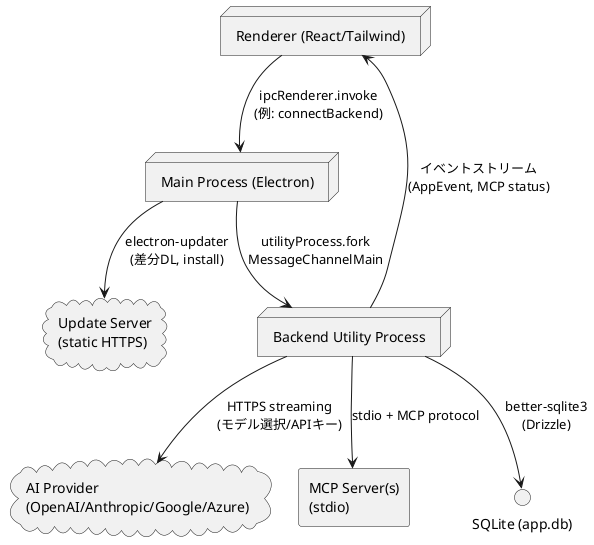

# ソフトウェアアーキテクチャ記述（予備版）

反復1（方向づけフェーズ）で作成するアーキテクチャ記述の骨格です。既存の実装と要求成果物を俯瞰し、次反復以降の設計・実装に向けたベースラインを示します。

## アーキテクチャ概要
- **3プロセス構成**: Main（ウィンドウ制御・アップデータ）、Backend Utility Process（会話/設定/外部連携の中枢）、Renderer（UI）。MainがBackendをutilityProcessでforkし、RendererとはMessageChannelでIPC。
- **AIストリーミング基盤**: Backendの`Handler.streamAIText`＋`ai/stream.ts`がAI SDKと接続し、トークン/ツール呼び出しイベントをRendererへ逐次中継。
- **外部連携**: MCPサーバーは`@ai-sdk/mcp`でstdio接続、AIプロバイダーはHTTPS、アップデートは`electron-updater`で静的サーバーから取得。
- **永続化**: better-sqlite3 + Drizzle（`./tmp/db/app.db`）。セッション、メッセージ、ツール呼び出し、圧縮スナップショット、設定を保存。

## 論理ビュー
- **Renderer**: `src/renderer/src`。チャットUI、設定UI（AI/MCP/ネットワーク/アップデート）、Assistant UIによるストリーム描画。
- **Backend**: `src/backend`。`handler.ts`を集約点として、AIストリーム(`ai/*`)、セッション管理(`session/ChatSessionStore.ts`)、MCP管理(`mcp/manager.ts`)、圧縮(`compression/*`)、設定(`settings/*`)を提供。
- **Main**: `src/main`。ウィンドウ作成、Backendプロセス管理、アップデート（`updater.ts`）、プリロード設定。
- **Shared**: `src/common`の型/IPC接続ユーティリティ。`resources/`にアイコン・マイグレーション。

## プロセスビュー（IPCと外部接続）

## 開発ビュー
- **パスエイリアス**（`electron.vite.config.ts`）: `@renderer` → `src/renderer/src`, `@backend` → `src/backend`, `@main` → `src/main`, `@common` → `src/common`.
- **構成**: TypeScript + Vite（Renderer）、Electron 37 + electron-vite（Main/Backend）、Tailwind CSS 4 + Shadcn/ui（UI）、Vitest（Backendテスト）。
- **重要な設定ファイル**: `electron.vite.config.ts`（バンドルとエイリアス）、`tsconfig*.json`（Node/Renderer分離）、`electron-builder.yml`（パッケージ）、`drizzle.config.ts`（DB）。

## 配置ビュー
- **開発**: デスクトップ上で`pnpm run dev`。DBは`./tmp/db/app.db`、ログは`./tmp/logs/app.log`。リソースはリポジトリ直下の`resources/`を参照。
- **本番（パッケージ後）**: Mainは`app.isPackaged`、Backendは`process.resourcesPath`でパッケージ判定。DBは`<userData>/db/app.db`、ログは`<userData>/logs/app.log`。`resources/`は`electron-builder.yml`の`extraResources`で`process.resourcesPath`配下へコピー。
- **アップデート**: Windows向けNSIS。`updater.json`または`ELECTRON_UPDATER_CONFIG`で更新サーバーURLを指定。

## シナリオ（4+1の+1）
- **UC-01: AIと会話する**: RendererがMessagePort経由でBackendへストリーミング要求。BackendはAI SDKに接続し、MCPツール情報を統合してトークン/ツール呼び出しイベントをUIへ送る。セッション/メッセージ/ツール結果をDBへ即時反映。
- **UC-04: MCPサーバーを管理する**: Renderer設定UIからのCRUDをBackendの`mcpManager`が受け、DB保存とサーバープロセス起動を行う。状態変化をイベントで全Rendererにブロードキャストし、ツール一覧をAIストリームに供給。

## 主要設計決定（方向づけフェーズ）
- **3プロセス分離**: UIとビジネスロジック、ウィンドウ管理を疎結合化し、クラッシュ隔離とログ統合を両立。
- **ストリーミング優先**: AIレスポンスはトークン単位で即時表示し、ツール呼び出しも同一チャネルで流す。大規模文脈は圧縮メカニズムで制御。
- **MCP標準準拠**: `@ai-sdk/mcp`を用い、stdio経由でツールを自動起動・管理。stderr/exitコードをエラー診断に利用。
- **設定の多層管理**: AI設定V2（複数プロバイダー/モデル）、ネットワーク設定（プロキシ・証明書）を分離し、接続テストAPIを用意。ストリーム開始時にモデル選択とAPIキー解決を行う。

## リスクと次ステップ（推敲フェーズで精査）
- 圧縮の閾値/保持戦略の最適化とUIへの可視化。
- MCPサーバー多重起動時のリソース管理・エラーフォールバック。
- MessagePort断時の再接続戦略とイベント再送保証。
- アップデートエラー時の復旧手順とUX。
