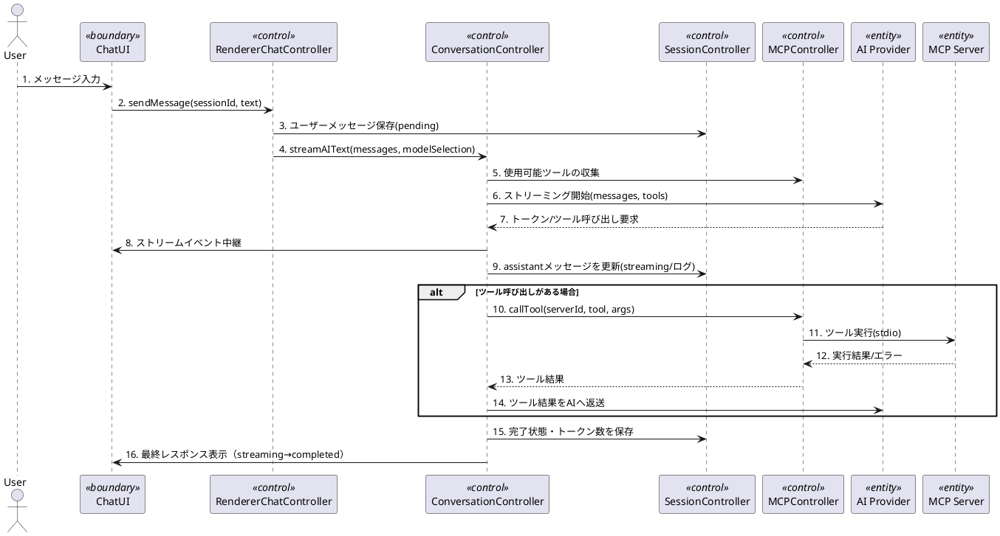
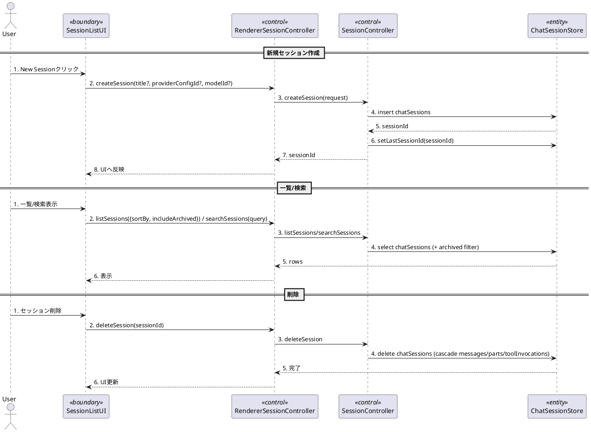
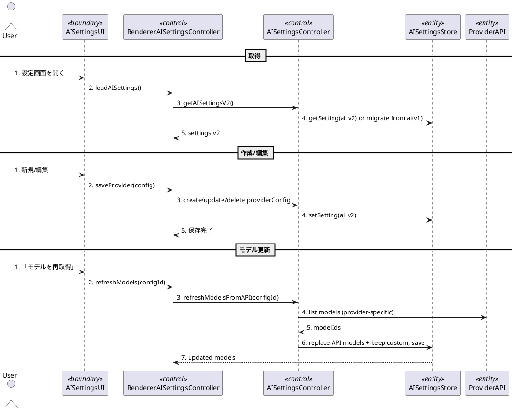
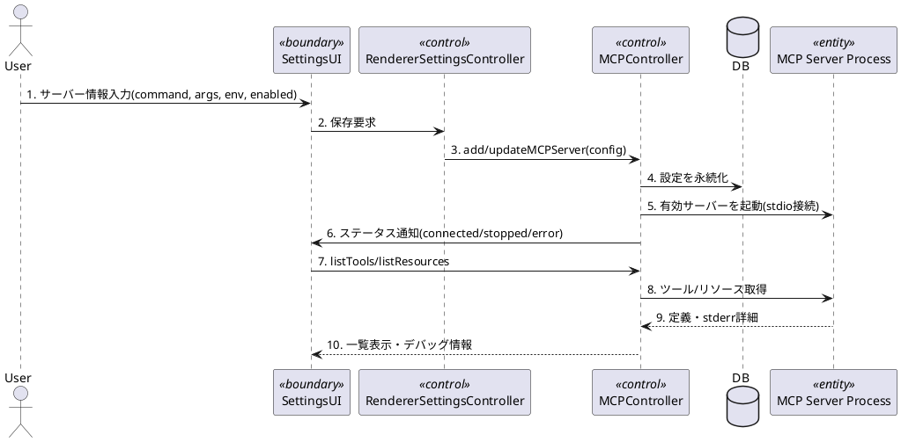
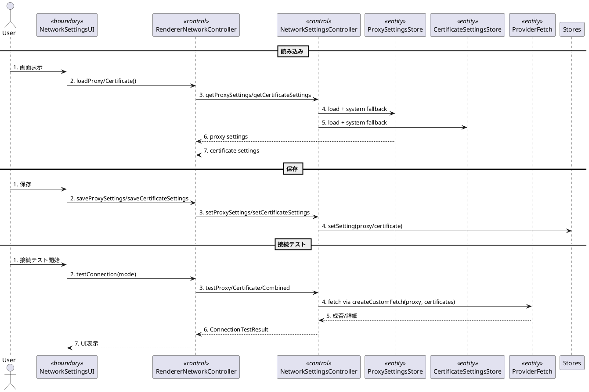
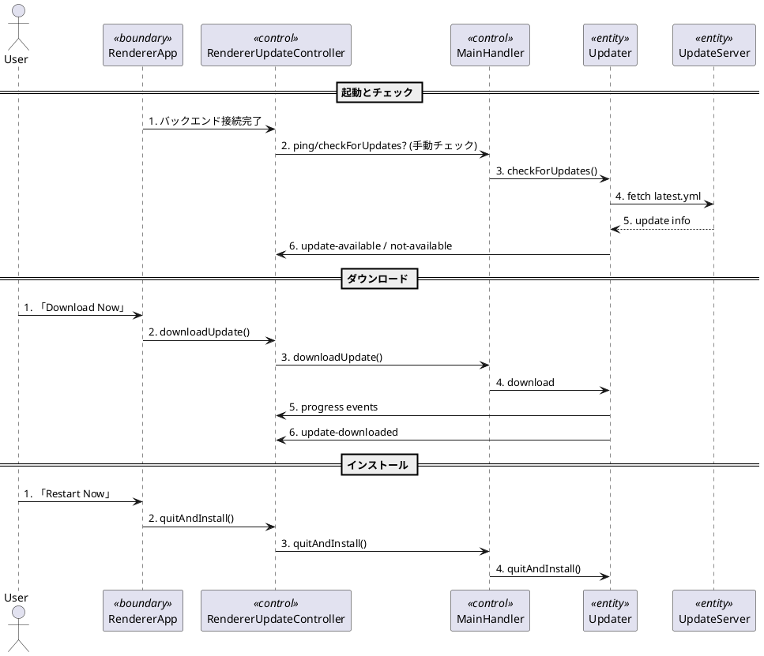
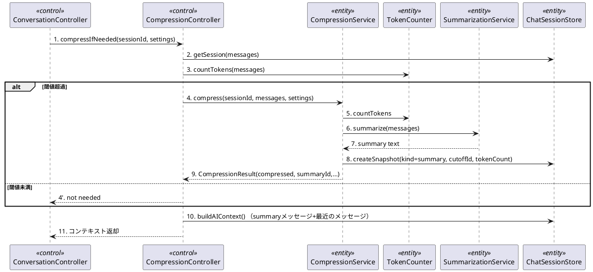

# ユースケース実現（分析）―全主要ユースケース

アーキテクチャ上重要と判断したユースケースについて、現行実装（`src/backend/*`, `src/main/*`, `src/renderer/*`）に即したラフな実現シナリオをまとめる。バウンダリ/コントロール/エンティティは`docs_UP/分析_分析モデル.md`のパッケージに対応する。

## UC-01: AIと会話する（ストリーミング + MCPツール呼び出し）

### シナリオ概要
- ユーザーがチャット画面からメッセージを送信する。
- RendererはBackendへストリーミング要求を送り、Backendがモデル選択・MCPツール連携を調停する。
- AIプロバイダーからのトークンとツール呼び出し要求を逐次UIへ反映し、永続化する。

### シーケンス（ラフ）

### 留意点
- モデル選択とAPIキー解決は`AISettingsV2`（プロバイダー設定）を優先し、Fallbackとして旧設定を使う。
- コンテキスト長の確認と圧縮判断は`CompressionController`が行い、必要に応じてスナップショットを追加する。
- 失敗時はストリーム停止・エラーイベントを即時UIに返し、セッション側にエラーを記録する。

## UC-02: 会話セッションを管理する（作成/一覧/検索/削除）

### シナリオ概要
- ユーザーがセッション一覧から新規作成・既存セッション選択・検索・削除を行う。
- RendererはBackendの`ChatSessionStore`経由でDrizzle ORMの`chatSessions`/`chatMessages`/`messageParts`へCRUDを実行し、最後に開いたセッションIDを`settings`に保持する。

### シーケンス（ラフ）

### 留意点
- `listSessions`は`includeArchived=false`が既定、`sortBy`は`updatedAt/createdAt/title`を選択可能。
- 削除はcascadeで関連メッセージ・ツール呼び出しも削除される。
- `getSession`はパーツ/ツール呼び出しをJOINして返却し、UIはISO8601に変換済みのタイムスタンプを扱う。

## UC-03: AIプロバイダー設定を管理する（作成/編集/削除/モデル更新）

### シナリオ概要
- ユーザーがAI設定画面でプロバイダー構成（APIキー、Base URL、モデル一覧、既定選択）をCRUDする。
- Backendは`ai-settings.ts`で`ai_v2`設定をDrizzle `settings`テーブルに保存し、必要に応じてv1からv2へ自動移行する。
- モデル更新はプロバイダー別API（OpenAI/Azureの`/v1/models`）を手動で呼び、返却が空なら現状維持、返却があればAPIモデルを置換しつつカスタムモデルを保持する。

### シーケンス（ラフ）

### 留意点
- モデル選択は`StreamAIOptions.modelSelection`から`providerConfigId/modelId`で指定され、BackendでAPIキーとBase URLを確定する。
- Azureは`resourceName/useDeploymentBasedUrls`を含む`AzureProviderConfig`に従い、モデル取得にはbaseURLが必須。
- モデル刷新はAPIがモデル一覧を返した場合にのみAPIモデルを全置換し、`source=custom`のモデルは保持する。APIが空/未対応の場合は既存モデルを維持する。

## UC-04: MCPサーバーを管理する（登録と起動）

### シナリオ概要
- ユーザーがMCPサーバー設定を追加・有効化し、提供ツール/リソースを取得する。
- Backendがサーバープロセスを起動し、状態変化をRendererへ通知する。

### シーケンス（ラフ）

### 留意点
- サーバーごとの状態（connected/stopped/error）は`statusEmitter`経由で全Rendererへブロードキャストされる。
- stderr/exitコードなどのデバッグ情報は、エラー時にUIへ返却し設定見直しを促す。
- AIストリーミングは有効なMCPツール一覧を毎回集約するため、UC-01とUC-04の連携点としてMCP設定の正確性が重要。

## UC-05: ネットワーク設定を管理する（プロキシ/証明書/接続テスト）

### シナリオ概要
- ユーザーがネットワーク設定画面でプロキシ・証明書モードを選択し、接続テストを実行する。
- Backendは`settings/proxy.ts`と`settings/certificate.ts`で`settings`テーブルに保存し、モードに応じてOS設定を読み込む。テストは`settings/connectionTest.ts`でAIプロバイダーへのフェッチを実行する。

### シーケンス（ラフ）

### 留意点
- 初回起動時はプロキシ/証明書とも`system`モードに初期化される。Windowsのみシステム取得を実装。
- テストはプロキシ/証明書/複合の3種類を個別に実施し、`ConnectionTestResult`で成功・警告・失敗理由を返す。
- `createCustomFetch`でプロキシ・CAバンドルをNode Fetchへ注入し、AI/モデル取得経路と共通化する。

## UC-06: アプリケーションを更新する（静的サーバー利用）

### シナリオ概要
- アプリ起動後、Mainが`updater.ts`を初期化し3秒後に非同期で更新確認を行う。結果はIPC経由でRendererへ通知され、ユーザーがダウンロード/インストールを選択する。
- 設定は開発時は`ELECTRON_UPDATER_CONFIG`、本番は実行ファイル隣接の`updater.json`から読み込む。

### シーケンス（ラフ）

### 留意点
- Windows向け`generic`プロバイダーを前提。SHA-512署名は`electron-updater`が検証。
- 更新イベントはRendererの`UpdateNotification`で購読し、UIダイアログを表示する。
- `Updater`未初期化時はIPCハンドラが`Updater not initialized`を返すため、Main起動順序に依存。

## UC-07: 会話履歴を圧縮する（内部ユースケース）

### シナリオ概要
- 長いセッションのトークン量を削減するため、Backendの`CompressionService`が要約スナップショットを作成し、以後のAIコンテキスト構築時にサマリを先頭に挿入する。
- 要約作成には`TokenCounter`でトークン数を算出し、`SummarizationService`でモデルへ要約を依頼する（現在はプレースホルダ/ベースライン実装）。結果は`sessionSnapshots.kind=summary`として保存する。

### シーケンス（ラフ）

### 留意点
- スナップショットは`sessionSnapshots`に保存され、`buildAIContext`でサマリ+cutoff以降のメッセージを返す。
- `CompressionSettings`は閾値/ターゲット長/サマリ格納の挙動を規定し、UIから渡される想定。現状はBackend側で直接呼び出され、UIの設定化はAD-008で別途設計予定。
- 圧縮実行時にメッセージ削除は行わない（サマリ追加のみ）。後続の実装で保持ポリシー設定と連動予定。
