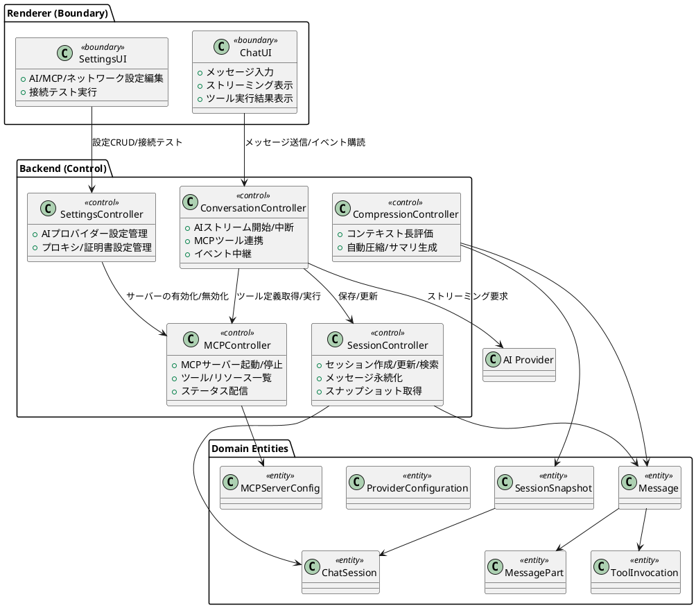

# 分析モデル（方向づけフェーズ・初版）

本書は反復1（方向づけフェーズ）で作成する荒削りな分析モデルです。既存の要求成果物（特色リスト、ユースケースモデル、ドメインモデル）と実装の確認結果をもとに、アーキテクチャ候補を説明するための構造を示します。

## パッケージビュー（ラフスケッチ）

> 3プロセス構成（Renderer / Backend / Main）のうち、分析対象をRendererとBackendに絞り、アーキテクチャ上重要なユースケース（UC-01: AIと会話する、UC-04: MCPサーバーを管理する）に関係する要素を示しています。

### パッケージの役割
- **Renderer (Boundary)**: エンドユーザーとのI/Oを担う。`src/renderer/src/components/assistant-ui/*`でチャット表示とツール結果表示を行い、`src/renderer/src/components/settings/*`でAI/MCP/ネットワーク設定を扱う。
- **Backend (Control)**: ユースケース実現の調停を担当。`src/backend/handler.ts`を起点にAIストリーミング（`ai/stream.ts`）、セッション永続化（`session/ChatSessionStore.ts`）、MCP管理（`mcp/manager.ts`）、圧縮（`compression/*`）、設定管理（`settings/*`）をまとめる。
- **Domain Entities**: `docs_UP/要求_ドメインモデル.md`で定義した概念を、永続化層やAPIペイロードとして利用する分析エンティティ。

## 主要分析クラスと責務

### バウンダリ（Boundary）
- **ChatUI**: チャット画面。ユーザー入力を収集し、ストリーミング中のトークンやツール呼び出しの進行状況を逐次表示する。メッセージ削除や巻き戻し操作も受け付ける。
- **SettingsUI**: 設定画面。AIプロバイダー設定、MCPサーバー設定、プロキシ/証明書設定の入力・接続テストを提供し、状態変化をリアルタイムに反映する。

### コントロール（Control）
- **ConversationController**: `Handler.streamAIText`／`ai/stream.ts`に対応。モデル選択・APIキー解決、MCPツール登録、ストリーミングイベントをRendererへ中継し、途中中断（abort）やツール呼び出しのハンドリングを行う。
- **SessionController**: `ChatSessionStore`に対応。セッション/メッセージ/ツール結果/スナップショットを永続化し、検索・アーカイブ・ピン留め・色付けなどの状態操作を提供する。
- **MCPController**: `mcp/manager.ts`に対応。MCPサーバー設定のCRUD、プロセス起動/停止、ツール・リソース取得、状態変化イベントの発行を行う。
- **CompressionController**: `compression/CompressionService`を中心に、`TokenCounter`/`SummarizationService`と連携してコンテキスト長を評価し、自動圧縮（要約スナップショット作成）を実行する。
- **SettingsController**: `settings/ai-settings.ts`および`settings/proxy.ts`/`settings/certificate.ts`に対応。AIプロバイダー設定のCRUDとモデル同期、プロキシ・証明書設定の保存と接続テストを提供する。

### エンティティ（Entity）
- **ChatSession / Message / MessagePart**: 会話とその構成要素。Messageは状態（pending/streaming/completed/error）とロール（user/assistant/tool）を持ち、MessagePartでテキスト・ツール呼び出し・メタデータを表現する。
- **ToolInvocation**: AIが発行したツール呼び出し要求と実行結果を保持する。MCPツール実行の入出力やステータスを追跡する。
- **ProviderConfiguration**: AIプロバイダー設定（複数プロバイダー/モデル、APIキー、baseURL、デフォルトモデル選択）。セッションごとのモデル選択と連動する。
- **MCPServerConfig / MCPResource / MCPTool**: MCPサーバー接続情報とサーバーが提供するリソース・ツール定義。有効/無効状態と起動結果を持つ。
- **SessionSnapshot**: 圧縮や要約の結果を保持するスナップショット。コンテキスト長管理と履歴復元に利用する。
- **CompressionSettings**: セッションごとの閾値/保持トークン数/自動圧縮フラグを持ち、圧縮メカニズムのパラメータとして用いる。

## 現段階の制約と前提
- 本モデルは方向づけフェーズのため、細部の責務割り当てや例外フローは後続反復で精緻化する。
- プロセス境界（Main/Backend/Renderer）やIPCチャネルはアーキテクチャ記述（`docs_UP/分析_ソフトウェアアーキテクチャ記述.md`）で補足する。
- ユースケース実現の詳細シナリオは`docs_UP/分析_ユースケース実現.md`に記載する。
