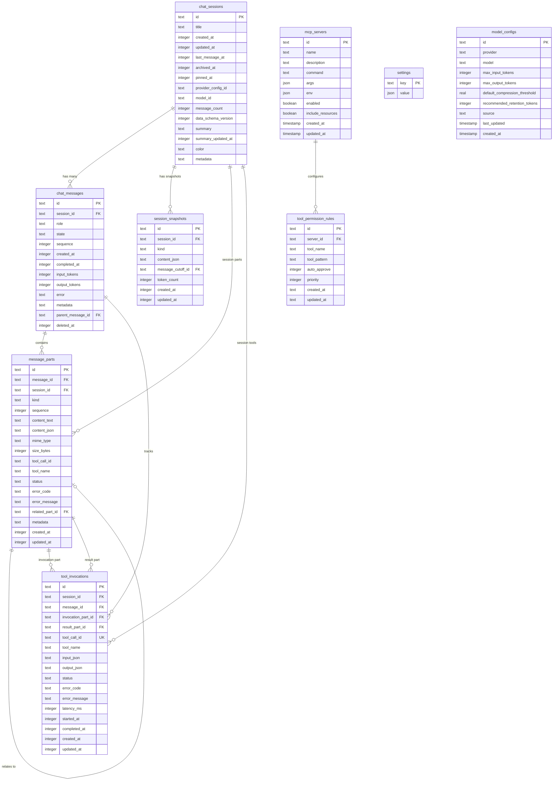
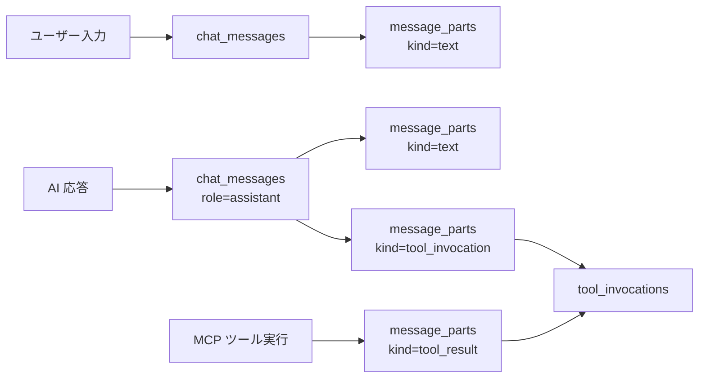
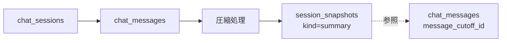

# ER 図（Entity-Relationship Diagram）

本ドキュメントでは、Releio のデータベーススキーマを ER 図で可視化する。

- **対象読者**: データベース設計者、バックエンド開発者
- **目的**: テーブル関係の理解、外部キー制約の確認
- **関連**: `data-model/physical-model.md`, `domain-design/aggregates.md`

---

## 全体 ER 図



---

## テーブル別詳細

### 1. ChatSession 集約

#### chat_sessions (1) --< chat_messages (N)

- **関係**: 1つのセッションは複数のメッセージを持つ
- **外部キー**: `chat_messages.session_id` → `chat_sessions.id`
- **削除動作**: `CASCADE` (セッション削除時、全メッセージも削除)

#### chat_messages (1) --< message_parts (N)

- **関係**: 1つのメッセージは複数のパーツ（text/tool_invocation/tool_result）を持つ
- **外部キー**: `message_parts.message_id` → `chat_messages.id`
- **削除動作**: `CASCADE`

#### chat_messages (1) --< tool_invocations (N)

- **関係**: 1つのメッセージは複数のツール実行を記録
- **外部キー**: `tool_invocations.message_id` → `chat_messages.id`
- **削除動作**: `CASCADE`

#### chat_sessions (1) --< session_snapshots (N)

- **関係**: 1つのセッションは複数の圧縮スナップショットを持つ
- **外部キー**: `session_snapshots.session_id` → `chat_sessions.id`
- **削除動作**: `CASCADE`

---

### 2. MCP サーバー集約

#### mcp_servers (1) --< tool_permission_rules (N)

- **関係**: 1つの MCP サーバーは複数の権限ルールを持つ
- **外部キー**: `tool_permission_rules.server_id` → `mcp_servers.id`
- **削除動作**: `SET NULL` (サーバー削除時、ルールは残る)

---

### 3. 自己参照関係

#### message_parts --< message_parts (related_part_id)

- **関係**: パーツ間の関連（tool_invocation → tool_result）
- **外部キー**: `message_parts.related_part_id` → `message_parts.id`
- **削除動作**: `SET NULL`

#### chat_messages --< chat_messages (parent_message_id)

- **関係**: メッセージ分岐（将来の会話ツリー機能用）
- **外部キー**: `chat_messages.parent_message_id` → `chat_messages.id`
- **削除動作**: `SET NULL`

---

## インデックス一覧

| テーブル              | インデックス名                          | カラム                 | 種類   | 用途                       |
| --------------------- | --------------------------------------- | ---------------------- | ------ | -------------------------- |
| chat_messages         | `idx_chat_messages_session_sequence`    | session_id, sequence   | 複合   | セッション内メッセージ取得 |
| chat_messages         | `idx_chat_messages_session_created`     | session_id, created_at | 複合   | 時系列メッセージ取得       |
| message_parts         | `idx_message_parts_message_sequence`    | message_id, sequence   | 複合   | メッセージ内パーツ取得     |
| message_parts         | `idx_message_parts_session_kind`        | session_id, kind       | 複合   | 種別フィルタ               |
| message_parts         | `idx_message_parts_tool_call_id`        | tool_call_id           | UNIQUE | ツール呼び出し ID 検索     |
| tool_invocations      | `idx_tool_invocations_tool_name`        | tool_name              | 単一   | ツール名検索               |
| tool_invocations      | `idx_tool_invocations_status_completed` | status, completed_at   | 複合   | 完了ツール検索             |
| tool_invocations      | `idx_tool_invocations_session_created`  | session_id, created_at | 複合   | セッション別ツール履歴     |
| session_snapshots     | `idx_session_snapshots_kind`            | session_id, kind       | 複合   | スナップショット種別取得   |
| tool_permission_rules | `idx_tool_permission_rules_server`      | server_id              | 単一   | サーバー別ルール取得       |
| tool_permission_rules | `idx_tool_permission_rules_priority`    | priority               | 単一   | 優先度順取得               |
| model_configs         | `idx_model_configs_provider`            | provider               | 単一   | プロバイダー別モデル検索   |

---

## データフロー図

### AI チャット → メッセージ保存



### 圧縮処理 → スナップショット保存



---

## 集約境界とカスケード削除

### ChatSession 集約削除時

```
chat_sessions (DELETE)
  ├─ chat_messages (CASCADE DELETE)
  │   ├─ message_parts (CASCADE DELETE)
  │   └─ tool_invocations (CASCADE DELETE)
  └─ session_snapshots (CASCADE DELETE)
```

**1回の削除で 4 テーブルに影響**

### MCPServer 削除時

```
mcp_servers (DELETE)
  └─ tool_permission_rules (SET NULL on server_id)
```

**ルールは残るが、サーバー参照は NULL に**

---

## データ整合性制約

### 外部キー制約

| 子テーブル            | 親テーブル    | 外部キー           | ON DELETE               |
| --------------------- | ------------- | ------------------ | ----------------------- |
| chat_messages         | chat_sessions | session_id         | CASCADE                 |
| message_parts         | chat_messages | message_id         | CASCADE                 |
| message_parts         | chat_sessions | session_id         | CASCADE                 |
| message_parts         | message_parts | related_part_id    | SET NULL                |
| tool_invocations      | chat_sessions | session_id         | CASCADE                 |
| tool_invocations      | chat_messages | message_id         | CASCADE                 |
| tool_invocations      | message_parts | invocation_part_id | CASCADE                 |
| tool_invocations      | message_parts | result_part_id     | SET NULL                |
| session_snapshots     | chat_sessions | session_id         | CASCADE                 |
| session_snapshots     | chat_messages | message_cutoff_id  | CASCADE                 |
| tool_permission_rules | mcp_servers   | server_id          | (アプリレベル SET NULL) |

### UNIQUE 制約

| テーブル         | カラム              | 理由                       |
| ---------------- | ------------------- | -------------------------- |
| settings         | key                 | Key-Value ストア           |
| message_parts    | tool_call_id        | ツール呼び出し ID 重複防止 |
| tool_invocations | tool_call_id        | ツール実行レコード重複防止 |
| model_configs    | id (provider:model) | モデル設定重複防止         |

### NOT NULL 制約

すべてのテーブルで `id`, `created_at` は NOT NULL。その他主要カラムも NOT NULL。

---

## トランザクション境界

### メッセージ追加

```sql
BEGIN TRANSACTION;

INSERT INTO chat_messages (id, session_id, role, ...)
VALUES (?, ?, ?, ...);

INSERT INTO message_parts (id, message_id, session_id, kind, ...)
VALUES (?, ?, ?, 'text', ...);

UPDATE chat_sessions
SET message_count = message_count + 1,
    last_message_at = ?
WHERE id = ?;

COMMIT;
```

### ツール実行記録

```sql
BEGIN TRANSACTION;

INSERT INTO message_parts (id, message_id, kind, tool_call_id, ...)
VALUES (?, ?, 'tool_invocation', ?, ...);

INSERT INTO tool_invocations (id, session_id, message_id, tool_call_id, ...)
VALUES (?, ?, ?, ?, ...);

-- ツール結果受信後
UPDATE message_parts
SET content_json = ?, updated_at = ?
WHERE tool_call_id = ? AND kind = 'tool_result';

UPDATE tool_invocations
SET output_json = ?, status = 'completed', completed_at = ?
WHERE tool_call_id = ?;

COMMIT;
```

---

## まとめ

Releio のデータモデル特性:

1. **集約中心設計**: ChatSession を中心に 4テーブルが CASCADE 削除
2. **トレーサビリティ**: ツール実行履歴を `tool_invocations` で完全記録
3. **柔軟なメッセージ構造**: `message_parts` で text/tool/result を統一管理
4. **圧縮対応**: `session_snapshots` で会話要約を保存
5. **外部キー整合性**: DB レベルで関係性を保証

**次のステップ**:

- 論理モデル（`logical-model.md`）で概念レベルの設計を記述
- 物理モデル（`physical-model.md`）でパフォーマンス最適化を記述
- マイグレーション運用（`migrations.md`）でスキーマ変更手順を定義
