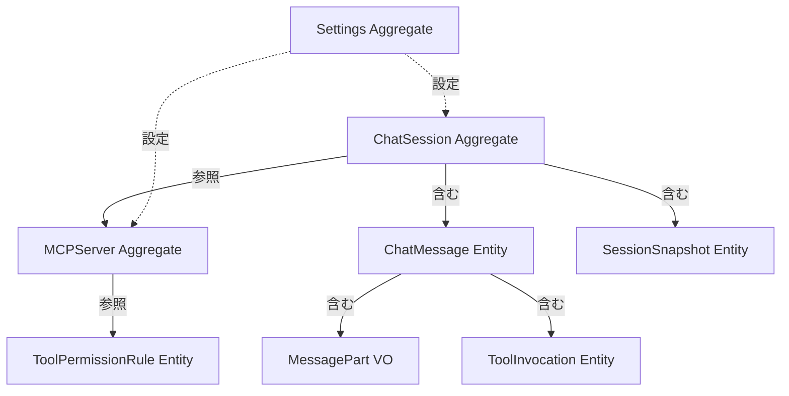

# 集約設計（Aggregates）

本ドキュメントでは、Releio のドメインモデルにおける集約（Aggregate）を定義し、境界・不変条件・操作を記述する。

- **対象読者**: アーキテクト、バックエンド開発者
- **目的**: ドメインロジックの一貫性保証、トランザクション境界の明確化
- **関連**: `architecture/context-map.md`, `data-model/erd.md`, `domain-design/state-machines.md`

---

## 集約とは

**集約（Aggregate）** は、一貫性境界を持つドメインオブジェクトのクラスター。

**特性**:

- **集約ルート（Aggregate Root）**: 外部からアクセス可能な唯一のエントリポイント
- **トランザクション境界**: 集約内の変更は単一トランザクションで実施
- **不変条件（Invariant）**: 集約ルートが常に保証するルール
- **外部参照**: 他の集約は ID 参照のみ（エンティティ直接参照は禁止）

---

## 1. ChatSession 集約

### 集約ルート

**ChatSession** (`chat_sessions` テーブル)

### 構成要素

- **ChatSession** (集約ルート)
- **ChatMessage[]** (エンティティ、CASCADE 削除)
- **MessagePart[]** (値オブジェクト、CASCADE 削除)
- **ToolInvocation[]** (エンティティ、CASCADE 削除)
- **SessionSnapshot[]** (エンティティ、CASCADE 削除)

### 境界

```
┌─ ChatSession Aggregate ───────────────────────┐
│  ChatSession (Root)                           │
│  ├─ ChatMessage[0..N]                         │
│  │  ├─ MessagePart[1..N] (text/tool/result)  │
│  │  └─ ToolInvocation[0..N]                  │
│  └─ SessionSnapshot[0..N] (summary)          │
└───────────────────────────────────────────────┘
```

### 不変条件

1. **メッセージ順序**: `sequence` は連番かつ重複なし
2. **削除整合性**: `deleted_at` が設定されたメッセージは UI 非表示
3. **トークン整合性**: `message_count` は実際のメッセージ数と一致
4. **ツール対応**: `tool_invocation` パーツには必ず対応する `tool_result` が存在（完了時）
5. **圧縮整合性**: `session_snapshots` の `message_cutoff_id` は実在するメッセージを参照

### 主要操作

#### `createSession(request: CreateSessionRequest): ChatSession`

- **説明**: 新規セッションを作成
- **不変条件**: `title` は必須、`message_count = 0`
- **副作用**: `chat_sessions` レコード作成

#### `addMessage(sessionId, request: AddMessageRequest): ChatMessage`

- **説明**: セッションにメッセージを追加
- **不変条件**:
  - `sequence` は既存最大値 + 1
  - `role` は `user` / `assistant` / `system` のいずれか
  - `parts` は最低 1 つの要素を持つ
- **副作用**:
  - `chat_messages` レコード作成
  - `message_parts` レコード作成（parts 配列分）
  - `chat_sessions.message_count` インクリメント
  - `chat_sessions.last_message_at` 更新

#### `deleteMessagesAfter(sessionId, messageId): void`

- **説明**: 指定メッセージ以降を論理削除（分岐用）
- **不変条件**: `messageId` は実在するメッセージ
- **副作用**:
  - 対象メッセージの `deleted_at` 設定
  - 関連 `message_parts` も論理削除
  - `chat_sessions.message_count` デクリメント

#### `createSnapshot(sessionId, request): SessionSnapshot`

- **説明**: 圧縮要約スナップショット作成
- **不変条件**:
  - `kind = 'summary'`
  - `message_cutoff_id` は実在するメッセージ
  - `token_count > 0`
- **副作用**: `session_snapshots` レコード作成

#### `buildAIContext(sessionId): ChatMessageWithParts[]`

- **説明**: AI 呼び出し用のコンテキストを構築（要約含む）
- **ロジック**:
  1. 最新 `session_snapshots` (kind='summary') を取得
  2. summary があれば `role='system', id='summary-{id}'` として先頭に挿入
  3. `message_cutoff_id` 以降のメッセージを取得
  4. `deleted_at IS NULL` のメッセージのみ含める
- **戻り値**: AI SDK に渡す `CoreMessage[]` 形式

### 依存集約

- **MCP Server** (ID参照): `tool_invocations.tool_name` が対応するサーバーのツール
- **AI Provider Configuration** (ID参照): `chat_sessions.provider_config_id`

---

## 2. MCPServer 集約

### 集約ルート

**MCPServer** (`mcp_servers` テーブル)

### 構成要素

- **MCPServer** (集約ルート)
- **ToolPermissionRule[]** (値オブジェクト、削除時は CASCADE または SET NULL)

### 境界

```
┌─ MCPServer Aggregate ─────────────────┐
│  MCPServer (Root)                     │
│  └─ ToolPermissionRule[0..N]         │
└───────────────────────────────────────┘
```

### 不変条件

1. **コマンド必須**: `command` は空文字列不可
2. **引数配列**: `args` は JSON 配列形式
3. **環境変数**: `env` は JSON オブジェクト or NULL
4. **有効状態**: `enabled = true` のサーバーのみ起動対象

### 主要操作

#### `addServer(config: MCPServerConfig): string`

- **説明**: 新規 MCP サーバー登録
- **不変条件**: `name` 重複不可（ユニーク制約なし、アプリレベルチェック）
- **副作用**:
  - `mcp_servers` レコード作成
  - Backend で MCP Manager がサーバー起動

#### `updateServer(serverId, updates): void`

- **説明**: サーバー設定更新
- **不変条件**: `serverId` は実在するサーバー
- **副作用**:
  - `mcp_servers` レコード更新
  - Backend で MCP Manager がサーバー再起動

#### `removeServer(serverId): void`

- **説明**: サーバー削除
- **副作用**:
  - `mcp_servers` レコード削除
  - Backend で MCP Manager がサーバー停止
  - 関連 `tool_permission_rules` が `server_id = NULL` に更新（グローバルルールとして残る）

#### `listTools(serverId): MCPTool[]`

- **説明**: サーバーが提供するツール一覧取得
- **副作用**: MCP Server に JSON-RPC `tools/list` リクエスト送信

### 依存集約

- **ToolPermissionRule** (値オブジェクト): `server_id` で参照

---

## 3. ToolPermissionRule 集約（値オブジェクト的扱い）

### 集約ルート

**ToolPermissionRule** (`tool_permission_rules` テーブル)

### 構成要素

- **ToolPermissionRule** (単独エンティティ)

### 境界

```
┌─ ToolPermissionRule ─────────────┐
│  ToolPermissionRule (Root)       │
└──────────────────────────────────┘
```

### 不変条件

1. **パターン排他**: `tool_name` と `tool_pattern` は排他（どちらか一方のみ）
2. **優先度**: `priority` は一意でなくてもよい（同優先度は作成順）
3. **サーバー参照**: `server_id` が NULL の場合は全サーバー対象
4. **自動承認フラグ**: `auto_approve` は 0 (要承認) or 1 (自動) のみ

### 主要操作

#### `createRule(input: CreateToolPermissionRuleInput): ToolPermissionRule`

- **説明**: 新規ルール作成
- **不変条件**: `tool_name` XOR `tool_pattern` が設定されている
- **副作用**: `tool_permission_rules` レコード作成

#### `evaluateRules(serverId, toolName): boolean`

- **説明**: ツール実行時にルールを評価し、自動承認可否を返す
- **ロジック**:
  1. `priority` 昇順でルールを取得
  2. `server_id` と `tool_name` or `tool_pattern` でマッチング
  3. 最初にマッチしたルールの `auto_approve` を返す
  4. マッチなしの場合、デフォルト: `false` (要承認)
- **戻り値**: `true` (自動承認) / `false` (要承認)

#### `updateRule(ruleId, input): ToolPermissionRule | null`

- **説明**: ルール更新
- **副作用**: `tool_permission_rules` レコード更新

#### `deleteRule(ruleId): boolean`

- **説明**: ルール削除
- **副作用**: `tool_permission_rules` レコード削除

### 依存集約

- **MCPServer** (ID参照): `server_id` で参照（NULL 可）

---

## 4. SessionSnapshot 集約（ChatSession の一部だが独立性高い）

### 集約ルート

**SessionSnapshot** (`session_snapshots` テーブル)

### 構成要素

- **SessionSnapshot** (エンティティ)

### 境界

```
┌─ SessionSnapshot ────────────────┐
│  SessionSnapshot (Root)          │
│  └─ content (JSON)               │
└──────────────────────────────────┘
```

### 不変条件

1. **カットオフメッセージ**: `message_cutoff_id` は実在するメッセージ
2. **トークン数**: `token_count > 0`
3. **種別**: `kind = 'summary'` or `'checkpoint'`（現状 summary のみ）

### 主要操作

#### `createSnapshot(sessionId, request): string`

- **説明**: スナップショット作成
- **副作用**: `session_snapshots` レコード作成

#### `getLatestSnapshot(sessionId, kind): SessionSnapshot | null`

- **説明**: 最新スナップショット取得
- **ロジック**: `created_at` 降順で 1 件取得

---

## 5. Settings 集約（Key-Value ストア）

### 集約ルート

**Settings** (`settings` テーブル)

### 構成要素

- **Settings** (Key-Value ペア)

### 境界

```
┌─ Settings ────────────────┐
│  Settings (KV Store)      │
│  ├─ ai_settings_v2        │
│  ├─ proxy_settings        │
│  ├─ certificate_settings  │
│  └─ compression:*         │
└───────────────────────────┘
```

### 不変条件

1. **キー一意性**: `key` は PRIMARY KEY
2. **JSON 形式**: `value` は有効な JSON

### 主要操作

#### `getSetting<T>(key: string): T | null`

- **説明**: 設定値取得
- **戻り値**: JSON パース後の値

#### `setSetting(key: string, value: unknown): void`

- **説明**: 設定値保存
- **副作用**: `settings` レコード UPSERT

#### `clearSetting(key: string): void`

- **説明**: 設定削除
- **副作用**: `settings` レコード削除

---

## 6. 集約間の関係



**凡例**:

- 実線: 集約内の包含関係
- 破線: ID 参照（集約間の依存）

---

## 7. 集約操作のトランザクション境界

| 操作                         | トランザクション範囲                                                                            | 備考                     |
| ---------------------------- | ----------------------------------------------------------------------------------------------- | ------------------------ |
| `createSession`              | `chat_sessions` のみ                                                                            | 単一 INSERT              |
| `addMessage`                 | `chat_messages` + `message_parts` + `chat_sessions` (UPDATE)                                    | Drizzle トランザクション |
| `recordToolInvocationResult` | `tool_invocations` + `message_parts` (UPDATE)                                                   | Drizzle トランザクション |
| `createSnapshot`             | `session_snapshots` のみ                                                                        | 単一 INSERT              |
| `deleteSession`              | CASCADE で `chat_messages`, `message_parts`, `tool_invocations`, `session_snapshots` すべて削除 | DB 制約による自動削除    |
| `addMCPServer`               | `mcp_servers` のみ                                                                              | 単一 INSERT              |
| `createRule`                 | `tool_permission_rules` のみ                                                                    | 単一 INSERT              |

---

## 8. 集約設計の原則

### DO（推奨）

- ✅ **集約ルート経由でアクセス**: 外部は集約ルート（ChatSession, MCPServer）のメソッドのみ呼び出し
- ✅ **小さい集約**: 1 トランザクション内で処理可能なサイズに抑える
- ✅ **ID 参照**: 他の集約は ID 参照のみ（エンティティ直接保持は禁止）
- ✅ **不変条件を集約内で保証**: ビジネスルールを集約ルートで実施

### DON'T（禁止）

- ❌ **集約を跨ぐトランザクション**: 複数集約を 1 トランザクションで更新しない
- ❌ **エンティティ直接参照**: `ChatMessage` を外部から直接操作しない
- ❌ **巨大な集約**: メッセージ数が無制限に増える場合は圧縮で制御

---

## まとめ

Releio の集約設計は以下の 6 集約で構成される:

1. **ChatSession 集約**: 会話履歴の一貫性を保証
2. **MCPServer 集約**: MCP サーバー設定とツール管理
3. **ToolPermissionRule 集約**: HITL 権限制御
4. **SessionSnapshot 集約**: 圧縮要約の独立管理
5. **Settings 集約**: アプリ設定の Key-Value ストア

**次のステップ**:

- 集約ごとの状態遷移を `domain-design/state-machines.md` で定義
- 集約間のドメインイベントを `domain-design/events.md` で定義
- サービス層のロジックを `domain-design/services.md` で整理
