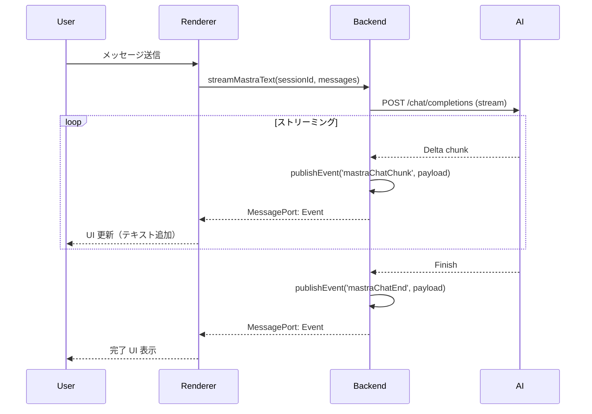

# ドメインイベント設計

本ドキュメントでは、Releio のドメインイベント（Domain Events）を定義し、イベント駆動アーキテクチャの設計を記述する。

- **対象読者**: バックエンド開発者、アーキテクト
- **目的**: 非同期処理・プロセス間通信の明確化、疎結合な設計の実現
- **関連**: `domain-design/aggregates.md`, `domain-design/state-machines.md`, `architecture/integration-patterns.md`

---

## イベント駆動アーキテクチャ概要

Releio では、Backend → Renderer へのイベント配信に **Pub/Sub パターン** を採用する。

```
Backend (Publisher) ---> MessagePort (Channel) ---> Renderer (Subscriber)
```

**特性**:

- **非同期**: Backend は結果を待たずにイベントを発行
- **一方向**: Renderer からの直接応答なし（必要な場合は別 API 呼び出し）
- **型安全**: `AppEvent` 型で全イベントを定義

---

## イベント分類

| カテゴリ     | プレフィックス  | 説明                      | 例                                      |
| ------------ | --------------- | ------------------------- | --------------------------------------- |
| AI チャット  | `mastraChat*`   | AI 応答ストリーミング関連 | `mastraChatChunk`, `mastraChatEnd`      |
| MCP ツール   | `mastraTool*`   | ツール実行関連            | `mastraToolCall`, `mastraToolResult`    |
| HITL 承認    | `toolApproval*` | ツール承認ダイアログ      | `toolApprovalRequest`                   |
| 圧縮         | `compression*`  | 会話圧縮進捗              | `compressionProgress`                   |
| 更新         | `update*`       | 自動更新通知              | `update-available`, `update-downloaded` |
| MCP サーバー | `mcpServer*`    | サーバー状態変化          | `mcpServerStatusChanged`                |

---

## 1. AI チャットイベント

### `mastraChatChunk`

**説明**: AI 応答のテキストチャンク受信

**Payload**:

```typescript
{
  type: EventType.Message,
  payload: {
    sessionId: string,
    streamId: string,
    chunk: string  // テキスト部分（累積ではなく差分）
  }
}
```

**発行タイミング**: AI SDK の `text-delta` イベント受信時

**購読者**: Renderer の `useThread()` フック

**副作用**:

- UI にテキストを逐次追加表示
- チャンクを内部バッファに蓄積

---

### `mastraChatEnd`

**説明**: AI 応答完了

**Payload**:

```typescript
{
  type: EventType.Message,
  payload: {
    sessionId: string,
    streamId: string,
    text: string  // 完全な応答テキスト
  }
}
```

**発行タイミング**: AI SDK の `finish` イベント受信時

**購読者**: Renderer

**副作用**:

- ストリーミング完了 UI 表示
- 「停止」ボタン非表示

---

### `mastraChatError`

**説明**: AI 応答エラー

**Payload**:

```typescript
{
  type: EventType.Message,
  payload: {
    sessionId: string,
    streamId: string,
    error: string  // エラーメッセージ
  }
}
```

**発行タイミング**: AI API エラー or ツール実行失敗時

**購読者**: Renderer

**副作用**:

- エラートースト表示
- エラーメッセージを UI に表示

---

### `mastraChatAborted`

**説明**: ユーザーによるストリーム中断

**Payload**:

```typescript
{
  type: EventType.Message,
  payload: {
    sessionId: string,
    streamId: string
  }
}
```

**発行タイミング**: `abortMastraStream` API 呼び出し成功時

**購読者**: Renderer

**副作用**:

- 「中断されました」UI 表示
- ストリーミング状態クリア

---

## 2. MCP ツールイベント

### `mastraToolCall`

**説明**: AI がツール呼び出しを指示

**Payload**:

```typescript
{
  type: EventType.Message,
  payload: {
    sessionId: string,
    streamId: string,
    toolCallId: string,
    toolName: string,
    input: unknown  // ツール引数（JSON）
  }
}
```

**発行タイミング**: AI SDK の `tool-call` イベント受信時

**購読者**: Renderer

**副作用**:

- ツール実行ログ UI に追加（折りたたみ）
- ローディングスピナー表示

---

### `mastraToolResult`

**説明**: ツール実行結果取得

**Payload**:

```typescript
{
  type: EventType.Message,
  payload: {
    sessionId: string,
    streamId: string,
    toolCallId: string,
    toolName: string,
    output: unknown  // ツール結果（JSON）
  }
}
```

**発行タイミング**: MCP Server からツール結果受信時

**購読者**: Renderer

**副作用**:

- ツール実行ログに結果表示
- ローディングスピナー完了

---

### `toolApprovalRequest` (Phase 3.2)

**説明**: HITL ツール承認ダイアログ表示要求

**Payload**:

```typescript
{
  type: EventType.ToolApproval,
  payload: {
    runId: string,  // Mastra run ID
    toolCallId: string,
    toolName: string,
    toolDescription: string,
    input: unknown,
    serverId: string
  }
}
```

**発行タイミング**: `ToolPermissionService.shouldAutoApproveSync()` が `false` を返した時

**購読者**: Renderer

**副作用**:

- モーダルダイアログ表示
- ユーザーが「承認」or「拒否」選択
- 選択結果を `approveToolCall` / `declineToolCall` API で送信

---

## 3. 圧縮イベント

### `compressionProgress` (Phase 2)

**説明**: 圧縮処理進捗通知

**Payload**:

```typescript
{
  type: EventType.Compression,
  payload: {
    sessionId: string,
    status: 'analyzing' | 'summarizing' | 'saving',
    progress: number  // 0-100
  }
}
```

**発行タイミング**: `CompressionService.autoCompress()` 処理中

**購読者**: Renderer

**副作用**:

- プログレスバー UI 更新

---

### `compressionComplete`

**説明**: 圧縮完了通知

**Payload**:

```typescript
{
  type: EventType.Compression,
  payload: {
    sessionId: string,
    summaryId: string,
    originalTokenCount: number,
    newTokenCount: number,
    compressionRatio: number
  }
}
```

**発行タイミング**: `CompressionService.autoCompress()` 成功時

**購読者**: Renderer

**副作用**:

- トースト通知「圧縮完了（XX% 削減）」
- トークンメーター更新

---

## 4. 自動更新イベント（Main → Renderer）

**注**: Main プロセスから Renderer への従来型 IPC（`webContents.send`）

### `update-available`

**説明**: 新バージョン検出

**Payload**:

```typescript
{
  version: string,
  releaseDate: string,
  releaseName?: string,
  releaseNotes?: string
}
```

**発行タイミング**: `autoUpdater.on('update-available')` イベント

**購読者**: Renderer

**副作用**:

- 画面右上にバナー表示「アップデート vX.X.X が利用可能です」

---

### `update-not-available`

**説明**: 最新版（更新なし）

**Payload**:

```typescript
{
  version: string
}
```

**発行タイミング**: `autoUpdater.on('update-not-available')` イベント

**購読者**: Renderer

**副作用**: ログ記録のみ（UI 通知なし）

---

### `update-download-progress`

**説明**: ダウンロード進捗

**Payload**:

```typescript
{
  percent: number,  // 0-100
  transferred: number,  // バイト
  total: number  // バイト
}
```

**発行タイミング**: `autoUpdater.on('download-progress')` イベント

**購読者**: Renderer

**副作用**: プログレスバー更新

---

### `update-downloaded`

**説明**: ダウンロード完了

**Payload**:

```typescript
{
  version: string,
  releaseDate: string,
  releaseName?: string,
  releaseNotes?: string
}
```

**発行タイミング**: `autoUpdater.on('update-downloaded')` イベント

**購読者**: Renderer

**副作用**: 「今すぐ再起動してインストール」ボタン表示

---

### `update-error`

**説明**: 更新エラー

**Payload**:

```typescript
{
  message: string,
  code?: string
}
```

**発行タイミング**: `autoUpdater.on('error')` イベント

**購読者**: Renderer

**副作用**: エラートースト表示

---

## 5. MCP サーバーイベント（Phase 2）

### `mcpServerStatusChanged`

**説明**: MCP サーバー状態変化

**Payload**:

```typescript
{
  type: EventType.MCPServer,
  payload: {
    serverId: string,
    status: 'running' | 'stopped' | 'error',
    error?: string  // エラー時
  }
}
```

**発行タイミング**: MCP Server プロセスの起動・停止・クラッシュ時

**購読者**: Renderer

**副作用**:

- 設定画面のステータス表示更新
- エラー時は stderr ログ表示

---

## 6. イベント配信フロー

### 例: AI ストリーミング



---

## 7. イベントソーシング（将来検討）

現状、Releio は **Event Notification パターン**（イベントを通知のみに使用）を採用。

**Event Sourcing パターン** への移行可能性:

- **メリット**:
  - 全操作履歴を記録（監査ログ）
  - タイムトラベルデバッグ（過去状態を再現）
  - CQRS との組み合わせで読み取り性能向上
- **デメリット**:
  - 実装複雑度増加
  - ストレージ容量増加
  - イベントスキーマバージョニング必要

**検討事項**:

- `tool_invocations` を Event Store として記録済み
- Phase 2 で HITL 監査ログ要求がある場合、Event Sourcing 検討

---

## 8. イベント命名規則

### パターン

```
{Aggregate}{Action}{Status?}
```

### 例

- `mastraChatChunk`: Mastra Chat の Chunk イベント
- `mastraToolResult`: Mastra Tool の Result イベント
- `compressionComplete`: Compression の Complete イベント

### DO（推奨）

- ✅ **過去形**: `chatMessageCreated` (動作完了後に発行)
- ✅ **明確な名前**: `mastraChatEnd` より `mastraChatCompleted` が明確（ただし既存コードは `End` を使用）
- ✅ **プレフィックス**: 集約名でプレフィックス

### DON'T（非推奨）

- ❌ **曖昧な名前**: `dataChanged`（何のデータか不明）
- ❌ **動詞現在形**: `chatMessageCreate`（進行形か完了か不明）

---

## 9. イベントペイロード設計原則

### 最小限の情報

- ID 参照のみ（エンティティ全体を含めない）
- 例: `{ sessionId: string }` のみ、Message 全体は含めない

### 理由

- **パフォーマンス**: イベントペイロードが大きいと IPC 通信遅延
- **整合性**: イベント時点のスナップショットではなく、最新データを Renderer が取得
- **セキュリティ**: 機密情報をイベントに含めない

### 例外

- ストリーミングデータ（`chunk`）: 即座に表示するため含める
- エラーメッセージ: トースト表示用に含める

---

## 10. イベント型定義（TypeScript）

```typescript
// @common/types.ts

export enum EventType {
  Message = 'message',
  ToolApproval = 'tool_approval',
  Compression = 'compression',
  MCPServer = 'mcp_server',
  Update = 'update'
}

export type AppEvent =
  | { type: EventType.Message; payload: MastraChatChunkPayload }
  | { type: EventType.Message; payload: MastraChatEndPayload }
  | { type: EventType.Message; payload: MastraChatErrorPayload }
  | { type: EventType.Message; payload: MastraToolCallPayload }
  | { type: EventType.Message; payload: MastraToolResultPayload }
  | { type: EventType.ToolApproval; payload: ToolApprovalRequestPayload }
  | { type: EventType.Compression; payload: CompressionCompletePayload }
  | { type: EventType.MCPServer; payload: MCPServerStatusPayload }
// 他のイベント...

export interface MastraChatChunkPayload {
  sessionId: string
  streamId: string
  chunk: string
}

export interface ToolApprovalRequestPayload {
  runId: string
  toolCallId: string
  toolName: string
  toolDescription: string
  input: unknown
  serverId: string
}

// 他のペイロード型...
```

---

## まとめ

Releio のドメインイベント設計:

1. **Event Notification パターン**: イベントは通知のみ、状態は DB で管理
2. **Pub/Sub アーキテクチャ**: Backend → Renderer への一方向イベント配信
3. **型安全**: TypeScript で全イベント・ペイロードを定義
4. **最小ペイロード**: ID 参照のみ、エンティティ全体は含めない
5. **将来拡張**: Event Sourcing への移行可能性を考慮

**次のステップ**:

- サービス層のビジネスロジックを `domain-design/services.md` で整理
- エラー処理戦略を `domain-design/errors.md` で定義
- イベント駆動の統合テストを作成
