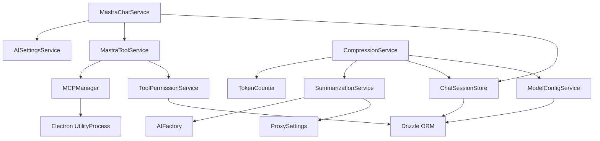

# サービス仕様

本ドキュメントでは、Releio のサービス層（Application Services, Domain Services, Infrastructure Services）を定義し、責務・依存関係・主要ロジックを記述する。

- **対象読者**: バックエンド開発者
- **目的**: サービス層の設計原則、ビジネスロジック配置の明確化
- **関連**: `domain-design/aggregates.md`, `architecture/context-map.md`

---

## サービス分類

### 1. Application Services（アプリケーションサービス）

- **責務**: ユースケースの制御フロー、集約の調整、トランザクション境界
- **依存**: Domain Services, Infrastructure Services, Aggregates
- **例**: `ChatSessionStore`, `MastraChatService`, `CompressionService`

### 2. Domain Services（ドメインサービス）

- **責務**: 複数集約に跨るビジネスロジック、集約に属さないドメインロジック
- **依存**: Aggregates のみ
- **例**: `ToolPermissionService`, `TokenCounter`

### 3. Infrastructure Services（インフラサービス）

- **責務**: 外部システム統合、技術的な詳細の隠蔽
- **依存**: 外部 API, ファイルシステム, ネットワーク
- **例**: `MCP Manager`, `AIFactory`, `ProxySettings`, `CertificateSettings`

---

## 1. Application Services

### 1.1 ChatSessionStore

**責務**: チャットセッション・メッセージの CRUD 操作

**主要メソッド**:

#### `createSession(request: CreateSessionRequest): Promise<string>`

- **引数**: `{ title, providerConfigId?, modelId? }`
- **戻り値**: セッション ID
- **ロジック**:
  1. UUID 生成
  2. `chat_sessions` レコード作成
  3. セッション ID 返却

#### `addMessage(request: AddMessageRequest): Promise<string>`

- **引数**: `{ sessionId, role, parts[] }`
- **戻り値**: メッセージ ID
- **ロジック**:
  1. トランザクション開始
  2. 最大 `sequence` + 1 で新規メッセージ作成
  3. `parts` 配列を `message_parts` に保存
  4. `tool_invocation` / `tool_result` がある場合、`tool_invocations` レコード作成
  5. `chat_sessions.message_count++`, `last_message_at` 更新
  6. コミット

#### `buildAIContext(sessionId: string): Promise<ChatMessageWithParts[]>`

- **引数**: セッション ID
- **戻り値**: AI SDK に渡すメッセージ配列
- **ロジック**:
  1. 最新 `session_snapshots` (kind='summary') 取得
  2. summary があれば `{ role:'system', content: summary }` を先頭に追加
  3. `message_cutoff_id` 以降の `deleted_at IS NULL` メッセージ取得
  4. `message_parts` を JOIN して返却

#### `searchSessions(query: string): Promise<ChatSessionRow[]>`

- **引数**: 検索キーワード
- **戻り値**: 一致したセッション一覧
- **ロジック**:
  1. `chat_messages.content_text LIKE %query%` で検索（Phase 2: FTS5）
  2. 重複除外してセッション一覧返却

**依存**:

- `db` (Drizzle ORM)
- なし（他サービスに依存しない）

---

### 1.2 MastraChatService

**責務**: Mastra Agent によるAI 応答ストリーミング

**主要メソッド**:

#### `getStatus(): Promise<MastraStatus>`

- **戻り値**: `{ ready: boolean, provider?: AIProvider, model?: string, reason?: string }`
- **ロジック**:
  1. `ensureAgent()` 呼び出し
  2. 成功なら `{ ready: true, provider, model }` 返却
  3. 失敗なら `{ ready: false, reason }` 返却

#### `startSession(resourceId?: string): Promise<SessionRecord>`

- **引数**: MCP リソース ID（任意）
- **戻り値**: `{ sessionId, threadId, resourceId, history }`
- **ロジック**:
  1. `sessionId`, `threadId` を UUID 生成
  2. セッションレコード作成、内部マップに保存
  3. 返却

#### `streamText(sessionId, messages, publishEvent, onFinish): Promise<string>`

- **引数**:
  - `sessionId`: Mastra セッション ID
  - `messages`: AIMessage[]
  - `publishEvent`: イベント配信関数
  - `onFinish`: 完了時コールバック
- **戻り値**: stream ID
- **ロジック**:
  1. Mastra Agent 初期化（`ensureAgent()`）
  2. `streamId` を UUID 生成
  3. `AbortController` 作成
  4. 非同期で `runStreaming()` タスク起動
  5. `streamId` を即座に返却（非ブロッキング）

#### `abortStream(streamId: string): boolean`

- **引数**: stream ID
- **戻り値**: 中断成功/失敗
- **ロジック**:
  1. `streamId` で `AbortController` 取得
  2. `abort()` 呼び出し
  3. ストリームマップから削除

**内部メソッド**:

#### `ensureAgent(): Promise<ProviderSelection>`

- **ロジック**:
  1. キャッシュされた Agent があればそれを返却
  2. なければ `AISettingsV2` から有効なプロバイダー取得
  3. Mastra Agent 初期化（モデル設定 + ツール登録）
  4. キャッシュに保存して返却

#### `runStreaming(...): Promise<void>`

- **ロジック**:
  1. `agent.stream()` 呼び出し
  2. `fullStream.getReader()` でチャンク読み取り
  3. `text-delta` → `mastraChatChunk` イベント配信
  4. `tool-call` → `mastraToolCall` イベント配信 + ツール実行
  5. `tool-result` → `mastraToolResult` イベント配信
  6. `finish` → `mastraChatEnd` イベント配信
  7. `onFinish` コールバック呼び出し（メッセージ保存）

**依存**:

- `Mastra Agent`
- `MastraToolService` (ツール変換)
- `AISettingsService` (プロバイダー設定取得)

---

### 1.3 CompressionService

**責務**: 会話圧縮の制御フロー

**主要メソッド**:

#### `checkContext(sessionId, provider, model, additionalInput?): Promise<ContextCheckResult>`

- **引数**: セッション ID, プロバイダー, モデル, 追加入力
- **戻り値**: `{ needsCompression, currentTokenCount, contextLimit, ... }`
- **ロジック**:
  1. `ModelConfigService` からモデル設定取得（`maxInputTokens`）
  2. `CompressionSettings` 取得（閾値・保持トークン数）
  3. `buildAIContext()` で現在のコンテキスト取得
  4. `TokenCounter` でトークン計測
  5. `additionalInput` のトークン加算
  6. `currentTokenCount > thresholdTokenCount` なら `needsCompression=true`
  7. 保持メッセージ数・圧縮可能メッセージ数を計算

#### `autoCompress(options: CompressionOptions): Promise<CompressionResult>`

- **引数**: `{ sessionId, provider, model, apiKey, baseURL?, force?, retentionTokenCount? }`
- **戻り値**: `{ compressed, summaryId?, originalTokenCount, newTokenCount, ... }`
- **ロジック**:
  1. `force=false` の場合、`checkContext()` で圧縮必要性確認
  2. 不要なら `{ compressed: false }` 返却
  3. 保持トークン数を基に、圧縮対象メッセージを決定
  4. `SummarizationService.summarize()` 呼び出し
  5. `TokenCounter` で要約トークン計測
  6. `ChatSessionStore.createSnapshot()` で保存
  7. 圧縮結果返却

#### `getTokenBreakdown(sessionId, mcpTools?): Promise<...>`

- **戻り値**: `{ systemTokens, summaryTokens, regularMessageTokens, toolTokens }`
- **ロジック**:
  1. `buildAIContext()` で現在コンテキスト取得
  2. system メッセージ（summary 以外） / summary / 通常メッセージに分類
  3. MCP ツール定義の JSON を `TokenCounter` で計測
  4. 内訳を返却

**依存**:

- `TokenCounter` (Domain Service)
- `SummarizationService` (Infrastructure Service)
- `ChatSessionStore` (Application Service)
- `ModelConfigService` (Application Service)

---

## 2. Domain Services

### 2.1 ToolPermissionService

**責務**: ツール実行権限の評価

**主要メソッド**:

#### `shouldAutoApproveSync(serverId: string, toolName: string): boolean`

- **引数**: MCP サーバー ID, ツール名
- **戻り値**: 自動承認可否
- **ロジック**:
  1. キャッシュから `tool_permission_rules` 取得（`priority` 昇順）
  2. 各ルールを順次評価:
     - `server_id` マッチ（NULL は全サーバー）
     - `tool_name` 完全一致 or `tool_pattern` ワイルドカードマッチ
  3. 最初にマッチしたルールの `auto_approve` を返す
  4. マッチなしの場合、デフォルト: `false` (要承認)

#### `createRule(input: CreateToolPermissionRuleInput): Promise<ToolPermissionRule>`

- **ロジック**:
  1. `tool_name` XOR `tool_pattern` のバリデーション
  2. UUID 生成、`created_at`, `updated_at` 設定
  3. `tool_permission_rules` に INSERT
  4. キャッシュ無効化

#### `preloadCache(): Promise<void>`

- **ロジック**: DB から全ルール取得 → メモリキャッシュ

**依存**:

- `db` (Drizzle ORM)

---

### 2.2 TokenCounter

**責務**: トークン計測（GPT Tokenizer 使用）

**主要メソッド**:

#### `countText(text: string): number`

- **引数**: テキスト
- **戻り値**: トークン数
- **ロジック**: `gpt-tokenizer` ライブラリで `cl100k_base` エンコーディング

#### `countMessageTokens(message: ChatMessageWithParts): number`

- **引数**: メッセージ
- **戻り値**: トークン数
- **ロジック**:
  1. `role` + `content` をフォーマット
  2. `message_parts` の `content_text` を結合
  3. `countText()` 呼び出し

#### `countConversationTokens(messages: ChatMessageWithParts[]): TokenResult`

- **引数**: メッセージ配列
- **戻り値**: `{ totalTokens, estimatedResponseTokens }`
- **ロジック**:
  1. 各メッセージを `countMessageTokens()` で計測
  2. 合計 + オーバーヘッド（メタデータ用 5トークン/メッセージ）

**依存**:

- `gpt-tokenizer` (npm パッケージ)

---

## 3. Infrastructure Services

### 3.1 MCP Manager

**責務**: MCP サーバープロセス管理、JSON-RPC 通信

**主要メソッド**:

#### `addServer(config: Omit<MCPServerConfig, 'id' | ...>): Promise<Result<string, string>>`

- **ロジック**:
  1. `mcp_servers` に INSERT
  2. `startServer()` 呼び出し（stdio プロセス起動）
  3. サーバー ID 返却

#### `startServer(serverId: string): void`

- **ロジック**:
  1. `UtilityProcess.fork()` でプロセス起動（`command`, `args`, `env`）
  2. stdio で JSON-RPC クライアント作成（`@modelcontextprotocol/sdk`）
  3. `initialize` handshake 実行
  4. プロセスマップに保存

#### `callTool(serverId, toolName, args): Promise<Result<unknown, string>>`

- **ロジック**:
  1. プロセスマップから JSON-RPC クライアント取得
  2. `tools/call` リクエスト送信
  3. レスポンス返却

#### `listTools(serverId): Promise<Result<MCPTool[], string>>`

- **ロジック**:
  1. JSON-RPC クライアントで `tools/list` 呼び出し
  2. ツール一覧返却

**依存**:

- `@modelcontextprotocol/sdk`
- Electron `UtilityProcess`

---

### 3.2 SummarizationService

**責務**: AI を使った会話要約生成

**主要メソッド**:

#### `summarize(options: SummarizationOptions): Promise<string>`

- **引数**: `{ messages, provider, model, apiKey, baseURL?, sessionId, promptTemplate? }`
- **戻り値**: 要約テキスト
- **ロジック**:
  1. `promptTemplate` がなければデフォルトプロンプト使用:
     ```
     以下の会話履歴を簡潔に要約してください。重要なポイントを箇条書きで記述してください。
     ```
  2. `messages` を会話履歴フォーマットに変換
  3. AI API 呼び出し（非ストリーミング）
  4. 要約テキスト返却

**依存**:

- `AIFactory` (AI SDK クライアント生成)
- `createFetchWithProxyAndCertificates` (プロキシ/証明書対応)

---

### 3.3 MastraToolService

**責務**: MCP ツールを Mastra 形式に変換

**主要メソッド**:

#### `getAllToolsWithPermissions(): Promise<MastraToolRecord>`

- **戻り値**: `Record<toolName, MastraTool>`
- **ロジック**:
  1. `MCP Manager.getAllTools()` で全ツール取得
  2. `ToolPermissionService.preloadCache()` で権限ルール事前読み込み
  3. 各ツールを `convertMCPToolToMastra()` で変換
     - `requireApproval` フラグを設定（Phase 3.2）
  4. Mastra Tool レコード返却

#### `convertMCPToolToMastra(toolName, mcpTool, options): MastraTool`

- **ロジック**:
  1. Mastra `createTool()` でツール生成
  2. `inputSchema` は passthrough（JSON Schema を Zod に変換せず）
  3. `execute` 関数で `mcpTool.execute()` をラップ
  4. `requireApproval` フラグ設定

**依存**:

- `@mastra/core/tools`
- `MCP Manager`
- `ToolPermissionService`

---

### 3.4 ModelConfigService

**責務**: AI モデルのメタデータ管理（トークン制限等）

**主要メソッド**:

#### `getConfig(provider, model): Promise<ModelConfig>`

- **戻り値**: `{ maxInputTokens, maxOutputTokens, defaultCompressionThreshold, ... }`
- **ロジック**:
  1. `model_configs` から取得
  2. なければデフォルト値を返却:
     - GPT-4o: `maxInputTokens=128000`, `maxOutputTokens=16384`
     - Claude 3.5 Sonnet: `200000`, `8192`
     - Gemini 1.5 Pro: `1000000`, `8192`
  3. キャッシュに保存

**依存**:

- `db` (Drizzle ORM)

---

## サービス依存関係図



---

## まとめ

Releio のサービス層設計:

1. **Application Services**: ユースケース制御フロー（ChatSessionStore, MastraChatService, CompressionService）
2. **Domain Services**: ドメインロジック（ToolPermissionService, TokenCounter）
3. **Infrastructure Services**: 外部統合（MCP Manager, SummarizationService, AIFactory）

**次のステップ**:

- エラー処理戦略を `domain-design/errors.md` で定義
- データモデルを `data-model/` で詳細化
- API 仕様を `api-specs/` で定義
