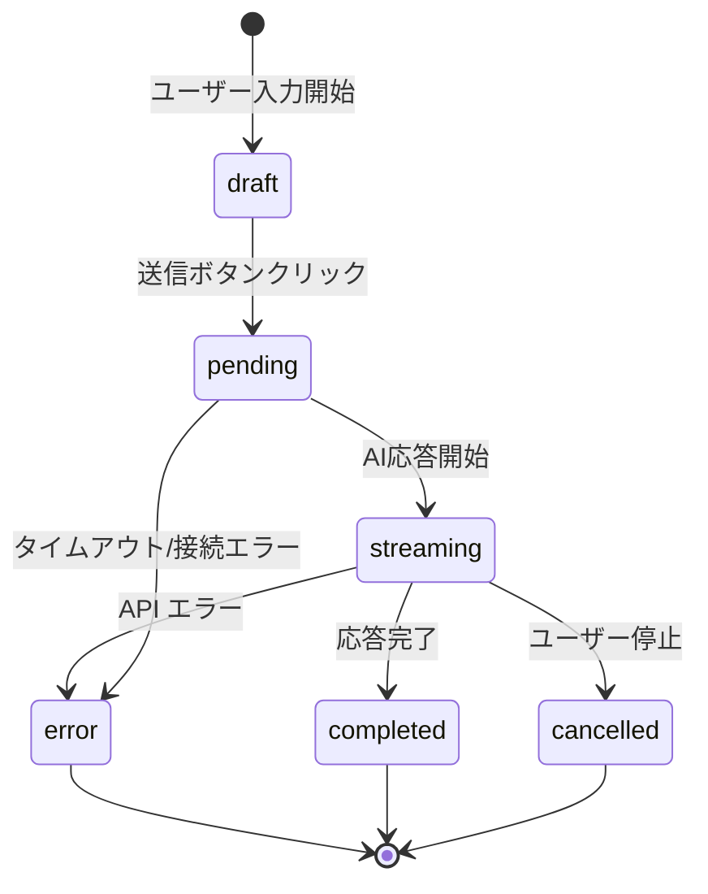
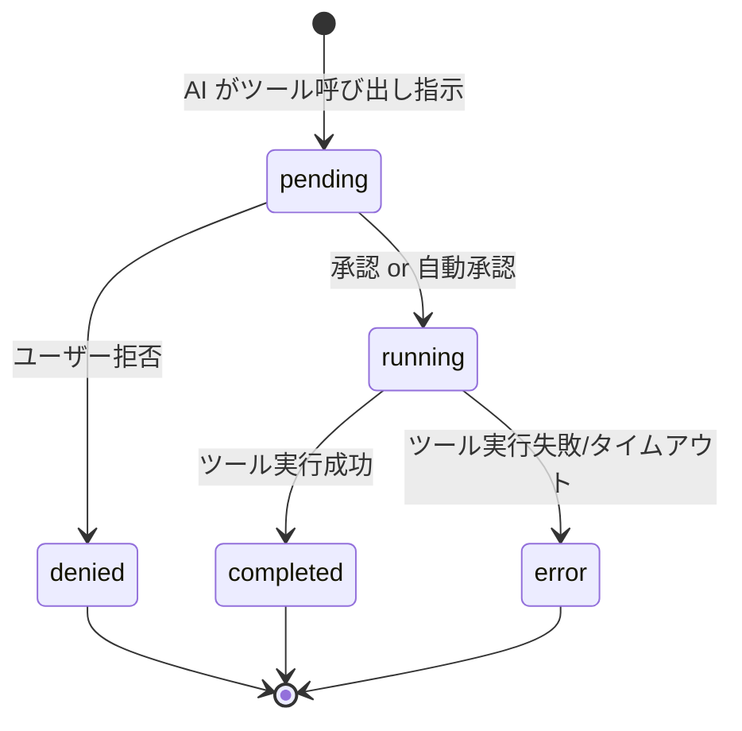
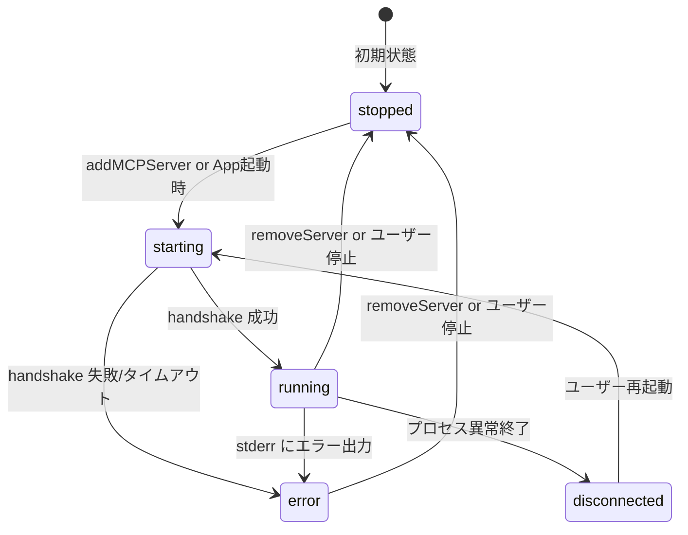
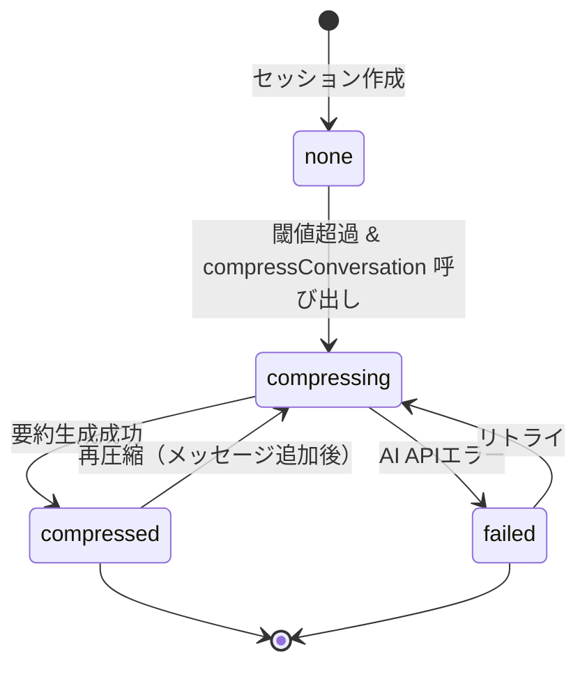
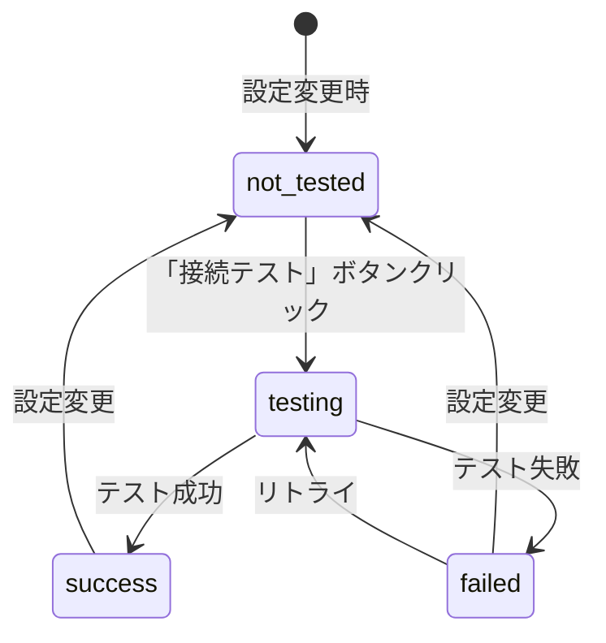

# 状態遷移図（State Machines）

本ドキュメントでは、Releio の主要エンティティにおける状態遷移を定義し、状態変化のトリガー・ガード条件・副作用を記述する。

- **対象読者**: バックエンド開発者、QA
- **目的**: 状態管理ロジックの明確化、不正な状態遷移の防止
- **関連**: `domain-design/aggregates.md`, `domain-design/events.md`

---

## 1. ChatMessage 状態遷移

### 状態定義

| 状態        | 説明                     | データ例                                        |
| ----------- | ------------------------ | ----------------------------------------------- |
| `draft`     | ユーザー入力中（未送信） | UI のみで管理（DB未保存）                       |
| `pending`   | AI 処理待ち              | `state='pending'`, `completed_at=NULL`          |
| `streaming` | AI 応答ストリーミング中  | `state='streaming'`, `completed_at=NULL`        |
| `completed` | 正常完了                 | `state='completed'`, `completed_at=<timestamp>` |
| `error`     | エラー発生               | `state='error'`, `error=<message>`              |
| `cancelled` | ユーザーキャンセル       | `state='cancelled'`                             |

### 状態遷移図



### 遷移条件

#### `draft → pending`

- **トリガー**: `streamMastraText` API 呼び出し
- **ガード**: `role='user'`, `parts.length > 0`
- **副作用**:
  - `chat_messages` に `state='pending'` で INSERT
  - `chat_sessions.message_count++`

#### `pending → streaming`

- **トリガー**: AI から最初のチャンク受信
- **ガード**: なし
- **副作用**:
  - `state='streaming'` に UPDATE
  - `mastraChatChunk` イベント送信

#### `streaming → completed`

- **トリガー**: AI 応答終了（`finish` イベント）
- **ガード**: なし
- **副作用**:
  - `state='completed'`, `completed_at=<now>` に UPDATE
  - `input_tokens`, `output_tokens` 記録（可能な場合）
  - `mastraChatEnd` イベント送信

#### `streaming → error`

- **トリガー**: AI API エラー or ツール実行失敗
- **ガード**: なし
- **副作用**:
  - `state='error'`, `error=<message>` に UPDATE
  - `mastraChatError` イベント送信

#### `streaming → cancelled`

- **トリガー**: `abortMastraStream` API 呼び出し
- **ガード**: `streamId` が存在
- **副作用**:
  - `AbortController.abort()` 実行
  - `state='cancelled'` に UPDATE
  - `mastraChatAborted` イベント送信

#### `pending → error`

- **トリガー**: タイムアウト（30秒） or 接続エラー
- **ガード**: なし
- **副作用**: `error` 状態遷移と同じ

---

## 2. ToolInvocation 状態遷移

### 状態定義

| 状態        | 説明                           | データ例                                     |
| ----------- | ------------------------------ | -------------------------------------------- |
| `pending`   | ツール実行待ち（HITL承認待ち） | `status='pending'`, `started_at=NULL`        |
| `running`   | ツール実行中                   | `status='running'`, `started_at=<timestamp>` |
| `completed` | 正常完了                       | `status='completed'`, `output_json=<result>` |
| `error`     | エラー発生                     | `status='error'`, `error_message=<msg>`      |
| `denied`    | ユーザー拒否（HITL）           | `status='denied'`                            |

### 状態遷移図



### 遷移条件

#### `pending → running`

- **トリガー**: HITL 承認 or 権限ルールで自動承認
- **ガード**: `ToolPermissionService.shouldAutoApprove(serverId, toolName) = true` or ユーザー承認
- **副作用**:
  - `status='running'`, `started_at=<now>` に UPDATE
  - MCP Server に `tools/call` リクエスト送信

#### `pending → denied`

- **トリガー**: `declineToolCall` API 呼び出し
- **ガード**: HITL 有効
- **副作用**:
  - `status='denied'` に UPDATE
  - AI に拒否通知（次のストリーミングで代替案提示）

#### `running → completed`

- **トリガー**: MCP Server から結果受信
- **ガード**: なし
- **副作用**:
  - `status='completed'`, `output_json=<result>`, `completed_at=<now>`, `latency_ms` 記録
  - `result_part_id` に対応する `message_parts` 作成
  - `mastraToolResult` イベント送信

#### `running → error`

- **トリガー**: MCP Server エラー or タイムアウト
- **ガード**: なし
- **副作用**:
  - `status='error'`, `error_code`, `error_message` 記録
  - `mastraToolError` イベント送信（Phase 3.2）

---

## 3. MCPServer 状態遷移（ランタイム）

### 状態定義

| 状態           | 説明           | データ例                         |
| -------------- | -------------- | -------------------------------- |
| `stopped`      | サーバー未起動 | プロセス不在                     |
| `starting`     | 起動中         | プロセス起動済み、handshake 待ち |
| `running`      | 正常稼働中     | handshake 完了、ツール利用可能   |
| `error`        | エラー状態     | stderr にエラーログ              |
| `disconnected` | 接続断         | プロセスクラッシュ or 異常終了   |

**注**: DB `mcp_servers.enabled` とは独立したランタイム状態

### 状態遷移図



### 遷移条件

#### `stopped → starting`

- **トリガー**: `addMCPServer` or アプリ起動時（`enabled=true`）
- **ガード**: `command` が実行可能
- **副作用**:
  - `UtilityProcess.fork()` でプロセス起動
  - stdio 接続開始

#### `starting → running`

- **トリガー**: MCP Server から `initialize` レスポンス受信
- **ガード**: handshake 正常完了
- **副作用**:
  - ツール一覧・リソース一覧を取得
  - UI にステータス表示更新（🟢 Running）

#### `starting → error`

- **トリガー**: handshake タイムアウト（5秒） or エラーレスポンス
- **ガード**: なし
- **副作用**:
  - stderr ログを記録
  - UI にエラー表示（🔴 Stopped + ログ）

#### `running → disconnected`

- **トリガー**: プロセス `exit` イベント
- **ガード**: なし
- **副作用**:
  - UI にステータス表示更新（🔴 Disconnected）
  - 再起動ボタン表示

#### `running / error / disconnected → stopped`

- **トリガー**: `removeMCPServer` or ユーザー手動停止
- **ガード**: なし
- **副作用**:
  - プロセス kill
  - `mcp_servers` レコード削除（remove 時）

---

## 4. SessionSnapshot 状態遷移（圧縮プロセス）

### 状態定義

| 状態          | 説明       | データ例                             |
| ------------- | ---------- | ------------------------------------ |
| `none`        | 圧縮なし   | `session_snapshots` レコード 0 件    |
| `compressing` | 圧縮処理中 | UI ローディング表示                  |
| `compressed`  | 圧縮完了   | `session_snapshots` レコード作成済み |
| `failed`      | 圧縮失敗   | エラーログ記録                       |

**注**: DB には状態カラムなし、ランタイムのみで管理

### 状態遷移図



### 遷移条件

#### `none → compressing`

- **トリガー**: `compressConversation` API 呼び出し
- **ガード**: `currentTokenCount > thresholdTokenCount` or `force=true`
- **副作用**:
  - UI にプログレスバー表示「圧縮中...」

#### `compressing → compressed`

- **トリガー**: `SummarizationService.summarize()` 成功
- **ガード**: なし
- **副作用**:
  - `session_snapshots` レコード作成
  - UI に完了通知「圧縮完了（XX% 削減）」

#### `compressing → failed`

- **トリガー**: AI API エラー or タイムアウト
- **ガード**: なし
- **副作用**:
  - エラーログ記録
  - UI にエラー通知「圧縮に失敗しました」

#### `compressed → compressing` (再圧縮)

- **トリガー**: メッセージ追加後、再度閾値超過
- **ガード**: 既存 snapshot 存在 & 新規トークン超過
- **副作用**: 累積要約を生成（既存 summary を含む）

---

## 5. Auto-Update 状態遷移

### 状態定義

| 状態          | 説明               | UI 表示                                  |
| ------------- | ------------------ | ---------------------------------------- |
| `idle`        | 更新チェック未実施 | なし                                     |
| `checking`    | 更新チェック中     | ローディング（手動チェック時）           |
| `available`   | 更新あり           | 「アップデート vX.X.X が利用可能」バナー |
| `downloading` | ダウンロード中     | プログレスバー                           |
| `downloaded`  | ダウンロード完了   | 「今すぐ再起動してインストール」ボタン   |
| `no-update`   | 更新なし           | なし（ログのみ）                         |
| `error`       | エラー発生         | エラー通知                               |

### 状態遷移図

```mermaid
stateDiagram-v2
    [*] --> idle: App起動
    idle --> checking: 自動チェック(3秒後) or 手動チェック
    checking --> available: 新バージョン検出
    checking --> no-update: 最新版
    checking --> error: ネットワークエラー
    available --> downloading: ダウンロードボタンクリック
    downloading --> downloaded: ダウンロード完了
    downloading --> error: ダウンロード失敗
    downloaded --> [*]: quitAndInstall
    no-update --> idle
    error --> idle: リトライ可能
```

### 遷移条件

#### `idle → checking`

- **トリガー**: アプリ起動3秒後（自動） or 「アップデートを確認」ボタン
- **ガード**: `UpdaterConfig.enabled=true` & 本番環境
- **副作用**: `autoUpdater.checkForUpdates()` 呼び出し

#### `checking → available`

- **トリガー**: `update-available` イベント
- **ガード**: `latestVersion > currentVersion`
- **副作用**:
  - `_isUpdateAvailable = true`
  - UI にバナー表示

#### `checking → no-update`

- **トリガー**: `update-not-available` イベント
- **ガード**: なし
- **副作用**: ログ記録のみ

#### `available → downloading`

- **トリガー**: 「ダウンロード」ボタンクリック
- **ガード**: `_isUpdateAvailable = true`
- **副作用**: `autoUpdater.downloadUpdate()` 呼び出し

#### `downloading → downloaded`

- **トリガー**: `update-downloaded` イベント
- **ガード**: なし
- **副作用**:
  - `_isDownloading = false`
  - UI に「再起動」ボタン表示

#### `downloaded → [*]` (終了)

- **トリガー**: 「再起動」ボタンクリック
- **ガード**: なし
- **副作用**:
  - `_isQuittingToInstall = true`
  - `autoUpdater.quitAndInstall()`
  - アプリ終了 → インストーラー起動

---

## 6. Settings 状態遷移（プロキシ/証明書テスト）

### 状態定義

| 状態         | 説明             | UI 表示                                |
| ------------ | ---------------- | -------------------------------------- |
| `not_tested` | 接続テスト未実施 | 「接続テスト」ボタン                   |
| `testing`    | テスト中         | ローディングスピナー                   |
| `success`    | テスト成功       | 緑チェックマーク ✅                    |
| `failed`     | テスト失敗       | 赤エラーアイコン ❌ + エラーメッセージ |

### 状態遷移図



### 遷移条件

#### `not_tested → testing`

- **トリガー**: `testProxyConnection` or `testCertificateConnection` API 呼び出し
- **ガード**: 設定値が入力済み
- **副作用**: UI にローディング表示

#### `testing → success`

- **トリガー**: テスト URL (`https://api.openai.com`) への接続成功
- **ガード**: HTTP Status 200 or 401（認証エラーは OK）
- **副作用**: UI に緑チェックマーク表示

#### `testing → failed`

- **トリガー**: 接続エラー or タイムアウト
- **ガード**: なし
- **副作用**: UI にエラーメッセージ表示（原因詳細）

---

## まとめ

Releio の主要エンティティ状態遷移:

1. **ChatMessage**: draft → pending → streaming → completed/error/cancelled
2. **ToolInvocation**: pending → running → completed/error/denied
3. **MCPServer**: stopped → starting → running → error/disconnected
4. **SessionSnapshot**: none → compressing → compressed/failed
5. **Auto-Update**: idle → checking → available → downloading → downloaded
6. **Settings Test**: not_tested → testing → success/failed

**次のステップ**:

- 状態遷移に対応するドメインイベントを `domain-design/events.md` で定義
- エラー処理詳細を `domain-design/errors.md` で整理
- サービス層でのビジネスロジックを `domain-design/services.md` で記述
