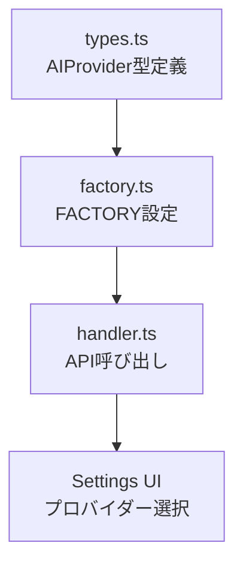
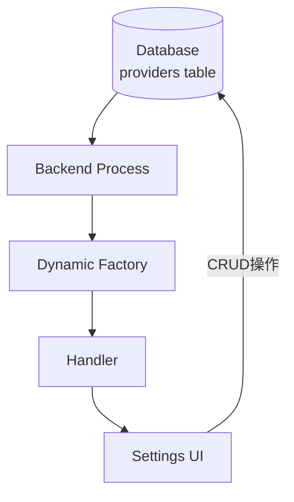

# AI プロバイダー拡張ガイド

このドキュメントでは、新しい AI プロバイダーの追加方法や、既存のプロバイダー設定を拡張する方法について説明します。

## 目次

- [現状のアーキテクチャ](#現状のアーキテクチャ)
- [レベル1: 新しいプロバイダーを追加（シンプル）](#レベル1-新しいプロバイダーを追加シンプル)
- [レベル2: カスタムBaseURLの対応](#レベル2-カスタムbaseurlの対応)
- [レベル3: モデルリストの動的取得](#レベル3-モデルリストの動的取得)
- [レベル4: プロバイダー設定の完全な動的化](#レベル4-プロバイダー設定の完全な動的化)
- [利用可能な AI SDK プロバイダー](#利用可能な-ai-sdk-プロバイダー)

## 現状のアーキテクチャ

### プロバイダーの定義場所



### 現在のコード構成

**対応プロバイダー**: OpenAI, Anthropic (Claude), Google (Gemini)

**使用技術**:
- **Vercel AI SDK v5.0.92** - AI プロバイダーとの統合
- **@ai-sdk/mcp v0.0.8** - MCP サーバー統合（ツール呼び出し）

**主要ファイル**:
- [src/common/types.ts](../src/common/types.ts) - `AIProvider` 型定義
- [src/backend/ai/factory.ts](../src/backend/ai/factory.ts) - プロバイダーファクトリー
- [src/backend/ai/stream.ts](../src/backend/ai/stream.ts) - ストリーミングとツール実行
- [src/backend/handler.ts](../src/backend/handler.ts) - API ハンドラー
- [src/backend/mcp/manager.ts](../src/backend/mcp/manager.ts) - MCP サーバー管理

**現在の制限**:
- モデル名はハードコード
- API キーのみ設定可能
- BaseURL は固定（デフォルト値）

## レベル1: 新しいプロバイダーを追加（シンプル）

最もシンプルな方法で、既存のパターンに従って新しいプロバイダーを追加します。

### 例: Mistral AI を追加

#### 1. パッケージをインストール

```bash
pnpm add @ai-sdk/mistral
```

#### 2. 型定義を更新

[src/common/types.ts](../src/common/types.ts):

```typescript
// Before
export type AIProvider = 'openai' | 'anthropic' | 'google'

// After
export type AIProvider = 'openai' | 'anthropic' | 'google' | 'mistral'
```

[src/common/types.ts](../src/common/types.ts) の `AISettings`:

```typescript
export interface AISettings {
  default_provider?: AIProvider
  openai_api_key?: string
  openai_model?: string
  anthropic_api_key?: string
  anthropic_model?: string
  google_api_key?: string
  google_model?: string
  // 追加
  mistral_api_key?: string
  mistral_model?: string
}
```

#### 3. ファクトリーに追加

[src/backend/ai/factory.ts](../src/backend/ai/factory.ts):

```typescript
import { createMistral } from '@ai-sdk/mistral'

export const FACTORY = {
  openai: { /* ... */ },
  anthropic: { /* ... */ },
  google: { /* ... */ },
  // 追加
  mistral: {
    default: 'mistral-large-latest',
    available: [
      'mistral-large-latest',
      'mistral-medium-latest',
      'mistral-small-latest',
      'open-mistral-7b',
      'open-mixtral-8x7b'
    ],
    createModel: (apiKey: string, model: string) =>
      createMistral({ apiKey })(model)
  }
}
```

#### 4. UI を更新（オプション）

設定画面で Mistral を選択できるようにする場合は、Renderer 側のコンポーネントも更新します。

**完了！** これで Mistral AI が使えるようになります。

---

## レベル2: カスタムBaseURLの対応

OpenAI 互換 API（LocalAI、Ollama、LM Studio など）をサポートするため、BaseURL をカスタマイズできるようにします。

### 実装手順

#### 1. 型定義を拡張

[src/common/types.ts](../src/common/types.ts):

```typescript
export interface AIConfig {
  provider: AIProvider
  model: string
  apiKey: string
  baseURL?: string  // 追加
}

export interface AISettings {
  default_provider?: AIProvider
  openai_api_key?: string
  openai_model?: string
  openai_base_url?: string  // 追加
  anthropic_api_key?: string
  anthropic_model?: string
  anthropic_base_url?: string  // 追加
  // ...
}
```

#### 2. ファクトリーを更新

[src/backend/ai/factory.ts](../src/backend/ai/factory.ts):

```typescript
export const FACTORY = {
  openai: {
    default: 'gpt-4o',
    available: ['gpt-4o', 'gpt-4o-mini', 'gpt-4-turbo', 'gpt-4', 'gpt-3.5-turbo'],
    createModel: (apiKey: string, model: string, baseURL?: string) => {
      const config = baseURL ? { apiKey, baseURL } : { apiKey }
      return createOpenAI(config)(model)
    }
  },
  // 他のプロバイダーも同様に更新
}

// createModel 関数のシグネチャを更新
export function createModel(
  provider: AIProvider,
  apiKey: string,
  model: string,
  baseURL?: string
): LanguageModelV1 {
  const config = FACTORY[provider]
  return config.createModel(apiKey, model, baseURL)
}
```

#### 3. Handler を更新

[src/backend/handler.ts](../src/backend/handler.ts):

設定から `baseURL` を読み取り、`createModel` に渡すように変更します。

```typescript
async streamAIText(messages: AIMessage[]): Promise<Result<string>> {
  const provider = await this.getSetting('default_provider')
  const apiKey = await this.getSetting(`${provider}_api_key`)
  const model = await this.getSetting(`${provider}_model`)
  const baseURL = await this.getSetting(`${provider}_base_url`)  // 追加

  const languageModel = createModel(provider, apiKey, model, baseURL)  // baseURL を渡す
  // ...
}
```

#### 4. UI で BaseURL 入力フィールドを追加

設定画面に BaseURL の入力欄を追加します。

**ユースケース例**:
- OpenAI 互換 API（`http://localhost:1234/v1`）
- Azure OpenAI（`https://your-resource.openai.azure.com/`）
- カスタムプロキシ経由のアクセス

---

## レベル3: モデルリストの動的取得

ハードコードされたモデルリストの代わりに、API から動的に取得します。

### OpenAI の例

OpenAI API では `/v1/models` エンドポイントでモデルリストを取得できます。

#### 実装

[src/backend/ai/factory.ts](../src/backend/ai/factory.ts):

```typescript
export async function listAvailableModel(
  provider: AIProvider,
  apiKey?: string,
  baseURL?: string
): Promise<string[]> {
  const config = FACTORY[provider]

  // 静的リストをフォールバック
  if (!apiKey) {
    return config.available
  }

  // OpenAI の場合は API からモデルリストを取得
  if (provider === 'openai') {
    try {
      const url = baseURL
        ? `${baseURL}/models`
        : 'https://api.openai.com/v1/models'

      const response = await fetch(url, {
        headers: {
          'Authorization': `Bearer ${apiKey}`,
          'Content-Type': 'application/json'
        }
      })

      if (!response.ok) {
        throw new Error(`API request failed: ${response.statusText}`)
      }

      const data = await response.json()
      const models = data.data
        .filter(m => m.id.includes('gpt'))  // GPT モデルのみ
        .map(m => m.id)
        .sort()

      return models.length > 0 ? models : config.available
    } catch (error) {
      logger.warn('Failed to fetch models from API, using static list', { error })
      return config.available
    }
  }

  // その他のプロバイダーは静的リスト
  return config.available
}
```

#### Handler で動的取得を使用

[src/backend/handler.ts](../src/backend/handler.ts):

```typescript
async getAIModels(provider: AIProvider): Promise<Result<string[]>> {
  try {
    const apiKey = await this.getSetting(`${provider}_api_key`)
    const baseURL = await this.getSetting(`${provider}_base_url`)

    const models = await listAvailableModel(provider, apiKey, baseURL)
    return { status: 'ok', value: models }
  } catch (error) {
    return { status: 'error', error }
  }
}
```

**メリット**:
- 最新のモデルが自動的に利用可能
- カスタム API の場合は実際に利用可能なモデルのみ表示
- ハードコードの保守が不要

**注意点**:
- API レート制限に注意
- エラーハンドリングが重要（フォールバック必須）
- プロバイダーごとに API 仕様が異なる

---

## レベル4: プロバイダー設定の完全な動的化

プロバイダー情報をデータベースに保存し、UI から自由に追加・編集できるようにします。

### アーキテクチャ変更



### データベーススキーマの拡張

[src/backend/db/schema.ts](../src/backend/db/schema.ts):

```typescript
export const providers = sqliteTable('providers', {
  id: text('id').notNull().primaryKey(),  // 'openai', 'anthropic', etc.
  name: text('name').notNull(),           // 'OpenAI', 'Anthropic', etc.
  packageName: text('package_name').notNull(),  // '@ai-sdk/openai'
  defaultModel: text('default_model').notNull(),
  availableModels: text('available_models', { mode: 'json' }).notNull(),  // string[]
  apiKeyRequired: integer('api_key_required', { mode: 'boolean' }).notNull().default(true),
  baseURLSupported: integer('base_url_supported', { mode: 'boolean' }).notNull().default(false),
  enabled: integer('enabled', { mode: 'boolean' }).notNull().default(true),
  createdAt: integer('created_at', { mode: 'timestamp' }).notNull(),
  updatedAt: integer('updated_at', { mode: 'timestamp' }).notNull()
})

export const providerConfigs = sqliteTable('provider_configs', {
  id: integer('id').notNull().primaryKey({ autoIncrement: true }),
  providerId: text('provider_id').notNull().references(() => providers.id),
  userId: text('user_id').notNull().default('default'),  // 将来のマルチユーザー対応
  apiKey: text('api_key'),
  model: text('model'),
  baseURL: text('base_url'),
  customOptions: text('custom_options', { mode: 'json' }),  // 拡張用
  createdAt: integer('created_at', { mode: 'timestamp' }).notNull(),
  updatedAt: integer('updated_at', { mode: 'timestamp' }).notNull()
})
```

### 動的ファクトリー

[src/backend/ai/dynamic-factory.ts](../src/backend/ai/dynamic-factory.ts):

```typescript
import { db } from '@backend/db'
import { providers, providerConfigs } from '@backend/db/schema'
import { eq } from 'drizzle-orm'
import type { LanguageModelV1 } from 'ai'

export async function createDynamicModel(
  providerId: string,
  userId: string = 'default'
): Promise<LanguageModelV1> {
  // プロバイダー情報を取得
  const provider = await db
    .select()
    .from(providers)
    .where(eq(providers.id, providerId))
    .get()

  if (!provider) {
    throw new Error(`Provider not found: ${providerId}`)
  }

  // ユーザー設定を取得
  const config = await db
    .select()
    .from(providerConfigs)
    .where(eq(providerConfigs.providerId, providerId))
    .where(eq(providerConfigs.userId, userId))
    .get()

  if (!config) {
    throw new Error(`Provider config not found: ${providerId}`)
  }

  // 動的に SDK を import
  const sdkModule = await import(provider.packageName)
  const createProvider = sdkModule[`create${capitalize(providerId)}`]

  if (!createProvider) {
    throw new Error(`Provider SDK not found: ${provider.packageName}`)
  }

  // プロバイダーインスタンスを作成
  const providerOptions: any = {}
  if (config.apiKey) providerOptions.apiKey = config.apiKey
  if (config.baseURL) providerOptions.baseURL = config.baseURL
  if (config.customOptions) Object.assign(providerOptions, config.customOptions)

  const providerInstance = createProvider(providerOptions)
  const model = providerInstance(config.model || provider.defaultModel)

  return model
}

function capitalize(str: string): string {
  return str.charAt(0).toUpperCase() + str.slice(1)
}
```

### UI での管理

設定画面で以下の操作ができるようにします：

1. **プロバイダー一覧表示**
2. **新規プロバイダー追加**
   - SDK パッケージ名を入力
   - デフォルトモデルを設定
   - API キー・BaseURL の要否を設定
3. **プロバイダーの有効化/無効化**
4. **各プロバイダーの API キー・モデル・BaseURL 設定**

**メリット**:
- コード変更なしで新しいプロバイダーを追加可能
- ユーザーごとに異なる設定を保持
- 将来的なマルチアカウント対応が容易

**デメリット**:
- 実装が複雑
- 動的 import のため TypeScript の型安全性が低下
- セキュリティリスク（任意のパッケージを import）

---

## 利用可能な AI SDK プロバイダー

Vercel AI SDK がサポートする主なプロバイダー：

### 公式プロバイダー

| プロバイダー | パッケージ | 特徴 |
|------------|-----------|------|
| **OpenAI** | `@ai-sdk/openai` | GPT-4o, GPT-4 Turbo など |
| **Anthropic** | `@ai-sdk/anthropic` | Claude 3.5 Sonnet, Opus など |
| **Google** | `@ai-sdk/google` | Gemini 2.0 Pro, Flash など |
| **Mistral** | `@ai-sdk/mistral` | Mistral Large, Medium など |
| **Cohere** | `@ai-sdk/cohere` | Command R+, Command など |
| **Azure OpenAI** | `@ai-sdk/azure` | Azure 経由の OpenAI モデル |
| **Groq** | `@ai-sdk/groq` | 高速推論プラットフォーム |
| **Fireworks** | `@ai-sdk/fireworks` | オープンソースモデルのホスティング |
| **Together AI** | `@ai-sdk/togetherai` | オープンソースモデルの API |

### OpenAI 互換プロバイダー

OpenAI の `createOpenAI()` を `baseURL` 付きで使用：

| プロバイダー | BaseURL | 特徴 |
|------------|---------|------|
| **Ollama** | `http://localhost:11434/v1` | ローカル LLM 実行 |
| **LM Studio** | `http://localhost:1234/v1` | ローカル LLM GUI |
| **LocalAI** | `http://localhost:8080/v1` | OpenAI 互換ローカルサーバー |
| **OpenRouter** | `https://openrouter.ai/api/v1` | 複数 LLM への統一 API |
| **Perplexity** | `https://api.perplexity.ai` | 検索特化型 LLM |

### カスタムプロバイダー

`@ai-sdk/provider` を使って独自のプロバイダーを作成することも可能です。

---

## 推奨アプローチ

プロジェクトの規模と要件に応じて選択してください：

| レベル | 適用ケース | 実装コスト | 柔軟性 |
|-------|----------|-----------|-------|
| **レベル1** | 1〜2個のプロバイダー追加 | 低 | 低 |
| **レベル2** | OpenAI 互換 API 対応 | 中 | 中 |
| **レベル3** | 最新モデルへの自動追随 | 中 | 中 |
| **レベル4** | 完全な動的管理 | 高 | 高 |
| **レベル5** | MCP ツール統合 | 中 | 高 |

**初期段階**: レベル1 または レベル2 を推奨
**プロダクション**: レベル2 + レベル3 の組み合わせが実用的
**エンタープライズ**: レベル4 で完全な柔軟性を実現
**外部ツール連携**: レベル5 で MCP サーバーとの統合

---

## レベル5: MCP ツール統合

AI プロバイダーに外部ツール呼び出し機能を追加します。Model Context Protocol (MCP) サーバーを統合することで、AI がファイルシステム、データベース、API などにアクセスできるようになります。

### MCP とは

**Model Context Protocol (MCP)** は、Anthropic が提唱する AI と外部ツールを接続するための標準プロトコルです。

**主な機能**:
- **Tools**: AI が呼び出せる関数（ファイル読み書き、計算、API 呼び出しなど）
- **Resources**: AI が参照できるデータソース
- **Prompts**: AI に渡すテンプレート

### AI SDK v5 の MCP サポート

本プロジェクトで使用している **Vercel AI SDK v5** は、MCP を公式にサポートしています。

```typescript
import { experimental_createMCPClient } from '@ai-sdk/mcp'
import { Experimental_StdioMCPTransport } from '@ai-sdk/mcp/mcp-stdio'
import { streamText, stepCountIs } from 'ai'

// MCP クライアントを作成
const transport = new Experimental_StdioMCPTransport({
  command: 'npx',
  args: ['-y', '@modelcontextprotocol/server-filesystem', '/path/to/allowed']
})

const mcpClient = await experimental_createMCPClient({ transport })

// ツールを取得（Record<string, Tool> 形式）
const tools = await mcpClient.tools()

// AI にツールを渡してストリーミング
const result = streamText({
  model,
  messages,
  tools,  // MCP ツールをそのまま渡せる
  stopWhen: stepCountIs(10)  // マルチステップツール呼び出し
})
```

### 実装済みの MCP 統合

本プロジェクトには既に MCP 統合が実装されており、以下の機能が利用可能です：

**実装場所**:
- `src/backend/mcp/manager.ts` - MCP サーバーのライフサイクル管理
- `src/backend/ai/stream.ts` - ツール呼び出しとロギング
- `src/backend/handler.ts` - MCP ツールの取得と AI への渡し方

**主な機能**:
- 複数の MCP サーバーの並行管理
- アプリ起動時の自動接続
- マルチステップツール呼び出し（最大10ステップ）
- 詳細なツール実行ログ

**使用例**:

```typescript
// MCPManager からツールを取得
const mcpManager = new MCPManager()
await mcpManager.initialize()  // 設定された全サーバーを起動

const allTools = await mcpManager.getAllTools()
// → Record<string, Tool> 形式で全ツールを取得

// AI にツールを渡す
const sessionId = await streamText(
  config,
  messages,
  publishEvent,
  allTools  // ← MCP ツールを渡す
)
```

### MCP サーバーの追加方法

1. **MCP サーバーをインストール**:
   ```bash
   npm install -g @modelcontextprotocol/server-filesystem
   ```

2. **データベースに設定を追加**:
   アプリの設定画面（MCP Settings）から追加、または直接データベースに書き込み：
   ```typescript
   await mcpManager.addServer({
     name: 'Filesystem',
     command: 'npx',
     args: ['-y', '@modelcontextprotocol/server-filesystem', '/path/to/allowed'],
     enabled: true
   })
   ```

3. **アプリを再起動**:
   自動的に MCP サーバーが起動し、ツールが利用可能になります。

### MCP ツールのロギング

MCP ツールの呼び出しと結果は詳細にログ出力されます：

```
[MCP] 3 tool(s) available for session xyz789
[MCP] Tool: read_file - Read contents of a file
[MCP] Tool: write_file - Write contents to a file
[MCP] Tool: list_directory - List directory contents
[MCP] Tool called: read_file { toolCallId: 'abc123', input: { path: '/foo/bar.txt' } }
[MCP] Tool result received: read_file { toolCallId: 'abc123', output: '...' }
```

### 参考リンク

- **[MCP Integration Design](./MCP_INTEGRATION_DESIGN.md)** - 本プロジェクトの MCP 統合設計
- **[Model Context Protocol](https://modelcontextprotocol.io)** - MCP 公式サイト
- **[Vercel AI SDK - MCP](https://sdk.vercel.ai/docs/ai-sdk-core/mcp)** - AI SDK の MCP サポート
- **[MCP Servers](https://github.com/modelcontextprotocol/servers)** - 公式 MCP サーバー集

---

## 参考リンク

- [Vercel AI SDK - Providers](https://sdk.vercel.ai/providers)
- [AI SDK - Model Providers](https://sdk.vercel.ai/docs/ai-sdk-core/providers)
- [OpenAI Platform - Models](https://platform.openai.com/docs/models)
- [Anthropic - Models](https://docs.anthropic.com/claude/docs/models-overview)
- [Google AI - Gemini Models](https://ai.google.dev/models/gemini)

---

**更新日**: 2025-11-08
