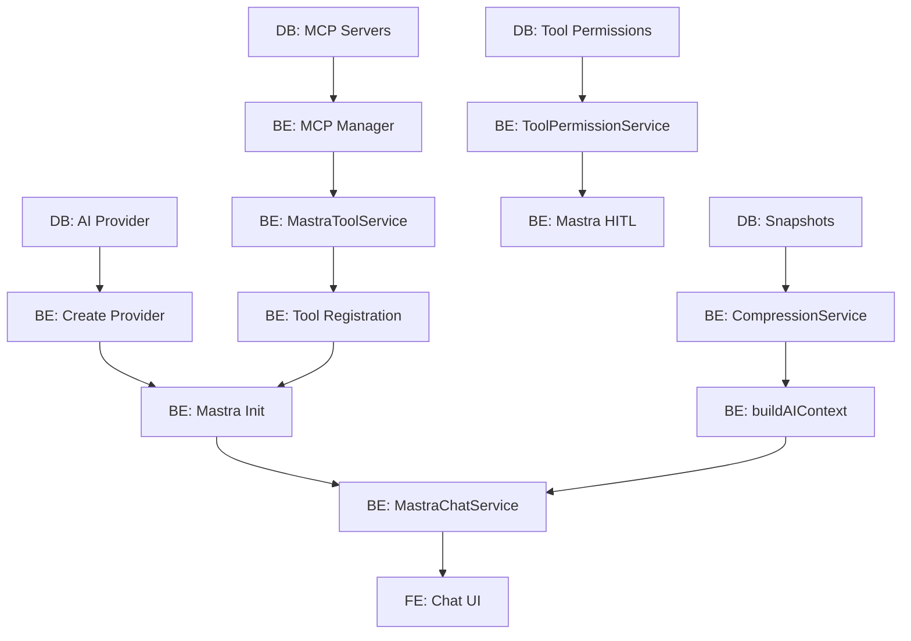

# 機能分解（Feature Breakdown）

本ドキュメントでは、ユーザーストーリーを実装可能なタスクに分解し、依存関係・優先度・見積もりを明示する。

- **対象読者**: 開発チーム、スクラムマスター
- **目的**: スプリント計画、タスク割り当て、進捗管理
- **関連**: `requirements/user-stories.md`, `requirements/traceability.md`

---

## タスク分類

### タスク種別

- **Frontend (FE)**: Renderer プロセス（React UI）
- **Backend (BE)**: Backend プロセス（ビジネスロジック）
- **IPC**: プロセス間通信（Connection 層）
- **DB**: データベース設計・マイグレーション
- **Infra**: ビルド・デプロイ・CI/CD
- **Doc**: ドキュメント作成

### 優先度（MoSCoW）

- **M (Must Have)**: MVP必須
- **S (Should Have)**: 初期リリース推奨
- **C (Could Have)**: Phase 2以降
- **W (Won't Have)**: 将来検討

### 見積もり

- ストーリーポイント（フィボナッチ数列: 1, 2, 3, 5, 8, 13）
- 1ポイント = 約半日作業

---

## エピック 1: AI チャット基盤（US-001 〜 US-003）

### US-001: AI プロバイダー設定

| タスクID | 内容                                                   | 種別  | 優先度 | SP  | 状態    | 依存    |
| -------- | ------------------------------------------------------ | ----- | ------ | --- | ------- | ------- |
| T-001-1  | `ai_provider_configurations` テーブル設計              | DB    | M      | 2   | ✅ Done | -       |
| T-001-2  | `AISettingsV2` 型定義                                  | BE    | M      | 1   | ✅ Done | T-001-1 |
| T-001-3  | `createProviderConfiguration` API 実装                 | BE    | M      | 3   | ✅ Done | T-001-2 |
| T-001-4  | `refreshModelsFromAPI` 実装（OpenAI/Anthropic/Google） | BE    | M      | 5   | ✅ Done | T-001-3 |
| T-001-5  | プロバイダー設定 UI（フォーム・一覧）                  | FE    | M      | 5   | ✅ Done | T-001-3 |
| T-001-6  | モデル一覧取得ボタン UI                                | FE    | M      | 2   | ✅ Done | T-001-4 |
| T-001-7  | エラーハンドリング（無効APIキー）                      | BE/FE | M      | 2   | ✅ Done | T-001-4 |

**合計**: 20 SP  
**完了**: 20 SP (100%)

---

### US-002: AI チャット実行

| タスクID | 内容                                            | 種別  | 優先度 | SP  | 状態    | 依存    |
| -------- | ----------------------------------------------- | ----- | ------ | --- | ------- | ------- |
| T-002-1  | `MastraChatService` 実装                        | BE    | M      | 8   | ✅ Done | -       |
| T-002-2  | Mastra Agent 初期化（AI設定読み込み）           | BE    | M      | 3   | ✅ Done | T-001-3 |
| T-002-3  | `streamMastraText` IPC ハンドラ                 | IPC   | M      | 2   | ✅ Done | T-002-1 |
| T-002-4  | ストリーミングイベント配信（`mastraChatChunk`） | IPC   | M      | 2   | ✅ Done | T-002-3 |
| T-002-5  | チャット UI（Assistant UI 統合）                | FE    | M      | 5   | ✅ Done | T-002-4 |
| T-002-6  | ストリーミング中断（停止ボタン）                | FE/BE | M      | 3   | ✅ Done | T-002-5 |
| T-002-7  | エラーハンドリング（API失敗・レート制限）       | BE/FE | M      | 3   | ✅ Done | T-002-5 |
| T-002-8  | メッセージ DB 保存（`addMessage`）              | BE    | M      | 2   | ✅ Done | T-002-1 |

**合計**: 28 SP  
**完了**: 28 SP (100%)

---

### US-003: 複数セッション管理

| タスクID | 内容                                       | 種別  | 優先度 | SP  | 状態    | 依存    |
| -------- | ------------------------------------------ | ----- | ------ | --- | ------- | ------- |
| T-003-1  | `chat_sessions` テーブル設計               | DB    | M      | 2   | ✅ Done | -       |
| T-003-2  | `ChatSessionStore` 実装（CRUD）            | BE    | M      | 5   | ✅ Done | T-003-1 |
| T-003-3  | セッション一覧 UI（サイドバー）            | FE    | M      | 3   | ✅ Done | T-003-2 |
| T-003-4  | セッション切り替え機能                     | FE    | M      | 2   | ✅ Done | T-003-3 |
| T-003-5  | セッション名変更・削除 UI                  | FE    | M      | 3   | ✅ Done | T-003-3 |
| T-003-6  | 最後のセッション復元（`getLastSessionId`） | BE/FE | S      | 2   | ✅ Done | T-003-2 |

**合計**: 17 SP  
**完了**: 17 SP (100%)

---

## エピック 2: MCP ツール統合（US-004 〜 US-007）

### US-004: MCP サーバー登録

| タスクID | 内容                                      | 種別 | 優先度 | SP  | 状態    | 依存    |
| -------- | ----------------------------------------- | ---- | ------ | --- | ------- | ------- |
| T-004-1  | `mcp_servers` テーブル設計                | DB   | M      | 2   | ✅ Done | -       |
| T-004-2  | `MCP Manager` 実装（stdio通信）           | BE   | M      | 8   | ✅ Done | T-004-1 |
| T-004-3  | `addMCPServer` / `updateMCPServer` API    | BE   | M      | 3   | ✅ Done | T-004-2 |
| T-004-4  | MCP サーバー設定 UI（フォーム）           | FE   | M      | 5   | ✅ Done | T-004-3 |
| T-004-5  | サーバーステータス表示（Running/Stopped） | FE   | M      | 2   | ✅ Done | T-004-4 |
| T-004-6  | stderr ログ表示 UI                        | FE   | S      | 2   | ✅ Done | T-004-5 |
| T-004-7  | ツール一覧・リソース一覧タブ              | FE   | S      | 3   | ✅ Done | T-004-3 |

**合計**: 25 SP  
**完了**: 25 SP (100%)

---

### US-005: MCP ツール自動実行

| タスクID | 内容                                       | 種別  | 優先度 | SP  | 状態    | 依存    |
| -------- | ------------------------------------------ | ----- | ------ | --- | ------- | ------- |
| T-005-1  | `MastraToolService` 実装（MCP→Mastra変換） | BE    | M      | 5   | ✅ Done | T-004-2 |
| T-005-2  | `getAllTools` 実装                         | BE    | M      | 3   | ✅ Done | T-005-1 |
| T-005-3  | Mastra Agent へのツール登録                | BE    | M      | 3   | ✅ Done | T-005-2 |
| T-005-4  | `tool-call` イベント処理                   | BE    | M      | 3   | ✅ Done | T-005-3 |
| T-005-5  | `tool-result` イベント配信                 | IPC   | M      | 2   | ✅ Done | T-005-4 |
| T-005-6  | ツール実行ログ UI（折りたたみ）            | FE    | S      | 3   | ✅ Done | T-005-5 |
| T-005-7  | エラーハンドリング（ツール失敗）           | BE/FE | M      | 2   | ✅ Done | T-005-4 |

**合計**: 21 SP  
**完了**: 21 SP (100%)

---

### US-006: HITL ツール承認

| タスクID | 内容                                      | 種別 | 優先度 | SP  | 状態           | 依存    |
| -------- | ----------------------------------------- | ---- | ------ | --- | -------------- | ------- |
| T-006-1  | `ToolPermissionService` 実装              | BE   | S      | 5   | ✅ Done        | T-004-2 |
| T-006-2  | `shouldAutoApproveSync` 評価ロジック      | BE   | S      | 3   | ✅ Done        | T-006-1 |
| T-006-3  | `toolApprovalRequest` イベント定義        | IPC  | S      | 1   | 🚧 In Progress | T-006-2 |
| T-006-4  | 承認ダイアログ UI                         | FE   | S      | 5   | 📝 To Do       | T-006-3 |
| T-006-5  | `approveToolCall` / `declineToolCall` API | BE   | S      | 3   | 📝 To Do       | T-006-2 |
| T-006-6  | Mastra HITL 統合（Phase 3.2）             | BE   | S      | 5   | 📝 To Do       | T-006-5 |

**合計**: 22 SP  
**完了**: 8 SP (36%)  
**残り**: 14 SP

---

### US-007: ツール権限ルール管理

| タスクID | 内容                                           | 種別 | 優先度 | SP  | 状態    | 依存    |
| -------- | ---------------------------------------------- | ---- | ------ | --- | ------- | ------- |
| T-007-1  | `tool_permission_rules` テーブル設計           | DB   | S      | 2   | ✅ Done | -       |
| T-007-2  | `createRule` / `updateRule` / `deleteRule` API | BE   | S      | 3   | ✅ Done | T-007-1 |
| T-007-3  | ツール権限設定 UI（一覧・フォーム）            | FE   | S      | 5   | ✅ Done | T-007-2 |
| T-007-4  | ルール優先度評価テスト                         | BE   | S      | 2   | ✅ Done | T-007-2 |

**合計**: 12 SP  
**完了**: 12 SP (100%)

---

## エピック 3: 会話圧縮（US-008 〜 US-010）

### US-008: トークン使用量監視

| タスクID | 内容                                  | 種別 | 優先度 | SP  | 状態     | 依存    |
| -------- | ------------------------------------- | ---- | ------ | --- | -------- | ------- |
| T-008-1  | `TokenCounter` 実装                   | BE   | S      | 3   | ✅ Done  | -       |
| T-008-2  | `checkContext` API 実装               | BE   | S      | 3   | ✅ Done  | T-008-1 |
| T-008-3  | `getTokenUsage` IPC ハンドラ          | IPC  | S      | 2   | ✅ Done  | T-008-2 |
| T-008-4  | トークンメーター UI（プログレスバー） | FE   | S      | 3   | ✅ Done  | T-008-3 |
| T-008-5  | トークン内訳ダイアログ UI             | FE   | C      | 2   | 📝 To Do | T-008-4 |
| T-008-6  | 閾値超過通知（トースト）              | FE   | S      | 1   | ✅ Done  | T-008-4 |

**合計**: 14 SP  
**完了**: 12 SP (86%)  
**残り**: 2 SP

---

### US-009: 会話自動圧縮

| タスクID | 内容                                      | 種別  | 優先度 | SP  | 状態     | 依存    |
| -------- | ----------------------------------------- | ----- | ------ | --- | -------- | ------- |
| T-009-1  | `session_snapshots` テーブル設計          | DB    | S      | 2   | ✅ Done  | -       |
| T-009-2  | `SummarizationService` 実装               | BE    | S      | 5   | ✅ Done  | T-009-1 |
| T-009-3  | `CompressionService` 実装（autoCompress） | BE    | S      | 5   | ✅ Done  | T-009-2 |
| T-009-4  | `buildAIContext` 実装（要約挿入）         | BE    | S      | 3   | ✅ Done  | T-009-3 |
| T-009-5  | `compressConversation` IPC ハンドラ       | IPC   | S      | 2   | ✅ Done  | T-009-3 |
| T-009-6  | 圧縮通知 UI（完了・進捗）                 | FE    | S      | 2   | ✅ Done  | T-009-5 |
| T-009-7  | 自動圧縮設定（ON/OFF）                    | BE/FE | S      | 2   | 📝 To Do | T-009-3 |

**合計**: 21 SP  
**完了**: 19 SP (90%)  
**残り**: 2 SP

---

### US-010: 圧縮設定カスタマイズ

| タスクID | 内容                                                    | 種別 | 優先度 | SP  | 状態     | 依存    |
| -------- | ------------------------------------------------------- | ---- | ------ | --- | -------- | ------- |
| T-010-1  | `CompressionSettings` 型定義                            | BE   | C      | 1   | ✅ Done  | -       |
| T-010-2  | `getCompressionSettings` / `setCompressionSettings` API | BE   | C      | 2   | ✅ Done  | T-010-1 |
| T-010-3  | 圧縮設定ダイアログ UI（スライダー）                     | FE   | C      | 3   | 📝 To Do | T-010-2 |
| T-010-4  | セッションごと vs グローバル設定切替                    | FE   | C      | 2   | 📝 To Do | T-010-3 |

**合計**: 8 SP  
**完了**: 3 SP (38%)  
**残り**: 5 SP

---

## エピック 4: エンタープライズネットワーク（US-011 〜 US-012）

### US-011: プロキシ設定

| タスクID | 内容                                        | 種別 | 優先度 | SP  | 状態    | 依存    |
| -------- | ------------------------------------------- | ---- | ------ | --- | ------- | ------- |
| T-011-1  | `ProxySettings` 型定義                      | BE   | S      | 1   | ✅ Done | -       |
| T-011-2  | `setProxySettings` / `getProxySettings` API | BE   | S      | 2   | ✅ Done | T-011-1 |
| T-011-3  | `getSystemProxySettings` 実装（OS検出）     | BE   | S      | 3   | ✅ Done | T-011-1 |
| T-011-4  | `testProxyConnection` 実装                  | BE   | S      | 3   | ✅ Done | T-011-2 |
| T-011-5  | プロキシ設定 UI（フォーム）                 | FE   | S      | 3   | ✅ Done | T-011-2 |
| T-011-6  | 接続テストボタン UI                         | FE   | S      | 2   | ✅ Done | T-011-4 |

**合計**: 14 SP  
**完了**: 14 SP (100%)

---

### US-012: カスタム証明書設定

| タスクID | 内容                                                    | 種別 | 優先度 | SP  | 状態    | 依存             |
| -------- | ------------------------------------------------------- | ---- | ------ | --- | ------- | ---------------- |
| T-012-1  | `CertificateSettings` 型定義                            | BE   | S      | 1   | ✅ Done | -                |
| T-012-2  | `setCertificateSettings` / `getCertificateSettings` API | BE   | S      | 2   | ✅ Done | T-012-1          |
| T-012-3  | `getSystemCertificateSettings` 実装（Windows）          | BE   | S      | 3   | ✅ Done | T-012-1          |
| T-012-4  | `testCertificateConnection` 実装                        | BE   | S      | 2   | ✅ Done | T-012-2          |
| T-012-5  | 証明書設定 UI（ファイル選択）                           | FE   | S      | 3   | ✅ Done | T-012-2          |
| T-012-6  | `createFetchWithProxyAndCertificates` 統合              | BE   | S      | 3   | ✅ Done | T-011-2, T-012-2 |

**合計**: 14 SP  
**完了**: 14 SP (100%)

---

## エピック 5: ユーザビリティ（US-013 〜 US-015）

### US-013: 初回セットアップウィザード

| タスクID | 内容                             | 種別  | 優先度 | SP  | 状態     | 依存    |
| -------- | -------------------------------- | ----- | ------ | --- | -------- | ------- |
| T-013-1  | ウィザード UI（ステップ形式）    | FE    | C      | 5   | 📝 To Do | -       |
| T-013-2  | プロバイダー選択画面             | FE    | C      | 2   | 📝 To Do | T-013-1 |
| T-013-3  | API キー入力 + 検証              | FE/BE | C      | 2   | 📝 To Do | T-013-1 |
| T-013-4  | モデル選択画面（デフォルト推奨） | FE    | C      | 2   | 📝 To Do | T-013-3 |
| T-013-5  | `setup_completed` フラグ管理     | BE    | C      | 1   | 📝 To Do | T-013-1 |

**合計**: 12 SP  
**残り**: 12 SP (0% 完了)

---

### US-014: 会話履歴検索

| タスクID | 内容                                         | 種別 | 優先度 | SP  | 状態     | 依存    |
| -------- | -------------------------------------------- | ---- | ------ | --- | -------- | ------- |
| T-014-1  | `searchChatSessions` API 実装（LIKE クエリ） | BE   | S      | 2   | ✅ Done  | -       |
| T-014-2  | 検索ボックス UI（debounce）                  | FE   | S      | 2   | ✅ Done  | T-014-1 |
| T-014-3  | 検索結果表示 UI（ハイライト）                | FE   | S      | 2   | ✅ Done  | T-014-2 |
| T-014-4  | FTS5 仮想テーブル導入（Phase 2）             | DB   | C      | 3   | 📝 To Do | T-014-1 |

**合計**: 9 SP  
**完了**: 6 SP (67%)  
**残り**: 3 SP

---

### US-015: 会話履歴エクスポート

| タスクID | 内容                                          | 種別 | 優先度 | SP  | 状態     | 依存    |
| -------- | --------------------------------------------- | ---- | ------ | --- | -------- | ------- |
| T-015-1  | `exportSession` API 実装（JSON/CSV/Markdown） | BE   | C      | 3   | 📝 To Do | -       |
| T-015-2  | エクスポートダイアログ UI                     | FE   | C      | 2   | 📝 To Do | T-015-1 |
| T-015-3  | ファイル保存ダイアログ統合                    | FE   | C      | 2   | 📝 To Do | T-015-2 |

**合計**: 7 SP  
**残り**: 7 SP (0% 完了)

---

## エピック 6: 自動更新（US-016）

### US-016: 自動更新通知・インストール

| タスクID | 内容                       | 種別  | 優先度 | SP  | 状態    | 依存    |
| -------- | -------------------------- | ----- | ------ | --- | ------- | ------- |
| T-016-1  | `Updater` クラス実装       | BE    | S      | 5   | ✅ Done | -       |
| T-016-2  | `electron-updater` 統合    | BE    | S      | 3   | ✅ Done | T-016-1 |
| T-016-3  | 自動更新チェック（起動時） | BE    | S      | 2   | ✅ Done | T-016-2 |
| T-016-4  | 更新通知 UI（バナー）      | FE    | S      | 2   | ✅ Done | T-016-2 |
| T-016-5  | ダウンロード進捗バー UI    | FE    | S      | 2   | ✅ Done | T-016-4 |
| T-016-6  | `quitAndInstall` 実装      | BE    | S      | 2   | ✅ Done | T-016-2 |
| T-016-7  | GitHub Releases 連携テスト | Infra | S      | 2   | ✅ Done | T-016-2 |

**合計**: 18 SP  
**完了**: 18 SP (100%)

---

## 全体サマリー

| エピック            | 合計 SP | 完了 SP | 残り SP | 進捗率  |
| ------------------- | ------- | ------- | ------- | ------- |
| 1. AI チャット基盤  | 65      | 65      | 0       | 100%    |
| 2. MCP ツール統合   | 80      | 66      | 14      | 83%     |
| 3. 会話圧縮         | 43      | 34      | 9       | 79%     |
| 4. ネットワーク対応 | 28      | 28      | 0       | 100%    |
| 5. ユーザビリティ   | 28      | 6       | 22      | 21%     |
| 6. 自動更新         | 18      | 18      | 0       | 100%    |
| **合計**            | **262** | **217** | **45**  | **83%** |

---

## 依存関係グラフ（主要タスク）

---

## 次フェーズ計画

### Phase 2 (残り 45 SP)

**優先順位順**:

1. **HITL 完成** (14 SP) - US-006
2. **圧縮 UI 改善** (9 SP) - US-008, US-009, US-010
3. **初回ウィザード** (12 SP) - US-013
4. **エクスポート機能** (7 SP) - US-015
5. **FTS5 検索** (3 SP) - US-014

**見積もり**: 2-3 スプリント（1スプリント = 20-25 SP）

---

## 次のステップ

- 本分解を基にスプリントバックログ作成
- タスクを GitHub Issues / Jira に登録
- 依存関係を考慮して実装順序を決定
- 各タスクに担当者をアサイン
