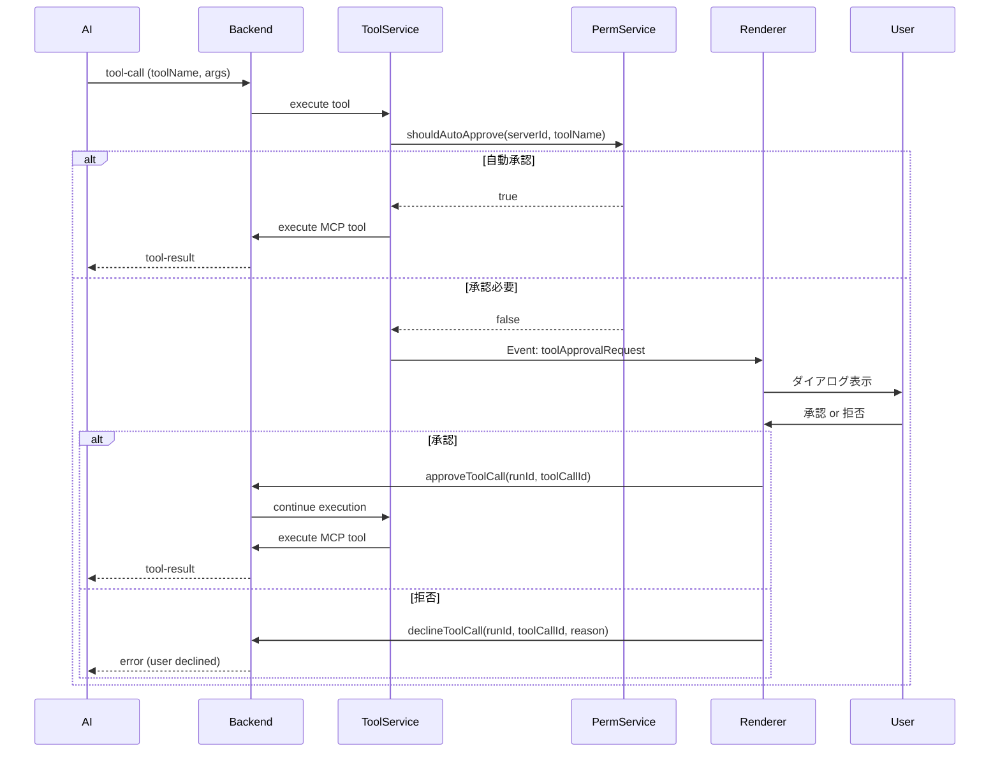

# HITL（Human-in-the-Loop）設計

Releio のツール実行承認フロー・権限ルール・監査ログ設計を記述する。

---

## HITL 概要

AI がツールを実行する前に、ユーザーの明示的な承認を得る仕組み。

**目的**:

- 意図しない操作の防止（ファイル削除・外部API課金）
- セキュリティポリシー準拠
- ツール実行の監査ログ記録

---

## 権限モード

| モード             | 説明                       | 設定方法                               |
| ------------------ | -------------------------- | -------------------------------------- |
| `auto_approve`     | 自動承認（ダイアログなし） | `tool_permission_rules.auto_approve=1` |
| `require_approval` | 承認必須（ダイアログ表示） | `tool_permission_rules.auto_approve=0` |
| `deny`             | 拒否（実行不可）           | 未実装（Phase 3）                      |

---

## 権限ルール評価

### ルール構造

```typescript
{
  id: string,
  serverId: string | null,  // null = 全サーバー
  toolName: string | null,  // 完全一致
  toolPattern: string | null,  // ワイルドカード (例: "delete_*")
  autoApprove: 0 | 1,
  priority: number  // 昇順で評価
}
```

### 評価ロジック

1. `priority` 昇順でルール取得
2. `serverId` マッチング（NULL は全サーバー）
3. `toolName` 完全一致 or `toolPattern` ワイルドカードマッチ
4. 最初にマッチしたルールの `autoApprove` を返す
5. マッチなし → デフォルト: `require_approval`

### 例

```typescript
// ルール例
;[
  { priority: 1, serverId: null, toolPattern: 'delete_*', autoApprove: 0 },
  { priority: 2, serverId: 'fs-server', toolName: 'read_file', autoApprove: 1 },
  { priority: 10, serverId: null, toolName: '*', autoApprove: 0 }
]

// 評価結果
ToolPermissionService.shouldAutoApprove('fs-server', 'delete_file') // false (priority 1)
ToolPermissionService.shouldAutoApprove('fs-server', 'read_file') // true (priority 2)
ToolPermissionService.shouldAutoApprove('other-server', 'random_tool') // false (priority 10)
```

---

## 承認フロー（Phase 3.2 実装予定）



---

## 承認ダイアログ UI

**表示内容**:

- ツール名
- サーバー名
- 引数（JSON整形表示）
- 危険度表示（ファイル削除・外部API課金は赤警告）

**アクション**:

- 承認
- 拒否
- 今後このツールは自動承認（権限ルール作成）

---

## 監査ログ

**記録内容** (`tool_invocations` テーブル):

- `tool_name`: ツール名
- `input_json`: 引数
- `output_json`: 結果
- `status`: pending / running / completed / error / denied
- `started_at`, `completed_at`: 実行時刻
- `latency_ms`: 実行時間

**Phase 2 拡張**:

- 承認/拒否イベントの記録
- CSV エクスポート機能

---

## セキュリティ考慮事項

1. **デフォルト拒否**: ルールマッチなしの場合、承認必須
2. **優先度制御**: 危険ツールを高優先度で明示的に制御
3. **監査ログ**: 全実行履歴を記録、削除不可
4. **タイムアウト**: ツール実行は 30秒でタイムアウト

---

## 次のステップ

- Phase 3.2 で Mastra HITL API 統合
- 承認ダイアログ UI 実装
- 監査ログエクスポート機能（CSV/JSON）
