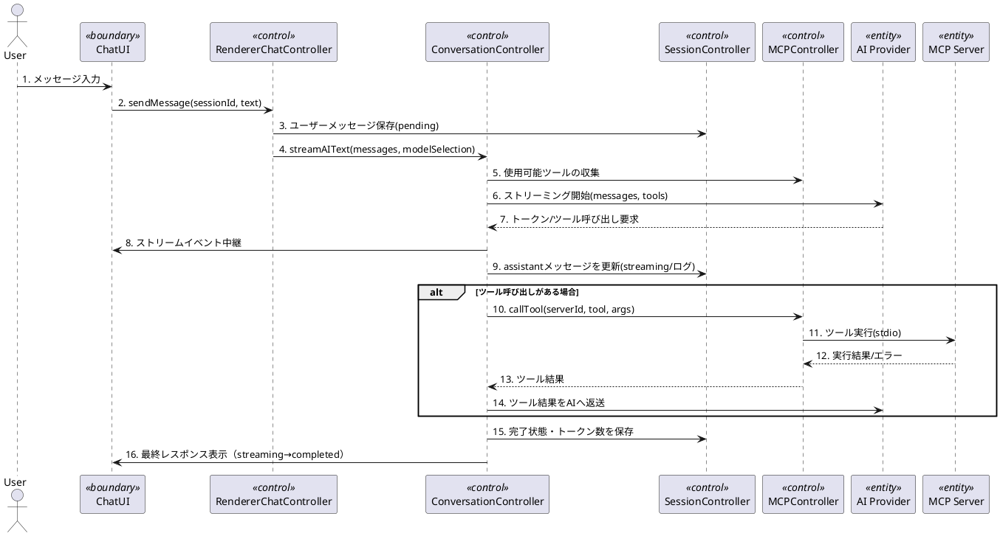
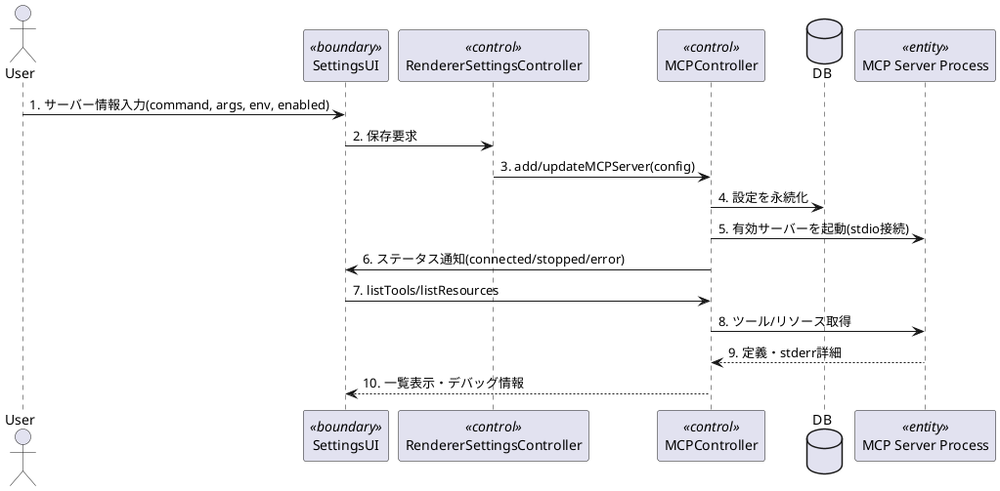

# ユースケース実現（UC-01, UC-04）―方向づけフェーズ版

アーキテクチャ上重要と判断したユースケース2件について、方向づけフェーズ向けの荒削りな実現シナリオを示します。バウンダリ/コントロール/エンティティは分析モデル（`docs_UP/分析_分析モデル.md`）に対応します。

## UC-01: AIと会話する（ストリーミング + MCPツール呼び出し）

### シナリオ概要
- ユーザーがチャット画面からメッセージを送信する。
- RendererはBackendへストリーミング要求を送り、Backendがモデル選択・MCPツール連携を調停する。
- AIプロバイダーからのトークンとツール呼び出し要求を逐次UIへ反映し、永続化する。

### シーケンス（ラフ）

### 留意点
- モデル選択とAPIキー解決は`AISettingsV2`（プロバイダー設定）を優先し、Fallbackとして旧設定を使う。
- コンテキスト長の確認と圧縮判断は`CompressionController`が行い、必要に応じてスナップショットを追加する。
- 失敗時はストリーム停止・エラーイベントを即時UIに返し、セッション側にエラーを記録する。

## UC-04: MCPサーバーを管理する（登録と起動）

### シナリオ概要
- ユーザーがMCPサーバー設定を追加・有効化し、提供ツール/リソースを取得する。
- Backendがサーバープロセスを起動し、状態変化をRendererへ通知する。

### シーケンス（ラフ）

### 留意点
- サーバーごとの状態（connected/stopped/error）は`statusEmitter`経由で全Rendererへブロードキャストされる。
- stderr/exitコードなどのデバッグ情報は、エラー時にUIへ返却し設定見直しを促す。
- AIストリーミングは有効なMCPツール一覧を毎回集約するため、UC-01とUC-04の連携点としてMCP設定の正確性が重要。
