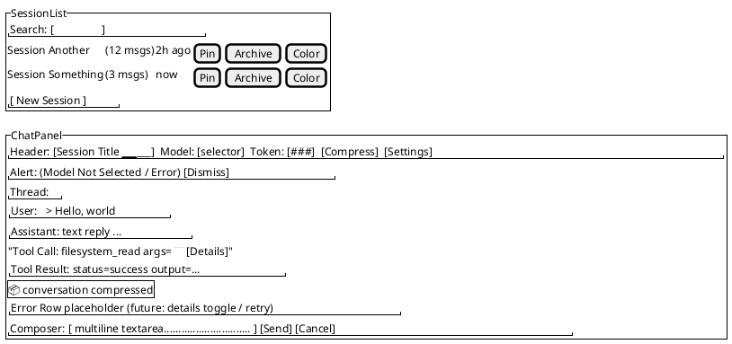

# ユーザーインターフェイスのプロトタイプ（方向づけ版）

目的: 統一プロセスの「UIプロトタイプ」成果物として、主要画面のレイアウト案とインタラクション要件を共有する。Shadcn/ui + Assistant UI（New Yorkスタイル）を前提とし、現在の実装方針と齟齬なく進めるための骨子を示す。

## スコープと前提
- 対象: チャット画面（セッション一覧＋スレッド）、設定画面（AI/ネットワーク/MCP/アップデート）、圧縮確認ダイアログ、エラー表示パターン。
- 技術前提: React 19, TypeScript, Tailwind CSS 4, assistant-ui, Shadcn/ui, Lucide Icons。
- 非目標: 高忠実度デザインやテーマ差分。現時点では骨子と主要コンポーネント構成のみ。

## 画面プロトタイプ（テキストスケッチ）

### 1) チャット画面（メイン）
- レイアウト: 左サイドバー「SessionList」、右ペイン「ChatPanel」。
- ヘッダー: セッションタイトル、モデル選択（ModelSelector）、圧縮ボタン、設定アイコン。
- メッセージ領域: assistant-ui Thread。ユーザー/アシスタント/システムに加え、ツール呼び出しカードを折りたたみ表示。
- エラー表示: `MessagePrimitive.Error`で簡易警告行を表示。将来的に「詳細」トグルと入力復元ボタンを追加する余白を確保。
- 入力バー: テキストエリア＋送信/中止ボタン。圧縮マーカーを挿入可能なスペースを確保。

### 2) セッション一覧（サイドバー）
- コンテンツ: セッションタイトル、最終更新、メッセージ数、ピン/アーカイブ/カラー表示。
- 操作: 新規作成、リネーム、削除（確認ダイアログ）、検索フィールド（タイトル部分一致）。
- 状態: アクティブ行の強調表示。アーカイブ表示のON/OFFトグル。

### 3) 設定画面
- セクション: AIプロバイダー設定、ネットワーク（プロキシ/証明書/接続テスト）、MCPサーバー、アップデート。
- フォーム: Shadcnフォームコンポーネント。APIキー必須時は保存前バリデーション。
- テスト結果: 成功/警告/エラーのバッジ＋詳細テキスト。長文は折りたたみ。

### 4) 圧縮確認ダイアログ
- 情報: 現在トークン数、しきい値、圧縮後予測、圧縮可否理由。
- アクション: 圧縮実行、キャンセル。実行後はセッション再読込をトリガー。

### 5) エラーパターン（将来拡張スペース込み）
- チャット送信失敗: スレッド内に警告カード、入力欄への自動復元スペース（現状未実装）。
- ネットワーク/設定エラー: 設定画面でアラートブロック＋リトライボタン。
- バックエンド断: 画面全体のフェイルセーフ（再接続案内、リロード誘導）。

## PlantUML ワイヤフレーム（Salt）

## インタラクション要件（抜粋）
- モデル未選択時: チャットペインに警告アラートを出し、送信を無効化。
- セッション切替時: メッセージ履歴を即座に再構築し、ロード中インジケータを表示。
- ツール呼び出し: 呼び出し/結果を折りたたみカードで表示し、ログ長は省略表示＋展開。
- エラー詳細: 将来的に「詳細を表示/隠す」トグルを導入できるよう余白を確保。

## 次ステップ
- 高忠実度モックの作成（Figma等）とアクセシビリティ確認。
- チャットエラーUXの詳細仕様（入力復元、詳細トグル、再送導線）を詰め、設計/実装タスクに分解。
- 圧縮ダイアログの操作ログ/警告メッセージ（圧縮不要時の文言）を具体化。
