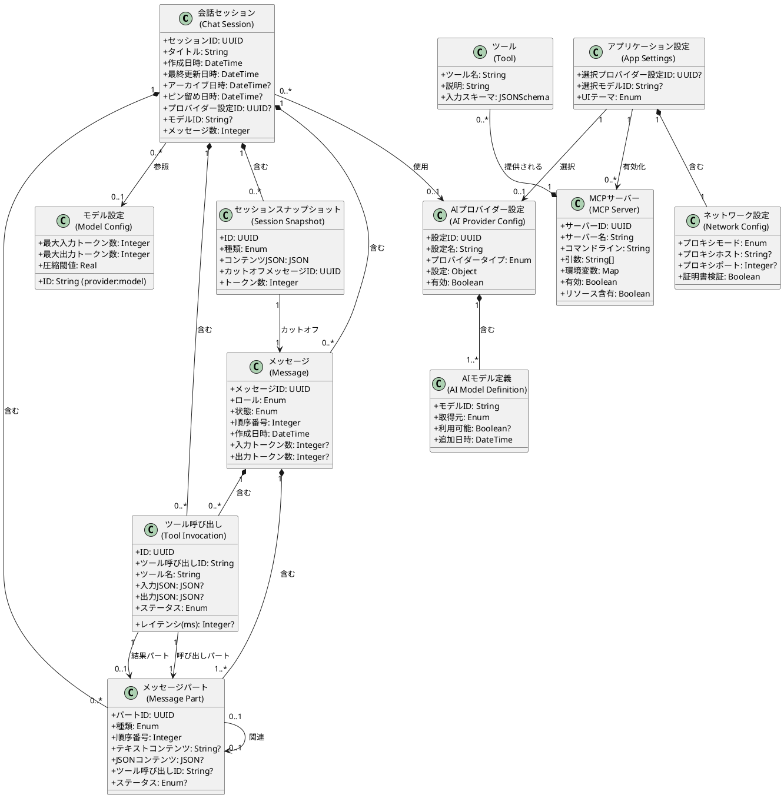

# ドメインモデル（Domain Model）

> システムの外界を表現し、ビジネスエンティティやそれらの関係を含むモデル。

本文書は、Electron AI Starter Templateプロジェクトにおけるドメインモデルを記述したものです。このモデルは、システムが扱う主要な概念とそれらの関係を明確化し、要求の理解を深めるための基礎となります。

---

## 1. ドメインの概要

本システムは、**AIチャットアプリケーション**のドメインに属します。主要な概念は以下の通りです：

- **会話（Conversation）**: ユーザーとAIプロバイダー間の一連のメッセージ交換
- **メッセージ（Message）**: 会話を構成する個々の発言（ユーザーまたはAI）
- **メッセージパート（Message Part）**: メッセージの原子的なコンテンツブロック
- **AIプロバイダー（AI Provider）**: 会話のレスポンスを生成する外部サービス
- **ツール（Tool）**: AIが会話中に使用できる外部機能
- **設定（Configuration）**: システムの動作を制御するパラメータ

---

## 2. 主要なドメインエンティティ

### 2.1 会話セッション（Chat Session）

**概念**: ユーザーとAI間の独立した会話の単位。

**属性**:
- セッションID: UUID（一意識別子）
- タイトル: String
- 作成日時: DateTime
- 最終更新日時: DateTime
- 最終メッセージ日時: DateTime（nullable）
- **アーカイブ日時: DateTime（nullable）** ⭐
- **ピン留め日時: DateTime（nullable）** ⭐
- **プロバイダー設定ID: UUID（nullable）** ⭐
- **モデルID: String（nullable）** ⭐
- **メッセージ数: Integer（デフォルト: 0）** ⭐
- **データスキーマバージョン: Integer（デフォルト: 1）** ⭐
- **サマリ: JSON（nullable）** ⭐
- **サマリ更新日時: DateTime（nullable）** ⭐
- **色: String（nullable）** ⭐
- **メタデータ: JSON（nullable）** ⭐

⭐: 実装で追加された属性

**関連**:
- 1つの会話セッションは、複数のメッセージを含む
- 1つの会話セッションは、複数のメッセージパートを含む
- 1つの会話セッションは、複数のツール呼び出しを含む
- 1つの会話セッションは、複数のセッションスナップショットを含む
- 1つの会話セッションは、0または1つのAIプロバイダー設定を参照する
- 1つの会話セッションは、0または1つのモデル設定を参照する

**ビジネスルール**:
- **一意性**: 各会話セッションは一意のIDを持つ
- **時系列性**: メッセージは作成日時（またはsequence）順に並べられる
- **完全性**: 会話セッションが削除されると、含まれる全てのメッセージ、メッセージパート、ツール呼び出しも削除される（カスケード削除）
- **アーカイブ**: archivedAtがnullでない場合、セッションはアーカイブされている
- **ピン留め**: pinnedAtがnullでない場合、セッションはピン留めされている
- **メッセージ数キャッシュ**: messageCountは、パフォーマンス最適化のためにメッセージ数をキャッシュする

---

### 2.2 メッセージ（Message）

**概念**: 会話セッション内の個々の発言。複数のメッセージパートから構成される。

**属性**:
- メッセージID: UUID（一意識別子）
- セッションID: UUID（外部キー）
- ロール: Enum(user, assistant, system, **tool**) ⭐
- **状態: Enum(pending, streaming, completed, error)** ⭐
- **順序番号: Integer** ⭐
- 作成日時: DateTime
- **完了日時: DateTime（nullable）** ⭐
- **入力トークン数: Integer（nullable）** ⭐
- **出力トークン数: Integer（nullable）** ⭐
- **エラー: JSON（nullable）** ⭐
- **メタデータ: JSON（nullable）** ⭐
- **親メッセージID: UUID（nullable）** ⭐
- **削除日時: DateTime（nullable）** ⭐

⭐: 実装で追加された属性

**関連**:
- 1つのメッセージは、1つの会話セッションに属する
- 1つのメッセージは、1個以上のメッセージパートを含む
- 1つのメッセージは、0個以上のツール呼び出しを含む
- 1つのメッセージは、0または1つの親メッセージを参照する

**ビジネスルール**:
- **ロール制約**: メッセージのロールは、user、assistant、system、toolのいずれかである
- **順序性**: 通常、userメッセージの後にassistantメッセージが続く
- **状態遷移**: pending → streaming → completed または error
- **トークン制限**: 会話セッション全体のトークン数が、選択されたモデルのコンテキストウィンドウを超える場合、圧縮が必要
- **論理削除**: deletedAtがnullでない場合、メッセージは論理削除されている
- **順序保証**: sequenceは、セッション内でメッセージの順序を保証する

---

### 2.3 メッセージパート（Message Part）⭐

**概念**: メッセージの原子的なコンテンツブロック。メッセージは複数のパートから構成される。

**属性**:
- パートID: UUID（一意識別子）
- メッセージID: UUID（外部キー）
- セッションID: UUID（外部キー）
- 種類: Enum(text, tool_invocation, tool_result, attachment, metadata)
- 順序番号: Integer
- テキストコンテンツ: String（nullable）
- JSONコンテンツ: JSON（nullable）
- MIMEタイプ: String（nullable）
- サイズ（バイト）: Integer（nullable）
- ツール呼び出しID: String（nullable）
- ツール名: String（nullable）
- ステータス: Enum(pending, running, success, error, canceled)（nullable）
- エラーコード: String（nullable）
- エラーメッセージ: String（nullable）
- 関連パートID: UUID（nullable）
- メタデータ: JSON（nullable）
- 作成日時: DateTime
- 更新日時: DateTime

**パートの種類**:
- **text**: テキストコンテンツ
- **tool_invocation**: ツール呼び出し（AIからの要求）
- **tool_result**: ツール実行結果
- **attachment**: 添付ファイル（将来の拡張）
- **metadata**: メタデータ情報

**関連**:
- 1つのメッセージパートは、1つのメッセージに属する
- 1つのメッセージパートは、1つのセッションに属する
- 1つのメッセージパートは、0または1つの関連メッセージパートを参照する
- tool_invocationパートとtool_resultパートは、toolCallIdで対応づけられる

**ビジネスルール**:
- **順序性**: パートはsequence順に処理される
- **対応関係**: tool_invocationパートとtool_resultパートは、toolCallIdで関連づけられる
- **一意性**: toolCallIdは、セッション内で一意である
- **完全性**: メッセージが削除されると、含まれる全てのメッセージパートも削除される

---

### 2.4 ツール呼び出し（Tool Invocation）⭐

**概念**: ツール実行のライフサイクルを専用に管理するエンティティ。MessagePartとは別にツール実行の詳細を記録する。

**属性**:
- ツール呼び出しID: UUID（一意識別子）
- セッションID: UUID（外部キー）
- メッセージID: UUID（外部キー）
- 呼び出しパートID: UUID（外部キー → MessagePart）
- 結果パートID: UUID（外部キー → MessagePart、nullable）
- ツール呼び出しID: String（一意、AIが指定）
- ツール名: String
- 入力JSON: JSON（nullable）
- 出力JSON: JSON（nullable）
- ステータス: Enum(pending, running, success, error, canceled)
- エラーコード: String（nullable）
- エラーメッセージ: String（nullable）
- レイテンシ（ms）: Integer（nullable）
- 開始日時: DateTime（nullable）
- 完了日時: DateTime（nullable）
- 作成日時: DateTime
- 更新日時: DateTime

**関連**:
- 1つのツール呼び出しは、1つのセッションに属する
- 1つのツール呼び出しは、1つのメッセージに属する
- 1つのツール呼び出しは、1つの呼び出しパート（MessagePart）を参照する
- 1つのツール呼び出しは、0または1つの結果パート（MessagePart）を参照する

**ビジネスルール**:
- **一意性**: ツール呼び出しID（AIが指定）は、セッション内で一意である
- **レイテンシ計算**: レイテンシ（ms）= 完了日時 - 開始日時
- **実行順序**: 複数のツール呼び出しは、AIが指定した順序で実行される
- **依存性**: あるツール呼び出しが失敗した場合でも、他のツール呼び出しは実行される
- **マルチステップ**: AIは、ツール呼び出し結果を受け取った後、さらにツール呼び出しを要求できる

---

### 2.5 セッションスナップショット（Session Snapshot）⭐

**概念**: 会話履歴の圧縮用スナップショット。トークン制限対策として、古いメッセージを要約した内容を保存する。

**属性**:
- スナップショットID: UUID（一意識別子）
- セッションID: UUID（外部キー）
- 種類: Enum(title, summary, memory)
- コンテンツJSON: JSON
- カットオフメッセージID: UUID（外部キー → ChatMessage）
- トークン数: Integer
- 作成日時: DateTime
- 更新日時: DateTime

**スナップショットの種類**:
- **title**: セッションのタイトル生成用
- **summary**: 会話の要約（圧縮用）
- **memory**: 長期記憶（将来の拡張）

**関連**:
- 1つのセッションスナップショットは、1つのセッションに属する
- 1つのセッションスナップショットは、1つのメッセージ（カットオフポイント）を参照する

**ビジネスルール**:
- **種類ごとのスナップショット**: 1つのセッションは、種類（kind）ごとに複数のスナップショットを持つことができる
- **カットオフポイント**: 要約は、messageCutoffIdまでのメッセージを含む
- **トークン数**: tokenCountは、要約自体のトークン数を示す

---

### 2.6 AIプロバイダー設定（AI Provider Configuration）

**概念**: AIレスポンスを生成する外部サービスの設定。V2では、同じプロバイダータイプでも複数の設定を作成できる。

**属性**:
- 設定ID: UUID（一意識別子）⭐
- 設定名: String（ユーザー定義）⭐
- プロバイダータイプ: Enum(openai, anthropic, google, azure)
- 設定: Object（APIキー、baseURLなど）
- モデルリスト: AIModelDefinition[]⭐
- モデル自動更新有効: Boolean⭐
- モデル最終更新日時: DateTime（nullable）⭐
- 有効: Boolean⭐
- 作成日時: DateTime⭐
- 更新日時: DateTime⭐

**プロバイダータイプ**:
- **openai**: OpenAI（GPTモデル）
- **anthropic**: Anthropic（Claudeモデル）
- **google**: Google（Geminiモデル）
- **azure**: Azure OpenAI

**関連**:
- 1つのAIプロバイダー設定は、複数のAIモデル定義を含む
- 1つの会話セッションは、0または1つのAIプロバイダー設定を参照する
- 複数のAIプロバイダー設定が存在できる（同じプロバイダータイプでも複数）⭐

**ビジネスルール**:
- **複数設定サポート**: 同じプロバイダータイプ（例：openai）でも、複数のAIプロバイダー設定を作成できる⭐
- **独立した設定**: 各設定は、独立したAPIキー、baseURL、モデルリストを持つ⭐
- **有効/無効**: 設定を無効化すると、その設定は選択肢に表示されない⭐

---

### 2.7 AIモデル定義（AI Model Definition）

**概念**: AIプロバイダー設定が提供する特定のモデル。

**属性**:
- モデルID: String（例：gpt-4、claude-3-opus、gemini-pro）
- 取得元: Enum(api, custom, default)⭐
- 利用可能: Boolean（nullable）⭐
- 最終確認日時: DateTime（nullable）⭐
- 追加日時: DateTime⭐

**取得元の種類**:
- **api**: API経由で取得されたモデル⭐
- **custom**: ユーザーが手動で追加したモデル⭐
- **default**: デフォルトで提供されるモデル⭐

**関連**:
- 1つのAIモデル定義は、1つのAIプロバイダー設定に属する

**ビジネスルール**:
- **API自動更新**: source='api'のモデルは、API経由でリフレッシュされる⭐
- **カスタムモデル保護**: source='custom'のモデルは、API更新の影響を受けない⭐
- **一意性**: モデルIDは、AIプロバイダー設定内で一意である

---

### 2.8 モデル設定（Model Config）⭐

**概念**: AIモデルのメタデータとトークン制限情報。圧縮戦略の決定に使用される。

**属性**:
- モデル設定ID: String（"provider:model"形式）
- プロバイダー: String
- モデル: String
- 最大入力トークン数: Integer
- 最大出力トークン数: Integer
- デフォルト圧縮閾値: Real（デフォルト: 0.95）
- 推奨保持トークン数: Integer（デフォルト: 1000）
- 取得元: Enum(api, manual, default)
- 最終更新日時: DateTime
- 作成日時: DateTime

**関連**:
- 1つのモデル設定は、複数の会話セッションから参照される

**ビジネスルール**:
- **一意性**: モデル設定IDは、"provider:model"形式で一意である
- **圧縮閾値**: defaultCompressionThresholdは、会話履歴がこの比率に達したときに圧縮を開始する
- **保持トークン数**: recommendedRetentionTokensは、圧縮後に保持すべきトークン数の推奨値

---

### 2.9 MCPサーバー（MCP Server）

**概念**: Model Context Protocolを実装し、AIが使用できるツールを提供する外部プロセス。

**属性**:
- サーバーID: UUID（一意識別子）
- サーバー名: String
- 説明: String（nullable）
- コマンドライン: String（実行ファイルパス）
- 引数リスト: String[]
- 環境変数: Map<String, String>（nullable）
- 有効: Boolean（デフォルト: true）
- **リソース含有: Boolean（デフォルト: false）** ⭐
- 作成日時: DateTime
- 更新日時: DateTime

**実行時ステータス（RuntimeStatus）** ⭐:
- ステータス: Enum(connected, stopped, error)
- エラー: String（nullable）
- エラー詳細: String（nullable、stderrキャプチャ）
- 更新日時: DateTime

**関連**:
- 1つのMCPサーバーは、複数のツールを提供する
- 複数のMCPサーバーが同時に実行可能

**ビジネスルール**:
- **独立性**: 各MCPサーバーは独立したプロセスとして実行される
- **可用性**: MCPサーバーが停止またはエラー状態の場合、そのツールは使用できない
- **並行性**: 複数のMCPサーバーが同時に実行可能
- **診断情報**: stderrは診断のためにキャプチャされる（最新10行）⭐
- **プロセス情報**: プロセス終了コードとシグナルも記録される⭐

---

### 2.10 ツール（Tool）

**概念**: AIが会話中に呼び出すことができる外部機能。

**属性**:
- ツール名: String
- 説明: String
- 入力スキーマ: JSONSchema（引数の型定義）
- 所属MCPサーバーID: UUID

**関連**:
- 1つのツールは、1つのMCPサーバーによって提供される
- 1つのメッセージは、0個以上のツール呼び出しを含む

---

### 2.11 ネットワーク設定（Network Configuration）

**概念**: システムの外部通信を制御する設定。

**属性**:
- プロキシモード: Enum(system, custom, none)
- プロキシホスト: String（nullable）
- プロキシポート: Integer（nullable）
- プロキシ認証情報: Object（ユーザー名、パスワード、nullable）
- カスタムCA証明書リスト: String[]（nullable）
- 証明書検証フラグ: Boolean

**関連**:
- 1つのシステムは、1つのネットワーク設定を持つ
- ネットワーク設定は、全てのAI API通信に適用される

**ビジネスルール**:
- **プラットフォーム制約**: Systemモードは現在Windowsでのみ完全にサポートされる
- **優先順位**: Customモードの設定は、Systemモードより優先される
- **適用範囲**: ネットワーク設定は、全てのAI API通信およびMCPサーバー通信に適用される

---

### 2.12 アプリケーション設定（Application Settings）

**概念**: システムの全体的な動作を制御するパラメータ。

**属性**:
- 選択されたプロバイダー設定ID: UUID（nullable）⭐
- 選択されたモデルID: String（nullable）⭐
- 有効なMCPサーバーリスト: UUID[]
- ネットワーク設定: NetworkConfiguration
- UIテーマ: Enum(dark, light)
- ログレベル: Enum(debug, info, warn, error)

**関連**:
- 1つのシステムは、1つのアプリケーション設定を持つ
- アプリケーション設定は、1つのAIプロバイダー設定を選択する⭐
- アプリケーション設定は、1つのモデルを選択する⭐

---

## 3. ドメインモデル図

---

## 4. ドメイン用語集

| 用語 | 説明 |
|------|------|
| **会話セッション** | ユーザーとAI間の独立した会話の単位 |
| **メッセージ** | 会話セッション内の個々の発言 |
| **メッセージパート** | メッセージの原子的なコンテンツブロック（text、tool_invocation、tool_result、attachment、metadata） |
| **ロール** | メッセージの送信者タイプ（user、assistant、system、tool） |
| **状態** | メッセージの処理状態（pending、streaming、completed、error） |
| **ツール呼び出し** | AIが会話中に外部機能を実行すること |
| **ツール呼び出しID** | AIが指定するツール呼び出しの一意識別子（toolCallId） |
| **セッションスナップショット** | 会話履歴の圧縮用要約データ |
| **カットオフポイント** | スナップショットがカバーする最後のメッセージ |
| **トークン** | AIモデルが処理するテキストの最小単位 |
| **コンテキストウィンドウ** | AIモデルが一度に処理できる最大トークン数 |
| **ストリーミング** | AIレスポンスをリアルタイムで段階的に受信する方式 |
| **AIプロバイダー設定** | AIサービスへの接続設定（V2では複数設定をサポート） |
| **AIモデル定義** | プロバイダー設定が提供するモデルのリスト |
| **取得元** | モデル定義の取得方法（api、custom、default） |
| **モデル設定** | AIモデルのメタデータとトークン制限情報 |
| **MCP (Model Context Protocol)** | AIと外部ツールを連携させるための標準プロトコル |
| **MCPサーバー** | MCPプロトコルを実装してツールを提供する外部プロセス |
| **stderrキャプチャ** | MCPサーバーの標準エラー出力を診断のために記録する機能 |
| **プロキシ** | ネットワーク通信を仲介するサーバー |
| **CA証明書** | HTTPSサーバーの信頼性を検証するための証明書 |

---

## 変更履歴

| 日付 | バージョン | 変更内容 |
|------|-----------|---------|
| 2025-11-25 | 1.0 | 初版作成（反復1、方向づけフェーズ） |
| 2025-11-25 | 1.1 | 実装レビューに基づく大幅な更新：MessagePart、ToolInvocation、SessionSnapshot、ModelConfigエンティティの追加、既存エンティティの属性拡張（反復1、方向づけフェーズ） |
