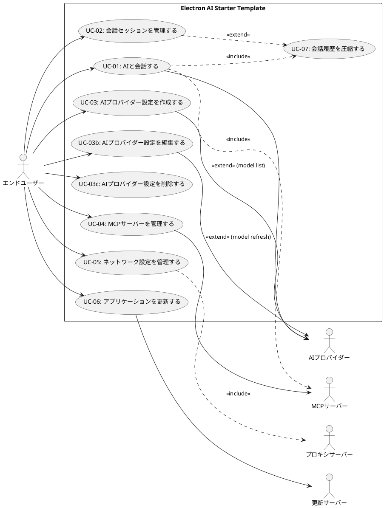

# ユースケースモデル（Use-Case Model）

> アクターとユースケースおよびそれらの関係を含んだシステムのモデル。

本文書は、Electron AI Starter Templateプロジェクトにおけるアクターとユースケースを記述したものです。このモデルは、システムの責任範囲を明確化し、システムと外部エンティティとの相互作用を定義します。

---

## 1. システムの境界

本システムは、デスクトップ環境で動作するAIチャットアプリケーションであり、以下の責任を持ちます：

- ユーザーとAIプロバイダー間の会話の仲介
- 会話履歴の永続化と管理
- 外部ツール（MCPサーバー）との連携
- ネットワーク設定（プロキシ、証明書）の管理
- アプリケーション設定の管理（複数のAI設定、モデル管理を含む）
- 自動更新の実行

---

## 2. アクター（Actor）

システムと相互作用する外部エンティティを以下に列挙します。

### 2.1 主アクター（Primary Actors）

#### エンドユーザー（End User）
- **説明**: アプリケーションを使用してAIと会話を行う人
- **責任**:
  - AIとの会話を開始する
  - 会話履歴を管理する（アーカイブ、ピン留め、色分けを含む）
  - アプリケーション設定を行う（複数のAI設定を管理する）
  - 外部ツール（MCPサーバー）を設定する
- **関連ユースケース**:
  - UC-01: AIと会話する
  - UC-02: 会話セッションを管理する
  - UC-03: AIプロバイダー設定を作成する
  - UC-03b: AIプロバイダー設定を編集する
  - UC-03c: AIプロバイダー設定を削除する
  - UC-04: MCPサーバーを管理する
  - UC-05: ネットワーク設定を管理する
  - UC-06: アプリケーションを更新する

### 2.2 副アクター（Secondary Actors）

#### AIプロバイダー（AI Provider）
- **説明**: OpenAI、Anthropic、Google、Azureなどの外部AIサービス
- **責任**:
  - ユーザーのメッセージに対してAIレスポンスを生成する
  - ストリーミングレスポンスを提供する
  - 利用可能なモデルリストを提供する（API経由）
- **関連ユースケース**:
  - UC-01: AIと会話する
  - UC-03: AIプロバイダー設定を作成する
  - UC-03b: AIプロバイダー設定を編集する

#### MCPサーバー（MCP Server）
- **説明**: Model Context Protocolを実装した外部ツールサーバー
- **責任**:
  - ツール定義を提供する
  - ツール実行リクエストを処理する
- **関連ユースケース**:
  - UC-01: AIと会話する（ツール呼び出し時）
  - UC-04: MCPサーバーを管理する

#### 更新サーバー（Update Server）
- **説明**: アプリケーションの更新ファイルを提供する静的Webサーバー
- **責任**:
  - 最新バージョン情報を提供する
  - 更新ファイルを配信する
- **関連ユースケース**:
  - UC-06: アプリケーションを更新する

#### プロキシサーバー（Proxy Server）
- **説明**: エンタープライズ環境で使用されるネットワークプロキシ
- **責任**:
  - 外部ネットワークへのアクセスを仲介する
  - 認証を要求する（オプション）
- **関連ユースケース**:
  - UC-05: ネットワーク設定を管理する

---

## 3. ユースケース（Use Cases）

### UC-01: AIと会話する

**主アクター**: エンドユーザー
**副アクター**: AIプロバイダー、MCPサーバー（オプション）
**前提条件**:
- AIプロバイダーの設定が完了している
- （オプション）MCPサーバーが設定されている

**基本フロー**:
1. ユーザーがチャット画面でメッセージを入力する
2. システムがメッセージをAIプロバイダーに送信する
3. AIプロバイダーがストリーミングレスポンスを返す
4. システムがリアルタイムでレスポンスを表示する
5. （オプション）AIがツール呼び出しを要求する
   - システムが該当するMCPサーバーにツール実行リクエストを送信する
   - MCPサーバーがツール実行結果を返す
   - システムがツール実行結果をAIに返す
   - AIが最終レスポンスを生成する
6. システムが会話履歴をデータベースに保存する（メッセージパート、ツール呼び出しを含む）

**代替フロー**:
- 3a. AIプロバイダーへの接続に失敗する
  - システムがエラーメッセージを表示する
  - ユーザーがネットワーク設定を確認する
- 5a. MCPサーバーへの接続に失敗する
  - システムがエラーメッセージとstderrログを表示する
  - ユーザーがMCPサーバー設定を確認する

**事後条件**:
- 会話履歴がデータベースに保存されている
- メッセージの状態が「completed」または「error」になっている

---

### UC-02: 会話セッションを管理する

**主アクター**: エンドユーザー
**前提条件**: なし

**基本フロー**:
1. ユーザーが新しい会話セッションを開始する
2. システムが新しいセッションをデータベースに作成する
3. ユーザーが既存の会話セッションを選択して再開する
4. システムがセッションの会話履歴を読み込んで表示する
5. **ユーザーがセッションをアーカイブする** ⭐
   - システムがセッションのarchivedAtをセットする
   - システムがセッションをアーカイブリストに移動する
6. **ユーザーがセッションをピン留めする** ⭐
   - システムがセッションのpinnedAtをセットする
   - システムがセッションをリストの上部に固定表示する
7. **ユーザーがセッションに色を設定する** ⭐
   - システムがセッションのcolor属性を更新する
   - システムがUIでセッションをカラー表示する
8. ユーザーが不要なセッションを削除する
9. システムがセッションとその会話履歴をデータベースから削除する（カスケード削除）

**代替フロー**:
- 4a. セッションの会話履歴が大きすぎる場合
  - システムが会話履歴を圧縮する（UC-07）
  - システムが圧縮された履歴を表示する

**事後条件**:
- セッションの状態がデータベースに反映されている

---

### UC-03: AIプロバイダー設定を作成する ⭐

**主アクター**: エンドユーザー
**副アクター**: AIプロバイダー（モデルリスト取得時）
**前提条件**: なし

**基本フロー**:
1. ユーザーが設定画面を開く
2. **ユーザーが「新しいプロバイダー設定を追加」を選択する** ⭐
3. ユーザーがプロバイダータイプ（OpenAI、Anthropic、Google、Azure）を選択する
4. **ユーザーが設定に名前を付ける**（例：「会社用OpenAI」「個人用OpenAI」）⭐
5. ユーザーがAPIキーを入力する
6. **（オプション）ユーザーがカスタムbaseURLを入力する**（Azure、プライベートエンドポイント用）⭐
7. **システムがデフォルトのモデルリストを読み込む** ⭐
8. **（オプション）ユーザーが「モデルをAPIから更新」を選択する** ⭐
   - システムがプロバイダーAPIからモデルリストを取得する
   - システムがモデルリストを更新する（カスタムモデルは保持）
9. **（オプション）ユーザーがカスタムモデルを追加する** ⭐
   - ユーザーがカスタムモデルIDを入力する
   - システムがカスタムモデルをモデルリストに追加する（source='custom'）
10. ユーザーがデフォルトで使用するモデルを選択する
11. システムが設定をデータベースに保存する
12. （オプション）ユーザーが接続テストを実行する
13. システムが選択したAIプロバイダーとの接続を確認する

**代替フロー**:
- 8a. モデルリストのAPI取得に失敗する
  - システムがエラーを表示する
  - システムが既存のモデルリストを保持する
- 9a. カスタムモデルIDが既に存在する
  - システムがエラーメッセージを表示する
  - ユーザーが別のモデルIDを入力する
- 13a. 接続テストに失敗する
  - システムがエラー詳細（認証エラー、ネットワークエラーなど）を表示する
  - ユーザーが設定を修正する

**事後条件**:
- AIプロバイダー設定がデータベースに保存されている
- 設定がプロバイダー設定リストに追加されている

---

### UC-03b: AIプロバイダー設定を編集する ⭐

**主アクター**: エンドユーザー
**副アクター**: AIプロバイダー（モデルリスト更新時）
**前提条件**:
- 少なくとも1つのAIプロバイダー設定が存在する

**基本フロー**:
1. ユーザーが設定画面を開く
2. ユーザーが既存のAIプロバイダー設定を選択する
3. ユーザーが設定を編集する
   - 設定名の変更
   - APIキーの変更
   - baseURLの変更（該当する場合）
4. （オプション）ユーザーが「モデルをAPIから更新」を選択する
   - システムがプロバイダーAPIからモデルリストを取得する
   - システムが既存のAPI取得モデル（source='api'）を新しいリストで置き換える
   - システムがカスタムモデル（source='custom'）を保持する
5. （オプション）ユーザーがカスタムモデルを追加または削除する
6. （オプション）ユーザーがデフォルトモデルを変更する
7. システムが更新された設定をデータベースに保存する
8. （オプション）ユーザーが接続テストを実行する

**代替フロー**:
- 4a. モデルリストのAPI取得に失敗する
  - システムがエラーを表示する
  - システムが既存のモデルリストを保持する
- 8a. 接続テストに失敗する
  - システムがエラー詳細を表示する
  - ユーザーが設定を修正する

**事後条件**:
- AIプロバイダー設定が更新されている
- 設定の更新日時が記録されている

---

### UC-03c: AIプロバイダー設定を削除する ⭐

**主アクター**: エンドユーザー
**前提条件**:
- 少なくとも1つのAIプロバイダー設定が存在する

**基本フロー**:
1. ユーザーが設定画面を開く
2. ユーザーが削除したいAIプロバイダー設定を選択する
3. ユーザーが「削除」を選択する
4. システムが削除確認ダイアログを表示する
5. ユーザーが削除を確認する
6. システムが設定をデータベースから削除する
7. システムがデフォルト選択をクリアする（削除された設定が選択されていた場合）

**代替フロー**:
- 3a. 削除しようとしている設定が現在デフォルト選択されている
  - システムが警告メッセージを表示する
  - ユーザーが削除を確認する
  - システムがデフォルト選択をクリアする
- 5a. ユーザーが削除をキャンセルする
  - システムがダイアログを閉じる
  - 設定は削除されない

**事後条件**:
- AIプロバイダー設定がデータベースから削除されている
- デフォルト選択が適切に更新されている

---

### UC-04: MCPサーバーを管理する

**主アクター**: エンドユーザー
**副アクター**: MCPサーバー
**前提条件**: なし

**基本フロー**:
1. ユーザーが設定画面でMCPサーバーセクションを開く
2. ユーザーが新しいMCPサーバーを追加する
   - サーバー名を入力する
   - コマンドラインと引数を設定する
   - 環境変数を設定する（オプション）
3. システムがMCPサーバー設定をデータベースに保存する
4. システムがMCPサーバープロセスを起動する
5. **システムがサーバーのステータス（connected、error、stopped）を表示する** ⭐
6. **（オプション）システムがstderrキャプチャを表示する**（エラー診断用）⭐
7. （オプション）ユーザーがMCPサーバーを無効化または削除する

**代替フロー**:
- 4a. MCPサーバーの起動に失敗する
  - **システムがエラーログ（stderr、終了コード、シグナル）を表示する** ⭐
  - ユーザーがサーバー設定を修正する

**事後条件**:
- MCPサーバー設定がデータベースに保存されている
- 有効なMCPサーバーが実行されている（またはエラー状態）

---

### UC-05: ネットワーク設定を管理する

**主アクター**: エンドユーザー
**副アクター**: プロキシサーバー
**前提条件**: なし

**基本フロー**:
1. ユーザーが設定画面でネットワーク設定を開く
2. ユーザーがプロキシモード（System、Custom、None）を選択する
3. （Customモードの場合）ユーザーがプロキシ設定を入力する
   - プロキシホストとポート
   - 認証情報（オプション）
4. ユーザーが証明書設定を行う
   - カスタムCA証明書を追加する（オプション）
   - 証明書検証を無効化する（オプション）
5. システムが設定をデータベースに保存する
6. （オプション）ユーザーが接続テストを実行する
7. システムが設定を使用してAIプロバイダーとの接続を確認する

**代替フロー**:
- 2a. Systemモードでシステムプロキシの検出に失敗する（macOS/Linux）
  - システムが警告メッセージを表示する
  - ユーザーがCustomモードに切り替える
- 7a. 接続テストに失敗する
  - システムがエラー詳細（プロキシ認証エラー、証明書エラーなど）を表示する
  - ユーザーが設定を修正する

**事後条件**:
- ネットワーク設定がデータベースに保存されている
- 全てのAI API通信が新しい設定を使用する

---

### UC-06: アプリケーションを更新する

**主アクター**: エンドユーザー
**副アクター**: 更新サーバー
**前提条件**:
- アプリケーションがパッケージ化されている（本番環境）
- 更新サーバーが設定されている

**基本フロー**:
1. システムが起動時に自動的に更新を確認する（3秒遅延）
2. 更新サーバーから最新バージョン情報を取得する
3. 新しいバージョンが利用可能な場合、システムが通知ダイアログを表示する
4. ユーザーが「ダウンロード」を選択する
5. システムが更新ファイルをダウンロードする
6. ダウンロード完了後、システムが「インストール」ダイアログを表示する
7. ユーザーが「今すぐインストール」を選択する
8. システムがアプリケーションを終了して更新をインストールする
9. システムが自動的に再起動する

**代替フロー**:
- 2a. 更新サーバーへの接続に失敗する
  - システムがサイレントに失敗する（ユーザーに通知しない）
- 4a. ユーザーが「後で」を選択する
  - システムがダイアログを閉じる
  - 更新は次回起動時に再確認される
- 7a. ユーザーが「後で」を選択する
  - システムがダイアログを閉じる
  - ダウンロード済みの更新は保持される

**事後条件**:
- アプリケーションが最新バージョンに更新されている

---

### UC-07: 会話履歴を圧縮する（システム内部ユースケース）

**主アクター**: システム（自動実行）
**前提条件**:
- 会話履歴がトークン制限に近づいている

**基本フロー**:
1. システムが会話履歴のトークン数を監視する
2. トークン数が閾値を超えた場合、システムが圧縮処理を開始する
3. システムがAIプロバイダーに要約リクエストを送信する
4. AIプロバイダーが要約を生成する
5. システムが古いメッセージを要約で置き換える（SessionSnapshotとして保存）
6. システムが圧縮後の会話履歴をデータベースに保存する

**代替フロー**:
- 3a. AIプロバイダーへの接続に失敗する
  - システムが圧縮をスキップする
  - システムがエラーログに記録する

**事後条件**:
- 会話履歴のトークン数が制限内に収まっている
- SessionSnapshotが作成されている

---

## 4. ユースケース図

---

## 5. ユースケースの優先度づけ

### 方向づけフェーズ（現在）
以下のユースケースを詳細化し、システムの責任範囲を確立します：
- **UC-01: AIと会話する** - アーキテクチャ上最も重要
- **UC-03: AIプロバイダー設定を作成する** - 基本的な設定機能（V2対応）
- **UC-03b: AIプロバイダー設定を編集する** - 設定管理の完全性

### 推敲フェーズ
以下のユースケースを詳細化し、アーキテクチュラルベースラインを確立します：
- **UC-02: 会話セッションを管理する**（アーカイブ、ピン留め、色分けを含む）
- **UC-03c: AIプロバイダー設定を削除する**
- **UC-04: MCPサーバーを管理する**（stderr診断を含む）
- **UC-05: ネットワーク設定を管理する**
- **UC-07: 会話履歴を圧縮する**

### 作成フェーズ
以下のユースケースを詳細化し、完全に実装します：
- **UC-06: アプリケーションを更新する**

---

## 変更履歴

| 日付 | バージョン | 変更内容 |
|------|-----------|---------|
| 2025-11-25 | 1.0 | 初版作成（反復1、方向づけフェーズ） |
| 2025-11-25 | 1.1 | 実装レビューに基づく更新：UC-03の詳細化（AI設定V2対応）、UC-03b/UC-03cの追加、UC-02の拡張（アーカイブ、ピン留め、色分け）、UC-04のstderr診断追加（反復1、方向づけフェーズ） |
