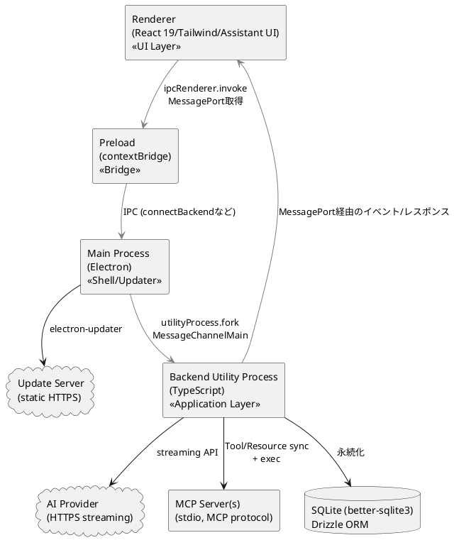

# 設計モデル（方向づけフェーズ・骨子）

反復1の方向づけフェーズで作成する設計モデルの枠組みです。要求・分析成果物と既存実装（3プロセス構成）を結び付け、推敲フェーズ以降で詳細化するためのサブシステム配置・責務メモ・設計メカニズムの扱い方針を示します。

## 目的と前提
- 分析モデル（バウンダリ/コントロール/エンティティ）を、設計上のサブシステム・コンポーネントに写像するための最小限の足場を提供する。
- 方向づけフェーズのため、実装詳細や例外フローの詰め込みは行わない。推敲フェーズで詳細化・精緻化する前提の骨子とする。
- 参照元: `docs_UP/分析_分析モデル.md`, `docs_UP/分析_ユースケース実現_UC-01_UC-04.md`, `docs_UP/分析_ソフトウェアアーキテクチャ記述.md`。

## サブシステム/レイヤー構成（骨子）

- **UI Layer (Renderer)**: チャットUIと設定UI。Assistant UIコンポーネントでストリームとツール結果を描画。
- **Bridge (Preload)**: `contextBridge`でRendererにMessagePortと安全なIPC APIを提供。
- **Application Layer (Backend)**: ユースケース実現の調停、AIストリーミング、MCP管理、圧縮、設定管理、永続化を担う。
- **Shell/Updater (Main)**: ウィンドウ作成とBackend起動、アップデート管理。プロセス境界とセキュリティ設定を司る。

## 主要設計コンポーネントと責務メモ

### Renderer（UI Layer）
- `ChatUI`（`src/renderer/src/components/assistant-ui/*`）: メッセージ入力・ストリーミング表示・ツール結果表示。進行状況/エラーの提示も担当。
- `SettingsUI`（`src/renderer/src/components/settings/*`）: AI/MCP/ネットワーク/アップデート設定のCRUDと接続テストの実行。状態変化を即時反映。
- `MessagePort Client`（`src/renderer/src/lib/ipc.ts`相当）: Preload経由で受け取るMessagePortをラップし、型付きIPC呼び出し/イベント購読を提供。

### Preload（Bridge）
- `ipcBridge`（`src/preload/index.ts`）: Rendererに対し、MessagePort配布と限定されたIPC API（connectBackend、アップデートイベント購読など）を公開。
- セキュリティ: `contextIsolation`維持、直接的なNode API非公開。

### Backend（Application Layer）
- `Handler`（`src/backend/handler.ts`）: IPCエンドポイントの集約点。AIストリーム開始/中断、MCP/設定/セッション操作を1つの窓口で受け付ける。
- `AIStreamService`（`src/backend/ai/stream.ts`）: AI SDKとの接続、トークン/ツール呼び出しのストリーミング、AbortSignal対応。
- `ChatSessionStore`（`src/backend/session/ChatSessionStore.ts`）: セッション/メッセージ/ツール結果/スナップショットの永続化と検索。
- `MCPManager`（`src/backend/mcp/manager.ts`）: MCPサーバー設定のCRUD、プロセス起動/停止、ツール・リソース同期とステータス配信。
- `CompressionService`（`src/backend/compression/*`）: `TokenCounter`と要約生成を用い、閾値超過時にスナップショットを作成し履歴を短縮。
- `Settings`（`src/backend/settings/*`）: AI設定V2、プロキシ/証明書設定の保存と検証、モデルリスト同期。
- `Logger`（`src/backend/logger.ts`）: プロセス間統一ログへの出力。サブスコープを用いて機能別に記録。

### Main（Shell/Updater）
- `WindowManager`（`src/main/index.ts`）: BrowserWindow生成、プリロード指定、セキュリティフラグ設定。
- `BackendProcess`（`utilityProcess.fork`）: Backend起動・再起動・MessageChannel作成、異常終了時の復旧方針の起点。
- `Updater`（`src/main/updater.ts`）: 自動更新チェック・ダウンロード・再起動。Rendererへの通知。

### 共通/リソース
- `@common` 型定義: IPCペイロード、AIモデル設定、MCPエンティティなどの共有型を保持。
- `resources/` : アイコン・DBマイグレーション・アップデート用リソース。

## 設計メカニズムの扱い（方向づけ版）
- **IPC/ポート配布**: MainでMessageChannelMainを生成し、一方をBackend、他方をRendererに配布。RendererはPreload越しにポートを取得し、Backend側のHandlerがすべてのリクエストを受理する。
- **AIストリーミングとツール呼び出し**: `AIStreamService`がAI SDKのイベント（トークン、ツール呼び出し）を共通イベントストリームに変換し、Rendererに逐次送信。ツール呼び出しはMCP Managerから取得した定義を統合。
- **圧縮/スナップショット**: `CompressionService`がトークン閾値と保持ポリシーを評価し、`ChatSessionStore`へスナップショットを保存。圧縮結果はAIストリーム開始時のコンテキスト再構成に利用。
- **アップデート**: Mainの`Updater`が静的サーバーから差分を取得し、Rendererに状態を通知。Windows NSISを前提とし、`updater.json`または`ELECTRON_UPDATER_CONFIG`でURLを注入。
- **プロキシ/証明書**: Backend設定層でHTTP(S)代理設定とカスタムCAを管理し、AI SDKおよびMCP接続に反映。開発時はデフォルト「なし」を基本とする。

## ユースケース実現との対応（骨子）
- **UC-01: AIと会話する**: RendererのChatUI → Preload経由でMessagePort取得 → Backend Handlerが`AIStreamService`を起動 → `ChatSessionStore`がメッセージ・ツール結果を永続化 → イベントをRendererへストリーム。
- **UC-04: MCPサーバーを管理する**: SettingsUI → Handler（MCP CRUD/起動）→ `MCPManager`がプロセスを起動・停止し、ツール/リソース一覧を更新 → 状態イベントをRendererへ配信しAIストリームへ供給。

## 今後の詳細化ポイント（推敲フェーズ候補）
- コントロール/エンティティ間の例外フロー（AI接続失敗、MCP起動エラー、圧縮失敗時のリカバリ）。
- MessagePort断の再接続戦略とイベント再送保証。
- 圧縮閾値・保持戦略のパラメータ化とUIからの調整経路。
- アップデートダイアログのUXと失敗時ロールバック手順の定義。
- AIプロバイダー/モデル選択ポリシーとキー解決の詳細な契約（セッション単位・デフォルト値の扱い）。
