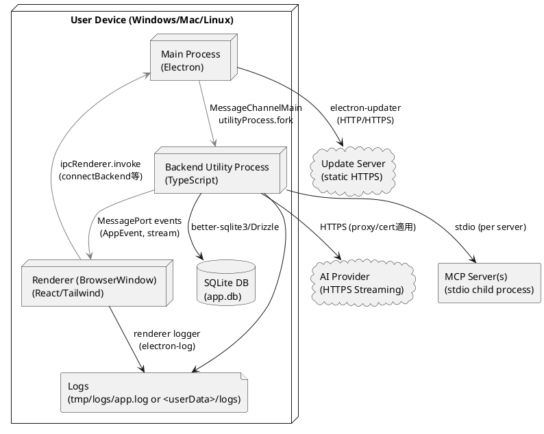

# 配置モデル（方向づけフェーズ・骨子）

反復1の方向づけフェーズで作成する配置モデルのたたき台です。デスクトップ上でのプロセス配置と外部依存の接続関係を示し、開発/本番でのリソース配置やパスの違いを明確にします。

## 目的と前提
- 3プロセス構成（Main/Backend/Renderer）の配置と外部システム（AI Provider/MCP/Update Server）の接続点を示す。
- セキュリティとログ/DBの配置を開発・本番で区別し、パッケージ後のパス解決を明示する。
- 方向づけフェーズの骨子として、通信ポートやリカバリ手順の詳細は推敲フェーズで補う。

## ノード・プロセス構成

## 環境別の配置とパス
- **開発**: `pnpm run dev`でMain/Backend/Rendererが同一マシン上に起動。DBは`./tmp/db/app.db`、ログは`./tmp/logs/app.log`。`resources/`はリポジトリ直下を参照。
- **本番（パッケージ後）**:
  - Mainは`app.isPackaged`で判定し、Backendは`process.resourcesPath`の有無で判定。
  - DB: `<userData>/db/app.db`。ログ: `<userData>/logs/app.log`（5MBローテーション）。
  - `resources/`は`electron-builder.yml`の`extraResources`で`process.resourcesPath`配下へコピーし、マイグレーション/アイコンをそこから参照。
  - アップデート: Windows NSIS配布を前提。`updater.json`または`ELECTRON_UPDATER_CONFIG`でUpdateサーバーURLを注入。

## 外部依存とネットワーク経路
- **AI Provider (OpenAI/Anthropic/Google/Azure)**: HTTPSストリーミング。プロキシ/証明書設定をBackendの設定層で適用。APIキーとモデル選択はAI設定V2に従う。
- **MCP Server**: stdioで子プロセスを起動し、MCPプロトコルでツール・リソースを同期。stderr/exitコードをエラー診断に利用。
- **Update Server**: 静的HTTPSサーバー（GitHub Pages, S3+CloudFront等）から差分を取得。SHA-512署名検証はelectron-updaterに依存。

## セキュリティ・フォールトトレランス観点（骨子）
- プロセス分離によりRendererのクラッシュはBackend/DBに波及しない。Backend異常終了時はMainが再起動を行い、MessagePortを再配布する方針（詳細設計は推敲フェーズ）。
- `contextIsolation`有効、Preloadで必要なAPIのみ公開。Rendererから直接Node APIを触らない。
- ネットワーク経路はHTTPS前提。社内プロキシ・カスタムCAはBackend設定経由で注入。
- DBファイルはローカルのみ。バックアップ/ローテーションは未設計（今後検討）。

## 今後の詳細化ポイント
- MessagePort断時の再接続シーケンスとリトライポリシー（どのプロセスが再配布を主導するか）。
- MCPサーバー複数起動時のリソース占有と同時起動数の上限。
- 圧縮・要約時の一時ファイル/メモリ使用量の監視方法。
- パッケージング時の証明書配置/更新手順（Windowsストア配布の可否を含む）。
