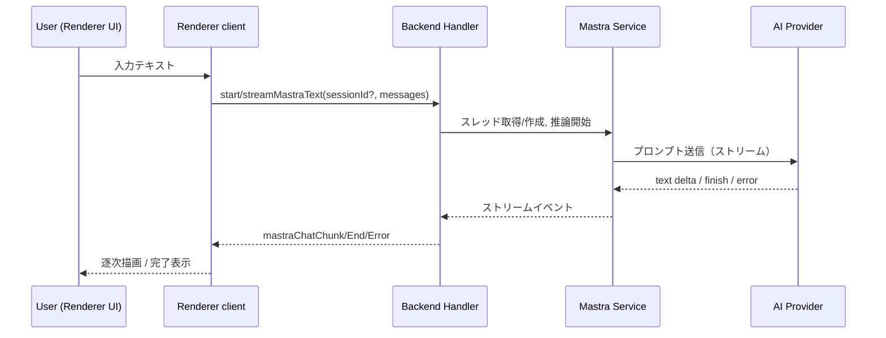

# 分析ノート（UC1: Mastraベース基本AI会話MVP）

## 目的

Mastraを組み込んだチャット経路の具体的な流れとデータ扱いを明確化し、設計/実装で迷わないようにする。既存のv1チャットと並行稼働させる前提で、衝突ポイントと最小限の接続面を洗い出す。

## ユースケースシナリオ（MVP）

1. ユーザーがMastraチャット導線を開く。
2. BackendがAI設定から利用可能なプロバイダー・モデルを選択し、Mastraクライアントを初期化する。
3. ユーザーがメッセージを送信すると、Mastra経路で推論を開始し、ストリーミングチャンクをRendererへ順次送る。
4. Rendererはチャンクを表示し、完了/エラー/中断シグナルを受けてUIを更新する。
5. セッションID/スレッドIDはBackendメモリで保持し、同一起動中は追記できる。

## 境界と概念

- Session/Thread: MastraのThreadを1チャットセッションに対応付ける。MVPではBackendメモリに保持し、プロセス終了で破棄。
- Resource: 将来のResource-scopedメモリは考慮外。必要なら`default-user`のような固定IDを使う。
- Provider/Model: 既存AISettingsV2から「有効な最初の構成」を選択するシンプルな方針で始める。
- イベントチャネル: 既存`aiChat*`とは分離し、`mastraChat*`プレフィックスで統一。

## データフロー（概略）

## 依存データとパラメータ

- AI設定: providerConfigsの中から`enabled`な先頭を選び、modelIdは設定内の先頭を採用（MVPルール）。将来的にUI選択を導入。
- APIキー: providerConfig.config.apiKeyをMastra初期化に利用。
- スレッド管理: `Map<sessionId, { threadId, history }>` で保持。historyはMastraへ渡すmessages配列と同期。

## エラーとリスク

- 設定不足: 有効なプロバイダーがない場合はUIに警告を出し、Mastra経路を無効化。
- ストリーム中断: AbortSignalをMastra呼び出しに渡し、Handlerが終了イベントを必ず送る。
- バージョン差異: MastraパッケージAPIの変更に備え、型定義を参照し実装時にコメントで根拠を残す。

## 共存・移行観点

- 既存`streamAIText`とは別メソッド・イベントで隔離する。
- DBへの書き込みは行わず、SessionManagerなど既存UIの状態を汚染しない。
- 将来はResource/ThreadをDBに持たせるため、sessionIdとthreadIdの対応を返却し、後続フェーズで流用可能にする。
