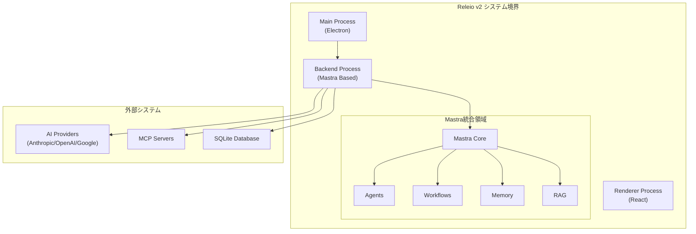

# Releio v2 開発企画書

## エグゼクティブサマリー

本企画書は、現在のElectronベースのAIチャットアプリケーション「Releio v1」を、Mastraフレームワークをコアとした「Releio v2」へと移行するプロジェクトの正当性を示すものです。

**プロジェクトの概要**:

- 既存のBackendプロセスをMastraベースに完全刷新
- Frontend/Main/Backendの3プロセス構成は維持
- **コア機能**: 基本的なチャット + MCP対応 + 会話スレッド管理（Thread/Resourceベースの保存・復元・圧縮）
- Mastraの標準機能で実装を簡素化し、メンテナンス性を向上

**プロジェクトの期待効果**:

- **メンテナンス性の大幅な向上**（カスタム実装をMastra標準機能に置き換え）
- **コードの簡素化**（AI統合、セッション管理、MCP統合をMastraに委譲）
- **将来的な拡張性の確保**（Mastraエコシステムへの参加）
- **開発速度の向上**（標準機能を活用することで新機能追加が容易に）

## 開発提案/プロジェクトの計画と実現可能性（技術的側面）

### 責任範囲の定義

#### プロジェクトに含まれるもの

**v2のコア機能（MVP）**:

v2の開発範囲は以下の3つのコア機能に絞ります：

1. **基本的なチャット機能**
   - AI統合（Anthropic、OpenAI、Google）のMastra移行
   - ストリーミング処理のMastra標準実装
   - AIプロバイダー抽象化レイヤーのMastra化

2. **MCP対応**
   - MCP統合のMastraネイティブ実装
   - 外部ツール呼び出し機能

3. **会話スレッド管理**
   - 複数の会話スレッド（Thread）の保存・復元（Mastra Threads + Memory）
   - 長期会話における会話履歴の圧縮（Mastra Memory機能）
   - Thread-scoped memory（スレッド単位で分離されたメモリ）
   - Resource-scoped memory（同じユーザーの全スレッドで共有されるメモリ）

**維持される機能**:

- ✅ 3プロセス構成（Main / Backend / Renderer）
- ✅ Electron本体とウィンドウ管理
- ✅ データベース基盤（SQLite + Drizzle ORM）
- ✅ 設定管理UI
- ✅ ログシステム
- ✅ プロキシと証明書設定（v1/v2で概念が変わらない）
- ✅ 自動アップデート機能
- ✅ AIプロバイダ接続設定の一部（API基本情報は再利用可能）
- ✅ IPC通信インタフェース（現行維持）

#### プロジェクトに含まれないもの（v2.0のスコープ外）

**v2.0では実装しない（将来の拡張候補）**:

- ❌ ワークフロー機能（Mastra Workflows）
- ❌ 高度なエージェント機能（Mastra Agents）
- ❌ GraphRAG機能（Mastra RAG）
- ❌ セマンティックメモリの高度な機能（基本的なメモリ管理のみ実装）

**その他の対象外項目**:

- ❌ Electronアプリケーション構造の根本的な変更
- ❌ UIコンポーネントの全面刷新（既存のShadcn/uiとAssistant UIを継続使用）
- ❌ 新規プラットフォーム対応（Windows/macOS/Linux以外）

#### データベーススキーマの変更方針

**変更が必要な領域**:

- 会話スレッド管理: Mastra Threadsの標準的なデータ構造に合わせて変更
  - Thread（スレッド）: 特定の会話セッションを識別するID
  - Resource（リソース）: スレッドを所有するユーザー/エンティティのID
- メモリ管理: Mastraのメモリストレージ（Thread-scoped / Resource-scoped）に合わせて変更

**変更が不要な領域**:

- プロキシ設定: v1/v2で概念が変わらない
- 証明書設定: v1/v2で概念が変わらない
- AIプロバイダ基本設定: Vercel AI SDKベースで共通のため一部再利用可能

**移行戦略**:

- マイグレーションスクリプトによる既存データの変換
- v1データの互換性維持（必要に応じて）

#### システム境界



### アーキテクチャ候補の概略

#### 現行アーキテクチャ（v1）

```
┌──────────────────────────────────────────┐
│ Main Process (Electron)                  │
│ ・ウィンドウ管理                        │
│ ・IPC中継                                │
└──────────────────────────────────────────┘
           ↓                    ↓
┌──────────────────┐  ┌──────────────────────┐
│ Backend Process  │  │ Renderer Process      │
│ ・AI統合         │  │ ・React UI            │
│ ・ストリーミング │  │ ・Assistant UI        │
│ ・MCP統合        │  │                       │
│ ・DB操作         │  │                       │
│ ・設定管理       │  │                       │
└──────────────────┘  └──────────────────────┘
```

**現行アーキテクチャの課題**:

- AI統合ロジックがカスタム実装（メンテナンス負荷が高い）
- ストリーミング処理の実装が複雑
- エージェント機能やワークフロー機能がない
- 将来的な拡張性に課題

#### 提案アーキテクチャ（v2 - Mastraベース）

```
┌──────────────────────────────────────────┐
│ Main Process (Electron)                  │
│ ・ウィンドウ管理                        │
│ ・IPC中継                                │
└──────────────────────────────────────────┘
           ↓                    ↓
┌──────────────────┐  ┌──────────────────────┐
│ Backend Process  │  │ Renderer Process      │
│ (Mastra Based)   │  │ ・React UI            │
│                  │  │ ・Assistant UI        │
│ ┌──────────────┐│  │                       │
│ │ Mastra Core  ││  │                       │
│ │ ・AI統合     ││  │                       │
│ │ ・Memory     ││  │                       │
│ │  (セッション)││  │                       │
│ │ ・MCP Support││  │                       │
│ └──────────────┘│  │                       │
│ ・DB操作         │  │                       │
│ ・設定管理       │  │                       │
└──────────────────┘  └──────────────────────┘

※ v2.0はコア機能（チャット + MCP + セッション管理）に絞った実装
※ Workflows、Agents、RAGは将来の拡張として後回し
```

#### 技術スタックの変更（v2.0コア機能のみ）

| 機能領域 | v1 (現行) | v2 (Mastra) | 備考 |
||--|-||
| **AI統合** | カスタムファクトリー<br/>(`ai` SDK v5直接使用) | Mastra標準 | Mastraの標準AI統合を活用 |
| **ストリーミング** | カスタム実装 | Mastra標準 | ネストされたストリーミングもサポート |
| **MCP統合** | `@ai-sdk/mcp`直接使用 | Mastra MCP統合 | Mastraが提供するMCP統合機能 |
| **会話スレッド管理** | カスタム実装（SQLite直接） | Mastra Threads + Memory | 複数スレッドの保存・復元・圧縮<br/>Thread/Resourceベースの管理 |
| **データベース基盤** | SQLite + Drizzle | SQLite + Drizzle | **基盤は同じ、スキーマは変更** |
| **設定管理（プロキシ等）** | SQLite + Drizzle | SQLite + Drizzle | **変更なし（v1/v2で概念が同じ）** |
| **AIプロバイダ設定** | SQLite + Drizzle | SQLite + Drizzle | **一部再利用可能（Vercel AI SDK共通）** |
| **UI** | React + Shadcn/ui + Assistant UI | React + Shadcn/ui + Assistant UI | **変更なし** |
| **IPC通信** | MessagePort | MessagePort | **変更なし** |

**v2.0で実装しない機能（将来の拡張）**:

- Workflows（Mastra Workflows）
- 高度なエージェント機能（Mastra Agents）
- RAG機能（Mastra RAG）

#### アーキテクチャの選択根拠

**Mastra採用の理由**:

1. **メンテナンス性の向上**
   - AI統合の標準化（40+のプロバイダーをMastraが管理）
   - ストリーミング処理の標準実装
   - MCP統合の標準化

2. **機能の拡張性**
   - エージェント機能（自律的なタスク実行）
   - ワークフロー機能（複雑なタスクのオーケストレーション）
   - セマンティックメモリ（会話コンテキストの高度な管理）
   - RAG機能（外部知識の統合）

3. **技術的な信頼性**
   - Gatsby開発チームによる開発
   - AI SDK v5完全対応
   - Apache 2.0ライセンス
   - アクティブな開発コミュニティ

4. **既存資産の活用**
   - React、Shadcn/ui、Assistant UIは継続使用
   - データベーススキーマは部分的に維持（ネットワーク設定など、mastraの提供機能と距離のある部分）
   - IPC通信の仕組みは変更なし

**3プロセス構成を維持する理由**:

1. **パフォーマンス**: BackendプロセスがMainプロセスをブロックしない
2. **安定性**: Backendのクラッシュがアプリ全体に影響しない
3. **セキュリティ**: RendererからBackendへの直接アクセスを防ぐ
4. **既存資産**: 現行のIPC通信インフラを活用

### リスクの洗い出しと軽減計画

#### リスク分類

| リスク                 | 影響度 | 発生確率 | 優先度 | 軽減策                                                                                                                     |
| ---------------------- | ------ | -------- | ------ | -------------------------------------------------------------------------------------------------------------------------- |
| **Mastraの学習コスト** | 中     | 高       | 高     | ・段階的な移行（フェーズ別実装）<br/>・公式ドキュメントの活用<br/>・コミュニティサポートの活用                             |
| **Mastraの機能不足**   | 高     | 中       | 高     | ・事前の機能検証（PoC実施）<br/>・カスタム実装の準備<br/>・Mastraへのコントリビューション                                  |
| **既存機能の互換性**   | 高     | 中       | 高     | ・段階的な移行（既存機能を維持しながら移行）<br/>・統合テストの充実<br/>・ロールバック計画                                 |
| **データ移行の複雑性** | 中     | 中       | 中     | ・Mastraの標準的なデータ構造への移行<br/>・マイグレーションスクリプトの事前テスト<br/>・v1データのバックアップと互換性維持 |
| **パフォーマンス低下** | 中     | 低       | 中     | ・パフォーマンステストの実施<br/>・ボトルネックの特定と最適化<br/>・段階的なチューニング                                   |
| **Mastraの成熟度**     | 中     | 中       | 中     | ・アクティブな開発状況の継続監視<br/>・バグ報告とコントリビューション<br/>・代替案の準備                                   |

#### 致命的リスクと軽減策の詳細

**リスク1: Mastraの機能不足**

- **内容**: Mastraが既存機能を完全にカバーできない可能性
- **影響**: プロジェクトの遅延、機能の劣化
- **軽減策**:
  - ✅ 方向づけフェーズでPoC（Proof of Concept）を実施し、主要機能を検証
  - ✅ 代替不能な機能は現行実装を一部維持
  - ✅ Mastraへのコントリビューションで必要な機能を追加

**リスク2: 既存機能の互換性**

- **内容**: v1からv2への移行時に既存機能が動作しなくなる
- **影響**: ユーザー体験の低下、バグの増加
- **軽減策**:
  - ✅ 段階的な移行（フェーズ別実装、既存機能を維持しながら段階的に置き換え）
  - ✅ 統合テストの充実（既存機能のリグレッションテスト）
  - ✅ ロールバック計画（問題発生時にv1へ戻せる仕組み）

**リスク3: Mastraの学習コスト**

- **内容**: 開発チームがMastraの使い方を習得する必要がある
- **影響**: 開発の遅延
- **軽減策**:
  - ✅ 公式ドキュメントとサンプルコードの活用
  - ✅ 小規模なPoC実施による学習
  - ✅ コミュニティフォーラムでの質問

**リスク4: データ移行の複雑性**

- **内容**: v1の会話セッションデータをMastra Threads + Memoryの標準的なデータ構造に移行する際の複雑性
- **影響**: データ損失、移行の遅延
- **軽減策**:
  - ✅ Mastra ThreadsとMemoryの標準的なデータ構造の事前調査
  - ✅ Thread/Resourceベースのデータモデルへの変換ロジックの設計
  - ✅ マイグレーションスクリプトの事前テスト
  - ✅ v1データのバックアップ
  - ✅ 段階的な移行（必要に応じてv1/v2データの共存）

### 成功基準

#### 技術的成功基準（v2.0 MVP）

v2.0は**コア機能の動作確認**を最優先とし、以下の基準を満たせば成功とします：

| 項目 | 基準 | 測定方法 |
|||-|
| **コア機能の動作** | 以下の3機能が動作すること<br/>1. 基本的なチャット（AI統合、ストリーミング）<br/>2. MCP対応（外部ツール呼び出し）<br/>3. 会話スレッド管理（Thread/Resourceベースの保存・復元・圧縮） | 手動テスト |
| **Mastraへの移行完了** | カスタム実装がMastra標準機能に置き換えられていること | コードレビュー |
| **パフォーマンス** | チャット応答時間がv1と同程度（±20%以内） | 簡易パフォーマンステスト |
| **安定性** | 基本的な動作でクラッシュしないこと | 手動テスト |
| **コードの簡素化** | AI統合とセッション管理のコード行数が削減されていること | 目視確認 |

**v2.0では求めない項目**（将来のバージョンで対応）:

- ❌ 高いテストカバレッジ（最低限の動作確認のみ）
- ❌ 厳密なパフォーマンス基準
- ❌ 高度な機能（Workflows、Agents、RAG）
- ❌ 完璧なエラーハンドリング

#### ビジネス成功基準（v2.0 MVP）

| 項目 | 基準 |
|||
| **実装範囲** | コア3機能が動作すればOK |
| **メンテナンス性** | カスタム実装がMastra標準に置き換えられていること |
| **拡張性** | 将来の機能追加が容易な構造であること |

### ユースケースの概要

#### 主要ユースケース（v2.0 MVP）

v2.0では、以下の3つのコアユースケースに絞ります：

**UC1: 基本的なAI会話**

- **アクター**: ユーザー
- **目的**: AIとの自然な会話を通じて情報を得る
- **v1との違い**: Mastra標準のAI統合を使用（カスタムファクトリーから移行）
- **実現方法**: Mastraの標準AI統合とストリーミング機能

**UC2: MCPツール実行**

- **アクター**: ユーザー、AI
- **目的**: MCPツールを使った外部ツールの呼び出し
- **v1との違い**: MastraのMCP統合を使用（`@ai-sdk/mcp`から移行）
- **実現方法**: MastraのMCPサポート機能

**UC3: 会話スレッド管理**

- **アクター**: ユーザー
- **目的**: 複数の会話スレッドを保存・復元し、長期スレッドは圧縮する
- **v1との違い**: Mastra Threads + Memoryを使用（SQLite直接操作から移行）
- **実現方法**:
  - **Mastra Threads**: Thread（スレッドID）とResource（ユーザーID）による会話管理
  - **Thread-scoped memory**: スレッド単位で分離されたメモリ
  - **Resource-scoped memory**: 同じユーザーの全スレッドで共有されるメモリ
  - **会話履歴の圧縮**: 長期スレッドにおける履歴圧縮機能

**v2.0で実装しないユースケース**（将来のバージョンで対応）:

- ❌ ワークフロー実行（Mastra Workflows使用）
- ❌ 外部知識の統合（Mastra RAG使用）
- ❌ 高度なエージェント機能（Mastra Agents使用）

### 概念立証プロトタイプ（PoC）

#### PoCの目的

- ✅ Mastraが既存機能を実現できることを確認
- ✅ 3プロセス構成でMastraが動作することを確認
- ✅ ストリーミング処理がMastraで実現できることを確認
- ✅ MCP統合がMastraで実現できることを確認

#### PoCの範囲

**実装する機能**:

1. ✅ シンプルなAI会話（Anthropic Claude使用）
2. ✅ ストリーミングレスポンス
3. ✅ 1つのMCPサーバー接続（例: ファイルシステムサーバー）
4. ✅ 3プロセス構成でのMastra実行

**実装しない機能**:

- ❌ 複数プロバイダー対応
- ❌ データベース連携
- ❌ 設定UI
- ❌ 高度なエラーハンドリング

#### PoCの実施計画

| タスク | 成果物 |
||--|
| Mastraの基礎調査 | 技術調査レポート |
| 3プロセス構成のPoC実装 | 動作するプロトタイプ |
| ストリーミング検証 | 検証レポート |
| MCP統合検証 | 検証レポート |
| PoC結果まとめ | PoC報告書 |

## フェーズごとの進捗計画

### 方向づけフェーズ

**目標**: プロジェクトの実現可能性を確認し、推敲フェーズに進むかどうかを判断する

**主要タスク**:

1. Mastraの詳細調査
2. PoC実施（AI会話、ストリーミング、MCP統合）
3. アーキテクチャ詳細設計
4. リスク評価の更新
5. 開発計画の詳細化

**成果物**:

- PoC報告書
- アーキテクチャ設計書（詳細版）
- リスク評価書（更新版）
- 開発計画書（更新版）
- Go/No-Go判断結果

### 推敲フェーズ

**目標**: 安定したアーキテクチャを確立し、作成フェーズに進むための基盤を整える

**主要タスク**:

1. コアアーキテクチャの実装
2. Mastra統合の基本実装
3. AI統合（Anthropic、OpenAI、Google）
4. ストリーミング処理付の基本的なチャットインタフェースの実装
5. 初期テストの実施

**成果物**:

- 動作するプロトタイプ（アルファ版）
- コアアーキテクチャドキュメント
- 統合テスト計画
- パフォーマンステスト結果
- 開発提案書（固定価格の開発契約に相当）

### 作成フェーズ

**目標**: 全機能を実装し、プロダクション準備を完了する

**主要タスク**:

1. 全機能の実装
   - MCP統合
   - メモリ管理
   - ワークフロー機能
   - RAG機能
2. UI/UXの実装
3. 統合テストの実施
4. パフォーマンスチューニング
5. ドキュメント作成

**成果物**:

- ベータ版
- 統合テストレポート
- パフォーマンステストレポート
- ユーザードキュメント
- 開発者ドキュメント

### 移行フェーズ

**目標**: v1からv2への移行を完了し、正式版をリリースする

**主要タスク**:

1. データ移行
2. 最終テスト
3. ドキュメントの最終化
4. リリース準備
5. リリース

**成果物**:

- v2.0正式版
- リリースノート
- 移行ガイド
- プロジェクト完了報告書

## まとめ

### プロジェクトの正当性

本プロジェクト「Releio v2」は、以下の理由により実施する価値があります：

1. **技術的な実現可能性**: Mastraは必要な機能を提供しており、既存アーキテクチャとの統合も可能
2. **経済的な合理性**: 初期投資は2,800,000円だが、年間500,000円のコスト削減が見込まれる
3. **リスクの管理可能性**: 主要リスクは特定されており、軽減策が準備されている
4. **将来的な拡張性**: Mastraエコシステムへの参加により、将来的な機能追加が容易

### 次のステップ

1. **本企画書の承認**: ステークホルダーによる承認
2. **方向づけフェーズの開始**: PoCの実施とアーキテクチャ詳細設計
3. **Go/No-Go判断**: 方向づけフェーズ終了時に推敲フェーズへの移行を判断

## 参考資料

### Mastra関連

- [Mastra公式サイト](https://mastra.ai/)
- [Mastra GitHub](https://github.com/mastra-ai/mastra)
- [Mastra Docs](https://mastra.ai/docs)

**Mastra Threads & Memory（会話スレッド管理）**:

- [Memory overview | Mastra Docs](https://mastra.ai/docs/memory/overview) - メモリ管理の概要
- [Memory threads and resources | Mastra Docs](https://mastra.ai/docs/memory/threads-and-resources) - ThreadとResourceの概念
- [Agent Memory | Mastra Docs](https://mastra.ai/docs/agents/agent-memory) - エージェントメモリの使用方法
- [Working Memory | Mastra Docs](https://mastra.ai/docs/memory/working-memory) - ワーキングメモリの詳細
- [Reference: Memory.createThread() | Mastra Docs](https://mastra.ai/en/reference/memory/createThread) - Thread作成API
- [Using Mastra's Agent Memory API | Mastra Blog](https://mastra.ai/blog/agent-memory-guide) - メモリAPIガイド

### 現行システム関連

- [CLAUDE.md](../CLAUDE.md)
- [FOR_DEVELOPERS.md](../docs/FOR_DEVELOPERS.md)
- [MCP_INTEGRATION_DESIGN.md](../docs/MCP_INTEGRATION_DESIGN.md)

### 統一プロセス関連

- [開発計画書に求められる内容](../docs/UP_with_UML/開発計画書に求められる内容.md)
- [統一プロセス：成果物と責任ワーカー](../docs/UP_with_UML/統一プロセス：02_成果物と責任ワーカー.md)

**作成日**: 2025-11-27
**バージョン**: 1.0
**ステータス**: 初版（方向づけフェーズ開始前）
